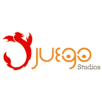

# Tap 项目与屡获殊荣的游戏工作室合作

> 原文：<https://medium.com/hackernoon/the-tap-project-partners-with-award-winning-game-studio-857fd0270457>

**获奖的 Juego 工作室与 Tap 项目合作**

Tap 项目很高兴地宣布，我们将与屡获殊荣的国际开发商 Juego Studios 合作。这一合作将推出一款独家手机游戏，为通过 Tap 平台将游戏内货币转换为加密货币铺平道路。这也允许完成用于 Unity 的 Tap 平台 SDK 插件和虚幻引擎 SDK 插件。

Juego Studios 是一家领先的技术游戏开发工作室，专注于游戏开发、艺术和设计、AR/VR、IOT 等领域。他们的合作伙伴包括迪士尼、20 世纪福克斯、华纳兄弟、Artix Entertainment，合作的游戏有《誓言》、《探险探秘》、《霍比特人五军之战》、《Hello Kitty Orchard》等等，现在还有 Tap 项目。

Tap Project 应用了一个实用令牌(Tap Coin)，它允许游戏玩家选择利用他们的时间，并将游戏中获得的货币和高级货币转换为可以跨多个平台和游戏的 Tap Coin。Tap 项目的生态系统由游戏开发者、游戏玩家、加密货币爱好者和 Tap 项目网络组成。生态系统中的核心关系存在于 TTT 和游戏开发者之间。通过与游戏开发商建立合作伙伴关系，可以在区块链实现盈利。

游戏行业的数字代币并不是什么新鲜事物。然而，Tap 项目为这个概念增加了一层创新，使他们与众不同。这种差异是因为它为游戏玩家提供了赚钱的机会。游戏内收入将不再只在游戏本身内有用，因为它们现在可以在 Tap 平台上交换、导入和导出到区块链，并转换为 Tap 硬币(一种 ERC20 令牌)，目前处于 alpha 开发阶段。用户还可以在游戏间转移 Tap 硬币，从而更容易获得不同游戏的增强功能。

tap 项目的联合创始人 Haniff Knight 表示:“这对 Tap 项目来说是一个伟大的合作伙伴关系，它为将 Tap 硬币集成到游戏中开辟了美好的可能性，是利用区块链技术颠覆游戏行业的一大进步。

能够将玩游戏的时间转化为金钱的诱惑肯定有可能在 20 亿强大的游戏社区中引起相当大比例的共鸣，Tap 项目很高兴与 Juego 工作室合作实现这一目标。

Tap 项目众筹仍在进行中，这是获得额外奖金的最后机会。立即游览 https://crowdsale.tapproject.net/，赢取 15%的红利！*时间有限*

“由游戏玩家推动，由社区激发，颠覆所有人。”— Tap 项目

加入我们的电报:[https://t.me/tapcoin](https://t.me/tapcoin)

访问我们的网站:【www.tapproject.net 

参观 Juego 影城:【https://www.juegostudio.com/ 