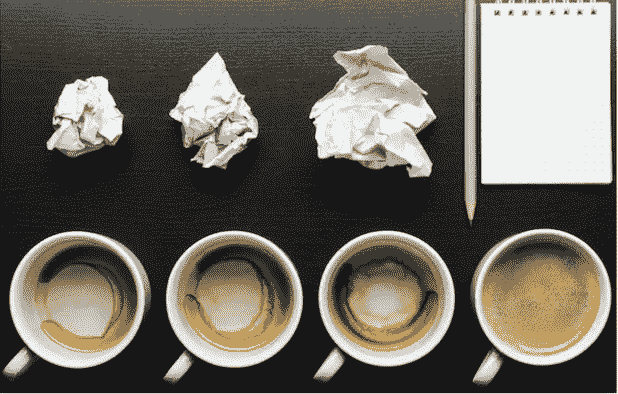

# 我是如何成为任务兔的

> 原文：<https://medium.com/hackernoon/the-tasking-trap-4fdd744a9b34>

任务接管的原因，以及如何将它们放回原位。

**晨起失忆**

每天早上，当我开始工作时，我大脑中某个地方的一个开关被拨动，然后我重新设定。我的成就、我的宣传片和我带来的专业知识都不见了。这是一种奇怪的健忘症，一个工作场所的土拨鼠日，让每天的工作都感觉像是一场让自己免于负债的斗争。

在谷歌的 11 年，晋升、奖励和认可——但这种重置是我每天的感受。我从来没有被描述为胆小或缺乏信心，但在工作中，我进入生存模式。从一个向自己证明自己的地方出来，会在情绪上耗尽精力，在心理上适得其反。一个溺水的人不会去想海滩上发生了什么。每一盎司的能量都集中在保持漂浮上。当我处于生存模式时，我就是那个溺水的人，在那一刻，只是试图不让自己沉下去。

**向海滩游去**

我老公，与之形成鲜明对比的，绝对是往沙滩方向游！我们都在科技公司工作，在差不多相同的水平上做着类似的事情。他是产品经理，我是项目经理——但这是没有区别的区别。不同的是我们思考职业的方式。他在目前的职位上已经呆了大约六个月，他正在从容地考虑自己的职业发展。我边听边想，“这是怎么回事？”。在谷歌被提升了六次，我正考虑让自己免于负债。这里有一个关键的区别:他同时在做工作和建立事业。我在这一刻。我所有的注意力都集中在我现在正在做的工作上，这让我无法向更远的地方投射。

**成为任务兔**

在生存模式下，我看不到我带来的大东西——从长远来看更有价值但目前不太有形的资产。为了消除不安全感，我会处理眼前的任务——并获得立竿见影的自信。这就像修理漏水的管道，而不是设计不会漏水的固定装置。通过把我所有的注意力放在那里，我专注于渐进的、直接的成就。我就是这样结束任务的。任务强化了能力的概念，而长期目标和更大、更有风险的项目则没有。如果你有不安全感，你需要从出色完成的任务中得到安慰。

**任务陷阱**

当你在职业生涯的早期，你被要求做低水平的短期任务。当你走得更高时，期望值会改变，项目会更长期，成功会更不确定，回报会更远。你在职业生涯早期得到的那种赞美会在更高的层次上以高人一等的态度出现。能力是被期待的，而不是被评论的。如果你渴望不断的肯定，那会很难。你需要有人喂你。

事情是这样的:当你完成任务并做得很好时，你就在职业生涯中找到了一个舒适但有限的位置。来自一个有任务的地方不会帮助你进步。你走得越高，你要做的就越少，而你要创造的就越多。你会有期望要达到，目标要达到，但是没有人会告诉你去做这个，这个，还有这个。你必须弄清楚。

**保持头脑清醒**

在生存模式下，你处于当下。这使得长期思考变得困难，但这正是我们所需要的。要走出“头露出水面”的思维模式，并意识到你确实游得很好，这需要努力。那么如何从溺水转变为游泳的认知呢？没有简单的解决办法，但是通过一个实验过程，我发现了一些对我有用的东西。

*   第一步:**认知**。认识到自己的生存行为。如果你是一个任务型的人，你需要看到那是你正在做的事情——但这并不能定义你。
*   **然后，相信证据**。我已经学会不再相信不真实的东西。当我认为我快要淹死的时候，那是错误的。所有的证据都表明我在游泳。看看证据，无论是成就、晋升还是认可。相信它已经带你走了多远。
*   职业教练给你的建议是做一个职业公告板。概述你所取得的成就。真正重要的成就可能不是那些显而易见的，而是那些你已经忘记的，把你带到一个新的方向并把你带到你现在所在位置的决定。
*   最后，还有信心问题。我们打败自己是因为我们不自信。我们浪费时间追逐自信，忘记了有价值的信息往往来自不自信。准备、真实、接地气也是如此。所以，如果自信不是你的强项，那又怎样？

意识和对证据的信任帮助我看清了自己带来了什么，并停止了任务。我终究没有溺水。