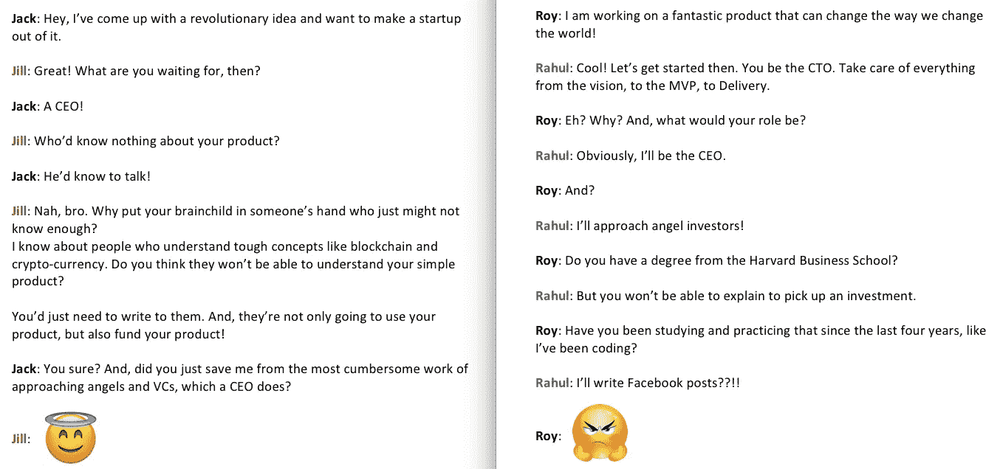
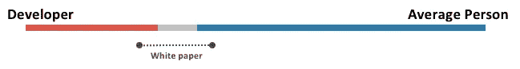
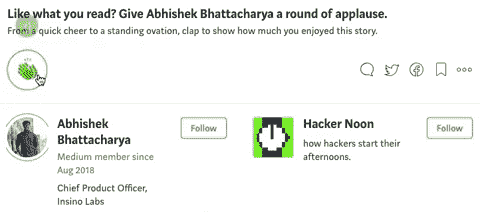

# 技术经济范式的转变

> 原文：<https://medium.com/hackernoon/the-techno-economical-big-shift-c84e80a42fe3>

## 你需要知道的关于 ico 的一切，以及他们如何帮助实现极客的统治。

© Abhishek Bhattacharya

上图中的 Jill 提到了 ICO(首次发行硬币)。

这听起来对 IPO(首次公开募股)很熟悉，对吗？就像足够大的公司允许公众通过从小到大的投资购买他们的股票一样，ICO 允许初创公司从世界各地的数百万人那里筹集资金。这让新创业者不必依赖少数可能对他们的产品感兴趣的天使投资者或风险资本家。对于任何初创公司来说，种子基金或天使投资通常都需要很长时间。那么，如果企业家们都忙着赚钱，谁来做产品呢？

ICO 的概念最早出现在 2013 年，当时 Mastercoin(现在的 Omni)在一个月内筹集了 50 万美元，并向创业公司展示了一种更好的融资方式，与古老的天使投资相比，这种方式是一种众筹模式，不仅非常可行，而且降低了市场新手的资本壁垒。迄今为止最大的 ICO 是 Bancor，这是一个旨在让用户更容易推出自己的区块链令牌的平台，所有这些都是通过最初部署在以太坊网络上的智能合约来实现的。 *Bancor 从 10，885 名投资者那里筹集了 1.523 亿美元。*

> 我非常相信以上的例子足以让你获得继续阅读的勇气。ico 是加密货币和创业公司领域的下一件大事。此外，了解整个交易以及了解参与其中的必要条件已经变得非常重要。我们需要能够理解这里的自由和力量。现在，每个人都可以不受任何障碍或边界的限制，投资于疯狂的、听起来具有革命性的想法。这完全取决于你和你的勇气——投资一毛钱或一百万美元，但要成为像野火一样蔓延的革命的一部分。

让我们举一个非常直接的例子。假设一家初创公司正在开发一种技术，可以通过区块链技术以比 Skype 或 Viber 低得多的价格进行国际 VOIP 通话。但是，这家初创公司位于英国。现在，即使该公司上市，你也不能投资于它，因为你不能投资于国际市场的首次公开募股(除非你遵循一条繁琐的道路，在一家公司开设交易账户，而这家公司又与一家外国公司有关联，作为中介发行交易账户)。这就剥夺了你支持一个团队的权利，这个团队正在开发一种技术，这种技术将使现有的技术更加便宜，更加安全。这对这家初创公司来说也是一个巨大的损失，因为它被剥夺了来自世界各地数百万像你一样的人的这种由小到大的感谢投资的象征，仅仅因为他们不在英国。ICO 消除了所有这些障碍，允许伟大的产品和技术从世界各地的支持者那里筹集资金。

仅在 2017 年 6 月，共有 34 家公司通过 ICOs 筹集了 5.674 亿美元。根据数据和统计，这个数字高于初创公司在类似阶段获得的天使投资或种子基金的通常总额。这清楚地表明，ico 正在发挥作用，并被证明是初创公司筹集所需资金并推出产品的可行解决方案。

*让我们看看上面罗伊-拉胡尔的例子。* Roy 想到了一个绝妙的主意，并开始开发一款有助于他实现愿景的产品。根据 Rahul 的说法，Roy 需要一位首席执行官将他的产品带给天使投资者，以筹集初始投资，让他能够实现自己的梦想。这正是创业公司仍然错误的地方。ico 正在改变这一切。如果开发者把他的心放在一个完美产品的开发上，他也应该是为他的产品获得投资的人。这是由能够通过阅读白皮书了解技术产品的社区实现的。这里有一个例子可以帮助你理解:

© Abhishek Bhattacharya

我用红条展示了一个纯粹的极客能够解释他的技术产品的程度。蓝条显示了普通人对技术产品的理解程度。灰色条描绘了对这两类人的理解之间的比喻差异。白皮书正是开发者用来弥合差距的材料。这个桥梁，也就是白皮书(和其他简单的英语解释来源)使开发商能够利用“普通人变成投资者”的社区。令人惊讶的是，这个社区没有人口统计和法律的障碍，人数可以达到数百万。

> 我们很少看到像脸书这样的例子，一个商标开始制造他梦想中的产品，并继续控制它的执行。

我们需要更多像 Vitalik Buterin(以太坊的发明者)这样的人，他们已经准备好生产和运输伟大的产品，并利用以太坊这样的优秀平台来开发基于智能合约的应用程序，或者利用 Waves 这样的平台，让你可以发行自己的代币来执行托管 ICO。

**安全问题**

与 ICO 相关的一个安全问题是，这些众筹活动没有得到政府的授权。没有既定的规则和政策来管理运营 ICO 的初创公司的行为，相比之下，IPO 时有美国证券交易委员会(u . s . Securities and Exchange Commission)等董事会来管理股票的销售。

T2:现在，我已经讨论了 ICO 的基本概念。我已经告诉了你 ICO 是什么，给出了一些统计数据，说明为什么 ICO 是早期创业公司产生资金的未来，并给出了可信的例子来支持这项事业。

成功上市绝非易事，公司需要庞大且高度专业化的团队来完成各种任务和维护。ICO 也是类似的情况。对区块链和加密货币领域的深入了解，加上经验丰富的专业专家团队，是成功举办 ICO 的首要要求。此外，我们致力于为其关联的初创公司提供最先进的资源、知识库和咨询，帮助他们通过以万无一失的方式构建和设置的 ICO 发起众筹活动，开始他们的产品之旅。

因此，如果你是一家拥有全新技术产品的初创公司，并且正在寻找获得大量初始资金的方法，那么最好停止寻找天使投资者。相反，去找一个 ICO。我们会全程帮助你。

无论你是计划为你自己的创业公司主持一个 ICO，还是从公司寻求服务，都必须有一个每个人都需要遵循的清单，才能有一个非常成功的 ICO 活动。

这也是我们用来指导您成功完成 ICO 的清单:

1.  **对产品/创业阶段的理解。**

了解你的产品所处的阶段，以及了解外界对你的产品的看法是非常必要的。如今，即使是天真的想法也在尝试 ICO。我们说，如果你已经准备好 MVP(最小可行产品),你已经进入了为你的产品进行 ICO 的完美阶段。

如果整个产品已经准备好投放市场，步骤将完全不同，以确保最大的市场影响力和知名度。

**2。团队**

当你接触天使投资者或风险投资家时，我们已经知道产品背后的团队有多重要。很多时候，一个团队是风投进行一轮融资的唯一原因。对于 ICO 来说，拥有一个好的团队，特别是公开其他团队成员的每个细节变得更加重要。这仅仅是因为来自世界各地的潜在订户不会知道你是一家提供真正产品的真正的初创公司，还是一家伺机携款潜逃的欺诈实体——所有这一切都只是因为监管机构的不存在。

因此，通过给你的支持者提供你团队中每个成员的社交资料的链接，让他们对你产生极大的信任，这样每个团队成员的背景和过去的经历都是公开的。

**3。目标就绪**

你需要确保你已经明确并准备好了所有的目标。你所有的目标和目标背后的愿景都需要公之于众，这样你就可以对错过里程碑或偏离目标负责。这增加了你的支持者之间的信任，他们确切地知道他们资助你是为了什么。

**4。投资者条款就绪**

你需要尽早澄清投资者条款。这包括向早期投资者提供溢价，并可能有一个托管钱包或任何其他类型的有前途的技术基础设施来管理捐款。您还需要向支持者保证在失败的情况下返回资金的过程是有效的。

让我们举个例子来了解如何充分利用你与投资者的关系。如果有十个人在早期为你的产品做贡献，这意味着他们在数百人了解你之前就对你的产品感兴趣了。这是值得称赞的信任，需要回报。所以，你可能想给早起的鸟儿一些额外的好处或奖励。

其次，你需要确保投资者明白你将如何处理他们的钱。我们所建议的，也是我们所看到的一种趋势是使用多签名托管钱包。这使你能够允许与你的创业无关的人获得资金，这保证了公共资金的安全。

最后，你需要向投资者保证退款程序，这在你错过里程碑或整个项目失败的情况下是适用的。

**5。白皮书**

白皮书可能是整个主题中最重要的部分——也就是走向成功的 ICO。由于我们不断提到 ICO 的整个概念是可行的，因为它使产品开发人员和极客能够直接利用投资，所以这些极客必须让世界了解产品的本质。白皮书是一个关键要素，它将从技术到非技术的每个细节都放入面向公众的文档中。一个很好的例子是由[EOS . io](https://eos.io/):【https://eoscollective.org/papers/】T2 撰写的白皮书集

**6。站台**

我们建议您使用专为托管 ICO 而构建的平台。这类平台的工作方式类似于 [Indiegogo](https://www.indiegogo.com/) 和 [Kickstarter](https://www.kickstarter.com/) ，为你筹集投资，也为公众投资其中几个项目聚集众筹活动。它们允许您轻松、快速、低成本地启动数字令牌。这比设置和创建你自己的数字代币要便宜和容易得多。这样的平台也减少了创业公司对代币进一步发展的控制，从而减少了在 ICO 期间代币价值极度波动的机会。

**7。活动**

这一步非常重要。竞选活动不足可能会导致大失败。这是显而易见的，因为除非人们不知道你的 ICO，否则他们不会来投资你的产品。广泛使用社交网络和其他社区和团体是确保广泛可见性的有效方式，这反过来会导致大规模的众筹。

> 上述清单是对成功 ICO 所需步骤的粗略估计。完成一次成功的 ICO 运行需要非常具体的步骤、专业知识和实践经验。

**需要注意的几点**

*   你需要对一个 ICO 负起完全的责任。任何法律问题都需要你自担风险。
*   在投资 ICO 时，需要做出正确的判断，以区分拥有真实产品的真实人员和拥有虚假技术或产品的欺诈人员。
*   作为一家初创公司，你需要了解 ICO 是否对你有帮助。你的情况可能不需要出售数字代币来筹集资金，而是可能被证明对你毫无用处。因此，决定采用 ICO 完全取决于你计划遵循的商业模式，以及销售数字代币与你的基本工作流程的关系。

我有观点，但没有掌声。*难道是你不喜欢我写的东西*😢*，还是你只是忘了鼓掌*🤔*？* ***不管是什么，请告诉我？*😌**