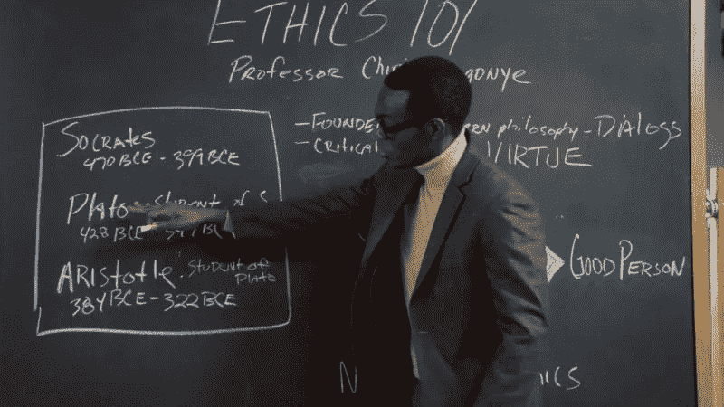

# 技术官僚的誓言

> 原文：<https://medium.com/hackernoon/the-technocratic-oath-a59f2cbb1e09>

在过去的几个月里，由于其他项目正在进行，我在这个[平台](https://hackernoon.com/tagged/platform)上不太活跃，但这是我很久以来一直想写的东西。不久前，我读到一篇在 [HackerNews](https://hackernoon.com/tagged/hackernews) 和 Reddit 等网站上疯传的文章，内容是一名程序员为自己写的东西感到羞愧。

有问题的文章可以在这里找到:

 [## 我仍然感到羞耻的代码

### 如果你以写代码为生，有可能在你职业生涯的某个时候，有人会要求你写代码…

medium.freecodecamp.org](https://medium.freecodecamp.org/the-code-im-still-ashamed-of-e4c021dff55e) 

最终，上面故事中的程序员被要求为十几岁的女孩创建一个推荐药物 X 并且只推荐药物 X 的通用信息站点。该程序员显然做得很好，并且因为他的努力而受到好评。然而，事实证明这种药物的主要副作用是抑郁和自杀的想法…

他本该得到一顿昂贵的牛排大餐作为奖励的那一天，却是他发现一个年轻女孩在服药后自杀的那一天。

现在，这肯定不是我最近看到的唯一一个由程序员和数据科学家实施的可疑行为引起的故事。

我们已经看到像#deletefacebook 这样的网站因为剑桥分析公司利用他们从脸书获得的数据操纵了数百万人而迅速崛起。

最可怕的是，毫无疑问，在未来的几个月和几年里，这种情况会越来越多。当我们对项目中可能被认为不道德和/或不道德的需求说不时，我们没有保护措施。如果说不，我们作为开发人员很可能会将我们的工作置于危险之中，而对要求我们实现这些需求的人没有任何实际的影响。

随着越来越多的公司开始收集我们的用户数据，类似 Cambridge Analytica 的事情再次发生的可能性越来越大。

This twitter chain is utterly terrifying…

# 希波克拉底誓言。

如果你熟悉任何医学专业，那么你应该知道希波克拉底誓言。这个誓言要求新的医疗专业人员坚持特定的道德标准。

 [## 希波克拉底誓言-维基百科

### 希波克拉底誓言是一个历史上由医生宣誓。这是最广为人知的希腊医学之一…

en.wikipedia.org](https://en.wikipedia.org/wiki/Hippocratic_Oath) 

现在，这更具有象征意义，而不是一套严格的规则，然而，它确实确保了新毕业的专业人员考虑他/她的行动，并确保他们为他们治疗的病人做得最好。但是对于所有进入这个领域的软件开发者来说,“技术官僚誓言”值得考虑吗？

虽然它实际上不会停止弊端，但它会鼓励新毕业的开发人员和编程技术的实践者在开发他们的系统时坚持一定的道德标准。

类似这样的事情代表着朝着正确方向迈出的一小步，直到适当的制衡能够到位，以确保企业在法律上有义务遵循一套更严格的道德准则。

# 判定不道德的挑战

作为开发人员，我们如何理解我们所构建的结果？比如说，Webpack 的开发者怎么知道他们的模块捆绑器会被用来做什么？他们是在通过继续制造优秀的工具来帮助不道德的公司和政权吗？

正如希迪所描述的，大多数伦理道德都陷入了“灰色地带”。如果你看过《好地方》,你会看到希迪不得不思考“电车思维实验”,在这个实验中，他必须决定是否杀死一个人来救五个人。随着我们越来越接近完善自动驾驶汽车的艺术，这项实验将一次又一次地证明它的重要性。

Chidi knows the struggle.

你对实验研究得越深入，它提出的问题就越多。救了 5 个人的命，杀了 1 个人，这是我们做的最好的事情吗？如果那 5 个人碰巧是大规模谋杀犯或性侵犯者，而其中一个人恰好在她/他的大脑中锁定了癌症的治疗方法，会发生什么？

如果这些实践不仅有问题，而且我们系统的使用是不可理解的，那么我们如何确保我们建造/设计的任何东西都遵循最佳的道德实践呢？

# 结论

我非常有兴趣听听其他人对这个问题的想法，并讨论我们可以解决这些情况的潜在方法。欢迎在下面的评论区留下你的评论或者发推特给我:[埃利奥特·福布斯](https://medium.com/u/eb71d34fbe09?source=post_page-----a59f2cbb1e09--------------------------------)

这种“技术官僚誓言”的想法当然并不新颖，我已经看到了修改希波克拉底誓言以适应的努力:[https://gist . github . com/Lauren ona/55 C5 eeac 8 ddfb 33 EB 7 B4 cc 20175217 a9](https://gist.github.com/laurenancona/55c5eeac8ddfb33eb7b4cc20175217a9)