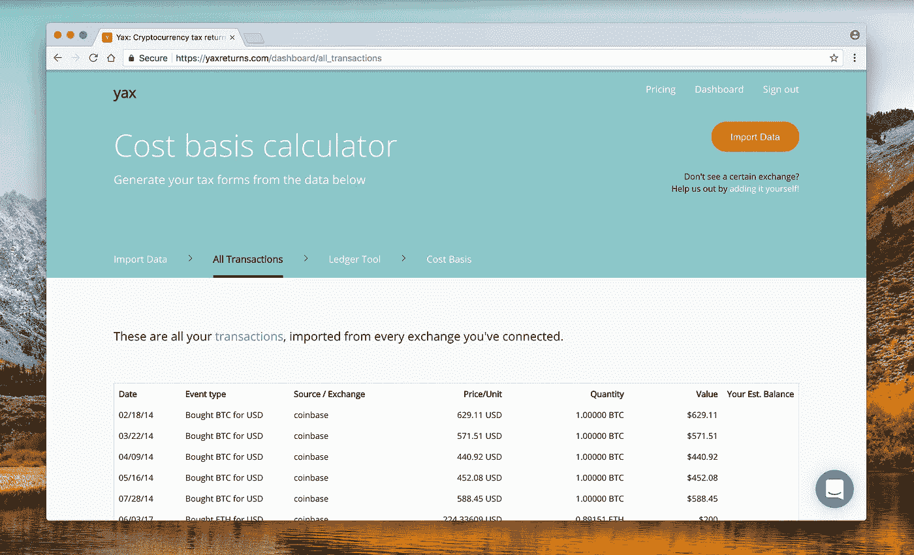

# 加密税的十诫

> 原文：<https://medium.com/hackernoon/the-ten-commandments-of-crypto-taxes-8ab9c532c500>

***免责声明:本人不是专业会计师、财务顾问，也不是注册 CFA、CPA。我在这里所说的或你在这里读到的任何内容都不构成法律、财务或税务建议。也就是说，我做了一些谷歌搜索和一些严肃的问题。***

完全公开，我已经创建了一个服务来帮助你计算你的加密资本收益，叫做 YaxReturns.com**T4**。要更深入地了解这些戒律，请点击[这里](/@david_97757/the-ten-commandments-of-crypto-taxes-in-depth-887c7b596f01)。

1.  **加密货币要征税吗？作为收入还是资本收益？**

是的。根据本 IRS 备忘录[和](https://www.irs.gov/pub/irs-drop/n-14-21.pdf)的规定，加密货币应纳税。如果你在购买后不到 1 年(365 天)出售它们，它们应作为收入纳税。如果你在购买一年后出售它们，它们应作为长期资本收益(简称资本收益)纳税。如果你从不出售你购买的加密资产，它们是不需要纳税的。所有这些都适用于国内外的美国公民。

能否将这份国税局备忘录解读为非官方且未强制执行，2017 年不缴税？风险自担。

**2。加密货币是资产(像股票)还是货币(像美元)？**

一笔资产。在国税局和证交会(在这种情况下起重要作用的监管机构)看来，加密货币是一种“资本资产”。你可以在这个备忘录[这里](https://www.irs.gov/pub/irs-drop/n-14-21.pdf)读到更多关于他们的立场。它可能看起来不像一份正式文件，但它确实是。

**3。如何向美国国税局报告我的加密货币资本收益？我如何在 2017 年纳税申报表中包含这些信息？**

计算您在 2017 年进行的每笔“应税”加密交易的成本基础和资本收益，并将其作为单独的“声明”附在 8949 表格[附表 D 中。这可以是一个电子表格。然后在表格 8949 的 ***中填写一行*** ，包含 2017 年这些交易的资本损益总额。在下面写上“见附件声明”。](https://www.irs.gov/forms-pubs/about-form-8949)

**4。什么是成本基础？为什么是计算资本利得最重要的部分？**

成本基础是资产在购买时的原始价值**(价格 x 数量)**。它是计算资本收益的两个要素之一，另一个是资产出售时的总销售价值(或市场价值)。资本收益等于资产的成本基础和当前市场价值之间的差额。当你卖出某样东西时，知道它的价格是非常明显的，知道那种资产在许多个月前和交易前花了你多少美元可能很难追溯。

**5 .如何计算成本基础和资本收益:**

**成本基础:**(货币数量 x 货币购买价格)

**资本利得:**(货币数量 x 货币销售价格)减(货币数量 x 货币购买价格)

**6。什么是“应纳税的”,什么不是？什么是“应纳税事件”？**

每当您以高于购买价格的价格出售密码货币时，这都是应纳税的事件。这包括您以美元出售一种密码货币的时间，以及您以另一种密码货币 出售一种 ***密码货币的时间。在后一种情况下，将一个密码出售给另一个密码时的价格需要转换回美元。***

**7。如果您在 2017 年只使用一种汇率，成本基础是如何运作的:**

您需要做的就是从该交易所获得一份您的应税交易(销售)电子表格。一些交易所，如比特币基地，允许您打印包含应税销售的成本基础电子表格，如下所示:[https://www.coinbase.com/reports](https://www.coinbase.com/reports)。如果您的交易所不提供该选项，您可以使用类似[**YaxReturns.com**](https://yaxreturns.com/)的服务来创建电子表格。

**8。如果您在 2017 年跨多个交易所转移了密码，成本基础是如何运作的:**

更棘手。在购买其他密码或在交易所之间转移密码之前，你需要记录你购买 ***每笔******每笔密码的价格。然后你需要弄清楚那些售出的密码中哪些数量属于哪些成本基础数量(使用先进先出、后进先出等方法)。)，因为你不太可能在每次交易时都以 1 整以太币或莱特币的价格卖出 1 整 T8 比特币。这很难追踪，但并非不可能。**无耻却有用的插头:**像[**YaxReturns.com**](https://yaxreturns.com/)这样的工具可以帮到你。***

* *困难之处在于，没有哪一家交易所能够提供您所需的全部信息。比特币基地不知道你在北海巨妖购买一枚比特币，然后把它转移到比特币基地钱包的真实价格，只知道你把它送到比特币基地那天的价格。

**9。成本基础和资本收益如何与多种货币之间的交易一起工作:**

假设你在北海巨妖花 500 美元买了 1 个比特币。然后你用那 1 个比特币买了 1 个以太和 1 个涟漪，都在北海巨妖。如果以太网和涟漪的价格上涨，那么你需要知道比特币、以太网*和*涟漪在你购买以太网和涟漪的那一刻的价格，以便知道你以美元计算的资本收益。这就好像你真的用美元而不是给定数量的比特币购买了以太和涟漪。如果你随后用以太和涟漪买入其他货币，这个过程会重复。

同样，假设你花 500 美元买了一个 BTC，花 200 美元买了一个 ETH。然后你卖掉 2/5 的 BTC 去买一些 ETH。然后你卖掉你所有的 ETH 换成美元。假设你在 ETH-USD 和 ETH-BTC 市场都购买了 ETH，那么你出售 ETH 的成本基础是什么？

备忘录的 A-5 部分是国税局澄清这一点的地方。

10。国税局对加密的官方立场是什么？

2014 年 3 月 25 日，美国国税局发布了一份关于数字货币的备忘录。它在 2017 年 8 月 6 日[再次引用了该备忘录。备忘录中](https://www.irs.gov/newsroom/irs-virtual-currency-guidance)[称](https://www.irs.gov/pub/irs-drop/n-14-21.pdf) *“纳税人通常通过出售或交换虚拟货币来实现资本收益或损失，虚拟货币是纳税人手中的资本资产。例如，股票、债券和其他投资财产通常是资本资产"*(A-7 部分)。这是国税局唯一两次正式提及加密和数字货币，但意义重大。

此外，如果您计划等到国税局公布更多相关信息，而不是像建议的那样支付 2017 年的税款，备忘录将在 A-16 节中提及今年对*“支付不足或未能正确归档信息”*的罚款。

**11。如果我使用另一个国家的交易所或使用匿名账户交易，纳税安全吗？**

这是一个你独自承担的风险。另一个国家的交易所可能永远不会遵守美国政府或国税局的规定，将您的交易信息移交给他们，但如果交易所曾经这样做，并且您已经有几年没有纳税，您可能会受到处罚。同样，如果您在一家尚未将数据移交给国税局的美国交易所交易，或者您以一封不知名的电子邮件和一个名字签约参加该交易所，您就指望该交易所永远不会移交您的数据。到目前为止，比特币基地交易所已经不得不披露在其平台上购买了价值超过 2 万美元密码的任何人的身份和交易活动，尽管他们最初的意图是不披露其用户的信息。我不建议或建议你像这样逃避国税局。

**12。像比特币基地这样的主要交易所和钱包对加密税做了什么？:**

如上所述，一些交易所为您的应税交易提供电子表格下载。比特币基地甚至在他们的网站和应用的顶部发布了警告，提醒你“今年请记得缴税”然而，如果你曾经在一个交易所购买，然后将密码转移到另一个交易所，这些交易所拥有的关于你交易的信息是有限的，也许根本没有用。

**13。我需要填写哪些表格来填写 2017 年加密纳税申报表？**

[**附表 D，表格 8949**](https://www.irs.gov/forms-pubs/about-form-8949) **:** 如果你 2017 年刚刚买卖了 crypto，只需要填写这个表格。

[**表格 1099-MISC**](https://www.irs.gov/forms-pubs/about-form-1099-misc-miscellaneous-income) **:** 如果你在 2017 年也向某人支付了超过 600 美元的服务费，你需要填写这张表格。此类服务可能是租金、由非您员工提供的服务，或者医疗、保健或法律费用。

**14。你需要给你的会计师什么:**

要么计算你在 2017 年进行的每笔“应税”加密交易的成本基础和资本收益，并将其交给你的会计师，作为**“声明”**附在[附表 D、表格 8949](https://www.irs.gov/forms-pubs/about-form-8949) 中。或者打印出一份电子表格，其中包含 2017 年你用美元进行的每笔买入的价格和数量，以及你用美元进行的每笔卖出的价格和数量，并让你的会计师计算这些交易中每笔交易的成本基础和资本利得。

15。因为加密是第 1031 (a)(1)条规定的“类似实物交换”，所以我可以免于纳税吗？

此前，一些加密货币持有者和税务顾问将加密货币的买卖解释为[“类似实物交换”](https://www.irs.gov/newsroom/like-kind-exchanges-under-irc-code-section-1031)。如果出售财产的收益随后投资于类似的同类资产，同类交换允许个人延期纳税。换句话说，加密交易不会产生资本收益或所得税，因为你买卖的是非常相似的东西。然而，最近美国国税局将[第 1031 条](https://www.irs.gov/newsroom/like-kind-exchanges-under-irc-code-section-1031)的解释局限于房地产，而加密货币显然不是。因此，第 1031 条肯定不再适用于加密货币，如果它曾经适用的话。

***Ok 教程结束！这些是关于 2017 年加密税的最重要的事实。然而，加密货币税收监管和合规是一个新的不断发展的空间。***

***让我们合作:*** 为了跟进这篇文章，我已经开始了一个活的、正在进行的文档，我将继续在其中添加额外的资源，以使您了解最新的加密税务知识。让我们汇编一份关于加密税的最佳文章、教程、观点和工具的列表。你可以在这里找到这个延续:[https://medium.com/p/887c7b596f01](/p/887c7b596f01)

***查看 YaxReturns.com:***

 [## Yax

### 该工具可帮助您计算加密货币交易和销售的成本基础。它分析跨…的交易

yaxreturns.com](https://yaxreturns.com) 

伸出手去打招呼！@yaxreturns

david@yaxreturns.com 和 support@yaxreturns.com