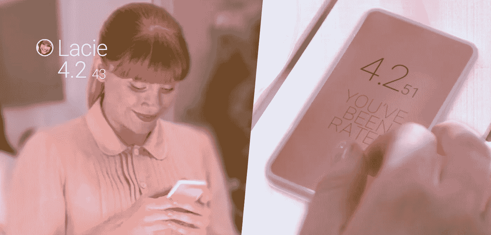

# 联邦币可怕的未来

> 原文：<https://medium.com/hackernoon/the-terrifying-future-of-fedcoin-ddcbef2b9592>

## crypto 如何带来世界上前所未有的最重要的权力集中。

我对加密想得越多，就越对我们的未来感到恐惧。

一方面，加密货币似乎是自由主义者的梦想。这项技术允许在没有任何第三方参与的情况下，通过互联网进行货币交易——或任何有价值的交易。加密就是赋予个人权利。像比特币这样的项目是开源的，没有许可，没有边界，不受审查，不受任何人的控制。他们对银行的存在提出了质疑，并暗示了一个[激进自治的世界。](https://www.youtube.com/watch?v=2tqo7PX5Pyc)

另一方面，加密货币也可能被政府用来获得对人民的可怕权力。比历史上任何时候都多。

这怎么可能呢？考虑一下 [FedCoin](https://law.yale.edu/system/files/area/center/global/document/411_final_paper_-_fedcoin.pdf) :由政府建立的中央加密货币，意在取代其货币。

# 加密货币=可编程货币

自比特币以来，加密领域最重要的创新可以说是创造了[图灵完成](https://en.wikipedia.org/wiki/Turing_completeness)项目，如[以太坊](https://ethereum.org/)。这些就像比特币，但它们增加了一个重要的特征:它们可以执行任何计算。

因为这些加密货币可以运行计算机代码，所以有可能在其上构建和分发应用程序。这些被称为[智能合约](https://en.wikipedia.org/wiki/Smart_contract)，它们绝对是革命性的。简而言之，他们允许我们[计划资金](https://www.youtube.com/watch?v=_0jxX84mzts)。

对政府来说，能够规划资金是可能发生的最好的事情之一。为什么？这里有几个例子:

## 1.税收自动化

想象一个美国政府用联邦币取代美元的世界。然后，他们将整个税收代码直接编入钱里。

在这个世界里，每次你领工资或者花钱，都会自动从交易中扣除税款。你不再需要在年底雇佣一名会计。一切都是通过智能合约实时计算的。加密可能会让会计师变得无关紧要，就像自动驾驶汽车会让公共汽车和出租车司机变得无关紧要一样。

Never again.

想想这样可以节省多少时间。美国公民每年花费大约 61 亿小时处理税务，导致大约 2330 亿美元的生产力损失。税收自动化将为你我节省大量的时间和金钱，对企业和政府本身来说更是如此。

## 2.自动分发货币

除了税收，FedCoin 还可以实现货币再分配的自动化。

假设一位政治家承诺在教育上多投入 10%的资金。他可以直接把它编入区块链，而不仅仅是空洞的文字。然后，每次政府收税，10%会自动转到教育部。有了联邦币，你将不再需要相信政客。你可以相信代码本身。

这同样适用于任何其他的金钱分配。需要给一笔刺激款？不需要通过邮件发送物理检查，也不需要担心有人欺诈性地试图偷钱。你可以用一行代码完成所有的事情。

## 3.透明政府

FedCoin 也可以使政府更加透明。关于加密最大的误解之一是交易是匿名的。除了[隐私币](https://coincentral.com/privacy-coins-what-are-they-how-do-they-work-and-why-are-they-needed/)，它们都不是。恰恰相反。今天你可以去 bitcoin.org 的，下载比特币的区块链，查看网络上的每一笔交易。按照设计，每笔比特币交易都是公开的。

Bitcoin’s blockchain is essentially a public spreadsheet. You can browse it at [blockchain.info](https://blockchain.info/).

如果 FedCoin 是这样建造的，任何人都可以访问区块链，查看政府的地址，看看政客们到底是怎么花我们的钱的。

考虑到美国政府在过去的 20 年里损失了 21 万亿美元(相当于万亿美元，相当于整个国家债务的总和)，更多的透明度将是非常受欢迎的。

# 比特币破产问题

Crypto 可以让政府财政变得更加高效和透明。那么它有什么可怕的呢？请考虑以下情况:

A [brain wallet](https://en.bitcoin.it/wiki/Brainwallet) allows you to carry your money in your head. Literally.

想象一下，你从银行借了 100 万美元，用来购买比特币。然后，你把它们放进一个秘密的私人钱包里。你销毁了私钥的任何痕迹，除了你已经记住的 12 个单词[助记短语](https://en.bitcoin.it/wiki/Mnemonic_phrase)。现在，唯一能拿到借来的钱的方法就是在你的大脑里。

然后，你回到你的银行，宣布破产，拒绝偿还贷款。通常情况下，银行、法院和政府会联合起来没收你所有的东西，这样他们就有希望把钱拿回来。

只是现在，因为钱在区块链上被数学加密了，他们什么也做不了。那一百万美元永远是你的了。

你今天就能做到。我是认真的。我很惊讶还没有一个著名的案例有人已经这样做了。当然，如果你这么做了，你可能会永远离开这个国家。否则，你很可能会被指控欺诈，并在监狱里呆很长一段时间。

重点是:**加密货币凌驾于法律之上。对于政府来说，这是一个巨大的问题。如果每个人都开始做一些鲁莽的事情，比如拖欠贷款或完全停止纳税，这个系统可能会崩溃。他们不会允许的。**

那么，当一个政府想要可编程货币的所有好处，但又不想失去对它的控制时，会发生什么呢？解决方案很简单:

1.  他们创造了联邦币，并用它来代替国家货币。
2.  他们为自己编写了**后门程序**。这样，他们就可以在人们试图穿越时冻结或扣押他们的资金。
3.  十有八九，他们可能会禁止比特币、以太坊和其他他们无法控制的公开加密货币。哦，既然他们这么做了，为什么不也禁止现金呢？他们也控制不了，现金是最容易作案的。

If FedCoin happens, politicians will inevitably give themselves absolute control over the money.

有了联邦币，如果你试图诈骗，政府就不需要通过法院和银行来没收你的钱。他们只要按一下按钮就可以做到。如果这没有吓到你，问自己以下问题:

# 如果希特勒有联邦币呢？

想象一下，如果在 1943 年，希特勒绝对控制了德国所有的货币。如果按下按钮，他就能冻结一半德国人的钱，那会怎样？历史将会有非常不同的结局。

或者考虑一下[中国的社会信用](http://bigthink.com/stephen-johnson/a-look-at-chinas-orwellian-plan-to-give-every-citizen-a-social-credit-score)，这是一个新项目，每个人都会得到一个 350 到 950 之间的分数，就像你的信用分数一样。除了分数不仅仅是关于你的财务质量，而是关于你作为一个公民的整体价值。

在这个项目下，当你做错事情时，你的分数会下降。可能是乱穿马路，没有及时还贷，犯罪，或者只是和分数低的人做朋友。当你的社交分数下降时，你的生活质量也会下降。

If you’ve seen this [Black Mirror episode](https://en.wikipedia.org/wiki/Nosedive), you know how this ends.

在中国，社会评分低意味着获得金融服务的机会有限，利率和税率更高，网速更慢。如果价格太低，你就不能送你的孩子去私立学校，也不能再买机票和火车票了。关键是，如果你不按照政府想要的那样去做*的话，你和你的家人会过得越痛苦越好。*

With FedCoin, the money itself would prevent you from buying things if your score is too low.

这听起来可能像一个反乌托邦的噩梦，但这正在发生。中国政府提前实现了到 2020 年在全国范围内实施该系统的目标。更奇怪的是，到目前为止，大多数[人似乎很喜欢这个项目](https://www.youtube.com/watch?v=AAIKh7AnTIk)，因为这个项目给那些表现好的人提供额外津贴。

很容易想象在一个腐败的政府下，社会信用会变得多么黑暗。一旦在全国范围内实施，没有什么能阻止他们破坏你的分数，比如说，如果你参加了错误的抗议或投错了票。社会信用正在利用金钱成为最终的控制系统。

我提出这个问题，是因为在我看来，联邦币是中国在全国范围内实施这样一个系统所缺少的成分。有了它，所有的社会信用规则都可以直接编码到货币中。

鉴于此，中国自 2016 年开始研发自己的 [Fedcoin 也就不足为奇了。他们还开始取缔其他加密货币，禁止 ico、加密挖掘和外汇交易。我敢打赌，中国将是第一个推出 FedCoin 的国家，社会信用将是一个核心特征。](http://www.chinadaily.com.cn/business/2017-10/14/content_33235955.htm)

# 即将到来的十字路口

数字货币不可避免。这可能会在 10 年或 100 年后发生，但在某个时候，世界上大多数货币都将是数字化的。好处实在太多了。

问题是，随着金钱变得数字化，它给了那些控制它的人越来越多的权力来控制我们其他人。今天，数字货币允许银行和政府追踪你的每一笔交易。他们可以决定谁可以收钱和花钱，谁不可以。如果你越过他们，他们可以按下按钮冻结或没收你的钱。当金钱仅仅是现金时，这些事情都是不可能的。可编程货币会让这一切变得更糟。

这就是加密货币的用武之地。加密的目的是获得数字货币的便利，而无需任何人负责。政府越来越多地探索联邦币的想法。他们想要比特币的所有好处，除了最后一部分，他们必须放弃对金钱的控制。他们忽略了整个要点。

技术既可用于善，也可用于恶。核能可以为数百万家庭提供电力，但也可以摧毁他们。加密货币也不例外。

作为一个社会，我们需要决定如何使用这项新技术。我们想要一个开放、全球化、去中心化、无需许可的货币体系吗？一种民有、民治、民享的货币。或者，我们想要一个政府掌管数字货币的世界，一个有可能被大规模滥用和压迫的世界？

这些是我们在未来十年需要面对的问题。

# 想了解更多关于加密的知识吗？看看我的其他这些令人费解的故事👇

 [## 今天我成了亿万富翁

### 这是一张来自津巴布韦的 100 万亿美元的钞票。现在大约值 0.40 美元。我得到它是为了提醒我…

hackernoon.com](https://hackernoon.com/today-i-became-a-trillionaire-15ba02ddf4a3)  [## 人们在数码猫上花费了数百万美元，这就是为什么它是有意义的

### 密码猫不仅仅是猫。

medium.com](/swlh/people-are-spending-millions-on-digital-cats-and-heres-why-it-make-sense-aea431740bcf)