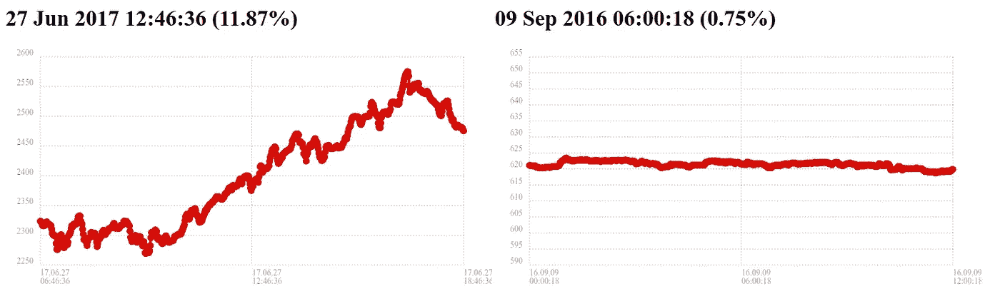

# 系绳图

> 原文：<https://medium.com/hackernoon/the-tether-charts-38e91353429>

他们说一张照片胜过千言万语。很明显，一项限制拨款价值 90 亿美元。至少 2017 年 12 月 14 日的 1 亿美元拨款是。在 Tether Corporation“授予”1 亿美元后不到 2 小时，比特币的价格上涨了 600 多美元，涨幅 4%，市值增加了 90 多亿美元。

这与随机选择的时间间隔相比如何？在此期间，比特币平均上涨约 20 美分。得出的平均百分比收益四舍五入为 0%。

2018 年 1 月 18 日， [The Tether Report](https://www.tetherreport.com/) 得出结论，48.8%的比特币价格上涨可以追溯到 93 次 Tether grants 的 2 小时内。这份报告相当科学，但有点难以理解。所以我一直在努力为我们其他人创造一些更简单的东西。

这里有一个例子，说明了如何将系绳授予与随机选择的点进行比较:

Tether Grant vs Random Time

左边的图表显示了一个系绳赠款。中点是授予的时间。与随机时间相比，每个系绳授予的互动版本，查看[系绳效应](https://cuzzo.github.io/the-tether-effect/tether-effect.html)。图表按百分比进行了缩放，以便您可以看到与随机时间相比，系绳授权的差异(尤其是最近)。

如果你感兴趣，我写了[一部 BitCon](https://hackernoon.com/a-brief-history-of-bitcon-cf358da30bf0) 简史——详细描述了许多与[加密货币](https://hackernoon.com/tagged/cryptocurrency)相关的欺诈案例。