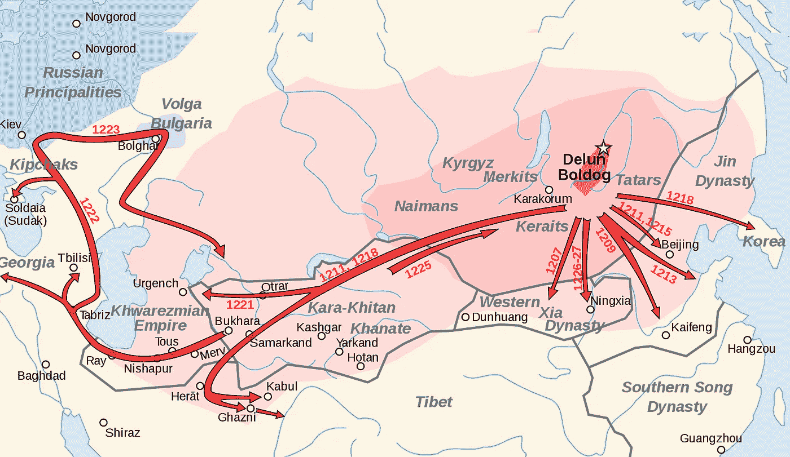
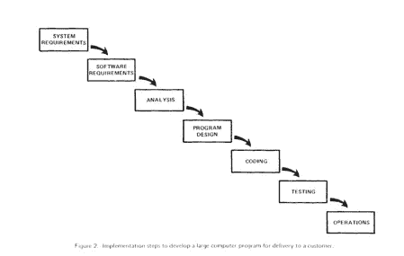

# 编程的第三个十年:什么是生产力？

> 原文：<https://medium.com/hackernoon/the-third-decade-of-programming-just-was-is-productivity-c510507fa511>

## 个人编程史第三章的第二部分。在这里阅读第一部分。

## 生产力

生产力这个词伴随着许多包袱。多年来，程序员的生产率是以每天/每周/每月的代码行数来衡量的。这种方法有几个缺点。

我们拿一个名为**生活**的小游戏程序，让两个不同技能水平的程序员用 C 和汇编两种语言编写。在 C 语言中这是一个 57 行的程序。汇编语言版本是 97 行。假设 C 程序员每行需要 60 秒(这实际上非常快)，汇编程序员以每 40 秒一行的速度编写代码甚至比 C 程序员还要快。创建汇编语言版本需要 65 分钟，而创建 C 语言版本需要 57 分钟，因此多花了 15%的时间，尽管汇编程序员每天多写 33%的代码行。

我们能说汇编语言程序员更有生产力吗？如果我们用一天的代码行数来衡量，她肯定是。如果我们用实现结果所花费的时间来衡量，答案是否定的。当你考虑到两个程序员可能会得到不同的薪水时，事情就变得更不清楚了，因为写得更少的程序员可能会得到更少的报酬，因此*的“每行”成本*更低。

我们能不能至少比较两个拿着同样薪水，用同样语言工作的程序员？让我们来考虑一下这个案例:两个程序员用 c 语言编写了生命的游戏，我们将称他为慢船长，他花了一整天的时间编写了 97 行高度优化的代码，占用了 100 千字节的磁盘空间，在不到一秒钟的时间内加载完毕。Showboat 船长花了同一天时间，设法找到了一种使用 970 行代码的方法，而 97 行代码就足够了，来编写一个占用 1 兆字节磁盘空间、10 秒钟加载时间的程序。

现在告诉我:谁是更有生产力的程序员？

更多的代码不会自动让程序变得更好。我们真的想激励人们写更多不必要的行吗？众所周知，比尔·盖茨诋毁用代码行来衡量生产率，称[是一场“建造世界上最重的飞机”的竞赛。在这个系列的后面，我将引用拉里·沃尔的基本观点。](https://www.wired.com/1995/09/myhrvold/)

另一个最受欢迎的度量单位是“功能点”，这是一个概念单位，应该为最终用户表示一个离散的功能。例如，登录的能力将是一个功能点(FP)。更改个人资料照片的能力是另一个优势。在现实世界中，几乎没有人计算功能点，或者有能力跟踪程序员在给定的 FP 上花费了多少时间。因此，几乎每一个用 FP/day 来衡量生产率的人都通过使用行业标准的*转换因子*来“作弊”，即:*这种*语言通常每 FP 使用*这种*多行代码，而*那种*语言通常使用*那种*多行代码。然后你把代码行除以转换因子，这就把它变成了功能点。显然，这并不比第一种方法好。还有两三种方法，没有一种更好。

因此，当我写软件开发中的生产率时，我是在诉诸常识，而不是度量标准。我认为生产力的提高是任何有助于软件*产品*更快或更好地成功完成而不增加成本的事情。

## 新手和大师

我之所以说 C 可能会让生产率倒退几十年，是因为它与我的书的中心论点有着深刻的联系，即现代编程是手工的，没有编程大师就无法成功。我最喜欢的编程笑话(当然是来自*行话文件*)是以*公案*的风格写成的，这是一个旨在帮助禅宗和尚获得开悟的谜语。

> 一个新手试图通过开关电源来修复一台坏掉的 Lisp 机器。
> 
> 奈特看到学生正在做的事情，严厉地说:“你不能在不知道出了什么问题的情况下，仅仅通过重启来修复一台机器”。
> 
> 奈特把机器关了又开。
> 
> 机器工作了。

Lisp 机器的主要设计者之一 Tom Knight 在重启机器时*知道自己在做什么*，这就是为什么它对他有效，而对新手无效，因为新手“根本不知道出了什么问题”。

c 就是那样；它几乎是汇编语言。它是强大的，也是危险的。这是魔法。在编程大师的手中，C 语言中适当的咒语可以用来编写操作系统、另一种语言，或者操作我们生活所依赖的设备，比如你汽车上的防抱死刹车。在不太确定自己在做什么的人的手中，这个魔法咒语可能会破坏一个硬件，清除数据，或者留下一个很长时间都不会被发现的细微错误，而且一旦出现不良副作用，几乎不可能被发现。

c 语言将编程带回了梅尔的时代(参见本系列的前一章)。梅尔聪明的诡计在 FORTRAN、COBOL 或 ALGOL 中都是不可能的。这也不可能在其他新的语言出现的时候；BASIC、Pascal、Forth 和 SmallTalk。但是在 C 语言中，你只需要指向一个内存地址，就可以了。就像梅尔一样。

*事情是这样的:*

如果每个程序员都像 Mel 一样优秀，这种编程将会非常可爱。我们都将使用运行速度超快的优化代码，并且不会出错。但是不幸的现实是*不是每个程序员都那么好*。就在 C 发布的时候，事情变得更糟了。

## 蛮战在大门口

到目前为止，由于计算机的成本，主要有两种程序员:a)为政府或大公司工作的专业人员，b)使用编程进行研究的学者，通常是研究生。这两种人几乎都是自学成才，非常聪明，而且几乎总是对编程有真正的亲和力或天赋。

但是现在，在 70 年代，两件重要的事情发生了变化。首先，学术机构正在创建专门针对编程的课程，创建新的“教学语言”，最重要的是，本科生(偶尔还有幸运的高中生)正在获得专门用于学习如何编程的分时账户。

第二件改变的事情是个人电脑的出现，首先是在家里组装的套件，然后是包装精美的消费品，售价与旧二手车相同。对于那些有自学爱好的人来说，这将变得容易得多。第一个大规模生产的计算机套件，Altair 8800，在第一年生产的 1975 年售出了 5000 台。在三年时间里(1977 年至 1979 年)，两种顶级个人电脑——坦迪·TRS-8 和苹果 II——售出了超过 15 万台。这大约是本世纪初全世界电脑的数量。BASIC 语言几乎是唯一包含在内的软件。

从接近电脑开始变得容易多了。

成千上万的新程序员正在被教授或自学，他们将很快被释放到这个世界，一个渴望计算机程序的世界。这将很快戏剧性地扩大程序员的队伍。

成为一名程序员不再那么难了，编程被认为是一个很有前途的职业，可以通过*培训*来实现。编程曾经是激情和关怀的对象，它开始了成为一个有利可图的职业的旅程，最终吸引了各种各样的人，他们对编程没有特别的激情或亲和力，只是为了钱。

我将在本书后面谈到罗伯特·马丁，他直言不讳地讲述了他一生中看到的一个令人费解的转变。在 50 年代和 60 年代，程序员群体的性别相当平衡，然后在 70 年代很快变成了男性主导的领域。

我认为，对这种差异的一个合理解释可能是，编程从一个模糊的职业，只吸引基于优点和激情的人，转变为一个有吸引力和利润丰厚的职业，变得像电气工程一样受人尊敬。

当编程还是一个模糊的职业时，几乎没有竞争。我认为有可能的是，一旦编程成为一个有利可图和令人向往的职业，竞争就非常激烈，在一个男性占主导地位的社会中，制度偏见确保了专业教育和职业选择都属于男性。

## 神话和人类

我想告诉你的关于七十年代的最后一件事是 1975 年出版的*神话中的人月*。这本经常被引用的书是由 IBM 前经理小佛瑞德·P·布鲁克斯写的，描述了他 10 年前在管理当时最大的软件开发项目之一 System/360 操作系统时学到的经验。

令我吃惊的是，现在重读这本书，我找不到任何一个分析或观察不像四十多年前这本书第一次出版时那样中肯和尖锐。神话中的人月是一部开创性的作品。它的重要性和它对整个计算机行业的影响是不言而喻的。虽然我认为当时没有人认识到它，但它是第一个全面的软件开发生命周期(SDLC)方法。它不仅描述了系统编程面临的挑战，还规定(超过 150 页):

*   SDLC 的阶段
*   每个周期的时间分配
*   如何估计
*   如何配备员工
*   如何构建组织
*   如何管理程序的设计
*   如何规划迭代
*   文件和治理
*   通信协议
*   如何衡量生产率
*   关于代码设计的一些特殊问题
*   交付物和工件
*   工具和框架
*   如何调试和计划发布
*   如何管理流程

的确，左图中的一步一步的路径出现在 w . w . Royce 1970 年的论文*管理大型软件系统的开发*中，但是与许多人认为的相反，Royce 并不提倡使用它。事实上，他对使用它发出了*警告*。他只是描述了当时的普遍做法和一些相关的问题，正如 Brooks 五年后所做的那样，他就如何缓解这些问题提出了一些
建议。

然而，罗伊斯的建议占了 10 页，相比之下，在*神话人月*中有 150 页的详细处方。罗伊斯的论文与其说是方法论，不如说是行动呼吁。这就是为什么我把第一个书面方法论归功于布鲁克斯。

从现在开始的几个章节里，我会更多地谈论方法论，但不是现在。关于八十年代的语言，还是有一些故事可以讲的。

> "不要仅仅阅读这里的说明，而不了解它们的作用."
> 
> Apache 服务器附带的配置文件

## [<——本系列的前一篇文章](https://hackernoon.com/the-winds-of-change-1970-1980-c1baa1c07872)

## [系列的下一篇文章- >](https://hackernoon.com/the-fourth-decade-of-programming-bigger-boxes-smaller-talk-ba3d2410898e)

[1]《物理学家》。*连线*，1995 年[https://www.wired.com/1995/09/myhrvold/.](https://www.wired.com/1995/09/myhrvold/.)

[2]你可能还记得我在第一章中提到过 LISP，这是一种自 20 世纪 50 年代末就开始使用的有影响力的计算机语言。

[3]我的小弟弟就是这些人中的一员。我，一个音乐家，有一天对他的 TRS-80 非常感兴趣。如果那天你告诉我们中的任何一个人，他会成为一名职业艺术家，而我会成为一名电脑极客，我们都会认为你完全疯了。