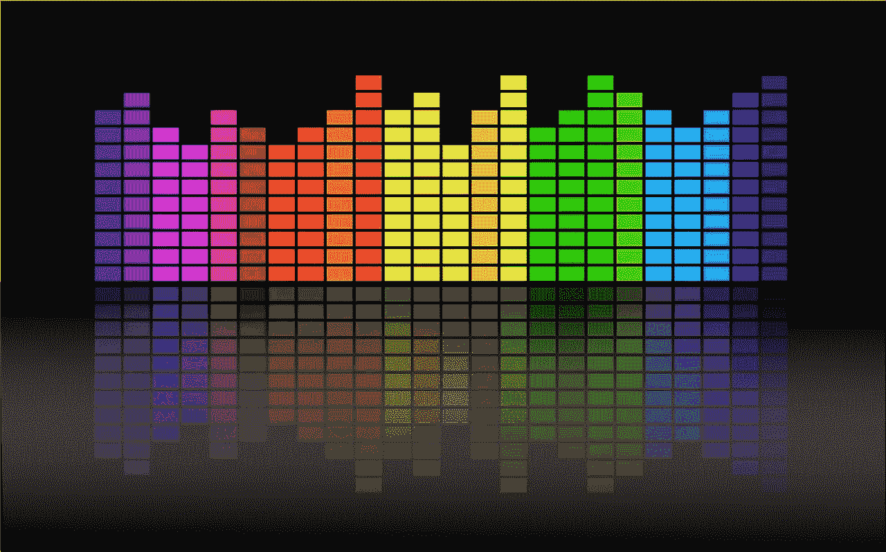
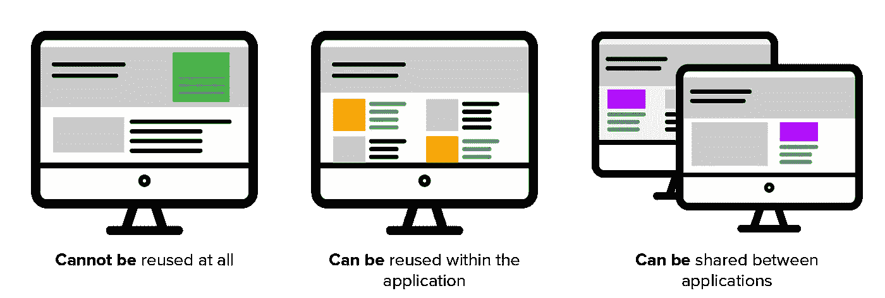

# React 中可重用性的三个层次

> 原文：<https://medium.com/hackernoon/the-three-types-of-reusable-react-components-37a6bf7c2d69>



开发人员经常谈论重用代码的重要性。我们谈论 DRY 原则(不要重复自己)，代码审查充斥着类似这样的评论:“你能把它封装成一个函数并在第 19 行重用它吗”，我们经常向产品所有者解释为什么当我们在这里*上*改变一些东西时，它会在这里*上*自动*改变。*

但这些讨论缺乏一些细微差别。他们经常让可重用性看起来像是二进制的——代码要么可重用，要么不可重用。我认为实际上有三个层次的可重用性。

第一种，也是最不可重用的组件类型根本不能被重用。有经验的开发人员在严格、不灵活的期限内构建这种类型的组件。没有经验的开发人员在他们只想让某些东西工作或者还没有学会重用代码的时候构建这种类型的组件。

中间地带充满了只能在一个应用程序中重用的组件。大多数组件都属于这一阵营。开发人员关心可重用性，希望一次又一次地重用他们的组件，而不是重新发明轮子，但不想把精力放在提取那些组件并把它们放在库中。

可以在应用程序之间共享的第三种类型的组件。这些组件存在于像[材质 UI](https://material-ui.com/) 或[反应工具箱](http://react-toolbox.io/#/)这样的库中。它们可以导入到应用程序中，并且它们的组件可以重用。

每个级别的可重用性都需要不同的工作量来构建，并为团队和业务提供不同级别的价值。让我们研究一下`Button`组件在每一层可能是什么样子。



Design credit: [Joe Cahill](https://www.linkedin.com/in/joecahill)

## 完全不能重复使用的组件

构建按钮的方法有很多种，不同的团队成员可能有不同的偏好。我见过开发人员上百次地重新构建一个简单的`Button`，而不是构建一个可以跨应用程序重用的可重用按钮。

例如，有时我会看到带有特定业务逻辑和样式的按钮。我甚至见过一些硬编码的文本。

```
*const* ComparisonButton = ({ 
  isDisabled, 
  icon, 
  width, 
  color, 
  region 
}) *=>* {   
  *const* color = isDisabled === true ? '#999999' : '#1274b8';
  const btnClass = region === 'us' ? 'btn__blue : 'btn__red';  *return* (
    <button className={btnClass}>
      <Icon 
        styles={icon}
        width={width}
        color={color}
      </Icon>
      Compare Me
    </button>
 );
};
```

它可以这样使用:

```
import { ComparisonButton } from './ComparisonButtonconst ParentComponent = () => {
  return <ComparisonButton />
}
```

这个`Button`组件的实现方式有几个主要问题。

1.  文本被硬编码在`Button`中。如果您需要国际化您的应用程序，并且`Button`文本需要是法语，会发生什么？
2.  `Button`知道`Icon`组件。如果有人想用这个没有`Icon`的`Button`会怎么样？

3.`Button`的造型是由它内部决定的，而不是作为道具传进来的。这使得样式更难覆盖。如果想重用风格略有不同的`Button`的逻辑怎么办？

这个`Button`真的是具体到它的上下文。它只能在一种情况下使用，即使它与站点上的所有其他按钮共享逻辑。你甚至不能把你想要的任何文本传进去！

假设我们想将它重构为一个可以在应用程序中重用的组件。

## 只能在应用程序中重用的组件

如果我们重构前面的例子，使其在我们的应用程序中可重用，它就需要更加通用。

```
*const* Button = ({ children, onClick, className, ...props }) *=>* {   
  *return* (
    <button className={className} onClick={onClick}>
     {children}    
    </button>
  );
};
```

它可以这样使用:

```
const ParentComponent = (props) => { *const* color = props.isDisabled === true ? '#999999' : '#1274b8';
  const btnClass = props.region === 'us' ? 'btn__blue : 'btn__red';
  const onClick = () => { // do something } <Button className={btnClass} onClick={onClick}>      
    <Icon 
      styles={props.icon}
      width={props.width}
      color={props.color}
    </Icon>
    Compare Me
  </Button>
}
```

现在，`Button`不需要了解`Icon`。对于另一个开发人员来说，在没有`Icon`的场景中重用`Button`非常容易。

我们还将按钮被禁用时`Icon`应该是什么颜色的知识移到了`ParentComponent`中。此外，`ParentComponent`管理`Button`应该如何基于区域进行样式化。

`Button`内部的逻辑只处理它*需要*知道的东西，而应用程序处理业务逻辑。这使得与该应用程序在同一个 repo 中工作的其他开发人员可以重用该按钮。

## 可以在应用程序之间共享的组件

假设您的团队在扩大，您希望所有团队都能为您的用户提供一致的体验。您将需要升级到第三种类型的可重用组件。您将构建一个可重用组件的库，它可以被您工作的所有团队使用。

那个图书馆:

1.  必须可以安装到其他应用程序中
2.  必须处理造型
3.  必须使样式易于覆盖
4.  必须有文档

您的按钮可能看起来仍然像以前一样，但是现在，您将从库中导入它，而不是从应用程序中的另一个文件导入。

如何实际构建一个可重用的组件库是另一篇文章的主题，但是如果你正试图决定是否要进行这个项目，可以考虑阅读[你应该构建一个可重用的组件库吗？](/@MCapoz/should-you-build-a-reusable-component-library-4e7df72413d7)

这三个层次的可重用性都有优点和缺点。有时候，你只需要完成一个功能。其他时候，您希望在团队中共享组件。

当你开发一个特性的时候，你应该为你所从事的工作，你的公司所处的阶段，以及你的团队的带宽选择合适的可重用性级别。有时，在可重用性阶梯的最底层构建一些东西是完全可以接受的。其他团队可能需要更强大的解决方案。只要始终确保您有意识地选择可重用性的级别，并认识到您所做的假设。

如果你喜欢这篇文章，并且有兴趣学习更多关于可重用性和可重用组件库的知识，你可以考虑:

*   你应该建立一个可重用的组件库吗？
*   [构建可复用组件库](https://m.youtube.com/watch?v=PHi2lohuXvo)

🌟 ***如果你喜欢这个帖子，*** ***一定要在中上*** [***关注我***](/@MCapoz) ***，*[***在 twitter 上关注我***](https://twitter.com/MCapoz) ***，并在***[***Patreon*🌟**](https://www.patreon.com/maecapozzi)**