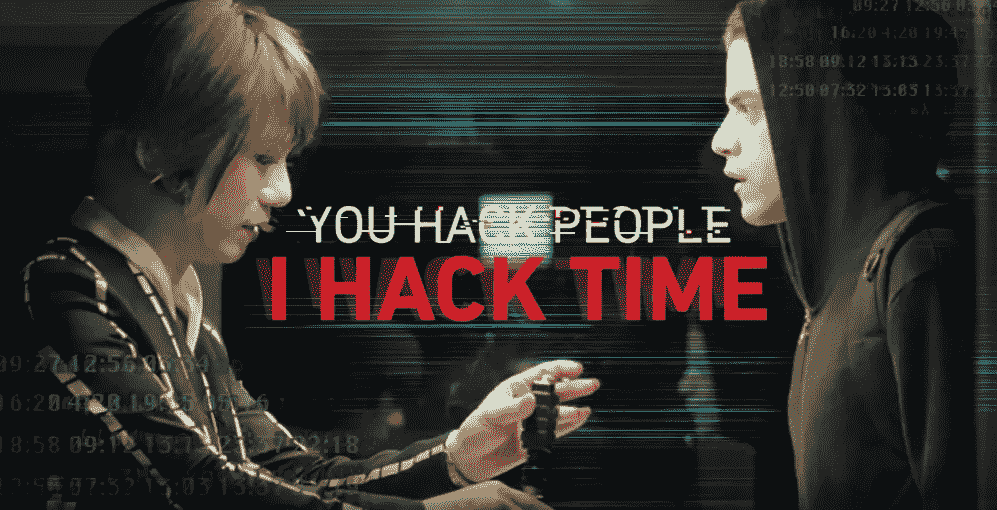

# 时间黑客方法

> 原文：<https://medium.com/hackernoon/the-time-hacker-method-12970c47f04f>

## 做更多重要事情的效率诀窍——每次 15 分钟。

这是一篇关于黑客的帖子——不是指闯入计算机系统(破解)的那种黑客，而是寻求探索、理解和分享的积极黑客。如果这种黑客形式对你来说是新的，那么这个[维基百科条目](https://en.wikipedia.org/wiki/Hacker_culture)可能很有见地。

在这种背景下，黑客是探索者和实验者。这在艺术、计算机编程、创客运动和生物黑客等不同领域都可以看到。为什么不是时间呢？

当我发现@ImJulieTweets 的时间黑客播客时，我第一次遇到了时间[黑客](https://hackernoon.com/tagged/hacker)这个术语。在她的播客中，朱莉分析了[提高效率](https://hackernoon.com/tagged/productivity)的小技巧，这些小技巧可以让你在时间中做更多的事情。

对我来说，在观看演员 BD Wong 在 USANetwork 的连续剧《机器人先生》中饰演黑暗军队的跨性别领袖怀特罗斯时，时间黑客的话题再次浮出水面。

[**@**whoismrrobot](https://twitter.com/whoismrrobot)

在她短暂的场景中，怀特罗斯被她手表的钟声打断——时间流逝的提醒。看《白玫瑰》，你会感觉到她对时间有着敏锐的鉴赏力和控制力…

## 欣赏时间

珍惜时间是利用时间造福人类的核心。但是要真正控制我们对时间的使用，我们必须首先拥抱它。那么，一个人该如何拥抱时间呢？一种方法是改变你和它的关系。套用一句流行的话，要么你驾驭时间，要么时间驾驭你。你是时间的受害者还是时间的操纵者？花点时间想想你和时间有什么样的关系。

等等。这么快就回来了？公平地说，事实是我们大多数人并不这样看待时间。我们许多人遭受的一个问题是我们有无限的时间可以支配的错觉。直觉上，我们知道这不是真的，但我们中的许多人根本不会那样做。从一个时刻到另一个时刻的角度来看，我们觉得在我们的生物钟停止跳动之前，我们还有很多时间。当然，我们可以腾出一些？所以一项任务被推迟到以后，我们最终会重新粉刷房子或者去度一个梦想中的假期。

一路上，我们许多人都忘记了时间。

其中一个原因是，我们大多数人倾向于欣赏那些难得的东西，而像空气和阳光这样的东西，在很大程度上却不被欣赏。

珍惜时间的一个关键是把它放在更小的背景下看待，而不是几年、几个月甚至几天。这并不是说你不应该有一个描绘更长旅程的路线图。相反，专注于一小段时间让我们考虑在这段时间里我们将会完成什么。毕竟，活在当下，全身心地投入到一项活动中，才能创造出令人难忘的时刻。你更有可能珍惜这样度过的时光。

尊重和珍惜时间是追回从你身边溜走的时间的第一步。

## 时间黑客方法(THM)

THM 是一种抓住时间来做更多重要事情的方法。THM 提供了一种看待时间的不同方式。其核心是，黑客将我们对时间的感知从一个遥远的目标甚至是一个迫在眉睫的最后期限的表面上分离出来，而是在一天的背景下看待时间。充满了有限的奇异时间块集合的一天。我们在每个时间段内的努力应该是短暂的和高度集中的。如果你一天中没有安排太多的时间，那也没关系。更重要的是，要把它们视为独一无二的机会，让你变得投入、高度专注并下定决心去完成一项任务。随着你对时间越来越珍惜，你的时间段也会越来越多。

在一个单独的时间段内，只有手头的任务才是重要的。所有其他分散注意力的东西都被满足、迅速分类并暂时丢弃。目标是在那段时间里提供极端的和大部分不可分割的注意力。最重要的是，你避免考虑当前任务所属的父任务。不这样做通常会导致分心，包括恐惧、不确定和怀疑。过度思考而不是简单的做。通过限制范围和创造背景，我们增加了我们的激光焦点。套用李小龙的话:像激光一样，我的朋友。

THM 包括四个阶段:

*   第一阶段:确定你的平均工作时间。
*   第二阶段:计划如何利用这段时间。
*   第三阶段:做
*   阶段 4:可视化时间

我们将回顾每个阶段，但请记住，第四个阶段“想象时间”是绑定元素。这能让你珍惜和利用时间，而不是忽视时间。

约翰首先列出了他在某一天想要实现的目标。他要么在头天晚上这样做，要么在一天开始前这样做。这个过程的一部分是决定他将投入多少时间。John 认为完成新产品原型是他的首要任务，他愿意花六个小时来实现这个目标。所以他有六个一小时的片段要处理。使用铅笔和纸(或时间黑客时钟)，约翰能够跟踪一天中还有多少小时。

然后 John 创建了一个子任务列表，我们称之为微任务。理想情况下，每项任务都可以在 15 分钟内完成——但有些任务可能需要几个 15 分钟的时间段才能完成。约翰用 15 分钟的时间块来保持专注于特定的任务。他设置了一个计时器/秒表来知道每个块何时到期。在每个时间段结束时，John 会重新评估他是否完成了微任务，或者他是否需要另一个时间段。约翰决定他需要另一个积木，但是唉，他需要一个短暂的休息。当约翰恢复另一个时间段时，他集中注意力，试图排除干扰。他明白在场和专注是实现目标的关键。

约翰每小时都会停下来考虑一天中还有多少个一小时的时段。这是一个重新评估他是否在正轨上，并做出任何必要的航向修正的机会。

在一天结束的时候，约翰清点一下已经完成的工作和还剩下的工作。他用日记来记录他的进展，并为第二天计划目标和微任务。

苏珊可能会遵循与约翰相似的道路，但可能只有三个小时的时间和三个目标要完成。

让我们仔细看看每个阶段。

***第一阶段:确定你的平均工作时间***

我们首先确定我们愿意用来提高工作效率的每天时间范围。

对我来说，是从早上 5 点到晚上 8 点。15 个小时。基本上是我醒来的时间，直到理论上我应该结束一天的时间。很自然，我在这段时间里做了各种各样的事情——但是这个范围定义了可以完成任务的总体范围。

***第二阶段:计划如何利用这段时间***

要明白，在一个时间范围内，每过一秒钟，可用的时间就会减少。所以计划好如何利用时间是很重要的。不是每分钟——而是考虑最重要的任务。那些可以在衡量你目标的标尺上移动指针的任务。

你应该只有少量的日常任务，最好只有三个左右。这些是重要的任务，也是你将在日常可用时间的背景下想象的任务。

接下来，创建一个能让你更接近完成三个目标的微任务列表。这里的关键是将一个较大的任务分成更小、更易管理的部分。每个微任务都应该是你能在 15 分钟内高度集中精力完成的事情。如果你对为什么选择 15 分钟感兴趣，可以看看这篇文章末尾的链接。

这个阶段应该每天晚上做，为第二天做准备。然而，你可能更喜欢在清晨做这件事，为当天做准备。无论哪种方式，你都会盘点你完成的微观任务，以及这些任务如何影响你的总体目标。以此为契机，纠正错误，创造新的任务。

***第三阶段:做***

在第三阶段，我们实际上在分配的微任务上工作。同样，这里的关键是从事高度集中的工作。

15 分钟没完成一个微任务也没问题。只需再分配 15 分钟的时间，然后立即或稍后再试。

确保在微任务中使用计时器(秒表/闹钟)——有数以千计的手机和智能手表应用程序。然而，为了这次黑客攻击，我最终创造了一系列专门的时钟，叫做[时间黑客时钟](/@cjus/time-hacker-clocks-3a1491dd02a7)——它们可以作为开源项目免费获得。稍后将详细介绍它们。

***第四阶段:可视化时间***

视觉化时间是指看到你剩余的时间，以及它是如何随着时间缩短的。把时间想象成一个递减的量是很重要的。

你可以用纸和笔来做这件事，简单地用你一天中分配的小时数来画一个条。每过一个小时，您就可以对一个片段进行着色。

这里的要点是，你不需要花哨的工具来做这件事。铅笔和纸就可以了。

尽管这个方法看起来很简单，但我们很可能只是在日常生活中忘记了遵循它。这就是每小时报时有用的地方。你可以在手表或移动设备上设置一个每小时一次的提醒，以提醒自己重新集中注意力，并盘点一天还剩多少时间。理想情况下，这个提醒是一个瞥一眼你的时间追踪器(手表、日记等)的机会，花一点时间想象你剩余的时间。问问你自己你正在做的事情是否符合你当天的目标。如果不是也没关系！这里的关键是你在考虑如何利用你的时间。这也让你可以考虑你的目标，以及你是否已经创建了可以实现的、有助于你前进的微任务。

这就是时间黑客的方法。看似简单但功能强大。

## 如果我进入状态了呢？

你可能想知道当你在心流或区域中时，这种全时间黑客方法是否不会简单地打断你？答案是——除非你允许。如果你正处于生产流程中，为什么要打断它呢？只需停止计时器，继续转动曲柄。然而，确保你真的在这个区域，而不是一个兔子洞。如果是后者，你最好出来透透气，通过重新评估、问更好的问题和创造新的微观任务来重新聚焦。

重要的是不要认为这是一种僵化的方法。像所有的黑客一样，这只是你探索、学习和分享的起点。

## 这种方法的好处

这种方法的一个关键好处是，它专注于做最重要的事情，并使用简单的技术来保持正轨。这种方法不是专注于帮助你做一打事情，而是鼓励你以更大的存在感、意图和承诺做更少的事情。

定时微任务的使用迫使我们集中注意力，从而延长时间。

这种方法的一个关键方面是使用工具来可视化时间——特别是时间的流逝。

## 入门指南

这里描述的 THM 在概念上很简单，但是在实践中很难做到。您会发现以下工具有助于充分利用这种方法。

*   使用纸质笔记本。当你把任务写下来并随着时间的推移回顾它们时，跟踪任务会变得更容易。如果这种方法对你有吸引力，那就试试子弹日记吧。有一个完整的在线社区致力于记录黑客。
*   使用 Evernote 等应用程序。它是一个随身携带的数字笔记本。如果你没有忘记带手机的话。
*   使用计时器。你需要一种方法来记录两种类型的时间:1)每天剩余的时间和 2)在一个单独的微任务上剩余的时间。用一个计时器做这两件事是有挑战性的——所以你需要用一个秒表，可能还有我之前描述的打印方法，用一个笔记本，在过去的几个小时里画阴影。或者你可以简单地使用两个定时器。

我实际上使用了上述方法的组合。尽管我很喜欢数字工具，但我经常被提醒，有时铅笔和纸仍然是不可战胜的。

然而，记录时间绝对是一项可以自动化并委托给我们的数字设备的任务。我着手通过建造时间黑客时钟来解决这个问题。该时钟通过形状和彩色光来指示剩余时间。使用光的原因是阅读彩色光比在精神上阅读和处理文本更容易。

## 后续步骤

回顾上面的简单步骤，自己尝试一下。如果不鼓励您尝试这种方法并对其进行调整以满足您的需求，那么这就不算是一种黑客行为。至少，这种方法是无限可破解的。因为请记住，时间黑客并不是要做更多的事情，而是要保护和创造时空来做更多重要的事情。

*   [为什么是 15 分钟？](/@cjus/the-time-hacker-method-why-15-minutes-5d4747c35d9a)
*   [时间黑客时钟](/@cjus/time-hacker-clocks-3a1491dd02a7)

—

*感谢阅读！如果你喜欢你所读的，按住下面的拍手按钮，让其他人也能看到。也可以* [*在 Twitter 上关注我*](https://twitter.com/cjus) *。*