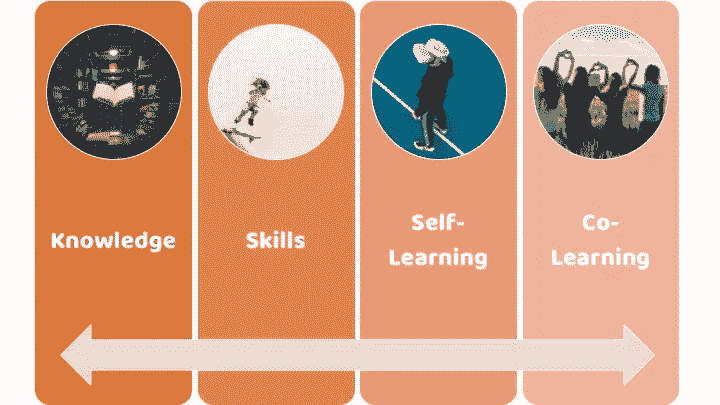
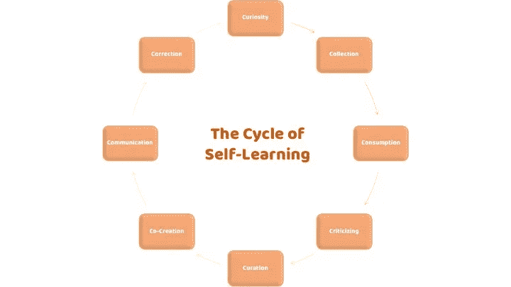
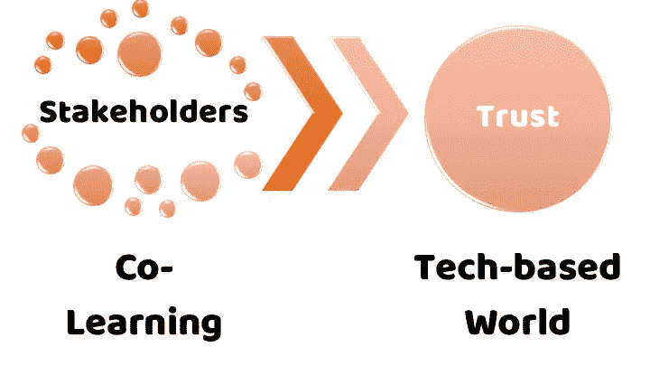

# 改变教育的时候到了。。。

> 原文：<https://medium.com/hackernoon/the-time-to-change-education-is-now-e7a28d7515de>

## 技术正在迅速创造一个新世界。但我们必须教导下一代“聪明地生活”。

Photo by [Aaron Burden](https://unsplash.com/photos/6jYoil2GhVk?utm_source=unsplash&utm_medium=referral&utm_content=creditCopyText) on [Unsplash](https://unsplash.com/search/photos/learning?utm_source=unsplash&utm_medium=referral&utm_content=creditCopyText)

我们都热爱科技。

我们都开始依赖科技。我们都想拥有最新的技术。我们大多数人都认为技术提高了我们的生活质量，大多数人会认为技术通过改善健康或减少社会排斥和贫困使世界变得更美好。

但是我们也害怕科技。

有些人觉得他们已经对技术上瘾了。他们认为他们的电脑或智能手机已经主宰了他们的生活。

更普遍的是，我们害怕失去对新技术的控制。我们担心在一个以传感器和数据为导向的世界中隐私的减少。我们不喜欢算法如何更多地做出“我们的”选择，并通过这样做来支配我们的生活和剥夺我们的自由。我们担心新兴技术(如人工智能)会加深不平等，甚至接管世界。

一个由机器主导的未来对许多人来说没有吸引力。

此外，还有那些我们不知道如何利用的新兴的不久的将来的技术。想想那些可能显著增加我们预期寿命的发展，让我们能够克隆自己，生活在其他星球上，等等。

乔伊。恐惧。不确定性。对新技术的三种截然不同的态度。而且，在不同的时间，我们每个人都感受到了所有这些情绪。我们正在建设一个依赖于技术的新世界，但大多数时候，我们不知道如何利用技术。

这些只是我上周在两次会议上发表的一些言论。最近经常出现的情况是，这些会议既有技术专家(程序员、工程师)也有非技术专家(企业家、监管者、经济学家、银行家、律师)参加。

有趣的是两组都有一个共同的目标:

> 我们需要建立对技术的信任！

但令我震惊的是，这两个团体就如何实现这一目标提供了非常不同的解决方案。

“非技术专家”通常关注传统规则和条例的需要，以产生对技术的更多信任。他们指的是新技术的应用，如加密货币，以及需要更严格的国家驱动的控制。

这种思维方式导致了以下两个问题:

*   监管应该“适应”技术吗？
*   *应该让技术适应现有的规章制度吗？*

按照这种观点，对技术的信任是一套精心设计的法规的副产品，这些法规控制着允许技术如何运行和发展。

毫不奇怪，“技术专家”有不同的想法。他们并不认为解决信任问题的办法是“更多”或“更好”的规则。

相反，他们将注意力转向技术和分散的解决方案。

为了产生信任，我们必须授权给大众。在某一点上，提到了流行的 *HBO* 系列、*硅谷*:“因为我们不再信任当前的互联网，我们必须建立一个去中心化的、点对点的版本(*没有*监管机构和大公司利用我们的数据的干涉)。”

“更好的法律”或“更好的技术”关于如何在我们正在创造的未来世界中建立信任的两种不同观点。

# 教育和如何建立对技术的信任

听着这场争论，我再次想到“教育”就是答案。至少，这是一个比把事情留给监管者或技术专家更好的答案。

如果我们想在新世界建立更多的信任，更好的教育是必要的第一步。

为了让下一代做好准备，帮助他们建设更美好的未来，我们必须关注学习和教育的四个方面。

The 4 Dimensions of Education

## 基于知识和技能的学习

教学总是倾向于“向后看”。传递过去的固定知识一直是我们教育方法的出发点。

但是，我们还需要考虑在一个日益围绕软件、机器和其他突破性技术构建的世界中其他重要的技能和能力。

已经写了很多关于培养技能的重要性，这些技能将通过执行技术无法完成的任务来帮助下一代与先进和自主的技术和机器一起生活。这些以创造力为导向的技能包括批判性思维、企业家精神、团队合作、艺术、谈判等。

## 自学

除了以创新为导向的教育，我们需要解决“程序化”和标准化教学的问题，而不是仅仅关注知识和成绩的重复。我们不能把教学固定在剥夺教育灵活性的过程和程序中，而是必须专注于帮助下一代如何不断地自学。或者换句话说，我们应该确保培训不会扼杀创造力。

我以前写过关于“自学”的重要性。根据收到的一些反馈，我们现在可以确定实现这一目标所必需的八个要素，我称之为自学周期的“8Cs”。

## 共同学习

在参加了上周的会议后，我们现在可以为教育增加一个“第三维度”:共同学习。当然，共同学习并不是一个新想法。协作学习和合作学习的概念已经存在了几十年。

然而，数字技术为共同学习提供了新的动力和紧迫性。学生现在可以通过在线论坛和聊天室进行协作和远程学习。

然而，我更感兴趣的是“面对面”的课堂体验，以及在“非技术专家”和“技术专家”之间开始共同学习练习的机会

将更多学科融合在一起，将课堂转变为一个多元化和包容性的论坛，不仅讨论技术，而且(更重要的是)思考和共同设计建立信任所需的基础设施。

# 我如何使用合作学习

大多数时候，我是一个技术乐观主义者，但我也相信我们必须聪明地对待新技术(特别是考虑到这些新技术的速度和采用率)。我们必须始终保持谨慎和批判的态度。

我计划引入“共同学习”练习，非技术人员和技术人员都可以参加。作业将集中在信任和技术的问题上:

*   *增加对技术的信任需要什么？*
*   *科技如何帮助我们增加对他人的信任？*
*   *我们如何确保每个人——而不仅仅是技术专家和一小群“非技术专家”——都有能力参与到一个包容开放的过程中来，共同创造我们基于技术的未来？*

非常感谢您的阅读！请按住👏*下面，还是留下评论吧。*

每周都有新的故事。因此，如果你关注我，你不会错过我关于数字技术如何改变我们生活、工作和学习方式的最新见解。