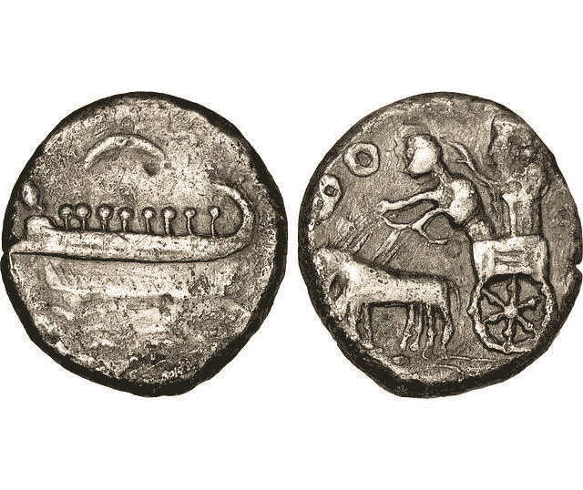
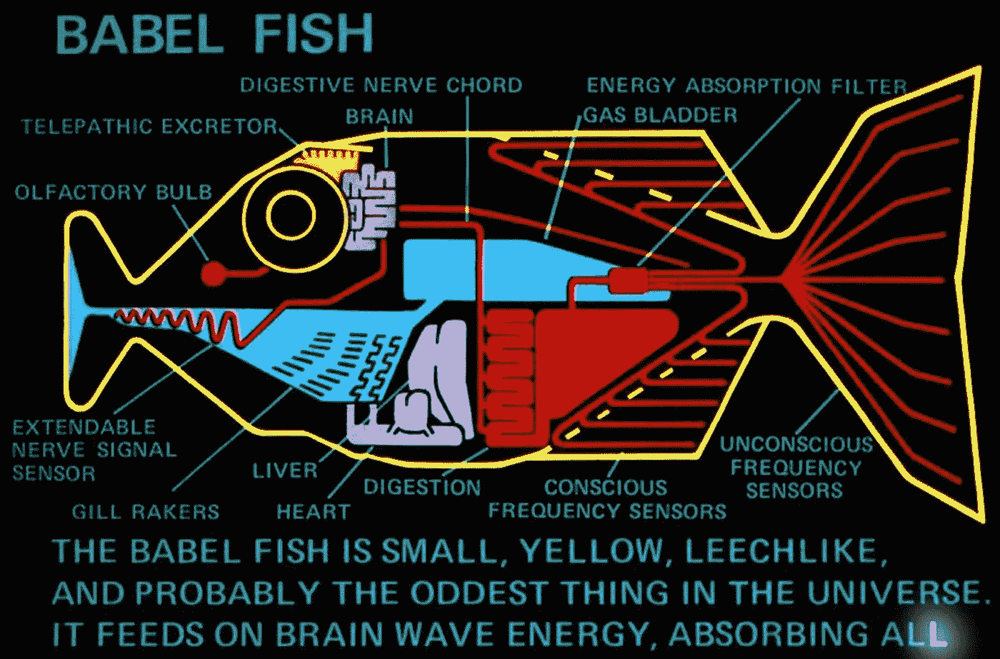
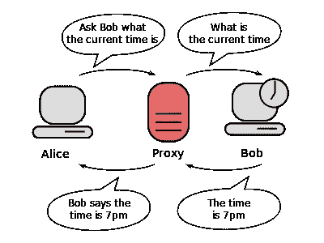
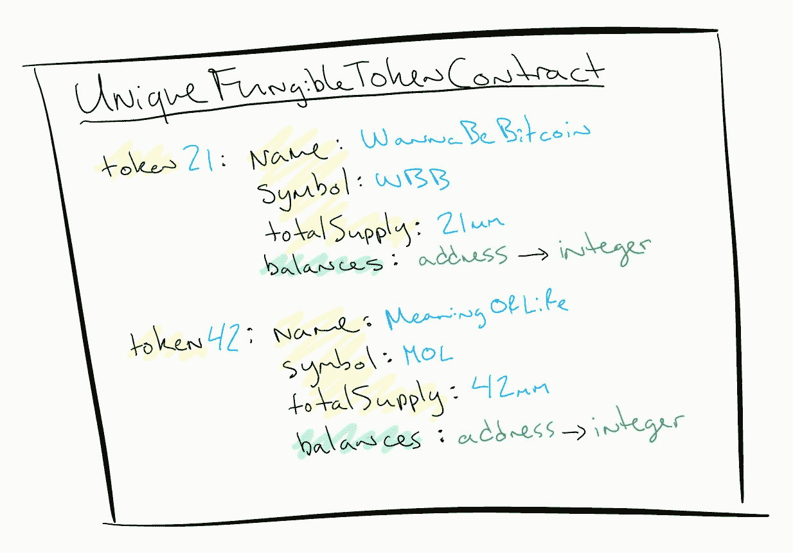

# 巴别塔的令牌——区块链上的令牌标准

> 原文：<https://medium.com/hackernoon/the-tokens-of-babel-token-standards-on-the-blockchain-745c87c640c1>


[https://upload.wikimedia.org/wikipedia/commons/2/2e/Hendrick_van_Cleve_III_-_The_tower_of_Babel.jpg](https://upload.wikimedia.org/wikipedia/commons/2/2e/Hendrick_van_Cleve_III_-_The_tower_of_Babel.jpg)

在去中心化网络中，[区块链](https://hackernoon.com/tagged/blockchain)上必须存在什么来代表可替代性、不可替代性、可组合性和所有权？如果一个帐户拥有一个余额或几个唯一整数的可证明性是我们所需要的，那么我们为什么要关心这些“令牌”是否符合任何标准呢？此外，如果令牌具有映射到标准接口的代理，那么区块链的幕后发生了什么就不那么重要了。

令牌成为“标准”的要求是什么；我们使用什么样的测量尺；在区块链和应用程序之间，标准遵从性应该处于什么位置？无论如何，应用程序都需要一套健壮的标准或定制令牌库和文档。应用层和最终用户的采用应该是每个区块链项目的主要关注点。

在这篇文章中，我反对*链上*令牌标准。定义智能合约“链上”层接口的标准。我希望通过探索这种反向观点，来推动对我们如何在去中心化应用程序中处理令牌的探索。

# **下记忆巷**



[https://www.smithsonianmag.com/history/making-cents-currencys-ancient-rise-180963776/](https://www.smithsonianmag.com/history/making-cents-currencys-ancient-rise-180963776/)

古代的金钱和物质匮乏有多种形式。当重量和材料在大多数情况下都占主导地位时，标准的生产流程和印刷符号还有必要吗？如今，当金属价格飙升时，世界各国都将它们从本国货币中剔除，只留下国家的象征和肖像。相当大的转变。我能告诉你什么…如果它在应用层都以同样的方式运行，而我仍然可以买一杯咖啡，谁会在乎呢？

自从推出[密码组件](/coinmonks/introducing-crypto-composables-ee5701fde217)和 [ERC-998 提案:可组合不可替代令牌(cnft)](https://github.com/ethereum/EIPs/issues/998)以来，我已经参与以太坊标准社区 3 个多月了。围绕令牌标准形成的松散社区缺乏形式化和清晰的过程。一些项目倾向于在秘密的筒仓中工作，并把他们需要的任何令牌推向区块链。然后，团队重新露面，推广他们的标准解决方案，他们经常与标准解决方案结合，并且可能已经变得过于特定于领域。也有证据表明，利用 ERC 进程进行营销噱头，获得出版物和辛迪加。以太坊社区缺乏对更广泛的受众(媒体、爱好者、投资者)进行标准过程教育的直接结果。

要在[未来](https://hackernoon.com/tagged/future)岗位上攻陷。

# 为什么是巴别塔的标记？



We’ll need these for tokens… trust me 😉

在一个崭新的、充满激情的、我敢说是宗教性的领域，就像密码和区块链，我们看到个人和部落最好的、最固执己见的一面在网上暴露出来。推特风暴完全符合圣经。当谈到创建项目可以使用和重用的标准[令牌构建块](https://blog.oceanprotocol.com/towards-a-hierarchy-of-token-building-blocks-6c8dd7b42341)时，我个人担心的事情似乎正在发生。以太坊区块链即将被**数百个**与**相同的**底层公理如可替代性、不可替代性等的实现所震撼。这将在应用层和用户之间产生大量的摩擦。你知道他们说什么…

## 继续表演💃

我在这里告诉项目，这已经不重要了。不需要部署标准令牌。出去打断一条腿或者你的聪明合同。原因如下:

> 领养是王道👑

如果你想出了一个出色的智能合同，它是为你的用例定制的，并且非常高效，你仍然需要让人们使用它。钱包、交易所和其他去中心化的应用程序(dapps)需要知道你的令牌可以如何使用，为什么他们的用户应该关心它，以及如何在技术上将其集成到他们的前端接口中。在某些情况下，说你的令牌是标准的会大有帮助。我希望，在去中心化的交易所和钱包的世界里，无摩擦和无许可将成为代币游戏的名字。但是如果…

# 你的令牌不标准？

你仍然有几个选择来获得甜蜜的顺利通过。他们在这里:

1.  在链上部署代理令牌🤔
2.  为应用程序创建链外代码😐
3.  唯一可替换令牌(uft)的一个实际例子🤨
4.  该死的。你将独自建造罗马🤣

显然，第四个选项是行不通的……所以让我们来探索前三个。

## 1.在链上部署代理令牌



Bob (custom token) and the proxy (token) both are on-chain

代理契约将实现一个标准接口，并将数字稀缺性(可替代或不可替代)的实际记账委托给自定义令牌契约。这种方法的好处是无需在应用程序层创建任何新内容。用户要将这个新令牌添加到他们的钱包中，只需像以前一样将代理契约的地址添加到钱包中。这种方法有几个缺点。

如果许多项目都采用这种方法，那么它本质上会使您的链上代码加倍，导致链上代码膨胀。为了从链中读取信息，这些调用仍然是免费的，即使它们需要通过函数调用进行额外的跳转。然而，对于修改 chain (state)上的存储的事务，额外的函数调用的 gas 开销会增加。您的用户可能不会太高兴，但是一个函数调用只有 2000 个气体单位，所以这可能不是一个精彩的节目。

从历史上看，社区并没有被代理契约方法所吸引，主要是因为它增加了攻击媒介。任何时候你给你的智能契约增加更多的复杂性，特别是在架构上，准备好付出代价。

## 2.为应用程序创建链外代码

在 dapp 级别，每个应用程序都需要生成一个交易供用户签名。具有非标准令牌的项目可以像在应用层中的标准令牌类型一样被查看和交互。这只有通过一些适配器模块、库甚至服务或 API 才是可能的，尽管最后一个选项不太可能被信任。每个应用程序、钱包、交易所都需要升级它们的代码库。

这种方法的优势在于，可以在智能合约中执行链上令牌定制，其复杂性无法使用代理合约(1)体系结构进行一对一映射。

例如:一个合同负责部署几个唯一的可替换令牌。为什么？部署契约是昂贵的，有几个用例可能需要数千种不同的可替换令牌。

为了使用代理契约方法实现这一点，仍然需要为每个唯一的令牌部署一个新的代理契约；不好的消息。但是，如果用户可以通过应用程序界面选择令牌，并且您为应用程序提供了指定目标令牌的代码，那么一切都会顺利进行，结果会存储在链上。

> 我是否闻到了唯一可替换令牌(uft)的令牌标准？我知道这个名字有点矛盾。😂

这种方法的缺点在两个主要方面显而易见:

*   钱包、交易所和 dapps 需要部署新代码。这是一场硬仗。鉴于攻击媒介、区块链生态系统和开发者工具的不成熟，这些服务的脆弱性很高。在大多数情况下，向他们扔一些新代码是行不通的。
*   您完全失去了与现有项目的向后协议(链上)兼容性，现有项目仅理解例如 ERC-20 令牌。您也失去了与任何未来项目的无摩擦的互操作性，因为他们在协议中使用它之前需要学习您的令牌/契约接口。

## 3.唯一可替换令牌(uft)的一个实际例子



Not an actual smart contract… Yellow fields stored once, relatively low cost to the token creator. Green fields are updated with each transfer, by each user with gas costs comparable to ERC-20 transfers.

这是(2)的一个具体应用，以最大限度地减少对应用层全新功能和代码集的需求。事实上，您可能只需要在应用层代码中使用一个小的额外函数，就可以像对待 ERC-20 一样对待唯一可替换令牌(uft)。我喜欢这样😉

主合同就像一个[单例](https://en.wikipedia.org/wiki/Singleton_pattern)并且维护所有 uft 的所有簿记。在这个契约中，您需要一个镜像标准 ERC-20 可替换令牌接口的接口，除了一个小的附加内容:在您希望修改余额的唯一令牌中包含一个索引。例如，ERC-20 的传递函数:

```
**function** transfer(address to, uint tokens) **public** returns (bool success);
```

变成了:

```
**function** transfer(**uint256 which**, address to, uint tokens) **public** returns (bool success);
```

但是，如果我们从应用层进行标准的 ERC-20 交易，我们如何提供索引呢？首先，我们需要知道我们对哪个令牌感兴趣，如前所述，这可以由用户通过应用程序接口提供。也许这个应用程序只处理一种类型的 UFT。现在，应用层需要提供令牌索引作为参数，但它只知道为它处理的所有令牌创建 ERC-20 事务。所以我们使用一种叫做装饰者的技术。详细解释它们是如何工作的超出了这篇文章的范围，但是大概是这样的:

正常的 ERC-20 方法可以这样调用:

```
const **myToken** = new web3.eth.Contract(json, address);
**myToken**.methods.transfer(receiver, amount, { options });
```

装饰“like”函数可用于包装这些方法:

```
const **uniqueToken** = new web3.eth.Contract(json, address);
const **which** = application.state.**specificTokenIndex**;UniqueToken.wrap(**which**, **uniqueToken**); // custom function// business as usual for token transfers
**uniqueToken**.methods.transfer(receiver, amount, { options });
```

包装功能是怎么回事？

```
UniqueToken.wrap = (**which**, instance) => {
  instance.methods = instance.methods.map((**method**) => (...**args**) => {  
    **method**(**which**, ...**args**);
  });
}
```

这假设应用程序使用的 UniqueToken 契约中的每个方法都有一个针对特定惟一令牌的整数索引前缀参数。**情况可能不是这样**，但这一小段代码表明，为现有的钱包、交易所和 dapps 创建一些漂亮的、非侵入性的模式和代码是可能的。允许应用层继续将可替换令牌的定制链上实现视为标准的 ERC-20 令牌，这将极大地减轻他们的代码、测试和团队的负担。这使得应用层团队可以专注于更重要的事情，比如用户体验。

# 最近在令牌标准新闻中📰

金恩的团队已经创建了 ERC-1155 加密项目令牌标准。在这个标准中，用户可以从单个合同中创建多个不可替换和可替换的令牌，转移批量令牌等等。令人惊叹的游戏应用。完全脱离 [ERC-20](https://github.com/ethereum/EIPs/blob/master/EIPS/eip-20.md) 和 [ERC-721](https://github.com/ethereum/EIPs/blob/master/EIPS/eip-721.md) 的主要动机仅仅是遗留代码和当前标准中的存储和汽油成本开销不容易产生成千上万的令牌；我不得不同意他们的观点。这引发了一个很长的讨论话题，涉及到我在这篇文章中提出的几个观点，还有其他一些，比如命名法。

[](https://github.com/ethereum/EIPs/issues/1155) [## ERC:加密物品令牌标准发行#1155 以太坊/EIPs

### eip: 1155 标题:加密项目标准作者:威泰克·拉多姆斯基，安德鲁·库克类型:标准跟踪类别:ERC 状态…

github.com](https://github.com/ethereum/EIPs/issues/1155) 

Maciej Górski 还提出了一个 ERC-1180 不可替代的令牌状态验证标准，用于 NFT 的链上验证，这个标准也非常适合本文。

[](https://github.com/ethereum/EIPs/issues/1180) [## 不可替换令牌状态验证(用于交换)问题#1180 以太坊/EIPs

### 虽然我们真正拥有的是在某个契约的名称空间中称为 tokenId 的唯一编号，但它通常是…

github.com](https://github.com/ethereum/EIPs/issues/1180) 

# 是否需要链上令牌标准？

ICO marketing “professionals” RE: token standards 😂

我不反对令牌标准。事实上，我认为令牌标准有助于将这个领域向前推进一大步。具有可靠参考和/或工作实现的标准规范创造了新项目的爆炸式增长。我们在 ERC-20 上看到了这一点，我们在 ERC-721 上再次看到了这一点。一个标准也使得小团队的单个应用程序可以很容易地代表数百个数字资产。然而，创建令牌标准的过程被证明是缓慢的、不明确的，并且在某些情况下被滥用于推广和营销。

像以太坊这样的可编程区块链为我们提供了以我们选择的任何方式证明任何类型的数字稀缺的能力。密码，猫，什么的。如果目标是避免相同公理概念的定制实现，那么*链上*标准是实现这一目标的最佳方式吗？也许*链上*令牌标准可以更加抽象。例如:定义可替代性需求与定义像 ERC-20 这样的可靠性接口。

我同意并将为标准应用层接口而奋斗。我觉得这些对于 dapps 来说非常有用，可以避免不同实现的额外负担，尽管我不明白为什么标准应用程序接口必须与区块链上部署的任何特定智能合约接口一一对应。

另一种可能性正在出现。令牌标准将最终看起来像 [OAuth](https://en.wikipedia.org/wiki/OAuth) ，爱它或离开它。当我们使用谷歌或脸书登录另一个网站时，我们知道幕后发生了什么吗？我能听到分散主义者的畏缩，但请跟我来一下。我们不知道那些公司的登录技术，甚至不知道 OAuth。我们不在乎。应用程序也不想让您登录。网站可以利用一个标准的功能，通过一个通用的规范和一些很棒的库来跨多个服务认证你，每个服务都有自己的后端认证功能。

说实话。没人知道这将走向何方。但迟早我们都要谈论它🤗

# 简短的个人更新

我开始将 Crypto Composables (ERC-998)作为一个标准，因为我看到了需要支持这一公理功能的项目浪潮。我只是主持人。我在这里为社区工作，从我杰出的同事那里综合想法、设计和知识。我们需要共同努力来定义一个可以在最终用户应用中实现大规模采用的加密资产世界。这确实需要在某种程度上共同努力来决定这个世界是什么样子。

我已经向以太坊基金会(EF)申请了一笔小额赠款，用于研究、采访、编纂整个社区的令牌标准流程。我们仍处于早期阶段。我觉得一个全面的概述和一个更清晰的流程的建立将会创造奇迹，在生机勃勃的以太坊令牌社区中增加理解和包容性。

和往常一样，在 NFTy Magicians 中可以找到许多其他聪明的头脑谈论令牌标准。请随时加入，开发者，非开发者都一样。我们希望听到每个人对代币设计和工程的未来的看法。

https://discord.gg/3TtqP2C[🧙‍♂️](https://discord.gg/3TtqP2C)🧙‍♀️

【medium.com/@mattdlockyer
[twitter.com/mattdlockyer](https://twitter.com/mattdlockyer)
[linkedin.com/in/mattlockyer](https://linkedin.com/in/mattlockyer)