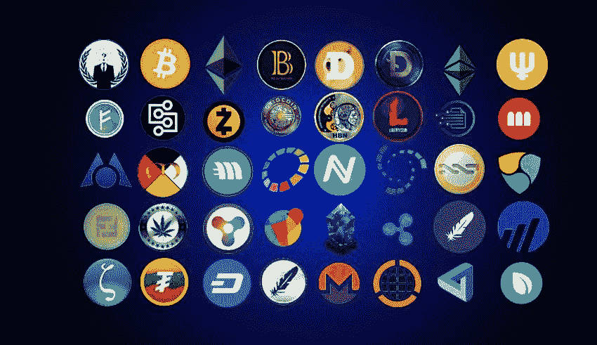

# 21 大 ICO/IEO/STO 营销机构|公关公司

> 原文：<https://medium.com/hackernoon/the-top-21-icomarketing-agencies-pr-firms-ab3d41e279c9>

Top ICO Marketing Agencies

我一直在做关于 ICO 营销机构的研究。审查这些公司的业绩，并考虑不同的参数来判断它们的地位。新的 ico 总是可以召唤他们的服务来获得额外的资金。在当今时代，即使是最强大的消费产品也需要公平份额的付费和有机营销才能接触到受众，ico 也不例外。一个成功的 ICO 是伟大团队、愿景、产品和强大营销活动的混合体。营销活动是 ico 获得成功执行项目所需的最佳资金的关键。这些数字营销公司是目前最好的。

推出 ICO 有许多阶段。每个 ICO 公司基于所处的阶段都有不同的营销需求。以下五个阶段已被记下，其中营销代理根据其表现被提及:

全方位服务(每个阶段)

这个阶段是初始阶段，企业需要帮助才能在行业中站稳脚跟。因此，代理商提供一整套服务来帮助企业推出 ICO，并在 ICO 后阶段保持高效。

1) [棕榈滩营销:](https://palmbeach.io/)

Palm Beach Marketing

棕榈滩营销(PBM)一直为加密货币和金融科技的所有论坛提供服务。它有熟练的成员在项目上聪明地工作。在最近的过去，他们变得很有名，得到了一些有声望的客户。他们处理不同的问题，如巨魔攻击，付费广告和游击营销。在 150 多名成员组成的强大团队的帮助下，他们总共创造了价值 1.95 亿美元的资本。自从这些网络钓鱼者增加后，对 PBM 的需求也增加了。他们处理这些巨魔，也增加了社区成员的有机增长。PBM 队现在因为他们的服务得到了广泛的认可，正在一步步走向顶峰。

[2。ICOBOX](https://icobox.io/)

ICOBOX

ICOBox 是第一个也是最大的新一代区块链增长推动者和业务促进者，面向寻求通过 ICO 众筹销售产品的公司。

他们为项目创建智能合同和部署图书构建平台，他们的营销策略是提供流量包和 PR 包来吸引他们的受众。ICOBOX 是业内最大的品牌之一。

[3)官方创业](http://officialstartups.com/):

Official startups

这家公司有经济学家、战略家和来自不同行业的不同专家，他们从不同的角度提供见解。他们可以向所有类型的企业提供服务。无论它只是一个想法还是一个成熟的业务。它有一个系统，能够为任何特定的业务吸引合适的人。

4) [**区块链创业工作室**](https://intrepid.ventures/) 就是这样一家国际机构，它与一群网页设计师、工程师和科学家以及企业创始人和开发人员合作。在团队合作中，他们建立生态系统，帮助企业实现可持续发展、市场优势和规模。

[5)氩组:](https://argongroup.com/)

Argon group

他们为大众代币销售构建、营销并提供许多技术解决方案。它有助于使复杂的事情和过程变得非常简单。他们是数字金融领域的先锋。它计划通过这种方式让融资变得更加容易，并吸引许多投资者。他们的总部设在美国，所以他们有许多与加密货币相关的客户。该公司还在建立一个密码交易所，因此可以有把握地说，它将有一个美好的未来。

6) [全景图](http://www.panony.com/):

Panony

Panony 是亚洲第一家拥有出色服务的高科技公司。它结合了加密货币，区块链发展的垂直媒体和通信咨询服务。Panony 提供最优质的服务，帮助合作伙伴在各个阶段成长，并进一步将行业提升到更高的水平。该公司在香港注册成立，业务遍及全球。

7) [优先级令牌](https://ptoken.io/):

Priority Token

他们提供 ICO 咨询和推广服务。一家知名公司，在投资者和企业家所在的世界不同战略城市设有办事处。在那里，公共关系可以把一个好项目变成一个了不起的项目。优先令牌有许多其他机构不提供的服务，如定位、令牌组学和路演。这些服务为投资者提供了更多的机会。这是一个管理良好的机构，团队中有许多不同的人。也有很多积极的方面值得期待。

8) [Ambisafe](https://www.ambisafe.co/)

Ambisafe 的团队自 2010 年以来一直在设计加密货币开发项目。他们的服务从 2010 年开发替代共识算法到 2014 年推出首款多币种钱包。他们最近的一些成就包括经历了硅谷创业加速器的第一次比特币课堂，然后进入了 SWIFT Innotribe 创业大赛的决赛。他们是数字钱包的先驱，并实现了主协议。

9) [泽里昂](https://zerion.io/):

Zerion

Zerion 是一家金融科技公司，擅长开发基于区块链的应用程序。他们有在以太坊区块链开发智能合约的经验，主要专注于执行 ico。泽里昂支持去中心化的未来。他们鼓励现代公司创造基于区块链的技术，赋予投资者权力。Zerion 拥有经验丰富的专业开发人员，他们拥有丰富的知识、网络和声誉，可以帮助公司从一个想法走向下一个大目标。它们是驱动 ico 的关键。创始人得到检查和安全的基础设施，以发行他们的令牌。投资者可以获得一个直观的投资界面，这使得他们可以轻松建立和管理投资组合。

10) [亲密组](http://www.theprocryptogroup.com/):

The Pro-Crypto group

Pro-Crypto Group 是一家充满激情的韩国(排名前 2 的 ICO 市场)成长型营销机构，提供 ICO 营销、设计和视频制作、发行出版物、公关推广、SNS 营销、社区管理营销和影响者营销。他们有全套服务。Focus 致力于为每一个区块链、品牌和众筹活动提供数据驱动的方法，在两年内成功资助了 29 个以上的众筹活动，产生了超过 6700 万美元的资金。政府的严格规定对他们的表现没有影响。

11) [狐尾营销](https://foxtailmarketing.com/):

Foxtail Marketing

Foxtail Marketing 是一家数字营销公司，为中型市场公司提供内容营销、数字营销和销售线索挖掘服务。他们制作的内容主要关注参与度和销售线索生成。我们客户的唯一目标是提升他们的品牌，增加流量，增加收入。他们基本上成功实现了这一目标。

12) [元素组](https://elementgroup.com/):

Element

Element group 是一家为数字令牌资本市场提供全方位服务的投资银行，以综合方式提供咨询、资本市场、先进技术和资产管理服务。

13) [硬币面料](https://coinfabric.com/)

Coin Fabric

Coin Fabric 是 ITOs(首次代币发行)和 ICOs 的全方位服务平台，为整体战略提供建议，并通过从内容营销、付费广告和社区建设到潜在投资者和影响者外联等一系列服务来执行战略。拥有一个伟大的行业专家团队，在他们的不同领域，硬币织物有所有的成分，以成功地帮助公司实现成功的售前，预 ICO 和公共人群销售活动。

14) [AdMachina](http://admachina.io/)

Admachina

从 2017 年 8 月开始，AdMachina 将注意力转移到一个新的挑战上，即 ICO 营销。他们拥有最好的技术、团队和技术。多年来，通过在 30 个国家的不同市场进行在线营销，获得了这些资产。目前，他们已经帮助筹备和营销了 10 个 ICO 项目。结果相当不错。

15) [ICO 发射马尔他](https://icomalta.com/)

ICO Launch Malta

ICO Launch Malta 是一家位于直布罗陀的公司，为 ICO 平台提供全面服务。这些服务包括公司 ICO 流程的各个方面，从注册和税收控制，到发行代币，智能合同开发和使用，营销和公关，直至交易所上市。ico 绝对没什么好担心的。

16) [CUBE29](https://www.cube29.com/) :

Cube29

CUBE29 提供全方位服务的 ICO 公关，是一家营销机构，专注于帮助科技公司和初创公司以有用的方式推出并推广他们的 ICO。由市场营销和公关专业人士创立，他们碰巧也是区块链的狂热爱好者。CUBE29 的使命是通过其在所有论坛上工作的团队，为决定通过 ICO 筹集资金的公司提供专业的营销支持。

17) [WeRaise](https://weraise.pro/) :

WeRaise

WeRaise 是一家营销公司，它采用加密货币的野性和易变特性。但是他们在数字广告领域有着 15 年以上的坚实背景，他们有能力做到不可能的事情。他们有从上到下的服务，你将有机会向全球数百万潜在投资者推销你的项目。如果需要，您可以在 3-4 天内开始媒体宣传活动。您的想法将在不同的平台上突出显示，以吸引您的观众和潜在投资者的眼球，这些平台使用公关工具、SMM 和带有活动分析的海报广告。所有的活动都被全天候跟踪。该团队还使用宣传材料来加强和促进投资。

18) [Amazix](https://www.amazix.com/) :

AmaZix

Amazix 是一群专业的加密 ICO mods，他们拥有专业的技术知识，在管理团队的领导下提供卓越的支持。他们为基于 Bancor 或以太坊平台网络的加密货币项目提供交钥匙服务。在整个 ICO 流程中，拥有强大而有机的社区、相关的合作伙伴关系和有效的营销策略对于成功的众筹至关重要。他们在 Amazix 就是这么做的。

19) [行话公关](http://jargonpr.com/):

Jargon PR

行话公关提高国际声誉，兴趣和对你的 ICO 的渴望。他们与全球业务合作伙伴、开发人员、所有与加密相关的社交媒体平台和影响者合作，以确保您的 ICO 处于良好状态。他们还试图让你“赢得”你的类别。通过他们的国际媒体关系团队，他们确保记者和媒体报道您和您的 ICO，以提高国际知名度。它有助于获得资金和实现项目所需的目标。

20) [进站口](http://inboundjunction.com/):

InBound Junction

InboundJunction 是对区块链营销和 ICO 的完整回答。他们解决 ico 和区块链项目的所有流程。InboundJuntcion 旗下有 70 多个成功的 ico。为顶级加密硬币工作，因此非常了解行业、趋势、影响者、基金和社区。他们的团队在区块链和营销方面经验丰富，因此具备支持、营销和咨询的要素和能力，以成功推广 ico。

21) [市集:](https://marketacross.com/)

Market Across

MarketAcross 是一家提供全方位服务的 ICO 推广公司，以绩效为基础。MarketAcross 为 ico 设计了许多独特的整体营销战略，并通过内容营销、公关、影响者外联和社交推广等一系列服务来执行这些战略，以建立一个庞大、忠诚和有机的社区。MarketAcross 拥有一支由区块链开发人员和拥有多年经验的顶级营销专家组成的团队，拥有确保通过大型代币销售实现繁荣 ICO 所需的所有知识、关系和技能。

22) [TSM 全局](http://www.tsm.global/):

TSM Global

TSM Global 是一家在英国注册的公司，通过其在马其顿和摩尔多瓦的壳牌公司开展工作。它为 ICO 提供全方位的服务。凭借其在营销方面的技能，TSM 已经为其客户创造了超过 2.7 亿美元的收入。TSM 的国际团队可以处理和支持英语、日语、中文、韩语、俄语、德语和其他语言。它们可以根据项目和客户的需要进行定制。他们有能力瞄准全球范围内的大量人群。

预售

从事售前工作的营销公司帮助企业在市场上建立联系，从而帮助他们赢得销售。该部门提供诸如伙伴关系咨询、咨询援助和投资者关系等设施。

## 23.[申请](https://applicature.com/)

**APPLICATURE**

T2 应用公司是这一行业的大公司。它与创建智能合同、研发、定制解决方案、技术咨询和 ico 建议的公司合作。

**预 ICO**

与前 ico 打交道的机构是那些在法律工作和建立公司良好声誉方面提供帮助的机构。它提供营销服务、ICO 支持、网站创建和组织社区。7Marketz 是该领域最大的公司之一。

## 24.7MARKETZ

**7MARKET**

Marketz 同时处理多个项目，他们为人工智能和计算机系统提供解决方案。他们在你最后程序的每个阶段提供支持。

**希望拥有 ICO 的企业**

已建立的企业可以拥有自己的 ico，但它们需要帮助才能将自己的想法变成现实。这一领域的代理机构将帮助这些企业获得智能合同系统和区块链，同时将他们的想法变为现实。

## 25.[贝尔金营销](http://belkinmarketing.com)

**Belkin Marketing**

Belkin Marketing 就是这样一个例子。它由 NewsBTC 的 CMO 和 Cointelegraph 的前营销主管领导。它有区块链的专家和专业团队，他们和谐地工作。

最后更新于 2019 年 4 月 11 日由 [kin jes sae](https://hackernoon.com/@kinjes536sae) ICO 评审员在[Coinmarketico.com](https://coinmarketico.com/)