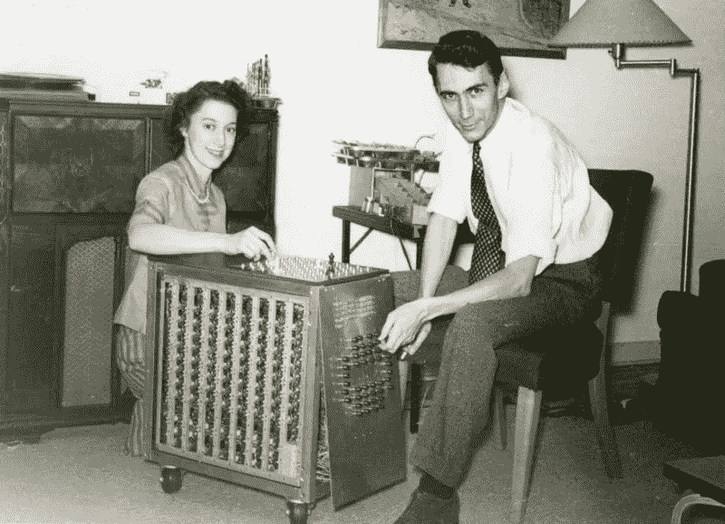
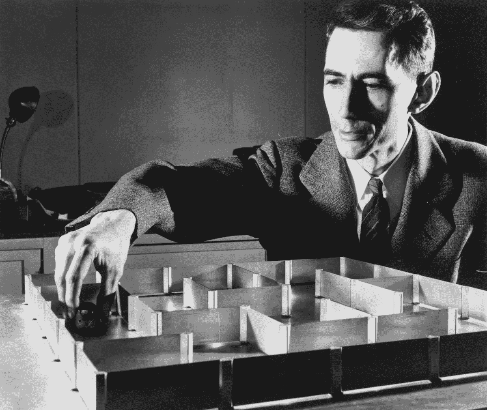
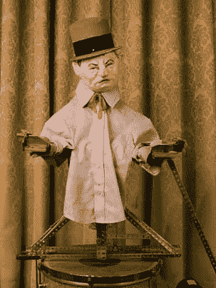

# 认证天才的顶级黑客:克劳德·香农在玩

> 原文：<https://medium.com/hackernoon/the-top-hacks-of-a-certified-genius-claude-shannon-at-play-30137b4424b4>

> "我认为科学的历史已经表明，有价值的结果往往是由简单的好奇心产生的。"克劳德·香农

最近，*黑客*一词有了很多含义——比如增长- *黑客*。当我在麻省理工学院的时候，*黑客*是一个术语，用来指需要高超工程技术的恶作剧或恶作剧——就像出现在麻省理工学院大穹顶上的消防车——没人知道他们是怎么做到的！

虽然*黑客*更流行的意思是通过他们疯狂的技能非法进入计算机系统，但我认为黑客的精神更多的是修补，利用你的工程技能跟随你的好奇心，而不是做“严肃的工作”。

在这方面，最初的修补者之一，也许是最著名的一个，是克劳德·香农教授，他在贝尔实验室，后来在麻省理工学院。当然，香农因其著名的 77 页论文《*信息的数学理论*》而被称为“信息理论之父”，该论文后来被《科学美国人》称为“信息时代的大宪章”，为我们今天使用的大多数数字通信奠定了基础。

但是除了这篇著名的论文之外，香农在贝尔实验室和麻省理工学院的同事们还知道他的好奇心，他的游戏精神，以及他“拼凑”别人甚至没有问的问题的答案的能力。他将“跟随你的好奇心”的想法发挥到了极致——使用数学和工程技能来实际建造东西。Jimmi Soni 和 Rob Goodman 在他们关于 Shannon 的传记中给出了很多例子。

当香农成为麻省理工学院的教授时，他和妻子贝蒂在麻省理工学院以北 8 英里的温彻斯特买了一栋房子，地下室成了他收藏各种奇珍异宝的个人工作室。当麻省理工学院的教授埃德·索普参观时，他称之为“一个电子技师的天堂”,并把他视为“电子技师大师”!

以下是他的一些最有趣的技巧:

## 认真对待游戏:一台下棋机器

你们中的一些人可能知道我在麻省理工学院开了一个叫做玩耍实验室的加速器，我的观点是，今天我们所认为的“计算机软件”有很多都起源于用于游戏和娱乐的“好玩的技术”。我经常用有史以来创造的第一批人工智能中的一个作为例子:一台由 Shannon 建造的下象棋的计算机，如下所示。

你可以看到这是一个很大的设备，它会照亮应该采取的行动。据解放军的一名军官说，计算机只能下一场比赛的最后 6 步棋，但这证明了一点。对香农来说，这只是玩耍，但他可以预见人工智能的整个未来。他写了一篇论文《给下棋的电脑编程》。许多人认为他展示了计算机是如何人工智能的，他是第一个预测在未来的某个时刻，计算机将能够击败国际象棋冠军的人之一(这发生在 50 年后)。

香农以他特有的谦虚态度介绍了这篇论文:“虽然这个问题可能没有什么实际意义，但却具有理论意义，人们希望这个问题的圆满解决将成为解决其他具有类似性质和更重要意义的问题的一个开端。

根据他的传记，香农“提醒读者，下棋的人工智能有许多未来的应用:路由电话，翻译文本，创作旋律。”

他是多么正确！

## ***修斯老鼠和迷宫***

许多人想知道香农的天才，以及他不仅探索一个想法，而且为整个探索领域奠定基础的能力，如信息论、布尔电路和人工智能。

对香农来说，他的很多追求都来自于提出一个问题，直到找到这个问题的答案才得到满足。他说，他和其他像他一样的人都有一种“动力…一种想要发现是什么让事情运转起来的欲望。”

也许比他的国际象棋计算机更著名的是香农的电动鼠标 Theseus，这是他回到麻省理工学院担任教授之前在贝尔实验室制造的。故事是这样的，Shannon 花了 20 分钟从伦敦的花园树篱迷宫中逃脱，并且想知道是否可以做得更快。

他用一个机械奶酪建造了一个机械迷宫，一只“机械老鼠”将在迷宫中导航，直到他找到奶酪。这让许多看到它的人感到惊讶，贝尔实验室最终制作了一个短视频，引起了全国的关注。

根据他的传记作者的说法，真正的老鼠并没有真正做解决迷宫的工作——它是由迷宫下面的一组磁铁和开关推动的。鼠标本身根据开关和磁铁的逻辑移动。当它不能移动时，开关会改变，磁铁会将鼠标移动到另一个方向。

虽然他没有写一篇关于寻找奶酪的机械鼠标的论文，但它确实为香农和贝尔实验室赢得了一项专利。

***其他好玩的事情:杂耍和赌博***

香农的许多小玩意(以及附带的论文)的标志是他的传记作者所说的经典香农:“异想天开，对实用性漠不关心，源于一项典型的教授可能会称之为不严肃的活动，但作为麻省理工学院的终身教授，香农发现这项活动非常有趣，值得学术时间和关注！”

有一次，他写了一篇关于杂耍数学的严肃论文，这是一项他在晚年花了相当多时间的活动。他甚至创造了一个机器人，如下图所示，可以掷 3 个球(它看起来有点像 W.C. Fields，它就是以他为原型的！).任何周末在麻省理工学院的人都会看到麻省理工学院杂耍俱乐部，主要由喜欢在周日杂耍的学生组成。当他们得知香农是一位著名的终身教授并和他们在一起时，他们非常惊讶。

作为这个列表中的最后一个小玩意，你们中的许多人可能已经看过电影《21 世纪》，讲述了一群麻省理工学院的学生去拉斯维加斯利用他们的数学技能赚了很多钱。这不仅不是第一次尝试类似的事情，我还惊讶地得知 Shannon 在很多年前也参与了类似的事情。

埃德·索普曾称香农的地下室是“电子人的天堂”，他写了一篇关于 21 点数学的论文，香农热情地审阅并鼓励了这篇论文。

当他们开始对轮盘赌的数学进行头脑风暴时，他们订购了一个完整的、拉斯维加斯式的轮盘赌轮盘，并在香农的地下室里，试图找出预测的数学方法

他们发明了一种设备，可能是首批“可穿戴计算机”之一，而不是算牌，它会向耳机发出音调，告诉他们在哪里下注。他们曾试图在一个真正的赌场使用它，但有人注意到了耳机，他们决定放弃追求。传记最后写道，在当时，许多赌场都是由黑帮经营的，或许这并不是一个糟糕的时代

## 结论是:跟随你的好奇心

香农是一位严肃的科学家，他经常从事其他“严肃”的教授和科学家不从事的工作。他很自然地跟随自己的好奇心，在多个领域提出问题，寻找答案。虽然他最著名的例子是关于信息论的论文，但他在许多领域都是这样做的，并且没有让传统的界限来定义他对什么感兴趣或不感兴趣！

香农看到了数字通信的潜力(在那个时代，电报、电话、广播和电视都被认为是独立的领域)，将不同的想法结合在一起(布尔逻辑在他的哲学课上讲授；香农的洞察力使一些人将它与逻辑电路结合起来，提出了一种模拟电路的数学方法)，没有人真的认为计算机可以思考(人工智能)，可以穿戴，或者是香农开创的许多其他领域中的一个，这些领域已经成为其他人探索的富有成效的地方。

对于那些贪玩、好奇的人，我鼓励你读读*。*

*更重要的是，要像克劳德·香农一样:无论你被什么吸引，都要跟随你的好奇心！*