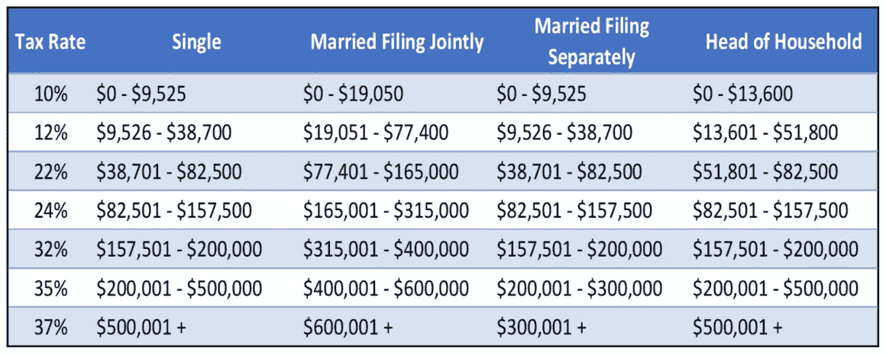
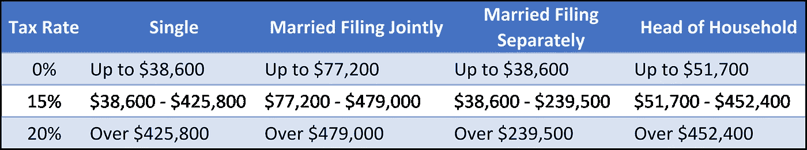

# 加密货币税交易者指南

> 原文：<https://medium.com/hackernoon/the-traders-guide-to-cryptocurrency-taxes-4ddda3a8fcfc>

美国的加密货币税收政策让很多人感到困惑。这个指南分解了你需要知道的一切，这样你就不会在税务季到来时措手不及。

2017 年，加密货币的价值平均增长了 900%，几乎超过了所有其他传统资产类别。你的朋友、同事、电视节目主持人，甚至你的姑婆珀尔都在询问这项可能让他们致富的“神秘”新技术。但是，伴随着所有的喧嚣和赚钱的潜力，山姆大叔也要求他的公平份额。这就提出了一个问题:你如何准确地报告你的加密货币交易和投资？

# 加密货币被视为财产

根据 2014 年发布的第一份也是唯一一份正式的美国国税局[指导意见](https://www.irs.gov/pub/irs-drop/n-14-21.pdf)，出于税收目的，加密货币应被视为财产——而非货币。这意味着像[比特币](https://hackernoon.com/tagged/bitcoin)、以太坊、Ripple 和几乎所有其他另类硬币这样的加密技术实际上必须被视为拥有其他形式的财产(股票、黄金、房地产)来纳税。这意味着法律要求你申报在交易这些加密货币时实现的资本损益。未能做到这一点将被国税局视为公然的税务欺诈。

# 那么，你如何计算你的加密资本收益？

*第一步——了解什么被视为应纳税事件——也就是说，你实际上欠政府钱，因为你的加密货币交易产生了资本收益。*

以下内容摘自 2014 年[美国国税局官方指南](https://www.irs.gov/pub/irs-drop/n-14-21.pdf)中关于什么被视为应税事件的内容:

*   **将加密货币转换为美元等法定货币属于应税行为**
*   **将加密货币转换为加密货币是一个应税事件**(您必须在交易时以美元计算公平市场价值)
*   **将加密货币用于商品和服务是一个应税事件**(同样，您必须在交易时以美元计算公平市场价值；你可能还会欠销售税)
*   **赠送加密货币不属于应税事件**(受赠方继承成本基础；[如果超过赠与税免税金额，赠与税](https://turbotax.intuit.com/tax-tips/estates/the-gift-tax/L1sFpFeXV)仍然适用)
*   **钱包到钱包的转账不是应税事件**(您可以在交易所或钱包之间转账，而不会产生资本损益，因此请确保将您的记录与交易所的记录进行核对，因为交易所可能会将转账算作应税事件，以此作为避风港)
*   **用美元购买加密货币不是应税事件**。**直到你交易、使用或出售你的密码**，你才意识到收益。**如果你持有超过一年，你可以实现长期资本收益**(大约是短期的一半)，如果你持有不到一年，你实现短期资本收益和损失。

*第 2 步——确定您的成本基础*

既然已经清楚了什么时候必须纳税，那么理解纳税背后的确切过程就很重要。真正的第一步是确定你持有股票的成本基础。本质上，成本基础是你投入多少钱购买财产。对于加密资产，它包括购买价格加上与购买加密货币相关的所有其他成本。其他费用通常包括交易费和从你购买密码的交易所收取的经纪佣金。因此，要计算您的成本基础，您需要执行以下操作:

**(密码购买价格+其他费用)/持有数量=成本基础**

例如，如果你在 2017 年 11 月投资 500 美元的莱特币，那将为你购买约 5.1 莱特币。比方说，你还向比特币基地支付了 1.49%的交易费。您的成本基准将按如下方式计算:

**($500.00 + 1.49%*500)/5.1 =每莱特币$ 99.50**

*第三步——计算你的资本损益*

决定你的资本损益的最后一步是从你的加密货币的销售价格中减去你的成本基础。

**售价—成本基础=资本利得/损失**

举个例子，假设一个月后你正好卖出了一枚莱特币，因为价格翻了一倍，达到每枚 200 美元。这将被视为应税事件(将加密货币转换为法定货币)，您将按如下方式计算收益:

200–99.50 美元= 100.50 美元资本收益

然后，你将欠政府 100.50 美元收益的一部分。

# 确定公平市场价值

当您考虑加密到加密的交易场景时，这个简单的资本收益计算变得更加复杂(请记住，这也会触发应税事件)。迄今为止，一个被忽略的重要信息是公平市场价值。让我们看另一个例子来理解公平市场价值是如何联系在一起的。

假设你购买了价值 100 美元的比特币，包括交易和经纪费。那 100 美元目前大约可以买到 0.01 个比特币。现在让我们假设两个月后你把你所有的 0.1 比特币换成了 0.16 以太。你如何计算这种硬币对硬币交易的资本收益？事实证明，这取决于交易时比特币的公平市场价值。假设在交易时，0.01 比特币价值 160 美元。这将使 0.01 比特币的公平市值达到 160 美元。然后，您可以根据这些信息计算您的资本收益:

**160–100 = 60.00 美元资本收益**

对于加密到加密的交易，你将欠政府 60 美元收益的一个百分比。

这种公平市场价值的计算和概念给密码交易员带来了各种各样的问题。一些交易者已经交易密码几个月了，可能几年了，但没有记录交易时密码的美元价值或公平市场价值。这是他们实际上需要的信息，以准确申报他们的税收，并避免国税局的问题。根据他们进行的交易量，准确计算收益可能会变得非常繁琐，如果他们没有跟踪公平的市场价值，手工甚至 Excel 都可能无法完成。想象一下，如果你像许多日内交易者一样，在一年中做了数千笔交易…

可悲的是，山姆大叔不会同情你的处境。如果被审计，国税局只会说，“告诉我你是如何得出 2017 年税收的资本利得数字的。”如果你没有正式的报告或证据证明你是如何得出你的资本利得数的，国税局可以简单地应用**零成本基础**，对你的全部资产征收资本利得税，以及不准确报税带来的任何罚款。

这在现实生活中会是什么样子？假设你是一个高波动的日内交易者，使用许多不同的交易所:币安、Bitfinex 和 GDAX。你最初在平台上投资了 70，000 美元开始交易。比方说，你做得很好，但你在密码游戏中得到乐趣，把你的大部分钱，100，000 美元，从交易所取出，放回银行。国税局可以看到你把钱存进了银行。假设你被审计了。国税局只会说，让我看看你用那 10 万美元做了什么。如果你不能证明你实际上是从 7 万美元开始投资的(即 7 万美元的成本基础)，他们可以简单地对你的 10 万美元应用零成本基础，并对其全部收取资本利得税。你应该被征税的不仅仅是 30，000 美元的收入，而是 100，000 美元的一部分。这是一个巨大的差异，可能是你不能失去的钱。

值得庆幸的是，有专门的软件可以让你即时准确地计算你的资本利得税，只需上传你的。csv 报告来自您使用的交换。[密码交易商。Tax](http://www.cryptotrader.tax/) 在几分钟内提供你所有交易的完整报告、你的成本基础和你的总资本收益/损失负债。当国税局来敲门时，只需给他们看生成的报告。

# 短期与长期资本收益对比:

有一件事还没有触及的是你的资本利得税的实际税率。这是因为这一比率取决于许多因素。第一个因素是资本收益将被视为短期收益还是长期收益。加密货币世界中最常见的利率是短期资本收益，当你持有加密货币不到一年，并以高于成本的价格出售加密货币时，就会产生短期资本收益。因此，除非你“只是 HODL”，否则你可能会有一些短期收益。

短期资本利得税是按照你的边际税率计算的。下表描述了您可能属于的不同税级:

为了演示如何浏览边际税级，假设你是一个单身报税者。你在纳税年度赚了 82000 美元，六个月前你花了 5000 美元购买了比特币，包括手续费和佣金。昨天你卖了 6000 美元的比特币，收益 1000 美元。

这 1000 美元将使你全年的收入增加到 83000 美元。根据边际税率表，你收益的前 500 美元按 22%的税率征税，产生 110 美元的税收。剩余的 500 美元按照 24%的税率征税，因为它超过了 82，500 美元的起征点。这产生了 120 美元的税收。总的来说，1000 美元的资本收益将产生 230 美元的税收。这是你欠政府的钱。

# 长期资本收益:

对于所有的霍德勒，如果你持有加密货币一年或更长时间，你就有资格获得较低的长期资本收益率。下表详细列出了 2018 年的税级:

如你所见，长期利率要低得多，如果投资者持续持有一年或更长时间，就会获得回报。

# 那么资本损失呢？

到目前为止，我们一直在严格地谈论资本收益。在一个理想的世界里，你是一个伟大的加密货币交易者，你的交易收益远远超过你的损失。然而，如果你的损失超过你的收益，这些损失将从你当年的应税收入中扣除。但是，你最多只能从你的应税收入中扣除 3000 美元。任何超过 3000 美元的资本损失都将逐年结转，并在随后的几年中用于征税，直到余额为零。如果你确实在加密货币交易中遭受了重大损失，明智的做法是与你的注册会计师合作，以确保你正确申报。

# 1031 的同类交换呢？

许多交易者声称，从一种加密货币到另一种加密货币的交易不是他们必须纳税的事件，因为 1031 同类交易。这条定律经常被用于房地产投资领域；然而，根据新的税改法，1031 已被禁止用于加密货币。这意味着你不能要求同类交易并避免支付加密对加密交易的税。你必须把这些和其他交易一起归档。

# 如果我不支付加密税会怎么样？

许多交易者确信，由于区块链和加密交易的匿名、去中心化特性，政府没有办法看到或知道他们在交易/购买/出售加密货币赚钱。不幸的是，对这些人来说，这是不正确的。虽然美国国税局在这一点上处理加密税的速度很慢，但他们正在到来。[国税局击败比特币基地](https://www.journalofaccountancy.com/issues/2018/mar/irs-summons-of-coinbase-records.html)，要求大众交易所交出任何交易(买/卖/或收)金额达到或超过 2 万美元的个人记录，这仅仅是个开始。当交易者没有正确申报他们的收益时，你会看到国税局开始变得非常严肃。当有这么多钱的时候，大家伙们就不会开玩笑了。即使你只是做钱包对钱包的交易，也是如此。区块链是一个分布式公共账本，这意味着任何人都可以随时查看账本。弄清一个人在账本上的活动本质上就是把钱包地址和名字联系起来。你可以打赌，国税局在这方面只会越来越熟练。最终，如果你选择不申报你的收益/损失，你将犯下公然的税务欺诈，国税局可以对其实施一系列处罚，包括刑事起诉、五年监禁以及高达 25 万美元的罚款。

如果你想得到美国国税局的青睐，只需使用 [CrytpoTrader。Tax](https://www.cryptotrader.tax/) 生成您完整的资本收益报告。该报告可上传至 TurboTax 或交给您的税务专家，以确保您保持合规。

*原载于 2018 年 5 月 10 日*[*www . cryptotrader . tax*](https://www.cryptotrader.tax/trading/the-traders-guide-to-cryptocurrency-taxes/)*。*