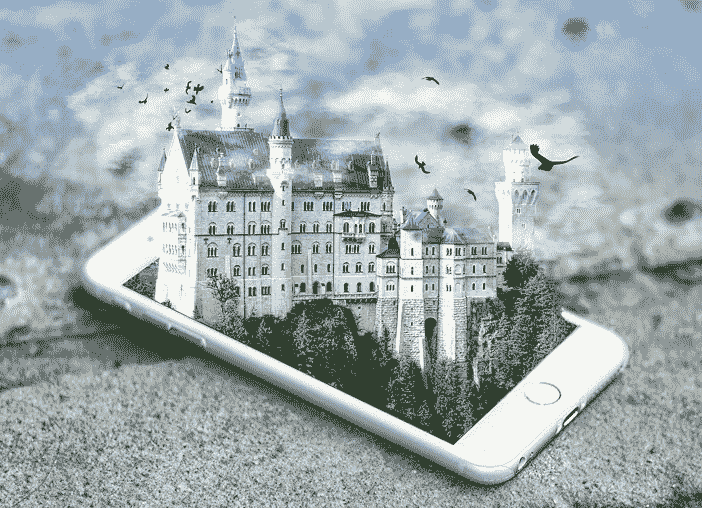

# 游戏之外的虚拟现实技术变革

> 原文：<https://medium.com/hackernoon/the-transformation-of-virtual-reality-technology-beyond-gaming-f17f6d2294fb>

Pricekart.com

虚拟现实是最近几年最热门的话题之一。术语虚拟现实本身意味着接近我们在现实生活中经历的东西或“近现实”。它正在成为对我们的生活产生巨大影响的技术之一。尽管游戏是一个明显的虚拟现实应用，但它正变得比游戏更重要。虚拟现实的世界有很多特质来革新商业、心理学、医学、教育、体育等领域。

虽然所有带给我们的技术大多是二维的， [**虚拟现实耳机**](https://www.pricekart.com/mobile-accessories/vr-headsets) 让我们以近乎现实的理解体验三维世界。VR 有能力改变我们在日常生活中体验事物的方式。让我们来看看虚拟现实可能改变的主要领域:

**1。** **针对焦虑问题的虚拟现实**

焦虑不是一种疾病，而只是一种情绪状态，经历焦虑的人会感到忧虑、紧张、担心和恐惧。虚拟现实技术有助于缓解焦虑水平。它让人们在一个非常安全的环境中面对他们最担心的情况，帮助他们克服恐惧。它还可以用来治疗压力、抑郁和恐惧症，所有这些都在人的舒适区内。

**2。** **虚拟现实医学领域**

虚拟现实也可以帮助我们的医生和外科医生训练他们的技术。这给了他们空间和范围来移除不想要的肿瘤，而没有任何并发症。虚拟现实使他们能够了解在手术过程中处理各种并发症的最佳方法。外科医生正致力于在虚拟设备的帮助下使用微型机器来进行脆弱的手术，消除人为错误的风险。牙医还可以使用虚拟现实来分散患者的疼痛，并帮助缓解他们的紧张情绪。

**3。** **虚拟现实教育**

教育是虚拟现实可以发挥变化作用的另一个领域。它可以帮助一大群学生轻松地相互交流，并在三维环境中享受他们的课程。对于学生来说，这是一种有趣而简单的方式来掌握虚拟环境中的一切，让他们与环境互动。它把学生带到一个不同的学习世界，而不必去远足。

**4。** **军事虚拟现实**

[**虚拟现实应用**](https://www.pricekart.com/blog/experience-virtual-reality-cool-apps/) 帮助游戏玩家获得对周围环境的感知，并与 3D 宇宙互动，这是帮助 VR 脱颖而出的原因。同样，虚拟现实可以帮助武装分子训练和锻炼自己，以应对他们在现实世界中可能必须面对的危险和复杂情况。它被用于所有三个军种-陆军，空军和海军。虚拟现实让他们有机会重现真实世界的风险，但也有可能造成严重伤害或死亡。它还帮助武装分子在安全的环境中应对创伤后压力，这进一步使他们能够面对新的情况。

**5。** **虚拟现实商务**

许多企业都欢迎虚拟现实进入他们的利基市场，以便对商业世界产生影响。虚拟现实让企业有机会测试他们的原型，并在初始阶段找到设计中任何可能的故障。所有生产有害产品的企业都可以对其进行评估，以避免任何健康风险。它还可以用于降低成本，如商务旅行，参观，举行会议，甚至通过使用虚拟会议室面试候选人。

**6。** **房地产和建筑虚拟现实**

Pricekart.com

虚拟现实可能会在房地产和建筑领域发挥越来越重要的作用。它让建筑师和工程师对他们提议的结构的三维图像有一个清晰的概念。让他们深入了解拟建建筑完工后的外观，并纠正任何缺陷。它还可以让潜在客户在不离开自己舒适的房子的情况下更容易地查看财产。通过虚拟援助帮助他们购买梦想中的房产。

**7。** **电影院中的虚拟现实**

虚拟现实可以将观影体验提升到另一个层次。VR 可以用创新的讲故事形式让人群沉浸在电影中，让他们感觉自己是整个剧情的一部分。它可以将观众带到一个真实的 3D 世界，在那里他们可以更多地关注细节，让他们有机会看到他们想要的东西，而不是他们面前的东西。虚拟现实电影最受欢迎的类型是科幻电影，在科幻电影中，更容易让一切看起来完全真实。

**8。** **博物馆虚拟现实**

就像电影一样，博物馆可以通过虚拟现实来欣赏。这将允许观众从他们当前的位置舒适地观看不同的博物馆和遗产。它让观众有机会走一走，看看不同大陆不同博物馆里陈列的不同物品，而不必走那么远。虚拟现实可以增加展示历史文化的热度。

**9。** **汽车虚拟现实**

就像虚拟现实可以推动所有其他领域一样，它也可以帮助改变汽车制造的世界。任何车辆的原型都可以上传到虚拟现实平台上，由一群工程师观看。所有必要的改变都可以在制造之前在设计中实现。

**10。** **虚拟现实空间**

Pricekart.com

在虚拟现实的帮助下，人们可以体验逼真的太空体验。虚拟现实已经被我们的科学家用来控制外太空的机器人。但另一方面，对于一个观众来说，这是一种非常有趣的在太空中飞行的方式，但实际上并不在那里。它可以给人们一个前所未有的机会来观察和探索太空，就像在现实生活中一样。 [**谷歌 cardboard VR 头戴设备**](https://www.pricekart.com/mobile-accessories/vr-headsets/lionix-vr-9xx-google-cardboard-based-3d-virtual-reality-headset-with-vr-remote-controller-smart-glas-34235) 有很多有趣的太空旅行应用可以探索。