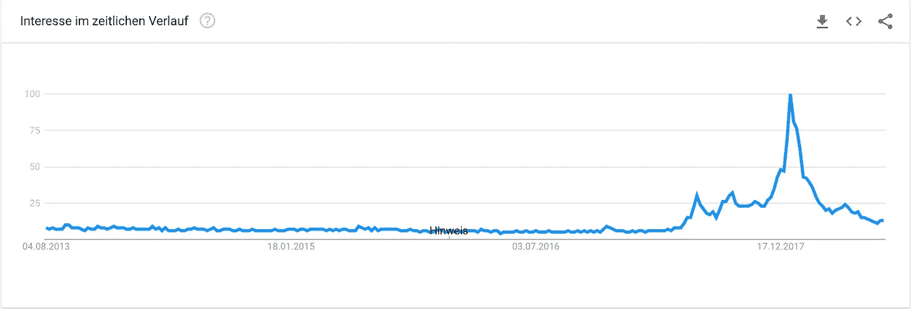

# 在区块链上发行公司股票的趋势已经开始

> 原文：<https://medium.com/hackernoon/the-trend-of-issuing-corporate-stock-on-the-blockchain-has-already-started-a615056b1d2b>

## 在过去的 6 个月里，各种媒体都在讨论可编程证券。

虽然一些专家已经宣称所谓的证券代币发行(STO)是公司融资的未来，但其他人担心高度管制的美国证券市场可能是启动这一进程的巨大障碍。随着争论的继续，少数初创公司如 [tZero](https://www.tzero.com/) 和[光明正大](http://aboveboard.ai/)已经领先一步，实际上已经开始发行他们自己的安全令牌。正如 [Anthony Pompliano](https://twitter.com/apompliano?lang=de) 在谈论加密货币和安全令牌时经常提到的:病毒正在传播，在这篇简短的文章中，我们将探讨为什么以及传播的速度有多快。

## **首先，为什么是区块链？**

加密货币已经赢得了革新未来货币的创新和潜在可行性的声誉。然而，最近的发展表明，大多数加密货币的基础技术区块链不仅仅是作为支付平台。[继银行业](https://www.cnbc.com/2017/11/03/blockchain-and-biometrics-the-tech-disrupting-banking.html)之后，看起来区块链技术颠覆的下一个主要行业是华尔街。通过以证券代币的形式分配股票，公司受益于无数的新功能，包括改善的**流动性**、**分配**、**控制**和**投资者关系**。

一方面，董事会成员和董事将满足于可定制的交易设置、自动化的白名单程序以及对股东的追踪。尤其是最后一点，对管理层来说无疑是一个巨大的收获，因为它提供了更多的机会来培养与投资者的关系，并更好地了解他们。

另一方面，股东受益于更宽松、更透明的股票市场传统，如股息支付、投票和报告，以及区块链相关的格式，如额外的公用事业。可能的效用可以是会员资格、获得产品和折扣等。

## **sto 作为 ico 的替代品**

Interest in ICOs over time.

在过去的两年中，首次公开募股(ico)已经被证明是早期初创企业筹集大量资金的一个极好的工具，通常只需几秒钟。尽管这种非稀释性筹资方式吸引了许多人的注意，但它也受到了很多批评。为了让发行的代币在 SEC 眼中看起来像是公用事业而不是证券，发行者取消了投票权、股息和清算权等传统功能。

事实上，在大多数 ico 中，投资者根本没有被授予任何权利。因此，在这个监管机构开始迎头赶上的成熟行业中，引入 sto 似乎是合乎逻辑的下一步。

> 在大多数 ico 中，投资者根本没有被授予任何权利。

据估计，全球价值在[以北，为 15 万亿美元](https://www.thestreet.com/story/13671231/1/the-15-trillion-security-warren-buffett-considers-radioactive.html)，全球安全市场远远超过 ICO 市场，据估计[的价值不到 200 亿美元](https://www.coindesk.com/6-3-billion-2018-ico-funding-already-outpaced-2017/)。

sto 不仅可能成为比 ico 更有效的筹资方式，还可能将整个区块链空间提升到一个全新的层面。

## **仍在解决的一些障碍**

在大公司开始在区块链发行股票之前，仍然有一些已知的，可能还有数百个目前未知的障碍需要解决。一个关键问题是投资者的白名单程序，许多司法管辖区对此有非常严格的规定。[光明正大](http://www.aboveboard.ai)最近成为第一家在区块链发行公司股票的公司，它是一家著名的公司，正在通过开发一种注册软件来解决这个问题，该软件可以跟踪以太坊区块链上的安全令牌持有者，并提供其他功能，如股东权利管理、治理和交易规则。

由于严格的规定，另一个大问题是证券的交易。安全令牌的主要承诺之一是释放资产额外流动性的潜力，从而使它们更有价值。虽然目前还没有证券代币市场，但由 Overstock 支持的项目 tZero 可能是第一个很好的候选人。该项目最近举行了一次安全令牌发售，为建立有史以来第一个安全令牌交易所筹集资金，目前计划在 2018 年底上线。

## **下一步是什么？**

就像加密货币改变了我们对金钱的看法，并可能使银行在长期内变得多余一样，安全令牌有可能永远改变我们对资产转移和所有权的看法。随着许多主要玩家进入这一领域，旨在从中分一杯羹，这肯定会是一个值得关注的有趣领域。