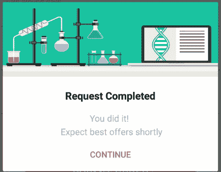
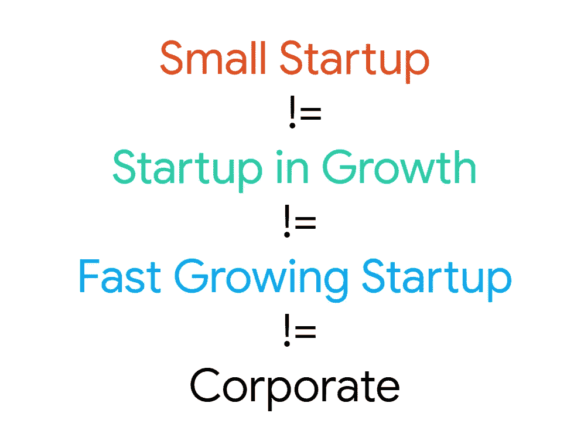
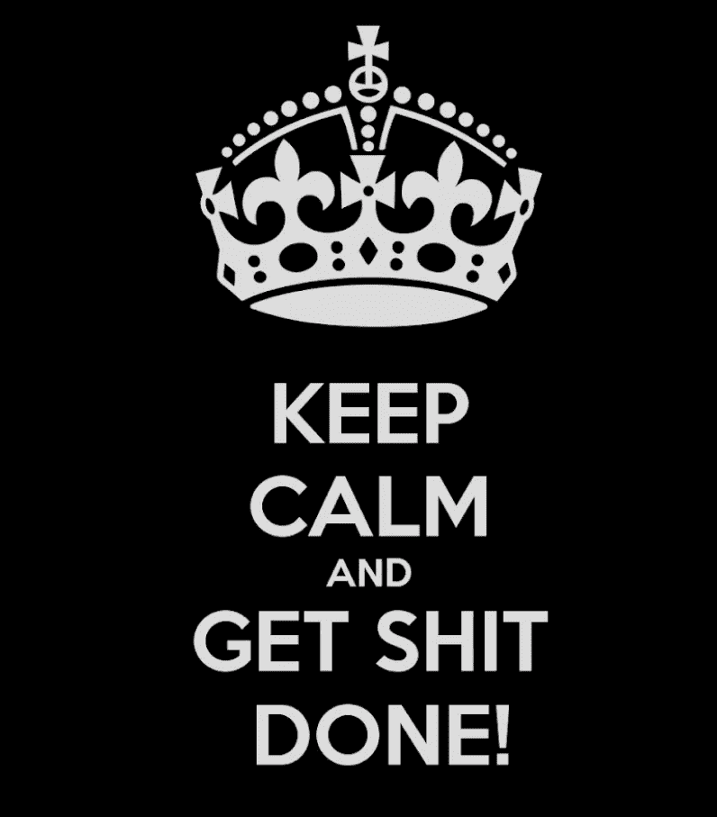
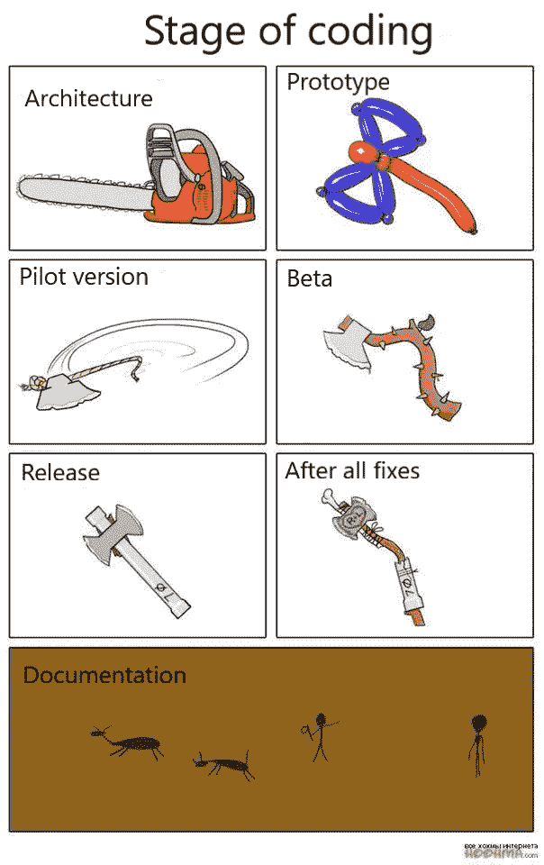
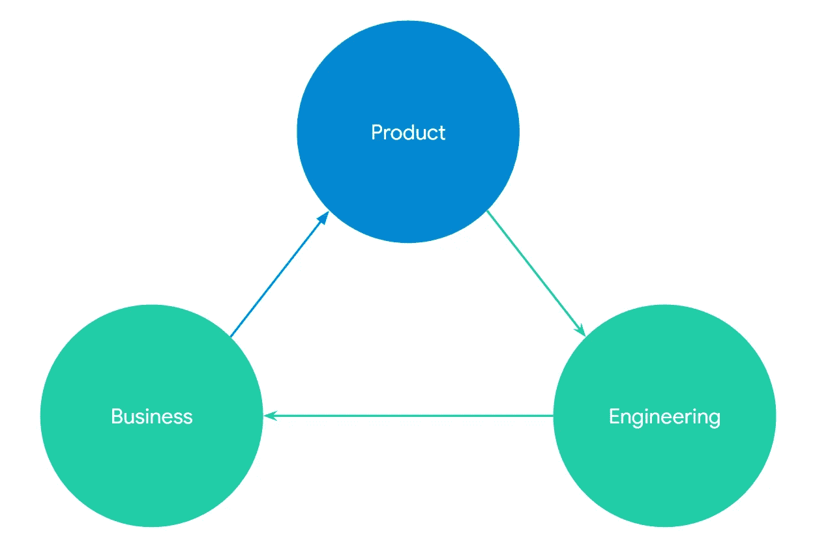
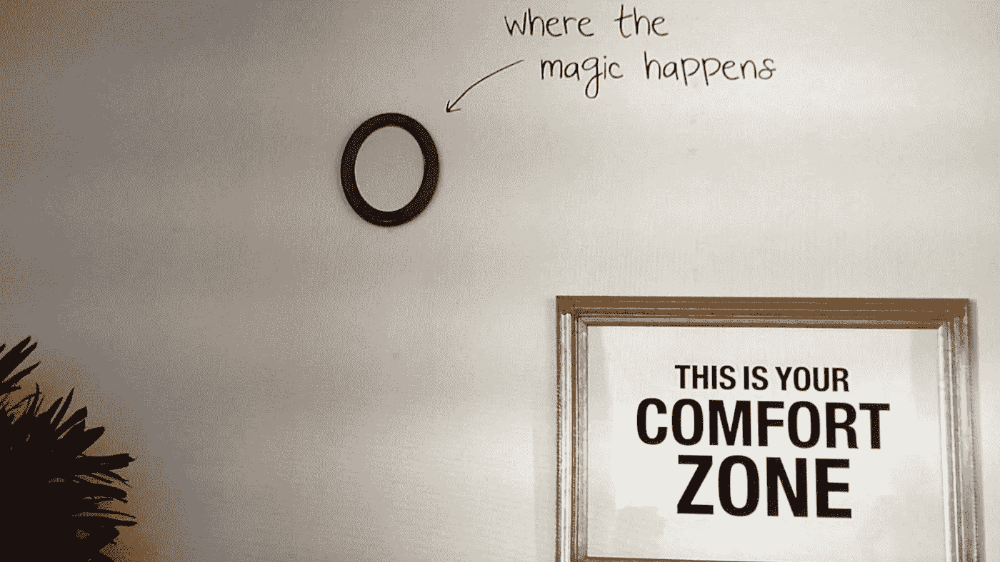
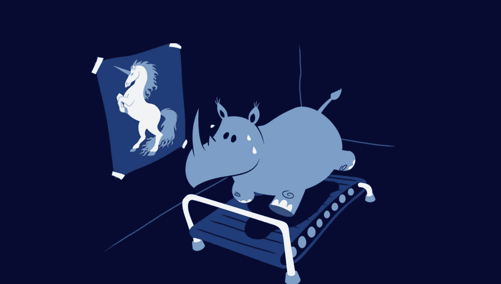
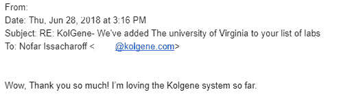

# 真实故事:首席技术官的生活

> 原文：<https://medium.com/hackernoon/the-true-story-the-life-of-a-cto-a5792e90c836>

大约三年前，我永远不会忘记的一天，这一天改变了我的人生轨迹。这一天标志着我个人生活的开始(我亲爱的女儿出生的那一天),也标志着传奇企业家兼投资人 [Eyal Gura](https://finder.startupnationcentral.org/angel_page/eyal-gura) 打电话给我，邀请我与 [Dan Faszczyk](https://www.linkedin.com/in/dan-faszczyk-a0639a14/) 一起加入 [KolGene](https://www.kolgene.com/) 的愿景团队，建立一个革命性的想法——一个基因检测市场，成为管理医院所有基因检测的平台。剩下的就是历史了:)

KolGene’s magic

这篇文章不会关注我们是如何筹集到第一轮种子资金的(但是我们做到了！)或者关于我们是如何成功的进行了一个支点，并获得了我们的第一批客户(辛苦了！)以及我们一路上遇到的所有其他糟糕的事情。而是关于我成为 CTO 的个人历程。最近，我受邀与 Zell 的学生谈论在一个初创公司的世界里做 CTO 意味着什么。在准备演讲的时候，我有了分享和写这篇博文的灵感。

Not the same CTO

你首先要明白的是，一个 CTO 职位的范围是公司与公司之间的(像每个职位！).

例如，一个小公司的 CTO 和一个大公司的 CTO 有很大的不同。第一种要求你自己做所有的事情——从产品、技术、管理，当然还有开发。同时争取投资者并参加会议。而大公司的首席技术官更多的是以技术为导向，你的主要职责是为公司产品找到合适的技术组合，并向公司的其他利益相关者解释。

# 前奏:个人经历

我很幸运能够观察到不同公司的不同首席技术官走上不同的阶段:从公司到像 [Gett](https://en.wikipedia.org/wiki/Gett) 这样快速成长的初创公司。但是，因为这主要是关于我的旅程，所以让我们谈谈我成为 CTO 的个人旅程。多年来，我一直是“关键人物”，每个人都指望我为所有的 [Android 开发](https://developer.android.com/)提供解决方案。在我在 [Gett](https://en.wikipedia.org/wiki/Gett) 的时候，我很幸运能够学习后端并经历各种架构增长问题，然后 [KolGene](https://www.kolgene.com/) 发生了，这要求我自己弄清楚作为一名 CTO 到底意味着什么，当然也使所有的错误成为可能(我的意思是我们只是人类)。

# 第一部分:**联合创始人的故事**

做一个创业公司的 CTO，真正意味着什么？两个人的创业公司！嗯，作为一名开发人员，基本上也要努力从客户那里了解他们的需求是什么，以及我们如何满足他们。在我们的故事中，我们的 CEO 带来了一个基于他的行业经验的想法。我是一名开发人员，试图弄清楚他到底是什么意思。我的意思是我只用了一张 A4 纸和一支铅笔。后来，我独自一人坐在家里，试图把所有这些混乱的想法纳入一个正式的产品规范，包括线框、用户流和一个故事。

是的，这听起来像是产品人员的工作，但是，请记住，当你是唯一的两人团队时，我们都必须身兼数职。同样，在任何初创公司的初期，即使公司已经开始发展，直到你有了产品经理，首席技术官和首席执行官都有责任管理公司的产品。

当一个企业以一种更加抽象和混乱的方式思考时，开发者实际上是唯一一个能够给最终要构建的东西带来更多“秩序”和结构的人。然后，当然，建造它。

No. It’s not real. It’s just a chaos :)

“构建”分为两件事——或者你知道所有的技术堆栈，你可以单独构建它。或者你可以找一个能为你建造它的人(为了钱或者股权)。这是你从开发人员到 CTO 的第一次转变(欢迎来到我的地方)。在我们的案例中，我们想快速行动，我们有一些资金，所以我们决定利用我在俄罗斯的根基，将开发外包给一个东欧国家。

经过一番调查，我们在乌克兰找到了一家公司。

# 第 2 部分:构建产品部分

Building Product

你需要接受的第一件事是——你将会制造一个巨大的混乱。你会犯所有可能的错误。在创业初期，首席技术官的职责是用最少的努力和最少的时间开发产品。你将被要求妥协。开发商身上。在技术堆栈上。关于解决方案。产品决策。开发产品需要你在没有任何重要知识的情况下做出很多决定。只是直觉。你和你搭档的。还有你的开发者。尤其是当你第一次做 CTO 的时候。

一旦你接受并放下它，接下来的事情就是尽快学习你所缺少的所有技能。不是以专家的身份——而是要有足够的勇气向你的目标前进。

*Never too late to learn do not be afraid*

例如，我们很快意识到，我们的客户 95%的时间都在他们的桌面上使用网络，因此我们所有的 Android 和 iOS 应用程序都无关紧要。我们开始在网络上采用我们的平台。我从未为网络开发过任何东西。(我的意思是，除非你算上我在学校写一些基本的 HTML 网站的那些日子——我们都必须从某个地方开始)。

你如何为一个你从未有过任何构建经验的平台编写产品规格？

通过[学习](https://hackernoon.com/tagged/learning)。非常快。向你的开发者提问，最愚蠢的问题。雇佣开发人员，面试他们，问他们同样的问题。事实上，我是在一次采访中问这些问题的——“嘿，我们应该如何建造这个？”或者“我不明白 PHP 应该如何使用 React？”是的，我知道！没有人是完美的，但我从他们的回答中学到了很多。

# **第三部分:构建错误更少的产品# 2**

现在你有一个开发团队，你管理他们的冲刺，任务和日常会议。第一个版本已经发布，你有了第一批客户。现在开始最艰难的工作。

有一个词你需要学习。**产品市场契合度**。这是一种很难驯服的野兽。(如果很容易，每个人都会这么做)。这意味着你的产品，一个有很多错误和糟糕架构的产品，实际上是一个非常好的解决方案，它解决了真正的问题，一旦用户找到它，他们就不能离开它。

你的工作和你的事业就是驯服它。

驯服过程是一个实际的持续过程，在这个过程中，企业(CEO)和你的(CTO)一起收集来自客户的反馈，对其进行分析，并尝试将其转化为应该对你的产品进行的更改。

反馈可以是正式的(来自客户的电子邮件)，也可以是非正式的(如针对 web 的 Fullstory 或针对应用的 TestFairy)。

这不是一个简单的过程，它需要你管理客户的期望，处理眼前的问题，并找到当前的最佳解决方案(不一定是长期的正确方案)。

它要求你尽可能快地移动。动作快点。打碎东西。你会从作品中了解更多，而不仅仅是凭直觉猜测！犯错——让成功越来越近。

把一切都外包出去。尽你所能。从开发者开始，到使用外部 API 带来必要的功能。我们在公司后期才聘请了一个内部开发人员。设计和质量保证我们外包，直到今天。我们使用了所有可能的 API。从用联邦快递跟踪血样到给我们的客户发电子邮件。甚至是我用 Grafana 库做的一个仪表盘。

# **第四部分:成为 CTO**

在驯服过程中，你会发现成为 CTO 不仅仅是成为 5-6 名开发人员的团队领导。你不仅需要对 bug、技术问题和架构给予大量关注，还需要关注产品和运营需求的所有方面。它实际上是在三个领域之间找到正确的平衡:技术、产品和商业。

## 技术

*   队长
*   解决方案架构师
*   开发者

## 产品

*   了解业务需求
*   构建它并编写产品规格
*   把它分成给开发者的任务

## 商业

*   业务驱动因素
*   销售人员(对开发商、员工、投资者、潜在客户)
*   首席执行官在艰难时期掌舵

对我个人来说，我在其中一些方面成功了，在另一些方面失败了。但我很清楚这是一个持续的过程。而且学什么都不晚。嘿，我还在学呢！

我们已经为这一课付出了代价(通过制造错误)，现在是时候从中吸取教训了:)

# 临终遗言

*The magic that happens out of your comfort zone*

我完全相信走出你的舒适区。很难。很紧张。但是当我回顾我的生活——当我走出现在的位置，开始第一次做一些事情时，发生在我身上的美好的事情。这就是奇迹发生的时候。

所以不管有多难，都不要放弃。制造一个产品很难。做 CTO 很辛苦。但是有可能。完全有可能。

Do not give up on your dreams

你的梦想就在眼前。去拿吧！

one of our customers

****

*感谢阅读。如果你喜欢，请给我你的*👏👏*和大家分享一下这个。我也很乐意听到你的意见和建议:)谢谢*