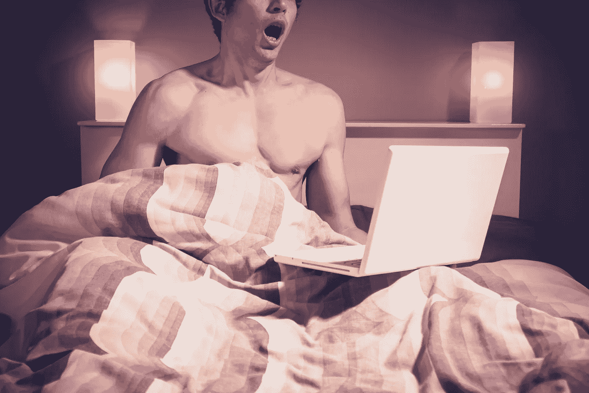

# 色情成瘾背后的真相

> 原文：<https://medium.com/hackernoon/the-truth-behind-pornography-addiction-b855bd0bfa5e>

funny picture

我们很多人都想停止看色情片。

我们可以试着用战术和意志力。我们可以在睡觉前把设备放好。我们可以击退拿起设备观看的冲动。但是，为了以一种持久有效的方式停止观看它，我们可能需要解决潜在的原因并改善我们的总体状况。这不仅仅是对色情业，对其他毒品也是如此。

药物越来越多地被使用，因为随着时间的推移，人们对相同数量的药物越来越不兴奋。该药物释放的大量多巴胺(或兴奋)会磨损多巴胺受体，使它们需要更多才能达到同样的效果。当吸毒者不再获得他们上瘾的药物的最初效果时，他们需要更多地使用药物。

但是吸毒者首先把毒品带入他们的生活是为了逃避现实。因此，如果他们能够改善他们的现实世界环境和精神状态，他们就可以消除一般药物使用的原因，并更容易地退出当前的使用。否则，策略和意志力只能到此为止，即使他们把一种药物拿出来，也能很快找到替代品。

对许多年轻人来说，选择的毒品可能是大量使用色情:即时、无限的性新鲜感。随着时间的推移，我们发现它与其他药物一样，需要时间和精力等成本。所以，我们很多人可能不想再看了。但是，如果不改善现实，这样做将是困难的。光靠战术和意志力是很难的。即使有些人成功地不再看它，没有一个更好的现实，他们可能会随着时间的推移找到另一种药物来取代他们生活中的新差距——他们以前试图逃避的现实仍然未变。

我们必须努力去做的是直面最初让我们沉迷于色情或其他毒品的痛苦，然后将它们洗掉。

如果你试图在不改善现实的情况下停止看色情片，你会发现这有多难。仅靠意志力和设备分离之类的策略，我们只能走到这一步。

对我来说，在改善现实的同时摆脱色情可能改善了我的生活。没有色情，我有更大的注意力和精神能量。除此之外，我生活中的其他变化都无法解释从那时起我所经历的明显的益处。

色情作品简化了获得新奇性刺激的途径，人为地让我们更频繁地自慰和射精。我们不自然地频繁释放性能量，如果没有这种新奇的体验，我们是不会这样做的。但是现在没有色情，手淫和射精以及视觉过度刺激减少，我有更多的精力和对刺激的接受能力，让我对浪漫和生活的方方面面更加热情。

我意识到社交媒体上的性内容可能会导致色情使用。所以我想办法减少社交媒体的使用。我不再查看社交媒体通知。我让正确的数字堆到 99，然后重置为 0，一次又一次。虽然我错过了某些社交信息，但我现在更好地控制了我的使用，并且收益是值得的。脱离社交媒体可能改变了我的精神环境，让我更容易从色情中抽离出来。

消除色情成瘾背后的真相是意志力只做了这么多。它有助于改善你的环境，并解决色情使用的其他潜在问题。

*现在从巴诺书店或 Indiebound 购买我的书:*[https://www . barnesandnoble . com/w/trapped-in-the-web-an-Turner/1129986845？ean=9781732182196](https://www.barnesandnoble.com/w/trapped-in-the-web-an-turner/1129986845?ean=9781732182196) ，【https://www.indiebound.org/book/9781732182196】T4