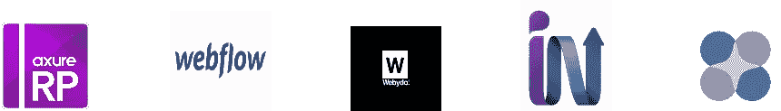

# UX/用户界面设计师原型工具的终极集合

> 原文：<https://medium.com/hackernoon/the-ultimate-collection-of-prototyping-tools-for-ux-ui-designers-3029faf047f4>

线框工具使得创建一个网站或应用程序从根本上更容易。它简化了 UX 设计师和客户之间的沟通，节省了我们大量的产品开发时间。这篇文章列出了 20 多种不同的 UX 原型工具。

**有 5 种原型工具:**

*   多页工具
*   移动原型工具
*   web 原型工具
*   静态线框工具
*   交互式原型工具

**多页工具**

这些工具用于创建 web、桌面和移动应用程序的点击原型。原型是用现有屏幕上的图像构建的。它允许你从 Photoshop，local，Dropbox，Google Drive 等上传图片。只需点击几下，你就可以将屏幕连接在一起，将你的设计变成交互式手机和网络原型。

[Invision](https://www.invisionapp.com/)——有了 Invision，你可以将你的静态网页&移动(iOS，Android)设计快速转化为可点击的互动模型。图片可以从本地、Dropbox、Google Drive 和 box 上传。协作功能很棒。

漫威——这是一个易于使用的应用程序，可以将你的设计变成可点击的原型。干净的界面有助于我们专注于设计。

[Flinto for Mac](https://www.flinto.com/mac) —这是一款仅适用于 Mac 的原型开发工具。如果你是一个草图用户，Flinto 有一个方便的插件，可以让你一键导入草图文件。

[Atomic](https://atomic.io/) — Atomic 允许您使用一系列移动或桌面手势和过渡来快速链接您的设计。Atomic 有内置的绘图和布局工具，允许我们绘制一些基本的 UI 元素。

**移动应用原型工具**

这些工具是移动模型和原型的理想选择，因为它们带有一个标准的移动部件库。他们根据设备大小为您提供不同的移动模板。它提供了一些在真实设备上预览设计的快速方法。

[Proto.io](https://proto.io/) —这是一款很好的移动线框和原型软件，因为它允许离线查看原型，并且附带了许多移动部件。

[最佳免费 UI/UX 设计资料](https://www.mockplus.com/resource/post/20-free-creative-casual-line-web-ui-designs)

[下载](https://www.mockplus.com/resource/post/20-free-creative-casual-line-web-ui-designs)

[Mockplus](http://www.mockplus.com/?utm_source=promote&utm_medium=click&utm_campaign=becky) — Mockplus 非常适合移动原型。有了 3000 个图标和 200 个组件，您可以通过简单的拖放操作构建交互式移动原型。在开始设计时，我们可以根据尺寸选择移动模板。有几种方法可以在移动设备上查看原型:在移动浏览器中查看、通过查看代码查看、扫描二维码等。

[Fluid](https://www.fluidui.com/) — Fluid 是一个基于网络的线框工具。如果我们想做一个移动应用原型，包括 iOS、Android 和可穿戴设备，这是一个很好的工具。

[Pixate](http://www.pixate.com/) — Pixate 是一款基于桌面的原型工具，允许你构建动画和交互。它只能用来制作移动原型。

[Justinmind](http://www.justinmind.com/) —这是一款基于桌面的原型开发工具，适用于高保真手机原型。它支持复杂的交互、动画和手势。学习曲线相当高。

**网站原型工具**

[Axure](http://www.axure.com/) — Axure 非常适合包含复杂交互的 web 应用程序或桌面软件的原型开发。掌握这个工具需要严格的逻辑思维技巧和编程知识。

[Webflow](https://webflow.com/) —集网页设计工具、CMS 和托管平台于一体。Webflow 是一个网站构建器，可以在你设计的时候自动生成干净的代码。

[Webydo](http://www.webydo.com/)——它帮助你为你的客户创建完美的、反应灵敏的网站。Webydo 将自动为您的客户将您的设计转换为更新的 HTML 代码+ CMS(内容管理系统)。

Indigo Studio —原型可以从现有的模型中创建，或者通过在 Indigo Studio 中为每个屏幕构建单独的元素来创建。

[Protoshare](http://www.protoshare.com/) —是一款学习曲线适中的原型开发工具。ProtoShare 帮助团队可视化交互式网站原型的需求。

**静态线框工具**

[Fluid](https://www.fluidui.com/) — Fluid 是一个易于使用的线框工具，可以用来快速制作静态线框。

Balsamiq 样机-这是一个手绘风格的线框工具，再现了在白板上画草图的体验。它适用于简单的静态线框。

[Mockflow](https://www.mockflow.com/) — Mockflow 是一个简单的线框工具。

**交互原型工具**

这些工具允许您为单个元素添加交互性。用它们可以进行基本的交互和复杂的交互。一般来说，交互性越强，学习曲线越高。

Axure——一个健壮的原型工具可以制作非常复杂的交互。学习曲线有点高。

[Mockplus](http://www.mockplus.com/?utm_source=promote&utm_medium=click&utm_campaign=becky) — Mockplus 是一款新的快速成型工具。Mockplus 中的交互设计是完全可视化的，那就是所见即所得。它允许您通过简单的拖放操作为组件添加页面链接和交互。像我这样没有耐心的人可以通过拖放操作轻松构建一个交互式原型。

[UXPin](https://www.uxpin.com/) — UXPin 是一款基于网络的工具，用于构建网络或移动应用的原型。它有一个一致的界面和几十个库，其中包含了设计中要使用的各种项目。它可以用来创建静态线框和交互式原型。

你可以使用容器来创建功能动画和交互。它可用于构建低保真度和高保真度模型/原型。

[Framer](https://framerjs.com/) — Framer 是一个基于代码的原型开发工具。如果您熟悉 JavaScript 或类似的语言，Framer 非常适合为桌面或移动应用程序制作高保真动画或复杂交互的原型。

HotGloo —这是一个在线原型制作工具，允许通过基本的交互来制作原型。

您可能还喜欢:

[设计师的 10 个最佳线框和原型工具](http://www.mockplus.com/blog/post/the-10-best-wireframing-and-prototyping-tools-for-designers/?utm_source=promote&utm_medium=click&utm_campaign=becky)

[为每位设计师提供 10 个有用的用户体验工具](http://www.mockplus.com/blog/post/10-helpful-user-experience-tools-for-every-designer/?utm_source=promote&utm_medium=click&utm_campaign=becky)

[交互式原型开发初学者指南:我应该选择哪种工具](http://www.mockplus.com/blog/post/beginners-guide-to-interactive-prototyping-which-tool-should-i-choose/?utm_source=promote&utm_medium=click&utm_campaign=becky)

— — — —

使用 Mockplus 更快、更智能、更容易地制作原型

【www.mockplus.com 