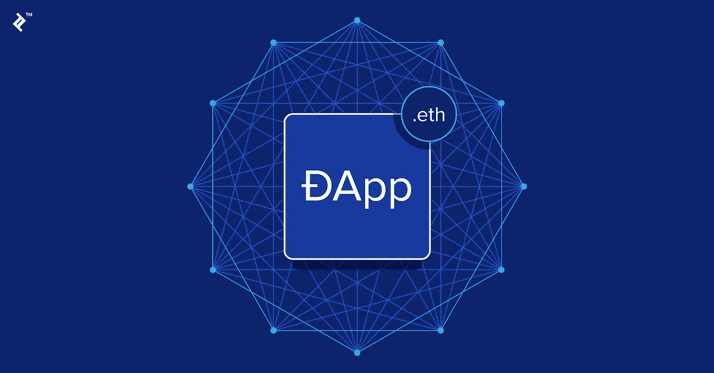
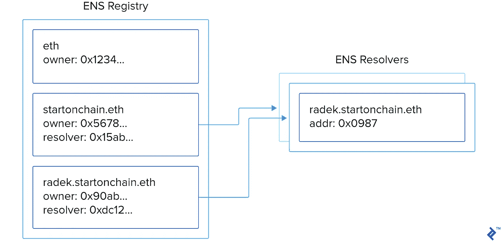
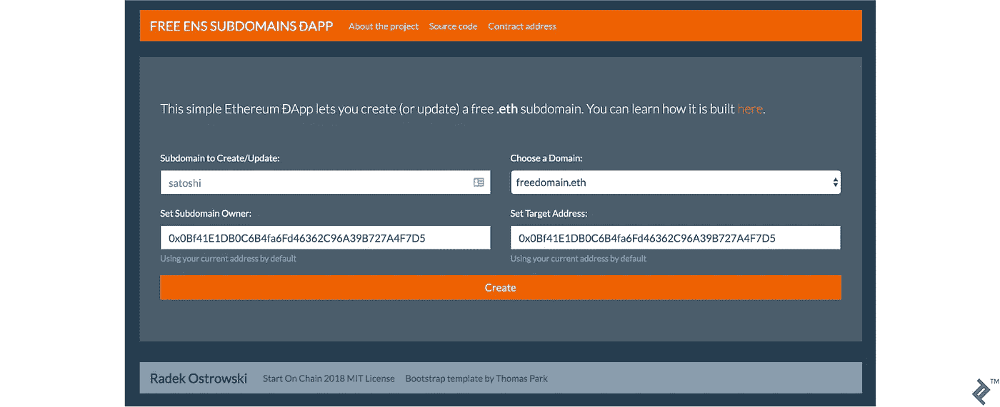
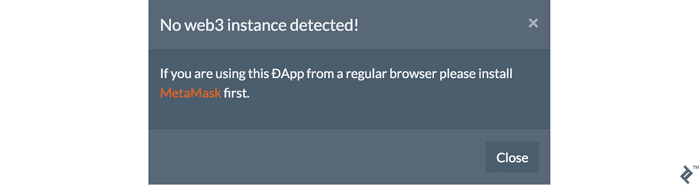
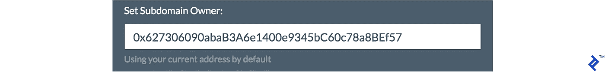
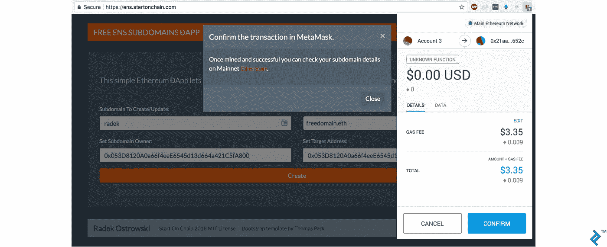
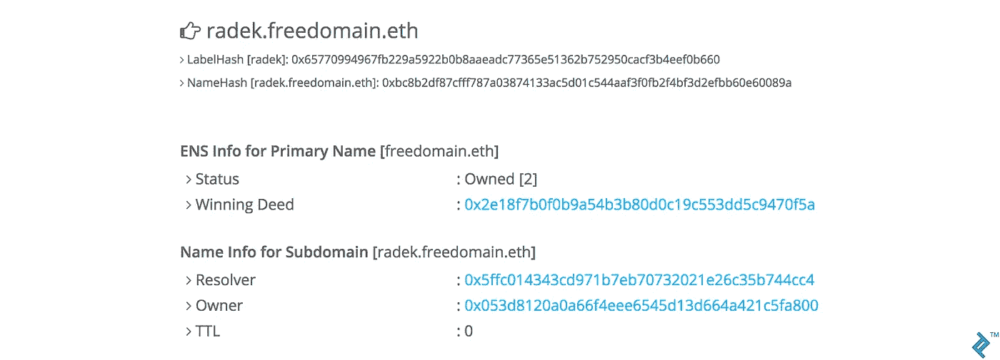

# ENS 和应用程序终极教程

> 原文：<https://medium.com/hackernoon/the-ultimate-ens-and-%C4%91app-tutorial-cc5c6f41b9c9>

*原载于*[*【www.toptal.com】*](https://www.toptal.com/ethereum/ethereum-name-service-dapp-tutorial)*，作者* [*拉德克·奥斯特罗夫斯基*](https://www.toptal.com/resume/radek-ostrowski) *。*



在区块链系列的前一篇文章中，我向您介绍了智能合同开发，但是没有涉及如何开发分布式应用程序(dapp，风格化的 app)。这一次，我想集中讨论这一点。然而，为了使我们的工作更有意义，让我们建立一个服务，允许人们用一个区块链交易创建免费的以太坊子域。

让我们从解释以太坊名称服务(ENS)开始这个应用教程。

# 以太坊名称服务

ENS 是区块链常用域名系统(DNS)的等价物。这两者都可以用电话簿来比喻。它们充当查找服务，将人类可读的名称翻译成它们的底层表示形式——在 DNS 和 ENS 的情况下，是计算机地址而不是电话号码。

DNS 将网站地址的域名转换为互联网协议(IP)地址。它们很容易被计算机理解，但对我们人类来说就不那么方便了。例如，在撰写本文时，`toptal.com`代表`35.186.228.167`——您更愿意记住并键入哪个？

```
$ ping toptal.com PING toptal.com (35.186.228.167): 56 data bytes
```

ENS 服务于相同的目的，但不是 IP 地址，而是域被映射到以太坊地址，它是 42 个字符长。顶级 ENS 域名是`.eth`。

有趣的是，相当于 DNS 的中央注册中心被表示为一组[智能合同](https://www.toptal.com/ethereum-smart-contract)。这些都是在以太坊区块链上以分布式的方式运行，“……这意味着它不会遭受 DNS 系统的不安全性。正如 ENS 网站所描述的那样，“你可以放心，你输入的名字是按照它们主人的意图工作的。”。

下面是 ENS 架构的高级概述。该服务的主干是 ENS 注册管理机构智能合同，它将域名的表示映射到 ENS 解析器的智能合同。这些地址依次映射到目标以太坊地址。看一下这个图，如果一个应用程序想要解析 ENS 地址`radek.freedomain.eth`，它将首先向 ENS 注册中心查询相应的 ENS 解析器，然后向解析器请求映射以太坊地址，解析器将以`0x0987...`作为响应。欲了解更多信息，请点击查看 ENS 文档[。](http://docs.ens.domains/en/latest/introduction.html)



# `.eth` ENS 域

ENS 于 2017 年 5 月 4 日推出，目前(第一阶段)，其域名必须包含七个或更多字符。不可能使用有六个字符的`toptal.eth`，所以我们将使用我买的 ENS 域名:`freedomain.eth`。

任何人都可以注册一个`.eth`域名，方法是在维克瑞拍卖过程中锁定一些以太网，该过程由部署的智能合同介导。拍卖分为两个阶段`bid`和`reveal`，分别持续三天和两天。

首先，域名拍卖必须在第一次出价的同时开始。一旦开始运行，任何人都可以出价。一旦第一阶段完成，新的出价不再被接受，然后参与者必须公开他们的出价。出价最高的获胜者只需匹配第二高的出价，其余的乙醚将被退还。所有剩下的参与者也会得到退款。但重要的是要注意，如果你不及时透露你的出价，你出价的乙醚就会丢失。

一旦你被确认为获胜者，你只需要`finalize`拍卖并设置`resolver`和`target`地址。简单？如果你是以太坊的新手，可能就没那么多了。有几个工具可以帮助你——比如 [MyCrypto](https://mycrypto.com/ens) 、[my ther wallet](https://www.myetherwallet.com/#ens)和[ENS Manager](https://manager.ens.domains/)——但这仍然是一个多阶段的过程。(我也是刚刚发现 [ENSListing](https://enslisting.com/) ，看起来更人性化一点。)

子域呢？它们更简单吗？让我们看一看。

# ENS 子域

首先，子域有什么用？我的最佳猜测是，这与 DNS 中的子域名是一样的。它们还可以给用户更多的组织感觉，其中域代表组织，子域类似于电子邮件地址的结构:

```
[[email protected]](https://www.toptal.com/cdn-cgi/l/email-protection) => radek.freedomain.eth
```

目前由 [Tenzorum 项目](https://tenzorum.org/)实现的一个新用例是使用你的子域作为用户名/登录以太坊应用程序。想象一下，有一个你已经玩了一段时间的 App 游戏。即使两个设备使用不同的密钥对，也可以在旅途中用笔记本电脑和手机上相同的登录信息继续玩游戏。这是如何实现的:

*   使用您的子域登录应用程序，例如`radek.tenz-id.eth`
*   该应用程序要求您签署一条消息，以验证您是相应私钥的持有者
*   该应用程序通过询问您的个人钱包智能合约来检查您是否有权登录。(你猜对了，ENS 子域代表的登录是指向你个人钱包的地址。)

这样做的额外好处是，即使您丢失了设备(和设备上的私钥),您也可以继续玩游戏，因为您不会失去访问个人钱包的权限。

子域映射名称到地址的方式和域名完全一样，但是你不需要通过拍卖过程来创建一个。幸运的是，ENS 子域名也没有最小长度限制。

要注册一个子域，作为先决条件，你必须是该域的所有者。要创建或更新子域，您必须调用 ENS 注册中心智能合同上的`setSubnodeOwner`。一旦成功，与域相同的逻辑也适用:所有者必须设置`resolver`和`target`地址。

如果我们可以自动化这一过程并为用户简化这一过程，会怎么样？我已经创建了[一个智能合同，正是这样做的——前面提到的`EnsSubdomainFactory.sol`——允许任何人用一个区块链呼叫创建一个子域。然而，由于本文的重点是构建应用程序，我将把它留给您作为练习来研究。

# 分布式应用程序

App 只是一个与区块链后端交互的前端网站。该网站必须在支持以太坊的浏览器上浏览，如[迷雾](https://github.com/ethereum/mist)、[奇偶性](https://www.parity.io/)或手机应用[密码](https://www.cipherbrowser.com/)；或者通过安装 [MetaMask](https://www.toptal.com/ethereum/one-click-login-flows-a-metamask-tutorial) 插件。

与传统的后端服务器和数据库不同，读写调用是直接对以太坊区块链进行的。这些调用可以使用 JSON RPC 协议来完成，但幸运的是我们有一个库，它以一种开发人员友好的方式包装了这些调用。

认识 Web3。在不同的编程语言中有几个版本，但我们将使用 JavaScript 版本， [web3.js](https://github.com/ethereum/web3.js) 。另外，`web3`实例是由浏览器注入的，或者在我们这里的方法中，是由元掩码插件注入的。

# HTML 网站

现在，我们可以开始着手如何构建一个应用程序了。在我们的例子中，我们所需要的只是一个包含五个元素的简单表单:

*   子域名称的输入字段
*   包含可用域的下拉列表
*   子域新所有者的输入字段
*   目标地址的输入字段
*   提交按钮

我用 [Bootstrap](https://getbootstrap.com/) 给它增加了一点。(请记住，就 UI 功能而言，应用程序与任何其他 web 应用程序一样，所以我们不需要应用程序框架本身(*)——Bootstrap 等常规 web 技术在这里做得非常好。)下面是它的样子:*

**

*只是一个普通的 [HTML 网站](https://github.com/radek1st/ens-subdomain-factory/blob/master/docs/index.html)所以就不细说了。所有的神奇都发生在 JavaScript 文件 [dapp.js](https://github.com/radek1st/ens-subdomain-factory/blob/master/docs/dapp.js) 中。*

# *JavaScript 和 Web3*

*要构建任何通用的应用程序，您需要的是:*

*   *Web3 实例(例如，具有元掩码提供程序)*
*   *从区块链读取的方法(例如以太坊天平)*
*   *给区块链写信的一种方式(如发送以太)*
*   *读取智能合同的方式(例如，ENS 域名所有者或 ERC20 令牌余额)*
*   *写入智能合约的方法(例如，创建子域或转移 ERC20 令牌)*

*此外，为了让您的分散式应用程序与智能合约进行交互，您需要:*

*   *应用程序二进制接口(ABI)*
*   *智能合约的部署地址*

*我将依次介绍上述内容，并向您展示我们如何将它们应用到我们的应用程序中。*

*开发应用程序最便捷的方式是使用 Firefox 或 Chrome 的 MetaMask 插件。有关如何安装的说明，请重新阅读[上一篇文章](https://www.toptal.com/ethereum-smart-contract/time-locked-wallet-truffle-tutorial#distributed-application-setup)。*

*在撰写本文时，有两个相关的 web3.js 版本需要在开发去中心化的应用程序时考虑:0.20 版本的[和尚未完全发布但已经广泛使用的版本](https://github.com/ethereum/wiki/wiki/JavaScript-API) [1.0.0 版本的](http://web3js.readthedocs.io/en/1.0/)。在本文中，我们使用的是后一个版本。*

*对`web3`实例的检查发生在`initWeb3()`函数中。这也适用于即将到来的 MetaMask [web3 注入更改](/metamask/https-medium-com-metamask-breaking-change-injecting-web3-7722797916a8):*

```
*window.addEventListener('load', () => { // If web3 is not injected if (typeof web3 === 'undefined') { // Listen for provider injection window.addEventListener('message', ({ data }) => { if (data && data.type && data.type === 'ETHEREUM_PROVIDER_SUCCESS') { // Use injected provider web3 = new Web3(ethereum); // ... } else { // No web3 instance available. Show a popup // ... } }); // Request provider window.postMessage({ type: 'ETHEREUM_PROVIDER_REQUEST' }, '*'); } // If web3 is injected, use its provider else { web3 = new Web3(web3.currentProvider); // ... } });*
```

*如果没有找到`web3`实例，我们可以向用户显示一个通知:*

**

## *与区块链互动*

*首先，让我们获取当前加载的以太坊账户，正如在`loadAccount()`函数中所做的:*

```
*web3.eth.getAccounts(function(error, accounts) { if (error) { // handle error } else { DApp.currentAccount = accounts[0]; // ... } });*
```

*然后，我们可以用当前帐户的地址自动填充新所有者和目标的输入字段。*

**

*在我们的应用程序中，我们不需要与余额交互，但为了完整起见，下面是如何检查帐户余额:*

```
*web3.eth.getBalance(DApp.currentAccount, function(error, ethBalance) { if (error) { // handle error } else { console.log("Eth balance", ethBalance); } });*
```

*…以下是发送乙醚的方法:*

```
*web3.eth.sendTransaction( { from: DApp.currentAccount, to: receiverAddress, value: ethValue }, function(error, txHash) { if (error) { // handle error } else { console.log("Transaction hash", txHash); } } );*
```

*请注意，您必须将`from`和`to`字段指定为以太网地址，以及您想要发送的以太网的`value`。这用卫来表示——比如`1000000000000000000`就是一个以太。*

## *与智能合约交互*

*为了与智能合约进行交互，我们首先必须创建一个代理对象。为此，我们需要它的[应用程序二进制接口](https://solidity.readthedocs.io/en/develop/abi-spec.html) (ABI)，它指定了可用的操作。*

*我们还需要在区块链上部署智能合约的以太坊地址。*

*在应用程序中，我们正在与一个智能契约进行交互，这是我们的 [EnsSubdomainFactory](https://github.com/radek1st/ens-subdomain-factory/blob/master/contracts/EnsSubdomainFactory.sol) :*

```
*factoryAbi: [...], // Local factoryAddress: "0x9fbda871d559710256a2502a2517b794b482db40", ...*
```

*合同在`initContracts()`功能中发起:*

```
*DApp.factoryContract = new web3.eth.Contract(DApp.factoryAbi, DApp.factoryAddress);*
```

*设置完成后，我们终于可以打电话了。对于我们的用例，我们需要知道特定域和子域的当前所有者是谁，所以我们的`checkSubdomainOwner()`函数看起来是这样的:*

```
*DApp.factoryContract.methods.subdomainOwner(subdomain, domain).call()*
```

*注意，这是一个只读操作:我们使用的是`call()`函数，它可以自由执行——也就是说，它不消耗任何气体。*

*这就是我们的应用程序将如何显示给定的域名是可用的，被当前用户占用或拥有的:*

******

*我们需要做的最后一个区块链调用是创建或更新子域。我们在`newSubdomain()`函数内部做这件事:*

```
*DApp.factoryContract.methods.newSubdomain( subdomain, domain, owner, target).send( { gas: 150000, from: DApp.currentAccount }, function(error, txHash) { if (error) { // handle error } else { console.log("Transaction hash", txHash); } } );*
```

*这一次，我们向函数传递四个参数:`subdomain`、`domain`、`owner`和`target`。它们不言自明。*

*注意，我们使用的是`send()`而不是`call()`。这是因为这是一个写操作，会改变区块链的状态，也会消耗一些乙醚气体。我们包含的一个额外参数是`gas`，它表示交易的气体限制。如果事务的执行成本超过了限制，我们希望它被恢复。*

## *监听事件*

*我们想知道我们的交易何时成功完成，并通知用户他们的子域可以使用了。*

*factory smart contract 定义了一个在子域创建或更新时发出的事件:*

```
*event SubdomainCreated(address indexed creator, address indexed owner, string domain, string subdomain);*
```

*遵循[web 3 . js 文档](https://web3js.readthedocs.io/en/1.0/web3-eth-contract.html#events)，我们应该能够做到这一点:*

```
*DApp.factoryContract.once('SubdomainCreated', { filter: {creator: DApp.currentAccount} }, function(error, event){ if (error) { // handle error } else { // display a notification that the event happened } } );*
```

*其中我们指定了我们想要监听的事件`SubdomainCreated`，并传递了`filter`参数，以便只监听将`creator`指定为我们的`DApp.currentAccount`的事件。不幸的是，MetaMask [的当前版本还不支持 web sockets](https://github.com/MetaMask/metamask-extension/issues/3642) ，web3.js 1.0 事件需要 web sockets。这可以在旧版本的 web3.js 中使用，但是语法不同。*

*作为一种变通方法，我们可以轮询交易收据，以检查它是否被挖掘，但为了简单起见，我们将只显示一个到 Etherscan 的 ENS 查找服务的链接，其中包含我们的新子域名的详细信息，例如`https://etherscan.io/enslookup?q=radek.freedomain.eth`，交易状态也可以在 MetaMask 窗口中找到。*

****

*这就是我们完成简单应用程序所需的全部内容。对于完整的源代码，可以在这里随意挖掘[。](https://github.com/radek1st/ens-subdomain-factory)*

# *本地运行*

*如果您想在本地使用代码，只需检查它并确保您安装了以下 npm 软件包:*

```
*npm i -g truffle npm i web3 lite-server eth-ens-namehash-ms*
```

*你可以用[松露](http://truffleframework.com/)启动本地测试网:*

```
*$ truffle develop … truffle(develop)> migrate … truffle(develop)> test Using network 'develop'. Contract: EnsSubdomainFactory ✓ creating new subdomain works (143ms) ✓ creating new subdomain fails when factory is not the owner of domain (47ms) ✓ updating subdomain works if done by current owner (215ms) ✓ creating new subdomain fails if it is already owned by someone else (197ms) ✓ transferring domain works (76ms) ✓ cannot transfer domains when locked (97ms) ✓ cannot transfer domains when not contract owner (55ms) ✓ checking for domain and subdomain owner works (138ms) 8 passing (2s)*
```

*最后，通过取消注释 [dapp.js](https://github.com/radek1st/ens-subdomain-factory/blob/master/docs/dapp.js) 中的一行，将工厂智能契约重新指向您的本地节点:*

```
*// Local factoryAddress: "0x9fbda871d559710256a2502a2517b794b482db40", // Ropsten // factoryAddress: "0xf9fa2ff44a474b6d20500969bda61c2827fbc6b6", // Mainnet // factoryAddress: "0xbd185de5172ca64eec3d8cc763883a68f9154cd6",*
```

*要启动 web 服务器，只需执行`npm run dev`，这将在`localhost:3000`启动您的浏览器。*

*注意，为了便于本地开发，我已经包含了 ENS 注册中心和解析器模拟契约。*

# *以太坊网络上的结果*

*合同部署到
[0x BD 185 de 5172 ca 64 EEC 3d 8 cc 763883 a 68 f 9154 CD 6](https://etherscan.io/address/0xbd185de5172ca64eec3d8cc763883a68f9154cd6)。*

*我们的生产应用程序网站位于[https://ens.startonchain.com](https://ens.startonchain.com/)。*

*带有 MIT 许可证[的源代码可以在 GitHub](https://github.com/radek1st/ens-subdomain-factory) 上获得。*

*声明:这是在主网上运行，不是 testnet，所以你是在用真金白银操作。使用风险自担。*

*值得注意的是，域所有者可以随时更改子域所有者——即使他们已经被分配。我们在智能合约中禁用了此选项，但是当您使用其他人的域时应该小心。*

# *欢迎来到应用程序的世界*

*在这篇 App 教程中，我已经涉及了以太坊名称服务(ENS)、web3.js、ABI、智能合约、元掩码、事务事件监听器，以及如何生成 Truffle 项目。这个应用做了一些有趣和有用的事情，让人们通过一次区块链交易创建免费的以太坊子域。结合[我的智能合约教程](https://www.toptal.com/ethereum-smart-contract/time-locked-wallet-truffle-tutorial)，我已经给了你足够的细节(希望还有灵感)让你创建自己的基于以太坊的区块链应用。祝你好运！*

*智能合同是在区块链节点上执行的计算机程序。智能合约可以执行任何计算、保存数据、定义业务规则，还可以像以太一样发送和接受本地货币。契约本质上是不可变的，除非被编程。*

*互联网的域名系统(DNS)是一种分层的、分散的服务，将“toptal.com”等人性化域名转换为“35.186.228.167”等数字 IP 地址，互联网上的计算机需要这些地址来定位数据和提供网站等内容。*

*以太坊名称服务(ENS)域相当于 DNS 域，它提供了一种分散且安全的方式来将人类记忆的文本转换成以太坊地址。ENS 域目前以结尾。eth 并有七个或更多的字符。他们可以在拍卖中购买，并可以有层次的子域。*

*App 只是一个与区块链后端交互的前端网站(通常通过 web3 ),而不是一个由服务器和数据库组成的传统后端。该网站必须在支持以太坊的浏览器上查看，如 Mist、Parity 或移动应用程序 Cipher 或者通过安装 MetaMask 插件。*

*所有区块链在自然界都是分布式的，因为它们有独立的节点以分布式方式一起工作。然而，并不是所有的区块链都是分散的。如果有一家公司可以审查、改变或停止区块链的运作，那么有些就是集中的。*

*子域名是二级域名的一部分，但是被搜索引擎认为是独立的实体。它们可用于为不同的地区、语言、部门、用户类型或设备类型创建不同的网站。例如，example.com 的专用移动版本可能使用 m.example.com 子域。*

**最初发表于*[*【www.toptal.com】*](https://www.toptal.com/ethereum/ethereum-name-service-dapp-tutorial)*。**