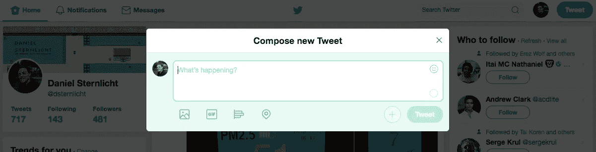
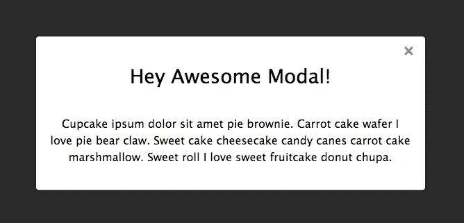
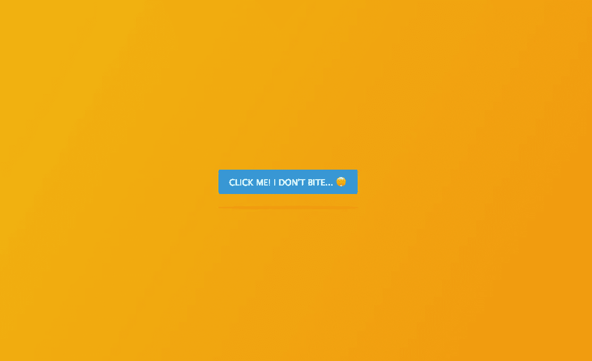
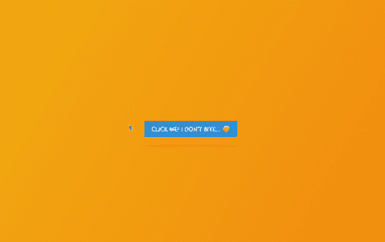
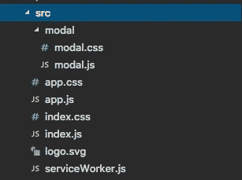
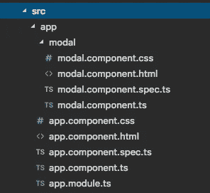
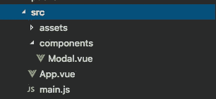

# 用普通 JavaScript、React、Angular 和 Vue 实现简单模态组件的终极指南

> 原文：<https://medium.com/hackernoon/the-ultimate-guide-for-creating-a-simple-modal-component-in-vanilla-javascript-react-angular-8733e2859b42>

最近，我从**微软**离职，重新加入 [**Outbrain**](https://www.outbrain.com/) 。

在公司之间转移并不总是容易的，因为每个公司用于开发其前端项目的技术和库之间并不一定一致。例如，在微软，我们的项目使用 React，而在 Outbrain，最常见的框架是 Angular。

无论你打算用哪个框架或库来开发，产品的规格和开发 web 应用的需求大部分都是一样的，所以你可能会一次又一次地为不同的库创建相同的组件。

web 应用程序中最常见的组件之一是(强大的)模型。在本文中，我将通过**向您介绍如何用普通的 JavaScript 以及 3 个最流行的 JavaScript 库&框架中的每一个创建一个简单的模态组件**:**React**、 **Angular** 和 **Vue** 。

深呼吸，我们要进去了。

顺便说一句，如果你没有 10 分钟的时间来阅读整篇文章，你可以在这里找到包含所有例子的 Github 库:

 [## dsternlicht/创建简单模式的终极指南

### 我的中型文章“用香草创建简单模态组件的终极指南…

github.com](https://github.com/dsternlicht/the-ultimate-guide-for-creating-a-simple-modal-in-react-vue-angular-and-vanilla-js) 

# 投机

在我们开始创建模态组件之前，我们需要理解它的核心概念和需求。

*   模态是在页面上发生事件(页面加载、点击、滚动等)后出现和消失的元素。).
*   Modal 应该支持所有类型的内容，包括文本、图像、视频。
*   模态应该反应灵敏，适合各种屏幕尺寸。
*   传统上，一个模态有两层:一个覆盖层(用于隐藏页面内容)，和模态本身。
*   Modal 应该有一个默认的设计，但是支持定制类来定制特定元素的设计。
*   模式应该有一个关闭按钮。
*   模态控制器应该被通知模态事件(例如模态打开、模态关闭等)。

为了完善规范，这里有一个在 Twitter 中撰写新推文的模型示例:

# 基础

尽管我们将在 4 个不同的 JavaScript 库和方法中实现我们的模型，但我们可以使用相同的基本 CSS 和 HTML 来模仿我们的模型。

HTML:

如您所见，HTML 代码非常简单。我们有一个类为`modal`的包装器 div 元素，它有两个子元素:

*   `overlay` —这个元素将在后台，负责隐藏我们的 web 应用程序的内容。
*   `modal_content` —该元素是模态本身，将包括模态的内容。

CSS(魔法真正发生的地方🎩):

首先，我们为模态的包装元素设置一个`position: fixed;`(带有`.modal`类的那个)。此外，我们将通过设置`width: 100%; height: 100%;`来确保它占据我们的视口的 100%的宽度和高度。我们还会用`left: 0; top: 0;`将它对齐到屏幕的左上角。这将确保我们的模态得到所有的关注，因为屏幕的其他部分不会是交互式的。

接下来，我们需要创建一个漂亮的有点透明的叠加层。我们将为`.overlay` div 设置一个`absolute`位置，并使用与`.modal`元素相同的技术在视口中拉伸它。然后，我们将添加一个透明的黑色背景色，以获得我们想要的效果(第 17 行)。

最后，我们需要通过向`.modal_content` div 元素添加样式来设计模态本身。为了确保它总是与我们的视口中心对齐，我们将设置一个绝对位置并添加`left: 50%; top: 50%;`对齐。此外，我们将添加`transform: translate(-50%, -50%);`,这将确保模态始终与中心对齐，而不依赖于模态的宽度和高度。我们将使用的另一个技术是将`max-height`设置为模态元素的 90%，并确保如果内容高于这个值，浏览器将添加滚动条— `overflow: auto;`(第 27 行)。

背景颜色和其他属性由您决定。我使用了白色背景，添加了一个`border-radius`和一个默认宽度。

结果如下:

Ladies & gentlemen we’ve got a modal!

接下来:**让它发挥作用**。

# 香草 JS 中的 Modal

如果我们看一下规范，模态的第一个要求是能够按需出现和消失，或者更准确地说，当事件在网页上发生时。出于本教程的考虑，我们将在用户单击特定按钮时打开模态。

首先，让我们创建一个按钮:

`<button id="modal_opener">Click Me! I Don't Bite... 😛</button>`

然后，我们将添加基本示例中的模态 HTML，并更改内容:

注意，模态`display`被设置为`none`，因为我们不希望模态出现在页面加载中。

我们将导入一个包含页面&模态 CSS 的`style.css`文件(同样，来自本教程的“**基础**”部分)。

最后，我们将创建一个名为`modal.js`的脚本来处理功能。

您应该得到以下 HTML:

在给页面添加了一些样式后，我设法得到了以下结果:

现在是有趣的部分。

下面是`modal.js`的样子:

这是怎么回事？

首先，我们创建了两个变量来保存我们将要使用的 DOM 元素:

*   **btn** —将按住触发模态出现的按钮(第 1 行)。
*   **模态** —将保存模态元素本身(第 2 行)。

然后，我们将添加 3 个不同的功能:

*   **toggleModal** —主要功能。它将通过查看`modal.style.display`属性来检查模态的当前状态(第 18 行)。如果值是`none`，它会将值设置为`block`，这样模态就会可见(第 19 行)，并附加关闭模态的事件(第 20 行)。否则，如果模态是可见的，它将把值设置为`none`，并将分离关闭事件(第 23 行)。
*   **attachModalListeners** —将添加 2 个事件监听器用于关闭模式。一次点击`.overlay`层，另一次点击`.close_modal`元素。
*   **detachModalListeners** —将从我们上面提到的 2 个元素中移除事件处理程序。

最后一部分是在单击按钮时添加事件处理程序本身:

`btn.addEventListener('click', toggleModal);`(第二十七行)

就是这样！你得到了一个很好的香草 JS 模型:

# 反应中的模态

在 React 中，开发一个可重用的组件是设计好的。所以创建我们的模态组件将会很容易。

为了简单起见，我们将使用`create-react-app`生成一个新的应用程序。

然后，我们将研究两个主要部分:

*   `app.js` —我们的应用程序的主要组件，将包含触发模态打开的按钮，并将导入模态组件。
*   `modal.js` —可重用的模态组件。

创建了`modal`文件夹和文件后，我们项目的结构将如下所示:

React’s “src” folder after creating a modal folder and component.

我们来看看情态成分(`modal.js`):

让我们看看这里有什么。

首先，在第 1-4 行，我们导入了所有相关的依赖项，包括模态组件的 CSS(我从前面的例子中复制的)。

然后，我们创建了一个接受 4 个属性的无状态组件:

*   **children** —这个参数将是我们的 modal 的动态内容部分的占位符。它将被我们添加到模态组件的内容所取代。
*   **显示** —一个布尔值，它将决定模态是可见还是隐藏。
*   **closeCallback** —一个回调函数，一旦用户点击关闭按钮或覆盖层，该函数将被调用。
*   **customClass** —如果我们为模态组件设置一个自定义类，它将被链接到模态的容器。如果需要，这将帮助我们定制模态内容。

所有属性都是可选的，并且有一个默认值(第 25–30 行)。

现在我们已经准备好了模态组件，是时候使用它了。

在`app.js`中，我们导入了模态组件(第 3 行)。

app 组件的状态包含一个名为`showModal`的布尔属性(第 9 行)。该属性将负责模式可见性。此外，我们添加了一个`toggleModal`方法(第 12 行),顾名思义，它将打开和关闭模态的可见性。

`render`方法将包括两个要素:

*   一个按钮元素，带有一个`onClick`方法，一旦被点击就会调用`toggleModal`并打开模态(第 21–23 行)。
*   具有相关属性的模态组件(第 25–29 行)，以及将用作模态内容的子元素(第 30–33 行)。

然后…给你。React 中的一个模态分量！

# 角度模式

这很有趣。我对 Angular 并不陌生，事实上，我职业生涯的大部分时间都在使用 AngularJS 和 Angular 进行开发，然而，用 Angular 实现 modal 花费了我最长的时间，我发现自己一直对数据绑定的 Angular 注释感到困惑。

无论如何…

我们将使用 [Angular CLI](https://cli.angular.io/) 生成一个新的 Angular app，并运行`ng new modal-app`命令。

接下来，我们将通过运行`ng generator c modal`添加一个名为“**模态**的新组件。

仅供参考，这是我们的`src`文件夹的样子:

Angular’s “src” folder after generating a modal component.

让我们从`app.component.ts`文件开始:

很简单，对吧？

`AppComponent`有一个`showModal`属性，用于确定是否应该打开模态。此外，它有一个`toggleModal`方法，可以双向地将`showModal`属性从`true`切换到`false`。

接下来，我们来看看`modal.component.ts`文件:

模态分量接受 3 个输入:

*   **显示** —显示/隐藏模态的布尔值。
*   **customClass** —一个可选字符串，它将被链接到`.modal`类，以便对特定的模态进行样式化。
*   **closeCallback** —负责关闭模态的函数。

我们将在`modal.component.html`模板中使用这 3 个输入:

在第 1 行中，我们将使用`[ngClass]`动态添加自定义类，如果`show`属性设置为`true`，则将 display 属性设置为`block`，如果设置为`false`，则将 display 属性设置为`none`。

在第 2 & 5 行中，我们在点击事件上附加了`closeCallback`方法，在第 4 行中，我们包含了模态内容。

下面是我们如何将模态添加到`app.component.html`文件中:

注意，组件的名称是`app-modal`，它被设置在`selector`属性下的`modal.component.ts`文件中。

# Vue 中的模态

我们从安装[**Vue CLI**](https://cli.vuejs.org/)**开始，通过运行`vue create modal-app`生成一个新的 Vue app。**

**接下来，在`components`文件夹下，我们将为我们的模态组件创建一个新的 Vue 文件。**

**我们应用程序的`src`文件夹应该是这样的:**

****

**Vue’s “src” folder after creating a modal component.**

**我们来看看`App.vue`文件:**

**在第 16 行，我们创建了一个脚本标签。在这个脚本中，我们将首先导入模态组件(第 17 行)，然后用我们的配置导出 Vue 对象。**

**在`components`属性中，我们声明了`Modal`组件(第 21 行),这样我们的模板就可以使用它了。在第 25 行，我们将把带有布尔值的`show`属性添加到我们的数据对象中，在第 28 行，我们将添加`toggleModal`方法，该方法将负责从`true`和`false`切换`show`属性值，反之亦然。**

**`<template>`部分包括一个带有 Vue 事件监听器`v-on:click`的`button`元素(第 3 行),该监听器将在 click 事件时调用`toggleModal`方法，还包括一个绑定 3 个属性的`Modal`元素(第 8 行):**

*   ****显示** —一个布尔值，用于确定模态是否打开。**
*   ****closeCallback** —用户点击关闭按钮后调用的回调函数。**
*   ****customClass** —将被添加到模式包装器元素以进行样式定制的字符串。**

**您可能想知道模态组件在 Vue 中会是什么样子，所以这里是:**

**我们定义了一个模板，其中包含了我们的模态的 HTML。**

**需要注意的几件事:**

*   **第 2 行:我们通过使用`v-bind:class`注释添加自定义类，并通过使用`v-bind:style`更改 CSS `display`属性，如果`show`属性被相应地设置为`true`或`false`，则将其值从`block`更改为`none`。**
*   **第 3 & 6 行:为了使用`closeCallback`方法，我们使用了`@click`注释。**
*   **第 5 行:`<slot></slot>`标签将用于包含模态内容。**

**接下来，我们导出一个名为`Modal`的 Vue 对象(第 14 行)，并设置我们想要支持的每个道具的类型(第 16 行)。**

**你就完事了！**

****补充说明**:这是我第一次用 **Vue** 编写 web 应用，比 Angular & React(我非常熟悉)花费的时间要少😌。总结一下我对 Vue 的第一次体验:**

# **包扎**

**尽管每个库和框架都有自己的语法和注释，但概念是相同的。**

**一旦我们理解了用普通 JavaScript 创建简单模态组件背后的技术，用 React、Vue 和 Angular 实现它就很容易了。**

**顺便说一下，在 HTML 5 中有一个`[dialog](https://developer.mozilla.org/en-US/docs/Web/HTML/Element/dialog)` [元素](https://developer.mozilla.org/en-US/docs/Web/HTML/Element/dialog)，带有一些很好的本地 API，允许自定义样式，尽管有一些现成的 polyfills，但大多数浏览器仍然不支持它。**

**下面是包含所有示例的 Github repo:**

** [## dsternlicht/创建简单模式的终极指南

### 我的中型文章“用香草创建简单模态组件的终极指南…

github.com](https://github.com/dsternlicht/the-ultimate-guide-for-creating-a-simple-modal-in-react-vue-angular-and-vanilla-js) 

如果你喜欢这篇文章，请随意分享，鼓掌，喜欢，再读一遍，发送给你的朋友，并在睡觉前读给你的孩子听🙂**