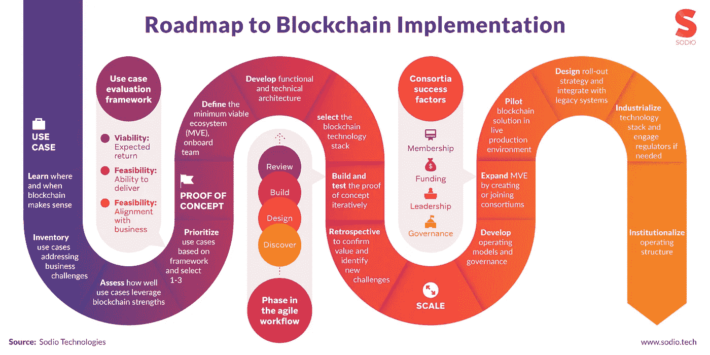
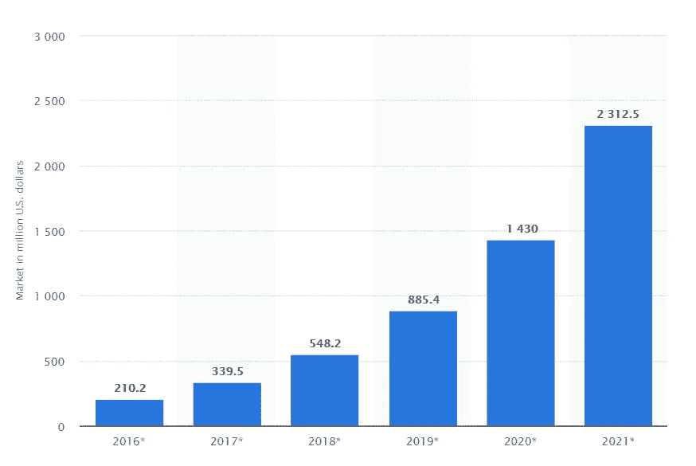
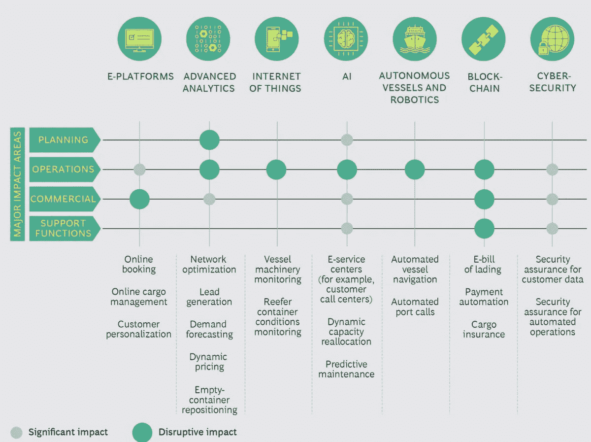
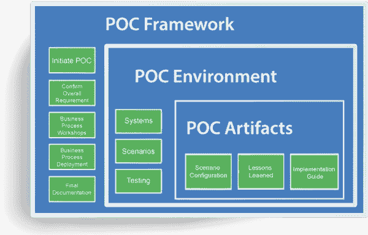

# 决策者实施区块链的终极指南

> 原文：<https://medium.com/hackernoon/the-ultimate-guide-for-decision-makers-to-blockchain-implementation-eeb989833346>

Excerpts are taken from Report by [Deloitte](https://www2.deloitte.com/insights/us/en/focus/tech-trends/2018/blockchain-integration-smart-contracts.html).

[技术](https://hackernoon.com/tagged/technology)的广阔世界已经产生了它的另一个标志性的、颠覆行业的创造:T2 区块链。每个人都在寻找区块链实施的正确方式。在过去的几年里，焦点已经从[集中转移到分散的网络](https://smallbusiness.chron.com/centralized-vs-decentralized-organizational-structure-2785.html)，组织和连锁店，而区块链对这一巨大的转变负有主要责任。

其中的关键组织和个人一直在探索区块链技术的可能使用案例，以及区块链的产品如何改变工作方式。随着时间的推移，决策者、执行官和高级官员探索区块链应用的需求不断增加。

又念: [***用于食品安全的区块链***](https://blog.sodio.tech/blockchain-for-food-safety/)

区块链的商业和组织影响力可能是独一无二的。事实证明，区块链的实施有助于一家公司脱颖而出。噪音如此之大，刚刚开始探索区块链技术使用案例的决策者经常被围绕它的宣传误导。

根据我们与政府、企业以及初创公司合作的各种区块链项目的经验:

> 随便给这项技术和它的名字打耳光不会解决任何问题。做深入的研究和执行全面的实验与严格的商业研究相结合。

因此，在这篇博客中，我们决定解释如何评估区块链用例来解决复杂问题的路线图。从区块链技术及其用例分析到为基于区块链的产品创建一个[万无一失的概念验证](https://www.techopedia.com/definition/4066/proof-of-concept-poc)，一切都将在本文中讨论。

简而言之，区块链是一个安全且带有时间戳的分类帐，其副本可供网络上的所有参与者使用。在继续讨论诸如区块链的用例或实现区块链之类的东西之前，理解关于区块链的基础知识是很有帮助的。

[密码术](https://thenextweb.com/contributors/2018/07/21/cryptography-online-shopping-cloud-tech-blockchain-bitcoin-cryptocurrency/)被广泛用于保护数据，并且新的交易被链接到以前的交易。入侵这样一个网络几乎是不可能的，因为事实上，一个人必须获得超过 51%的网络控制权。我们成功创建 [**加密货币交易所**](https://blog.sodio.tech/cryptocurrency-exchange-development-company/) 的经验告诉了我们加密技术的重要性。区块链本身就是一个令人兴奋的商业和职业机会，越来越多的公司将注意力转移到如何利用这项技术上来。

让我们来看看为什么区块链对高管和决策者如此重要。

# 为什么区块链如此重要

Get in touch with [Sodio](https://sodio.tech/contact)!

到 2025 年，预计区块链将带来 1760 亿美元的商业增加值，到 2030 年这一数字将攀升至 3.1 万亿美元。阿联酋政府也发布了一项命令，要求所有的[政府部门和公共服务产品在 2020 年之前在区块链](https://blog.sodio.tech/blockchain-in-government-and-public-services/)上。光是这些庞大的数字就足以让世界上一些最伟大的领导人和企业家刮目相看了。

这表明了关键决策者对区块链实施的重视程度，以及他们实际上正在探索区块链的使用案例。至少，区块链承诺让公司的后台运营更便宜、更安全、更容易管理，这种潜在用途可能会延伸到完全取代公司。

当与其他技术相结合时，区块链的实施可以无缝地取代整个组织。物联网、人工智能和区块链结合在一起，可能会产生一些可以完全消除的东西，例如，优步或 AirBnB 以及其他基于传统技术和流程的平台。这是因为区块链的本质是将重心从实体转移到软件。区块链在各种流程中的实施将确保它加快速度，提高效率。多亏了区块链，许多公司可能有一天会亲眼目睹自己的灭亡。

**谈到金钱或资产，**在区块链上可以很容易地创建用于创建或转移资产的对等网络。在为我们的客户开发[分散式交易开发](https://blog.sodio.tech/how-to-make-a-decentralized-cryptocurrency-exchange/)和解决方案时，我们意识到了这些 P2P 网络的潜力。这些将不会由任何中央集权的政党经营，并可以广泛用于上述点(完全取代公司)。它还可能让非流动资产变得可以交易或流动，在这些领域涌现出新的服务和机会。这就是为什么银行和金融部门期待在各种可能变得更加高效的流程中实施区块链的唯一原因。

# 实施区块链的分步骤指南

Get in touch with [Sodio](https://sodio.tech/contact)!

对于高管和高级官员来说，他们了解区块链的所有信息，以及它如何为他们的组织带来好处，这才是有意义的。了解用例、概念验证和扩展机会是有效实施区块链以使组织受益的全部工作。

让我们一步步地了解如何在任何商业组织中实施区块链。

## 1.业务用例分析

一个区块链项目的典型用例分析包括我们在这里将要讨论的几个主要步骤。快速浏览这些步骤应该能够让您大致了解如何在您的组织中开始实施区块链。

**答:了解区块链的意义所在**

区块链不是问题的全部。在一些典型的用例中，使用区块链是有意义的，比如在库存管理和供应链管理中。它不能用于一个组织工作的每一个部门或领域。在实际实施区块链之前，必须权衡将区块链纳入某个领域或功能的利弊。

**b .盘点所有用例**

一旦确定了区块链所有可能的用例，将它们整理成一个清单是很重要的，每个用例处理一个特定的业务挑战。例如，当不止一个用例解决类似的问题时，将它们归入一个单独的类别会更有意义，这将使区块链的进一步实现更加容易和更加简化。

**c .评估**

对于每个用例，都需要进行彻底的分析和评估，以确定它将给公司带来的效用。如果不能提高库存管理的效率和物品跟踪的速度，基于区块链的库存解决方案就不值得实施，不是吗？因此，根据用例为组织提供的效用来评估和评价所有用例变得至关重要。只有到那时，才能考虑进一步实施区块链技术。

**d .区分用例的优先级**

即使在评估阶段之后，也很难实现上述步骤中列出的每一个用例。确定 1-3 个用例，为组织提供最高的价值，根据区块链实施的难易程度进行排序，这将是一个理想的方法。作为决策者或高级管理人员，您应该对公司拥有的资源类型有一个大致的了解。这将有助于您确定您想要实现的区块链用例的优先级，以及实现的顺序。

# 2.构建概念证明

Get in touch with [Sodio](https://sodio.tech/contact)!

开发功能和技术架构，以及定义最小可行生态系统是区块链实施的两个最重要的步骤。将被使用的区块链技术栈将使所有的差异，它甚至可能使或打破链。

虽然，区块链的使用案例和它将发生的行业也将是一个控制因素。这里应该优先考虑要使用的系统架构，即选择最佳的技术和功能架构来满足系统和组织的需求。在此过程中，还需要决定您想要使用哪种区块链。

一旦完成了所有的工作，让一些开发人员为您的用例构建并测试概念证明。这将是你的区块链实施过程中的一个巨大的练习。无论哪种方式，精心构建和测试概念验证都是至关重要的，因为这正是赋予区块链网络独特性质的概念。

完成测试后，通常会进行回顾阶段。在这里，审查和检查整个过程，以发现在区块链用例及应用程序的概念形成过程中可能出现的任何判断错误。区块链的实施是一个漫长的过程，因此，为了确保其完整性和正确性，追溯阶段至关重要。

# 3.缩放比例

大规模实现区块链用例是一个完全不同的问题。技术栈的产业化、最小可行生态系统的扩展、联盟的创建和加入以及许多其他步骤突出了扩展区块链用例的过程。

治理系统和运营模式的开发可能是扩展过程中要执行的第一步，也是最重要的一步。不仅如此，在评估区块链的各种使用案例时，这也是一个重要因素。

紧接着，在实时生产环境中测试和试运行区块链解决方案，并将新技术与传统系统集成。后续步骤将包括正在使用的技术堆栈的产业化、监管机构的参与(如果需要的话)以及操作架构的制度化。

总而言之，用例分析、概念设计证明和扩展的三叉过程构成了任何组织中标准的区块链实现。

# 区块链商业化:决策者必须知道的事情

Get in touch with [Sodio](https://sodio.tech/contact)!

虽然文章的这一部分有足够的重要性，有一个独立的部分，我们将包括区块链本身的商业方面的简要概述。事实是，组织和企业必须将大量资源集中在商业化上。这是我们在与政府机构合作的区块链实施项目中了解到的。

涉及实现商业化的明确步骤的区块链用例更有可能在这个竞争激烈的世界中生存下来。请记住，区块链用例不需要非常特定于行业才能获得商业成功，决策者和高管还必须关注区块链的企业级商业应用，以便从这项非常有趣的技术中获得最大吞吐量。

解决整个组织独特价值问题的区块链实施更有可能成功，如果这些用例在近期或长期未来提供潜在的收入来源，那就更好了。

# 如何评估区块链用例的商业潜力？

高管可以评估每个区块链用例的一些简单因素，以评估其商业相关性。这些包括-

a.考虑组织愿景和目标的实现情况

b.对实施过程、路线图以及如何从这些用例中获得最大回报的评估

c.实现这些用例的需求——特殊技能、人员、设备，以及在哪里可以找到它们

d.与其他商业伙伴扩展和合作的潜力，可能作为一个财团的一部分

一旦你从商业因素的角度完成了对区块链实施的评估，接下来就是标准化了。

# 区块链的标准化:实施法规和标准

Get in touch with [Sodio!](https://sodio.tech/contact)

随着区块链的发展，对标准和法规的需求不断增加，至少在组织内部是如此。技术的标准化包含某些巨大的好处，如果利用得当，可以使任何组织更上一层楼。在谈论如何执行标准化过程之前，让我们看看它给个人、员工和整个组织带来的好处。

1.验证在实施阶段开发的概念证明

2.与其他组织共享企业解决方案和协作

3.通过专注于一两项技术而不是所有方面的基础知识，避免出现“万事通，一无所知”的情况

现在，高管或决策者可能会想:如果目前没有针对区块链的全球标准，他们应该等待一些标准出现，还是采取主动，自己制定标准？XYZ 组织的团队应该自己定义一些标准和规则吗？事实是，并非所有组织都具备处理这种情况的能力。

他们中的一些人很直率，在区块链或 IT 界没有那么大的影响力来执行他们自己制定的标准。在内部，高管和高级官员可能会影响他们的组织，使其朝着有助于实现组织使命和愿景的标准发展，但在更大的范围内，这带来了完全不同的挑战。

在不久的将来，如果实施某种标准，多值区块链甚至可以集成到一个链中。来自不同组织的解决方案可以组合在一起，在区块链之外形成大规模的商业产品。这个想法目前面临的问题包括不同区块链协议的不兼容性，例如以太坊和超分类帐。很难将这两种技术集成到一个单一的生态系统中，因此，多区块链集成还有很长的路要走。

# 从哪里开始？整个过程如何进行？

决策者和执行者对整个商业化过程的简要概述已经在前面的章节中讨论过了。在这里，我们试图概述一个循序渐进，明确的程序遵循，以实施区块链在规模和商业水平。

你的公司真的需要区块链吗？

如前所述，区块链并不能解决所有问题。研究和分析区块链是否真的适合你的生态系统可能是实现这项技术最重要的一步。了解区块链能在多大程度上让您的组织受益是很重要的。

**b .决定一个单一的用例，并朝着这个用例努力**

当你意识到某个区块链用例对你的组织最有益时，你要全身心地投入其中。通往区块链商业化的道路通常包括坚持某个你认为有可能颠覆整个行业的用例的决心。

**c .制定规章制度以供遵循**

当多方聚集在一起在区块链上工作，并且形成了联合体时，总有一天会需要规则和规章。最好让所有实体都知道并认识到他们的角色和职责，并遵循所有设定的标准和法规。明确定义的流程和规则只会有助于所有相关实体的进一步发展。

**d .雇用优秀人才在区块链工作**

作为一名高管，你有责任确保你的组织拥有业内最优秀的人才。区块链仍然是一个新概念，因此，到目前为止，该行业的许多人才还没有被公司抢购。这是一个出击的时机，让业内一些最优秀的人才为你工作。

不折不扣地遵循这些步骤，您很快就会拥有一个强大的、商业的区块链用例，为您的公司带来奇迹。

还有你的疑惑吗？请继续阅读一些著名的区块链商业项目，它们一定会给你带来灵感。

[总账 ](https://www.hyperledger.org/)

Hyperledger 是一个旨在使用区块链进行支付的交易平台，它已经迅速成为最受欢迎的区块链平台之一。它运行在 IBM cloud 中，以其可伸缩性而闻名。

[**R3**](https://www.r3.com/)

区块链爱好者一定听说过 Corda，这是 R3 在区块链的主要项目。这是该行业引入的第一批分布式分类帐程序之一。R3 专注于政府认可，已迅速成为所有区块链机构的热门选择，尤其是金融机构。

总而言之，作为决策者和高级官员，了解区块链及其商业实施可以为组织带来丰厚的回报。本文中讨论的潜在用例、标准化、商业化和其他过程提供了整个过程的概述。如果你作为一个决策者正在寻求在你的组织中实施区块链，现在是时候行动了。

# 希望实现区块链？我们谈谈吧！

我们的用例分析流程和进行广泛的业务研究，以定制基于区块链的强大且可扩展的解决方案，这一流程已得到广泛认可。无论是安全问题还是架构问题，Sodio 都尽可能做到最好。像我们说的那样？给我们一些掌声！

> 与我们联系:
> 
> 电子邮件:contact@sodio.tech
> 
> 推特: [Sodiotech](https://twitter.com/sodiotech)
> 
> 网站:[索迪欧科技](https://sodio.tech)