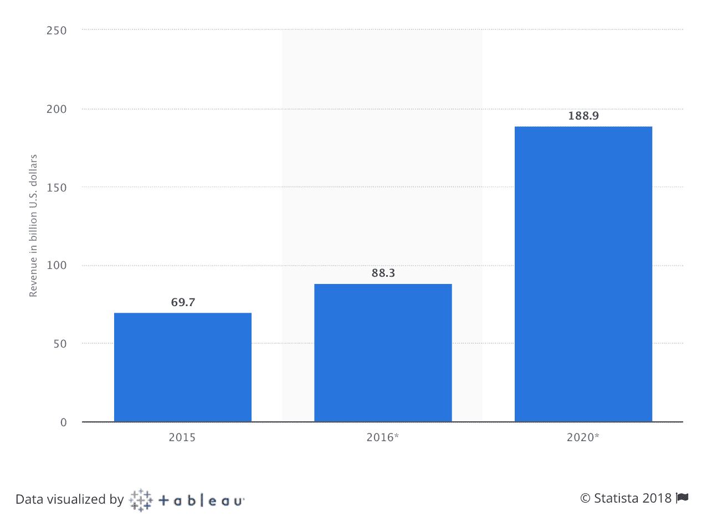
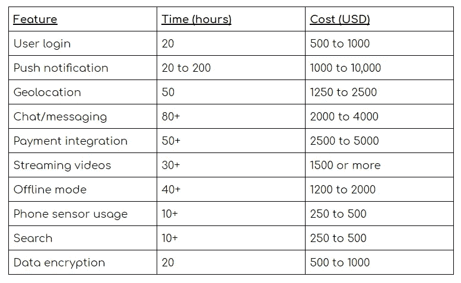
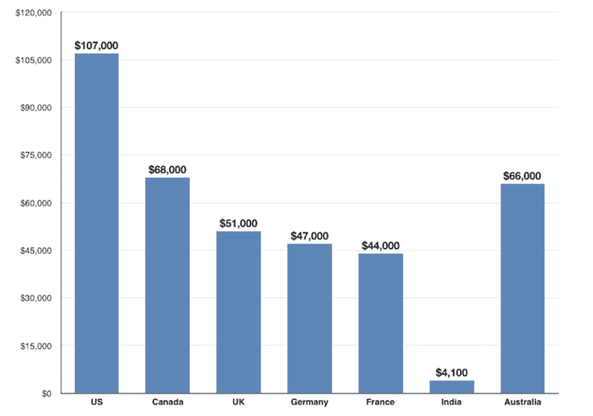
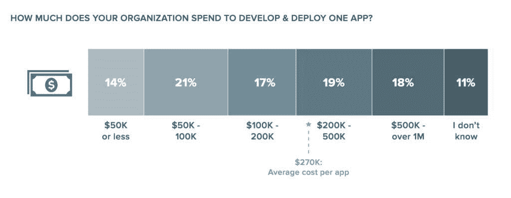
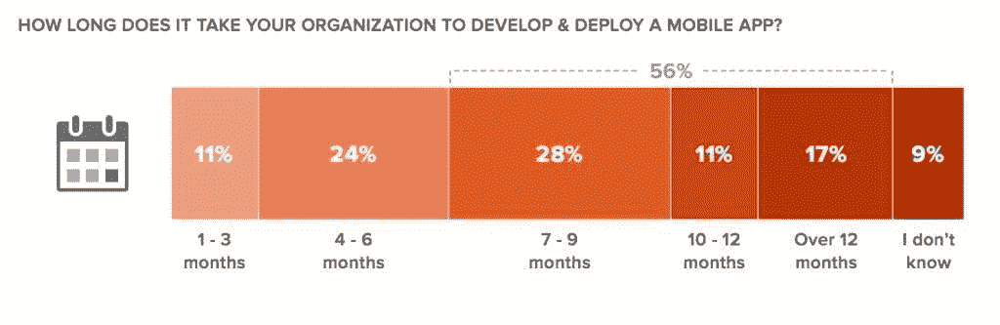

# 终极指南:2018 年开发一个手机 App 要多少钱

> 原文：<https://medium.com/hackernoon/the-ultimate-guide-how-much-does-it-cost-to-develop-a-mobile-app-in-2018-f529a59c432>

如果你正计划拥有一款专为你的企业设计的移动应用，这篇文章就是为你准备的！

很自然地，你会问的第一个也是最重要的问题是——开发一个应用程序要花多少钱？这篇文章将提出当前市场上流行的真实和实际的数字。

如果你想把你的业务转化为移动应用，你已经领先于很多企业了。移动应用行业正在爆炸式增长，你可以抓住很多机会。这个行业创造的收入数额确实令人吃惊。2015 年，全球移动应用收入达 697 亿美元。从这个行业的蓬勃发展来看，预计到 2020 年，收入将达到 1889 亿美元！

Source: Statista.com

为你的企业提供一个移动应用程序是一个让资金流入的黄金机会。很有可能，你投入到手机应用程序开发中的所有金钱和时间；他们都会有回报的。

随着科技之风席卷全球，千禧一代更愿意尝试新事物(多亏了 FOMO)。仅 2017 年，就已经有 1970 亿次 app 下载！

有了这些数据，任何一个甚至没有考虑为他们的生意买一个应用程序的人可能最终会改变主意！

在 2018 年，为你的企业打造一款定制应用一点也不困难。你很快就能赶上市场趋势。关键问题:“我需要花多少钱才能得到一个移动应用程序”没有明确的答案。然而，**的范围是:0 到百万美元！**

这真的取决于你愿意花多少钱，你期望什么样的应用程序，你希望你的应用程序执行得有多好，你获得了什么样的人才，人才来自哪里，你希望添加什么功能，你希望多快启动应用程序等等。

## 首先:如何以 0 美元获得一个应用程序

你们中的许多人可能会惊讶地发现，你可以用微不足道的价格买到它。如果你希望以这种方式进行应用程序开发，你将不得不自己做所有的事情。对一些人来说，这听起来像是一个挑战，对其他人来说，这可能是小菜一碟。

**以下是以“几乎为零”的成本开发手机应用的不同方法:**

*   **自己码出来！:**

***小心的话！*** *只有你对技术有一手，那就去做吧。否则，它可能会导致严重的永无止境的挫折。*

互联网上有很多好的资源可以教你如何开始移动应用开发。多个教育网站保证你从零开始成为英雄！如果你有时间、精力、激情；这很可能是继续下去的最佳方式。会很有趣，你会学到很多东西。你甚至可以通过为别人制作应用程序来赚钱！

*   **使用自定义应用构建器:**

绝对没有前期成本，也不需要上述任何专业技术。通过“几乎为零”或零月费，你可以从头开始构建自己的应用程序。一些著名的应用程序开发商有 Appy Pie、Shoutem 和 Swiftic。

如果你有预算并且需要大量的专业知识来付诸行动，那么对你来说最好的选择就是把工作外包出去:找专家！目的是组建一个专家团队。典型的移动开发团队有以下角色:

*   **企业架构师:**将移动应用的业务能力和技术功能联系起来。
*   **项目经理:**监督整个手机应用的开发
*   **UI/UX 设计师:**有责任为手机应用增加美感和流畅的用户体验。
*   **软件开发工程师:**编写应用程序。
*   **QA 工程师:**测试工程师生成的代码的质量。

在一个团队中，一个人可以有多个角色，或者多个人负责一个角色。这取决于要构建的应用程序的复杂性。一些简单的应用程序可能只需要 100 个小时来构建，而一些应用程序甚至可能需要 1000 多个小时来构建。

为了决定移动应用的复杂性和成本，必须考虑多个参数。(这不是一个详尽的清单。从一个企业到另一个企业，可能会有更多的隐性成本。)比如:

1.  要构建的应用程序的类型
2.  要使用的平台
3.  应用程序的类型
4.  应用程序中的功能
5.  后天的天赋
6.  杂项成本分析

让我们逐一查看每个参数，深入了解与移动应用程序开发相关的成本。

## 复杂性取决于要构建的应用程序的类型

一个应用程序可以有三种类型，每一种描述不同的复杂程度:

1.  **Web app** :简单来说就是一个网站的移动版。包含网络应用所有其他功能的核心功能是“手机友好性”。大多数用户期望的不仅仅是 web 应用，因为与本地应用相比，它的功能有限，性能较低。这些是最不复杂的。
2.  **原生应用**:在用户体验和性能方面追求极致完美的大型应用会使用原生应用。这些都是为特定的操作系统，如 iOS，Android，Windows。这些应用程序能够直接与智能手机的硬件(如相机、GPS 等)进行通信。这些可以从应用商店下载。这些是最复杂的，因此也是最昂贵的。(*本文将介绍如何构建一个本地应用的成本。)*
3.  **混合/跨平台应用**:这些最适合从一开始就接近大量受众。这些都是结合使用 web 和本地技术构建的。在这种情况下，开发和维护成本低。但就功能而言，它们不如原生应用，因为它们对智能手机硬件的访问有限。尽管如此，他们可以顺利运行在所有操作系统，如 iOS，Android，Windows。

## 成本取决于使用的平台

当今最突出的平台是:Android 和 iOS。Android 在南美/非洲/亚洲更受欢迎。iOS 在美国/欧洲更受欢迎。

iOS 应用程序可以比 Android 应用程序构建得更快。与 iOS 相比，Android 应用程序需要多花 2 到 3 倍的时间。因此，开发 iOS 应用程序的成本低于 Android。这也是为什么大多数商家首先推出 iOS 应用程序来检查用户的反应。如果是积极的，只有这样，企业才会投资开发同样的 Android 应用程序。

对于 Android 应用程序，成本范围如下:

*   **基础应用:**$ 25000 到$ 35000
*   **标准应用:**$ 45000 到$ 55000
*   **复杂应用:** $55，000 到$100，000
*   **高科技应用:**7.5 万美元到 15 万美元

iOS 应用程序(适用于苹果设备)的预计成本如下:

*   **简单的基于表格的应用:** $1，000 到$4，000
*   **数据库应用:** $8，000 到$50，000
*   **游戏:** $1 万到$25 万

## 基于应用类型的成本

根据应用程序的动态性质，可以将应用程序分为以下几类:

*   **基于表格:**这些是简单的应用程序，核心功能是显示一组数据。用户可以浏览收藏，应用程序可以根据用户的选择向用户提供新信息。这种应用程序实际上没有任何功能，开发这种应用程序所花的时间非常少。通常，这样一个应用程序的价格在 1000 美元甚至 4000 美元以内。
*   **基于数据库:**这些应用比基于表格的应用领先一步。这类应用程序预计会通过从大型数据集中提取数据来操纵数据。这些数据库必须与应用程序/网站连接，以保持数据的一致性。检索信息，更新信息，操作信息是复杂的，这就是为什么更多的时间花在开发基于数据库的应用程序。这种应用的例子可以是字典、百科全书。这些建筑的造价在 8000 美元到 50000 美元之间。
*   **动态:**这些应用将基于数据库的应用推向了新的高度。这些应用程序不仅需要数据库连接，还需要集成第三方 API 来获取或发布信息。例如，使用 Instagram API 获取图像或 Messenger API 创建脸书聊天机器人。这些都是昂贵的应用程序，可能从 10，000 美元开始，到 50，000 美元或更多。
*   **依赖固件/硬件的应用:**这类应用旨在充分利用智能手机的硬件。硬件特征的例子可以是:GPS、照相机、时钟、手电筒。这些应用程序制作起来并不困难。一个依赖于固件/硬件的基本应用程序可以在 10，000 美元内构建。
*   游戏:这些是最难制作的应用程序。他们可能会使用上述所有应用程序的功能和附加功能，如增强现实、虚拟现实、3D 图形。一个基本的赛车游戏可能需要 125，000 美元才能完成。

## 成本取决于应用中的特性

手机应用程序可以添加大量的功能。让我们把基本小时价格定为 25 美元，最高小时价格定为 50 美元。一些特征可以是:

## 人才成本

这是应用程序开发中最关键的部分。来自世界各地的人收取不同数额的钱来开发应用程序。下图总结了不同国家应用程序开发人员的年薪。

Source: indeed.com

可见人才在美国最贵，在印度最便宜。一般来说，在北美每小时的费用是 150 美元左右，在印度是 11 美元。计算移动应用程序总成本的简单公式如下:

***成本=功能×时间×小时费率***

克隆一个 WhatsApp 这样的应用，可能需要 1500 个小时左右。在印度，可能需要 16500 美元左右。同样的应用程序在北美售价约为 225000 美元。这种差异确实令人震惊。

你可以联系大大小小的应用代理来外包你的应用，或者你可以联系内部或远程的自由职业者来完成工作。选择很多。

## 杂项成本分析

开发应用程序后发生的成本可以称为杂项成本。例如:维护应用程序的成本。**一个 app 的平均维护成本大约是每年开发成本的 20%。**例如，如果您的应用程序开发成本为 100，000 美元，您可以估计应用程序维护每年将花费您大约 20，000 美元。附加功能可能会推高应用维护的成本。与维护相关的其他成本包括:

1.  主办；主持
2.  监视
3.  参与和营销
4.  应用程序更新
5.  执照

一个应用程序可能还有其他隐性成本，如版权、专利等。这些实际上取决于你的应用创意的新颖性。

在进一步开发之前，必须考虑所有这些成本。为了方便，市面上有各种 app 开发成本计算器。一个简单的表格必须填写，征求有关应用程序的基本信息，如复杂性，功能，平台。根据不同的领域，一个粗略的估计，它粉笔了算法。受欢迎的有:

1.  评估我的应用
2.  生火
3.  做一个 App 多少钱
4.  Otreva 计算器
5.  Imason 计算器
6.  金维计算器

## 最终想法

根据 Kinvey 的报告，企业可能会花费 27 万美元来开发一个应用程序。

就时间而言，对大多数企业来说，整个过程通常需要一年左右。

就这样，我们结束了我们的向导。我们希望它能帮助你认识到你的商业应用创意的成本。

*[*丹羽宇一郎*](https://www.linkedin.com/in/niharika-singh-86b31213a/)*