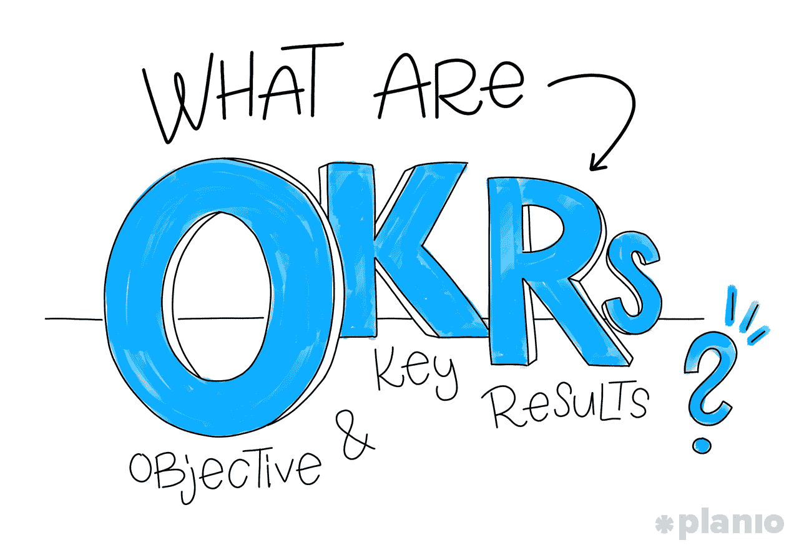
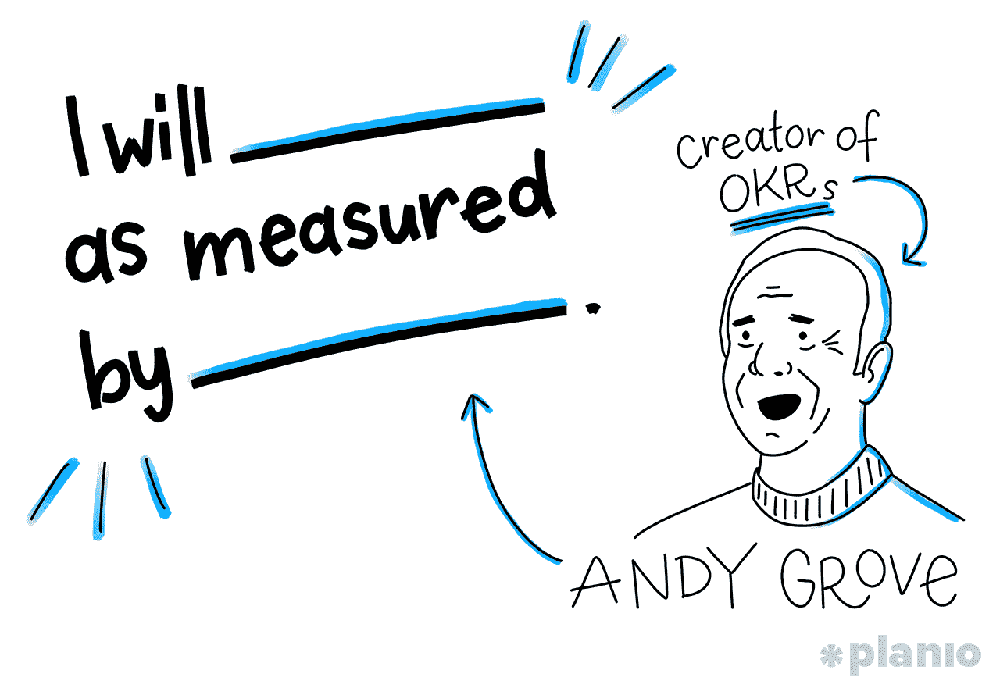
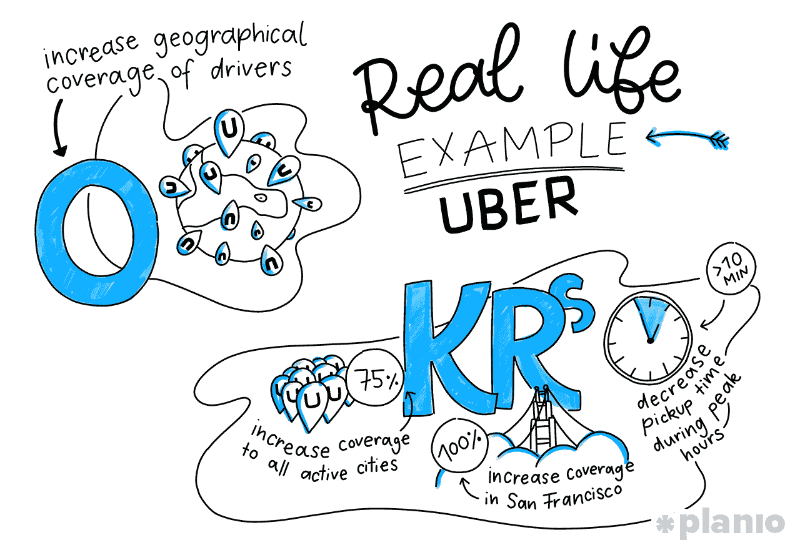
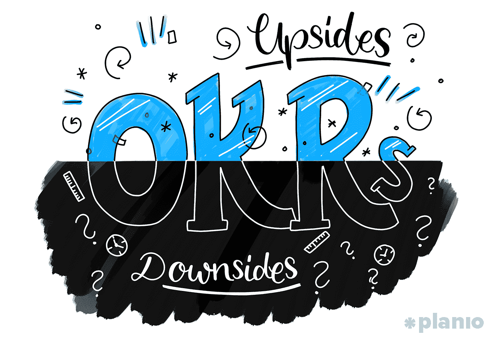

# 定义、编写和实现 okr 的终极指南

> 原文：<https://medium.com/hackernoon/the-ultimate-guide-to-defining-writing-and-implementing-okrs-3b2671e7b01a>

## 如何利用目标和关键结果来规划(和实现)你的公司目标

谷歌是如何从 40 名员工发展到 88，000 名员工，全球收入超过 1000 亿美元的？当然，他们的杀手级产品、无处不在的搜索引擎和云服务发挥了巨大作用。但是他们也有一个不那么秘密的秘密武器:OKRs。

目标和关键结果(OKRs)由传奇的英特尔首席执行官安迪·格罗夫首次开发，是一个协作式目标设定系统，于 1999 年被谷歌采用。从那以后，OKRs 不仅帮助谷歌(和无数其他公司)快速制造产品，还保持专注、参与，并与他们的公司目标保持一致。

OKRs 将你的公司战略转化为一种易于理解的方式，让每个团队成员都知道他们在做正确的事情。

更好的是，okr 非常简单。至少理论上是这样。

在实践中，如果你想在业务中最大限度地利用 okr，你需要注意一些最佳实践和陷阱。

所以，如果你厌倦了到达终点线却发现自己朝着错误的目标努力，厌倦了每天的工作没有进展，想要让你的团队更加符合公司的目标和战略，okr 适合你。

在本指南中，我们将带您了解关于 OKRs 的所有信息。从它们到底是什么，到清晰的例子，写作技巧，以及如何在你的公司实现它们。听起来不错吧？让我们开始吧。

***这篇文章的一个版本首先出现在 Planio 博客上。Planio 是一个强大的项目管理工具，让您的团队保持正轨。*** [***在这里注册 30 天免费试用***](https://plan.io/task-management/) ***。***

# okr 是什么？

顾名思义，okr 由两个不同的部分组成:

1.  目标:你想完成什么
2.  **主要结果:**你将如何衡量你工作的成功

听起来很简单，对吧？就其本身而言，目标和关键结果是易于理解的概念。但是当你把它们放在一起时，奇迹就发生了。为了阐明我们正在谈论的，让我们讲一个小故事:

早在谷歌早期，风险投资家约翰·杜尔登拜访了公司位于山景城的总部，谈论了他们的未来。

多尔之前曾在英特尔(OKRs 的创始人)的安迪·格罗夫手下工作，在英特尔从内存公司转型为微处理器公司时加入。对任何公司来说，转型都不是一件小事。但是像英特尔这么大的公司？为了让他们所有的团队在经历这些变化时保持一致，Grove 提出了 OKRs 的想法，他用一个简单的公式描述了这个想法:

> 我将按照 _________ 的标准 _ _ _ _ _ _ _ _ _ _。

正是这个公式让英特尔在成功改变商业模式的过程中保持了克制。这也是多尔想要展示给谷歌创始团队的东西。

如果你仔细想想，一个合适的目标不仅仅是你想要达到的目标的陈述，而是你如何达到目标的路线图。格罗夫公式中的“衡量标准”使目标成为目标(否则你只是有一个愿望)。

这个公式是描述 OKR 的最佳方式:

> 我将以(关键结果)作为衡量标准(目标)。

在这种情况下，我们可以将 OKR 各部分的定义扩展为:

1.  目标:令人难忘的、定性的描述，描述你想在给定的时间框架内(比如每季度)完成的事情。目标应该是雄心勃勃的，感觉有些不舒服。它们还应该简短、鼓舞人心、公开，这样每个人都知道其他人在做什么。
2.  **主要结果:**一组 2-5 个衡量您实现目标进度的指标。它们应该描述一个结果，而不是一个活动(例如，它们不应该包括像“帮助”、“咨询”或“分析”这样的词)。一旦它们都完成了，目标就必然实现了。

正如多尔所描述的，OKRs 的力量在于每个季度都有一颗“北极星”,通过它你可以设定你的优先事项。以及能够看到它如何符合其他人的目标和优先事项:

> “看到 Andy 的 okr、我的经理的 okr 以及我的同事的 okr，对我来说是难以置信的强大。我很快就能把我的工作和公司的目标直接联系起来。我把我的 okr 钉在我的办公室里，每个季度都写新的 okr，从那以后这个系统一直伴随着我。”

OKR 不是简单地成为你清单上的另一个任务，而是一个雄心勃勃的目标，由你需要采取的具体行动来支持。正如谷歌在他们的 [re:Work 博客](https://rework.withgoogle.com/guides/set-goals-with-okrs/steps/introduction/)上解释的那样，关键结果应该*基于数字*并且容易用数字评分(他们使用 0-1 的标度), OKR 成功的“甜蜜点”大约是 60-70%。

> 如果有人一直完全达到他们的目标，他们的 okr 不够雄心勃勃，他们需要想得更大。

当以这种方式使用时，okr 使团队能够专注于大的想法，并完成比他们认为可能的更多的事情。所有这些都没有通常对“错过”目标的后果的恐惧。

有目的地设定你认为你不会达到的目标可能看起来很奇怪。但是当目标远大时，即使失败的目标也会带来实质性的进步。这就是写一篇好的 OKR 背后的细微差别和技巧变得显而易见的地方。

# 好的 OKR 的例子是什么？

那么这一切在实践中会是什么样子呢？在继续之前，让我们通过一个 OKR 的例子来巩固我们对其基本原理的理解。

比方说，你的企业，像许多其他企业一样，依赖于提供比竞争对手更好的客户体验。

因此，你的季度目标可能是“创造卓越的客户体验”。但是你怎么知道你成功了呢？

你需要某种形式的测量来使这个 OKR 成为你可以努力实现的目标。但是，什么能表明你正在创造一种“棒极了”的客户体验呢？

首先，你可以看看你的 NPS，或净推广分数(一种可以衡量人们对你的品牌的看法的工具)，以及你的客户流失率(你一个月失去多少客户)。

一次很棒的经历意味着人们会说你的好话，并留下来。

听起来不错？但这不是故事的全部。

在我们开始之前，让我们考虑一下这些关键结果。通过说我们想提高我们的 NPS 分数*和*降低流失率，听起来我们愿意尽一切努力让我们的客户满意。但是要经营一个可持续发展的企业，我们需要控制成本。这就是为什么我们应该添加第三个关于成本的关键结果作为对策。

所以，OKR 看起来会像:

**目标:**创造卓越的客户体验

**主要结果:**

1.  将净推介值从 X 提高到 Y
2.  将每月流失率降至 X%
3.  将客户获取成本保持在 X 美元以下

现在，我们有了一个与公司战略目标一致的宏伟目标和少量可衡量的关键结果，这些结果将告诉我们是否在做正确的事情来实现目标。

在工作期结束时(通常是一个季度)，你的 OKRs 提供了一个参考，说明你做得有多好，你在哪里取得了成功，以及你未来需要更多关注的地方。

# 现实生活中的例子:优步的 OKRs

这是前谷歌员工 Niket Desai 分享的另一个 OKR 的例子[，他解释了优步如何利用 OKRs 来实现他们的最终公司目标，即成为世界上最容易获得的拼车服务:](/startup-tools/okrs-5afdc298bc28)

**目标 1:** 增加优步系统的驱动力

**主要结果:**

1.  将每个地区的驾驶员基数增加 20%
2.  将所有活跃地区的驾驶员平均课时增加到 26 小时/周

**目标 2:** 扩大驾驶员的地理覆盖范围

**主要结果:**

1.  将旧金山的覆盖率提高到 100%
2.  将所有活跃城市的覆盖率提高到 75%
3.  将接车时间减少到<10min in any coverage area during peak hours

Solving how to meet these OKRs is up to the team. But as Desai shows in this example, a good OKR helps align them with company strategy *和*会给他们一个非常清晰的路线图，告诉他们如何到达那里。

# 撰写好的 okr 的最佳实践

上面的例子应该能让你很好的了解如何写好 okr。但是，如果您在自己的业务中尝试使用它们时仍不确定，这里有几个问题可供您参考:

**OKR 是否符合我公司的主要业务战略和目标？**一旦组织知道它关注的是什么，以及它将如何衡量成功，单个团队成员就更容易将他们的项目与公司目标联系起来。

**公司的每个人都支持这个目标吗？一旦每个人都认同什么是最重要的目标，对不太重要的想法说不就变得更容易了。对于 OKRs 来说，说不不是政治或情感上的争论。它成为对整个组织已经做出的承诺的理性回应。**

OKR 适应性强且灵活吗？okr 雄心勃勃，因为他们想为试验和成长留下空间。如果你过于执着于单一的成功之路，你可能会限制团队的创造力，错失良机。记住，要确保你的关键结果具有足够的适应性和灵活性，能够以多种方式完成。

它有明确的截止日期吗？okr 可以令人难以置信地激励人。只要他们有严格的时间框架。设定一个严格的截止日期，然后每周、每月或每季度检查一次进展情况(只要对你的团队和你的沟通方式有用)。)

**你的关键成果是可衡量的和基于进展的吗？**能不能给你想看的结果打上一个数值？如果没有，你就没有一个好的关键结果。

**是否有抱负？**你的 OKR 让你的团队兴奋吗？你能让他们产生一个“登月计划”的想法吗？在这个想法中，即使移动一点指针也可以被视为成功。对于 OKRs，目标不是总是达到 100%。确保你在现实的范围内推动你的团队。

如果你的 okr 没有勾选所有的方框，你可能想在点击“go”之前花更多的时间和他们在一起。花更多的时间预先设计出最好的 okr 总是值得的，而不是让人们走上错误的道路。

okr 是一个强大的工具。但它们不是设定目标的灵丹妙药。

每种方法都有其优点和缺点，okr 也不例外。OKRs 的与众不同之处在于，它们不仅仅是设定目标的一种方式。

okr 从最高层向下传达战略和优先事项给每个团队成员。

他们允许团队领导将团队推向正确的方向，同时给他们约束以确保完成工作。它们不仅是移动指针的绝佳工具，也是聚焦、优先化和清晰沟通的绝佳工具(这些是当今大多数企业面临的最大问题！)除此之外，okr 在许多其他方面也很特别:

*   它们很简单:okr 很容易理解，让日常工作变得更容易，因为每个人都知道他们在朝着什么方向努力。它们帮助你减少设定目标所花的时间，这样你就可以更多地致力于实现目标(而不是分析目标)。
*   **他们很敏捷:**通过在短周期内工作并有明确的目标，OKRs 让你衡量你正在做的工作，看看它与公司范围的目标相比如何，并定期调整你的方法。
*   **他们带来了一定程度的透明:**正如我们刚才所说，okr 是一种沟通形式。在谷歌，从首席执行官开始，所有的 okr 都是公开的，这意味着你可以随时看到你周围的人是如何帮助公司的事业的。
*   他们帮助员工找到意义和目标:研究表明，在工作中感受到联系和目标会让我们更快乐、更有效率、更有工作动力。通过向你的团队展示他们所做的工作是如何与公司的目标联系在一起的，你帮助他们找到了前进的目标。
*   **他们是战略和战术之间的纽带:**而不是有一个崇高的公司使命，却无法知道你是否会实现。OKRs 让你选择有助于你整体目标的战术目标。

然而，在采用 okr 之前，您也应该了解一些潜在的缺点:

*   **你需要知道你的公司正在走向何方:**正如安迪·格罗夫在*高产出管理中所写的:*“绝对的真理是，如果你不知道你想要什么，你就不会得到它。”okr 帮助你快速前进，如果你没有给人们指出正确的方向，或者你的团队没有团结一致，他们会带来伤害而不是好处。
*   **你需要花时间来计划合适的 okr:**仅仅因为 okr*可以*简单，并不意味着它们很容易。团队领导和创始人都很忙。你在招聘，制定战略，灭火。但是 OKRs 的成功取决于投入适当的时间来计划和制定它们应该是什么样的战略。
*   你需要很好地理解如何衡量成功:这个“M”字又出现了。如果你不知道成功是什么样子，也不知道正确的衡量标准来告诉你是否达到了成功，那么尝试使用 OKRs 就没有意义。

归根结底，当你有一个清晰的战略，知道公司的发展方向时，OKRs 就能很好地工作。

就像任何目标设定练习一样，你对最终目的地了解得越多，你就越有可能到达那里。

# 如何为您的公司采用 OKRs

将 okr 引入你的公司不仅仅是复制像谷歌这样的公司使用它们的方式。谷歌不是一般的公司，他们花了近 20 年的时间来发展、扩大和试验他们内部的目标设定结构。正因为如此，他们使用 OKRs 的方式将会与你完全不同。

这是因为在本质上，OKR 不是一种方法论。把它带到你的工作场所没有固定的路径或步骤。相反，它是您应该理解并为您的团队定制的一套实践和理想。

但是，如果您想开始尝试 okr，您应该遵循一些最佳实践:

# 从小处着手，不断重复

据 OKR 教练[菲利佩·卡斯楚](http://felipecastro.com/en/blog/okr-journey-guide-adoption/)所说，当你收养 OKR 时，理解你所做的权衡是很重要的。这意味着从小处着手，当你了解它在你的公司中是如何工作的时候，进行迭代可能是一个好主意。

在[谷歌自己的介绍 okr 的指南](https://rework.withgoogle.com/guides/set-goals-with-okrs/steps/bring-OKRs-to-your-organization/)中，他们建议从基础开始:

*   **什么是 okr？向你的团队解释 okr 的基本原理以及它们是如何工作的。**
*   **为什么要用 OKRs？**回顾你目前设定目标的方法，以及你在这个方法中遇到的任何限制或问题。这是一个突出 OKRs 如何将每个人的工作与公司的目的和使命联系起来的好时机。
*   **OKRs 是如何工作的？**解释你的 OKR 周期的时间线(最好从较短的开始。大约 30-45 天。)对每个人的期望。主要的里程碑是什么。以及成功是什么样子的。记住，你不是每次都 100%的努力。让你的团队接受 60-70%完全没问题可能需要一些时间。

# 注重沟通和优先排序

okr 最重要的一点是它们是公开的。这对团队来说并不总是一件容易的事情。然而，明确在哪里可以看到其他人在做什么，他们在追求什么指标是采用 OKRs 的重要部分。

让每个人都达成共识。 [**同**](https://plan.io/) **。**

正如前谷歌员工、前 Twitter 首席执行官[迪克·科斯特罗解释的那样](https://www.youtube.com/watch?v=T963AGt-nWI#t=11m52s):

> *“当你发展一家公司时，最难扩展的就是沟通。这非常困难。okr 是确保每个人都明白你将如何衡量成功和战略的好方法。”*

# 利用定期检查来保持纪律

因为 OKRs 的[敏捷](https://plan.io/blog/ultimate-guide-to-implementing-agile-project-management-and-scrum/)本质，设定并坚持定期签到是很重要的。这不仅仅意味着在 OKR 周期的开始和结束。您可能希望设定一个节奏，包括:

*   **OKR 计划会议:**召集一小组人一起工作，计划并讨论下一个周期的目标和关键结果。
*   **每周检查:**团队级别的[会议](https://plan.io/blog/planning-and-running-fast-efficient-meetings/)关注战术更新，以确保每个人都在正确的优先事项上工作，不会被阻止。
*   **季度中期/周期回顾:**快速回顾以重新评估 OKR，添加或删除关键结果或调整目标，并为解决低于目标的 okr 制定行动计划。
*   **全体会议:**全公司范围的会议，你可以在会上交流和重申你的战略和目标，以确保每个人都保持一致和兴奋。

***通过我们免费的*** [***快速高效开会指南***](https://plan.io/blog/planning-and-running-fast-efficient-meetings/) ***，学习如何召开不会耗尽团队精力的会议。***

# 在你的整个公司准备好之前，不要全押在 OKRs 上

改变是艰难的。把 okr 丢给整个团队可能不是一个好主意。相反，选择水平或垂直整合它们:

*   **横向:**从一个团队开始，每个周期或季度增加额外的团队。
*   **纵向:**从公司 OKRs 和高级管理层开始，然后在每个周期或季度下增加新的层级。

# 团队在 okr 上最常犯的错误

你的公司如何处理 OKR 将是独一无二的。你添加的越多，和他们一起工作的越多，你就能更好地协调你的团队和衡量结果。然而，在您采用 okr 的早期阶段，您应该注意一些常见的陷阱:

# 沟通不当的“延伸目标”

在谷歌，okr 被用来追求延伸目标。或者，他们不一定认为自己能达到的目标。虽然这是激励你的团队寻找独特和创新的解决方案的绝佳方式，但如果沟通不当，可能会导致一些严重的问题。

一旦 okr 被多个团队采用，你需要非常清楚其他团队的目标设定理念。如果你的项目的一部分取决于另一个团队的目标，确保你知道他们是否最有可能以他们宣称的 OKR 的 95%或 65%交付给你一些东西。

# “一切照旧”OKRs

如果你目前的目标设定哲学是对你所追求的保持保守，这不会与 OKRs 相一致。为了测试这一点，查看您的团队当前的工作以及请求的项目，并根据价值和所需的努力对它们进行排序。如果你选择的 okr 有除了最重要的任务之外的事情，你应该放弃它们，重新分配资源。

当然，有一些目标会在每个周期保持不变(尤其是在维护或保养方面)。只要目标是高优先级的*并带来商业价值*，这是可以的。但是，始终要确保你的关键成果推动团队发展，并寻找新的方法来提高效率。

# “沙袋”

如果一个团队持续达到他们的 okr 而没有使用他们所有的带宽，他们可能囤积资源或者没有推动他们的团队(或者两者都有)。这可能会打击追求挑战目标的其他团队的士气。确保你有一个一致的、全公司的哲学，围绕着目标应该有多难以及成功是什么样子。

# 目标没有足够的关键结果(即缺乏清晰度)

我们怎么说都不为过，OKR 秘制酱是如何被测量的。如果某个目标的关键结果不能代表完全实现该目标所需的一切，那么你就没有为团队的成功做好准备。在计划阶段花些时间来准确确定成功实现该目标所需的条件。

你设定目标的方式很能说明你的公司。你关心的是如何度过这一天吗？或者你在考虑 10 年后的事情？

有了 OKRs，你可以两者兼得。OKRs 不仅能帮助你传达构建谷歌和推特这样的庞然大物的大愿景。他们还确保每个人在日常工作和灭火时步调一致。

但是他们需要工作。正如约翰·杜尔登在 [*连线*](https://www.wired.com/story/when-john-doerr-brought-a-gift-to-googles-founders/) 中所写:

> “okr 不是银弹。它们不能代替正确的判断、强有力的领导或创造性的工作场所文化。但如果这些基本要素都具备，OKRs 可以引导你到达山顶。”

如果你的公司在错误的方向上发展，不管它发展得多快。但是，如果你提前做好工作，调整你的战略和愿景，OKRs 可以成为你超越目标所需的超级燃料。

# 嘿，我是乔里！

*我帮助公司和有趣的人通过聪明和专注的写作讲述他们的故事。想一起工作吗？在 hello@jorymackay.com 给我发邮件*

*这篇文章的一个版本最初发表在* [*Planio 博客*](https://plan.io/blog/what-are-okrs/) *上。查看更多关于项目管理、建立远程团队和创业成功的文章和实用技巧。*