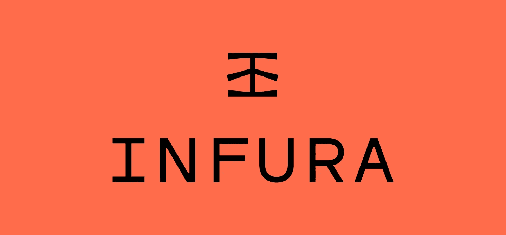

# 以太坊开发者工具终极指南

> 原文：<https://medium.com/hackernoon/the-ultimate-guide-to-ethereum-developer-tools-7feb53f9d953>


Photo by [shotbycerqueira](https://unsplash.com/photos/0o_GEzyargo?utm_source=unsplash&utm_medium=referral&utm_content=creditCopyText)

# 介绍

如果您是一名软件工程师，希望开始在以太坊区块链上进行开发，那么一开始就要理解目前可用的所有工具和技术可能会非常困难。

从分散的浏览器和钱包，到诸如 Truffle、Ganache、Infura、Parity 和 Geth 等术语，这些都可能非常令人困惑，并阻碍你刚刚开始的区块链学习之旅。

所以我决定编写一个指南，列出领先的软件工具和软件包，并给你一个每个功能的简要概述。

希望这将有助于您更好地了解以太坊生态系统，以及所有部分是如何结合在一起的，同时最终为您提供一个跳跃的起点，让您开始加速学习这项迷人的新技术的旅程！

## 可靠性(编程语言)

[https://solidity.readthedocs.io/en/develop/](https://solidity.readthedocs.io/en/develop/)


Solidity 是用来编写在以太坊区块链上运行的智能合约的最流行的编程语言。这是一种高级语言，编译后会被转换成 EVM(以太坊虚拟机)字节码。这与 Java 生态系统非常相似，在 Java 生态系统中，Scala、Groovy、Clojure、JRuby 等语言在编译时都会生成在 JVM (Java 虚拟机)中运行的字节码。

## 可靠性编译器

【https://github.com/ethereum/solc-js 号


Solidity 代码可能被设计成看起来像 javascript，[，但是你仍然必须编译它](https://i.imgflip.com/1k3ffi.jpg)。Solc 是您从智能契约语言 solidity 到以太坊字节码的翻译器，甚至可以在命令行上运行，用于快速任务和快速开发验证。

## Remix(基于浏览器的 IDE)

[http://remix.ethereum.org/](http://remix.ethereum.org/)

这对于调试来说非常好，并且为您提供了一个选项，让您可以在浏览器中直接浏览合同，这非常有帮助。你应该使用 remix 直到你的 dApp 编译没有错误。通过浏览器与区块链实例交互，remix 有 3 个选项

1.  您可以使用 Javascript 虚拟机(JVM)，
2.  注入的 web3 实例(例如 chrome 扩展元掩码)，
3.  连接到 web3 提供者(比如 [Infura](https://infura.io/) )。

当你开始的时候，JVM 是你要走的路。它更宽容，它忽略气体限制，给你一个无限量的乙醚玩 5 个帐户之间，它是更快的调试。


Screenshot of remix in the browser

## Mist(分散浏览器)

[https://github.com/ethereum/mist/releases](https://github.com/ethereum/mist/releases)

这是一个用于-app(分散式 web 应用程序)的浏览器。就像 Chrome 或 Firefox 一样，但针对 Dapps。它仍然不是完全安全的，所以你不应该把它和不可信的 dapps 一起使用。


## 以太坊钱包(Mist 的特定版本)

https://wallet.ethereum.org/

**这是 Mist** 的一个版本，但是只能打开**一个单独的 dapp -** 以太坊钱包。 **Mist 和以太坊钱包只是 UI 前端**所以我们仍然需要一个核心将我们连接到以太坊区块链(它可能是真正的以太坊区块链，或测试版)。您可以使用 Mist 创建钱包、存储以太网、发送交易、部署合同等等。您可以使用本机应用程序在区块链或 testnet 上玩一玩。对快速交易非常有用。


## 元掩码(浏览器插件)

[https://metamask.io/](https://metamask.io/)


如果你正在开发一个你确实想让人们使用的应用，那么**元掩码**支持是必须的。你可以把 MetaMask 想象成一个桥梁，它允许你通过使用一个扩展(无需运行一个完整的以太坊节点)在今天的浏览器中访问明天的分布式 web。

它在 Chrome、Firefox、Opera 和 Brave 中可用，让用户安全地管理他们的以太坊账户和私钥，并使用这些账户与使用 Web3.js 的网站进行交互(见下文)。

一旦你安装了它，那么你的浏览器现在可以与任何与以太坊区块链交流的网站互动了！**注意** : Metamask 使用 Infura 的服务器作为 web3 提供商，但它也给用户选择他们自己的提供商的选项。

## Web3.js

[https://github.com/ethereum/web3.js/](https://github.com/ethereum/web3.js/)


**web 3 . js 是什么？**

Web3.js 是一个用来与区块链互动的界面。这是一个 javascript 库，可用于从基于 web 的 DApp 与以太坊节点进行交互。请记住，网络上的每个节点都包含一份区块链。当您想要调用智能合约上的函数时，您需要查询这些节点中的一个，并告诉它智能合约的地址和您想要调用的函数。

以太坊节点只会说一种叫做 ***JSON-RPC*** 的语言，不太可读。幸运的是，Web3.js 隐藏了这些讨厌的查询，并为您提供了一个更熟悉的 javascript 界面，例如:

```
MyTeam.methods.createRandomPerson("Vitalik Nakamoto").send({ from: "0xb60e8dd61c5d32be8058bb8eb970870f07233155", gas: "3000000" })
```

**首先开始在你的项目中包含 Web3 简化版 JavaScript:**你可以使用例如 `npm install web3\.` 将 Web3.js 添加到你的项目中，或者你可以简单地从 [github](https://github.com/ethereum/web3.js/blob/1.0/dist/web3.min.js) 下载简化版的`.js`文件并将其包含在你的项目中:

`<script language="javascript" type="text/javascript" src="web3.min.js"></script>`

**接下来，让 it 使用 Web3 提供商与区块链对话:**

> 在 Web3.js 中设置 Web3 Provider 告诉我们的代码**我们应该与哪个节点**对话来处理我们的读写。这有点像在传统的 web 应用程序中为 API 调用设置远程 web 服务器的 URL。

您可以作为提供者托管自己的以太坊节点。然而，有一个第三方服务让你的生活更轻松，所以你不需要维护自己的以太坊节点— ***Infura*** 。

## Infura ( **基础设施即服务**)

[https://infura.io/](https://infura.io/)



Scalable Blockchain Infrastructure

**一款 IaaS 产品(来自 Consensys)，为开发者提供一套工具，将他们的应用连接到以太坊网络和其他分散平台**。 [Metamask](http://metamask.io/) ， [CryptoKitties](http://cryptokitties.co/) ， [UJO](http://ujomusic.com/) ，[uPort](http://uport.me/)——都利用 Infura 的 API 将其应用程序连接到以太坊网络。它提供了处理短期峰值和长期扩展解决方案所需的基础架构。它包括一个易于使用的 API 和开发工具，以提供对以太坊和 IPFS 的安全、可靠和可伸缩的访问。

您可以设置 Web3 使用 Infura 作为您的 web3 提供者，简单如下:

```
var web3 = new Web3(new Web3.providers.WebsocketProvider("wss://mainnet.infura.io/ws"));
```

## 格思(戈朗-以太坊)

[https://github.com/ethereum/go-ethereum](https://github.com/ethereum/go-ethereum)


Geth 是[以太坊基金会](http://ethereum.org/)提供的官方客户端软件。它是用 Go 编程语言编写的。**是将您连接到区块链的核心应用程序。它也可以开始一个新的地方或测试区块链，创建一个合同，矿醚，等等。就是**主以太坊命令行客户端**。**

它是以太网(主网、测试网或专用网)的入口点，能够作为**完整节点**(默认)存档节点(保留所有历史状态)或**轻型节点**(实时检索数据)运行。

它可以被其他进程用作通过暴露在 **HTTP、WebSocket 和/或 IPC 传输之上的 JSON RPC 端点**进入以太网的**网关。Geth 可以做 Mist 能做的任何事情，加上一些重要的功能，比如作为 RPC 端点通过 http 连接到区块链。它有 3 个值得理解的主要组成部分:**

**A. Geth 客户端守护进程—** 它连接到网络中的其他客户端(节点)并下载区块链的副本。它将不断与其他节点通信，以保持其区块链副本的最新状态。它还能够挖掘块并将事务添加到区块链，验证块中的事务，并执行事务。

**B. Geth 控制台—** 这是一个命令行工具，允许您连接到正在运行的节点并执行各种操作，如创建和管理帐户、查询区块链、签署事务并将其提交给区块链等。

**C. Mist Browser —** 正如我们之前看到的，这是一个用于与您的节点通信的桌面应用程序。使用 geth 控制台可以做的任何事情都可以通过这个图形用户界面来完成。

## 块菌框架

[https://github.com/ConsenSys/truffle](https://github.com/ConsenSys/truffle)


就像你有用于 web 应用开发的框架，比如 Ruby on Rails、Python/Django 等等，Truffle 是用于开发 dapps 的最流行的框架。它抽象出了在区块链上编译和部署合同的许多复杂性。

Truffle 是提供快速创建、编译、部署和测试区块链应用程序的构建块的黄金标准。是区块链使用以太坊虚拟机(EVM) **的**开发环境、测试框架和资产管道**。换句话说，它帮助你开发智能合同，发布它们，测试它们，等等。**

有了松露，你会得到:

*   内置智能合同编译、链接和部署。
*   快速开发的自动化合同测试。
*   可扩展的部署框架。
*   部署到任意数量的公共和私有网络。
*   使用 EthPM & NPM 进行包装管理。
*   用于直接合同通信的交互式控制台。
*   可配置的构建管道。

块菌有一个内置的个人区块链，可用于测试。

该区块链位于您的系统本地，不与以太坊主网络交互。您可以创建这个区块链，并使用命令 **truffle develop 与之交互。**这将会在港口当地催生一个区块链

## ganache(Test RPC)——个人测试区块链

[https://truffleframework.com/ganache](https://truffleframework.com/ganache)


在测试区块链中测试你的代码——由于写入区块链需要成本，所以在测试区块链支出测试以太中测试你的智能合约是个好主意。

虽然 Truffle Develop 是一个一体化的个人区块链和控制台，但你也可以使用桌面应用程序 [Ganache](https://truffleframework.com/ganache) 来启动你的个人区块链。对于那些不熟悉以太坊和区块链的人来说，Ganache 可能是一个更容易理解的工具，因为它预先显示了更多的信息。唯一需要的额外步骤是编辑 Truffle 配置文件以指向 Ganache 实例。


Ganache 可用于 Windows、Mac 和 Linux。以前它被称为 TestRPC，但是在集成到 Truffle 套件中后被重新命名。

## 奇偶校验(用 Rust 编写的客户端)

[https://github.com/paritytech/parity](https://github.com/paritytech/parity)


**Parity 是用低级语言 Rust 编写的以太坊客户端。**

它是一个非官方客户，由一家名为 [Parity Inc](https://parity.io/) 的公司维护。该客户端由以太坊的前首席技术官 Gavin Wood 博士创建，是一种快速、轻量级的以太坊节点运行方式。奇偶校验是 Geth 的一大升级。它是从头开始写的，强调效率。所有重要的逻辑都经过了 100%的单元测试，所有的公共 API 都有文档记录，所有的代码都经过了多方评审。

## Open Zeppelin(编写安全的智能合同)

[https://github.com/OpenZeppelin/zeppelin-solidity](https://github.com/OpenZeppelin/zeppelin-solidity)


当你写一份持有他人资金的智能合同时，你希望确保它是安全的。Zeppelin 是编写安全合同的库。当你已经在和松露一起工作的时候，特别容易。

## IPFS(行星间文件系统)

【https://ipfs.io/】

IPFS 是一个分散的存储系统。它与以太坊没有直接关系，但可以与以太坊集成。你可以在这里了解 Swarm 和 IPFS 的异同:[https://github.com/ethersphere/go-ethereum/wiki/IPFS-&-Swarm](https://github.com/ethersphere/go-ethereum/wiki/IPFS-&-SWARM)。

**TLDR:** IPFS 在代码成熟度、可伸缩性、采用、社区参与和与专门的开发者社区的互动方面走得更远。


# 底线

我希望您喜欢这篇介绍当今可用于创建 DApps 和与以太坊区块链交互的最佳开发工具的文章。

在下一篇文章中，我们将设置必要的工具和环境，**将开始我们使用 Solidity** 在以太坊中编码的旅程，继续你从 Web 开发人员**到 Web 3.0 区块链工程师**的道路。

与此同时，你可以前往[**【www.optimizme.com】**](http://optimizme.com/)**并注册我们正在构建的测试平台，以帮助利用加速学习的力量来提升新经济的技能。**

****

**The OptmizMe Platform**