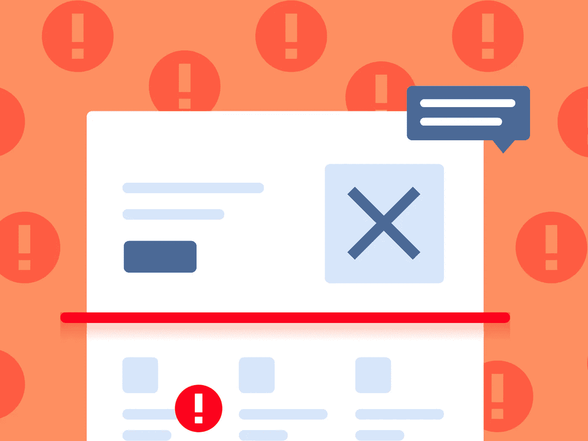
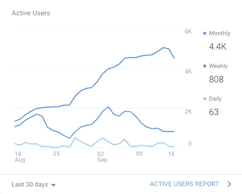
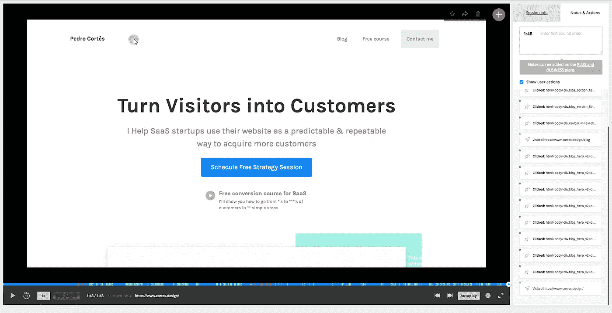
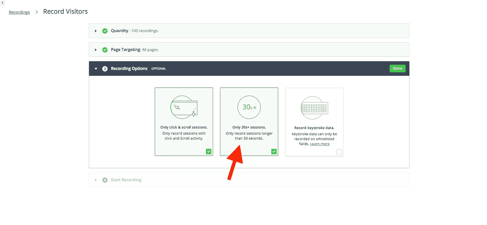

# 确定您的登录页面无法转换的原因的终极指南

> 原文：<https://medium.com/hackernoon/the-ultimate-guide-to-identify-why-your-landing-page-is-not-converting-cbd623a73217>

准确地确定你的页面发生了什么是非常困难的，需要几个月的反复，但前提是你没有一个合适的过程！

如果你知道如何始终如一地发现问题和/或需要改进的地方，让你的网站转化得更多，这并不困难。

优化是一个持续的过程，它总是需要一些尝试来使你的网站发挥最大的作用。

在这篇文章中，我将向你展示我是如何在短短几个小时内发现一个网站的所有问题和增长机会，从而为需要几周时间进行的大型网站重新设计奠定基础。

# 但是首先…转化率不重要！！

每次你搜索任何关于如何通过你的网站获得更多客户的资源(文章、视频、书籍),他们都在谈论转换率以及为什么你应该提高转换率。

但是转化率有那么重要吗？

我所做的就是为 SaaS 的初创公司优化网站，我可以告诉你他们不是！

转换率应该只是网站如何转化的一个小基准，并不能告诉你完整的故事，让我告诉你为什么。

# 比较转换率

你可能已经看过很多文章，说“你的页面转化率至少应该是 X %”，“一般的 SaaS(电子商务等)网站转化率是 X”。

这完全是胡扯！

你唯一的基准应该是你的网站目前的表现如何，以及你想在多大程度上改进它。

不同的市场、不同的解决方案、不同的收入模式、不同的 CTA 和成百上千的其他因素都会影响你的转化率，所以不要再比较了！

例如，高接触 B2B 初创公司在纸面上总是有糟糕的转化率(除非他们使用非常有针对性的付费流量)，因为他们需要潜在客户做出比免费试用或免费增值低接触模式更大的承诺，但有更高的客户 LTV，仍然可以产生大量收入。

这就像用别人的身体尺寸来寻找完美的衣服一样…

# 转换率可能不是最好的衡量标准

大多数时候，您的流量行为并不像您预期的那样是线性的，因此很难准确跟踪他们在做什么，这是为什么:

*   一些人到达你的主页，一些人通过博客文章，一些人通过搜索，其他人通过推荐…你认为这些人将能够通过相同的漏斗，并会有相同的转化倾向吗？没有。
*   让一个页面转换得非常好可能只会把问题带到漏斗的下一步，你不会获得你想要的那么多客户。

重要的是…

一个可预测的系统，你知道如果你给你的页面发送 X 个访问者，你将能够获得 X 个客户，你只需要加倍你的营销渠道(我这里有一个免费的视频课程)。

如果你能花 100 美元的广告获得 200 美元的收入，转换率重要吗？不…

# 一个永不说谎的 SaaS 换算标准！

如果你转化了很多人~ 30%以上的免费试用或演示，那是因为你的产品很棒，人们真的想得到它，但他们肯定不明白你提供的价值，否则他们会更快转化。

这是一个显而易见的迹象，你需要改进网站和漏斗的顶部，以吸引更多的潜在客户进行演示或免费试用，因为你知道，**一旦他们出现在那里，你就能转化他们中的很大一部分！**

# 我为什么要解释这一切？

我只想创造现实的期望！

你不能认为你的网站是几个可以转换的神奇页面，而是一个有几个步骤的系统/漏斗，你可以在未来测试和改进。

如果没有这种观点，我给你的建议就不会有效果，因为你只会提高一个转化率，而在某个地方制造一个瓶颈。 **‍**

**下面是我找出一个页面不能转换的原因的过程。**

# 步骤 1:设置谷歌分析

希望你已经有了这个集成，我们有一些数据可以看。

我不太喜欢谷歌分析，因为它对用户不友好，而且比需要的要复杂一些，但是如果你使用这个过程，它实际上非常有用！

Example from my own website

‍ **看看你的访客数量……**

*   它们有统计学意义吗？你一个月至少有几百个人吗？
*   流量从哪里来？你是网页的理想客户还是来自 Reddit、PH 等网站的随机访客？

设定目标，这样我们就可以有一个基准，看看我们是否增加了任何性能指标。

# 以下是一些需要注意的事项:

**跳出率:**又名有多少人没有查看更多页面就离开了你的网站？这可以给你一个指示，如果你链接你的网页是正确的，那么人们可以了解更多关于你的产品。

如果付费流量(假设你的目标是正确的)或搜索流量(人们已经在搜索像你这样的解决方案)的跳出率高达 70+%,很可能你需要优化一些东西。

来自 Reddit、Product Hunt、Indie Hackers、Medium、Twitter 等在线社区的推荐流量也有望获得较高的跳出率，因为它们的流量更加广泛，人们并不真正了解你的产品是做什么的，或者有正确的预期。

如果你做了大量的内容营销，有大量的访问者浏览了你的博客，你也会有很高的跳出率，所以你很可能需要一个策略来将流量发送到主页、销售线索磁铁或演示，这样你就可以抓住这些销售线索了！ [‍](https://www.cortes.design/post/optimizing-for-traffic-temperature-in-saas-landing-pages)

[这里有一篇关于如何管理流量差异的文章](https://www.cortes.design/post/optimizing-for-traffic-temperature-in-saas-landing-pages)。 **‍**

 [## 优化 SaaS 登陆页面的交通温度

### 这些人对你的产品、你的公司或者你如何解决他们的问题一无所知，而你可以…

www.cortes.design](https://www.cortes.design/post/optimizing-for-traffic-temperature-in-saas-landing-pages) 

**登录页面- >注册 CR:** 如果很少有人点击进入注册页面(或你的主 CTA 所指向的任何页面)，那么很有可能人们不明白他们为什么应该注册，你的[登录页面](https://hackernoon.com/tagged/landing-page)需要一些调整。[这里有一个简短的视频](https://www.cortes.design/funnelvideo),介绍替代 CTA 为什么非常重要。

 [## 如何使用登录页面产生可预测的收入

### 在这个短视频中，我将向您展示如何使用登录页面和一个简单的漏斗来生成可预测的金额…

www.cortes.design](https://www.cortes.design/funnelvideo) 

如果你有几个 CTA，比如免费试用、演示、文章、销售线索磁铁来吸引更多的人，但最终你仍然没有转化，这一点尤其明显。

如果有很多人进入你的注册漏斗，但只有不到 10-30%的人注册(取决于有多大)，那么你的注册过程一定有问题。它可能太大，要求错误的输入，太慢等等……**‍**

**登录页面- >“更多信息”页面 CR:** 如果人们没有访问您的登录页面，这是您没有正确解释您所提供的价值的另一个明显迹象！

如果人们有些兴趣，但还没有准备好立即转化，他们会查看更多信息，如专题页面、推荐/案例研究或常见问题。

如果他们检查更多的页面，而你的转化率仍然不高，这很可能是因为他们感兴趣，但有一些重要的反对意见让他们不想尝试。询问您的现有客户了解他们转换的原因是了解他们可能需要哪些额外信息的好方法。我在这里有一个完整的指南。 **‍**

 [## 使用此过程来确定哪条消息将使您的 SaaS 登录页面转换最多！

### 在这篇文章中，我将向你展示我开发的过程，使我能够把 4-5 页的功能列表，针对 160+…

www.cortes.design](https://www.cortes.design/post/use-this-process-to-identify-which-message-will-make-your-saas-landing-page-convert-the-most) 

**页面平均停留时间:**如果人们了解你的登陆页面，这通常是一个比跳出率更可靠的指标(它可以根据流量来源波动很大)。

如果人们花在你网站上的时间少于 2 分钟，这是一个很好的信号，说明你还没有兴趣注册。

如果他们停留的时间不超过 1 分钟(平均时间)，那么你的页面一定会非常混乱和令人沮丧，这可能意味着你需要一个大的改变。

如果你在页面上的平均时间超过 2 分钟左右，而你仍然没有转换，这应该是一些小事情让你的访问者感到困惑，一些小的调整可以增加你的转换。 **‍**

最常访问的页面:这可以让你很好地了解人们最感兴趣的是什么，以及你可以在哪里进行调整以进行更多转换。

例如，如果你有很多人从一个登录页面转到一个功能页面，这可能是因为他们没有找到他们需要尝试你的产品的核心优势/原因。测试哪些功能或优势应该保留在登录页面上，哪些应该保留在页面上可以帮助你做到这一点。

‍ **很明显，如果你做了大量的内容营销**来获得线索(像我一样),你访问量最大的页面中很大一部分将来自文章。在这种情况下，重点是你能让多少人从一篇博文转向某种选择加入页面或解释你的产品如何帮助他们的页面。如果你能以任何方式让人们从一个博客变成一个领导者，那么内容营销将毫无用处！

# 第二步实际观察你的访客

有时候数字很难解释，甚至不能说明全部情况。

找出问题所在但不知道如何解决它仍然不会让你有任何进展！

这就是为什么我总是推荐访客记录来填补谷歌分析中潜在的巨大信息缺口。

有几个工具可以做到这一点，但最有价值的肯定是 Hotjar！除了录音，他们还有大约 6-7 种其他工具值得自己花钱购买。

最棒的是，如果你一天的访问量少于 2000 次，它就是 100%免费的；)

# 如何使用 Hotjar 从访问者那里获得洞察力

使用 Hotjar 从我自己的网站录制

## 第一步:安装[热罐](http://www.hotjar.com/)。

它只需要一个快速注册的形式，并复制和粘贴在您的网站标题代码的 JS 代码。

## 第 2 步:设置录像

它只记录 100 人的时间，你将不得不重新激活记录，一旦你过去了他们，但 100 个记录是一个坚实的数字，以获得一些参考。 **‍**

**专业建议#1:** 不要浪费你的时间去观看那些立即反弹的人的录像，因为这通常与流量质量比你的页面更有关系。不管你怎么努力，你都无法改变这些人，所以只记录 30 秒以上的访问。

‍
**专业技巧#2:** 首先，记录整个网站，一旦你知道一些页面表现良好，就开始将记录限制在特定的页面，慢慢地将范围缩小到最差的页面，这样你就能准确地知道哪些页面需要修复。

## 第 3 步关注正确的指标

您已经从 Google Analytics 获得了一些见解，所以让我们将它们与您将从访客记录中获得的见解结合起来使用。

让我们把重点放在能让您获得 80%改进的 20%的指标上:

*   人们在哪里(部分或页面)花的时间最多？
*   人们点击最多的地方是哪里？
*   人们在哪里/什么时候离开？
*   这是你预期或计划的行为吗？

# 第三步-优先考虑你需要改变的事情

找出所有问题后，是时候集思广益解决它们了。

相对于你投入的时间，并不是所有的问题都能给你足够的回报，所以我们需要分清主次！

你需要做的是:

1.  列出所有阻碍你转化更多的问题。
2.  针对每个问题，列出 2-3 个可能的解决方案。
3.  定义哪些解决方案可以带来最大的回报。
4.  根据你修复它们的速度和信心来给它们打分。

# 第 4 步——是时候改变/改进了！

不同的问题会导致不同的解决方案，下面你可以找到一个免费资源列表，你可以用它来帮助你执行这些。

# 🎁根据您的问题，这里有一个资源列表！

如果你不知道如何识别能说服潜在客户并转化最多的信息，[我这里有一个指南](https://www.cortes.design/post/use-this-process-to-identify-which-message-will-make-your-saas-landing-page-convert-the-most)。

 [## 使用此过程来确定哪条消息将使您的 SaaS 登录页面转换最多！

### 在这篇文章中，我将向你展示我开发的过程，使我能够把 4-5 页的功能列表，针对 160+…

www.cortes.design](https://www.cortes.design/post/use-this-process-to-identify-which-message-will-make-your-saas-landing-page-convert-the-most) 

如果你发现了问题，需要一个好的登陆页面，[这里有一个完整的转换驱动页面指南](https://www.cortes.design/post/how-to-make-a-conversion-driven-saas-landing-page-2018-edition)。

 [## 如何做一个转化驱动的 SaaS 登陆页[2018 版]

### 转换驱动的登录页面是最大化你的营销努力和创造一个可预测的…

www.cortes.design](https://www.cortes.design/post/how-to-make-a-conversion-driven-saas-landing-page-2018-edition) 

如果你在整合整个页面时遇到问题[，这里有一个理想的 SaaS 登陆页面的逐步分解。](https://www.cortes.design/post/breaking-down) ‍

 [## 打破旨在获取更多线索的 SaaS 登录页面

### 在这篇文章中，我将向你展示我是如何设计一个概念页面来捕捉线索的，在这种情况下，它是…

www.cortes.design](https://www.cortes.design/post/breaking-down) 

如果你没有一个可预测的方法将访客转化为顾客，你就需要一个合适的漏斗！[这里有一个视频](https://www.cortes.design/funnel-video)，是我分解为客户设计的漏斗

 [## 将访客转化为顾客的渠道

### 在这个短视频中，我将向您展示如何使用登录页面和一个简单的漏斗来生成可预测的金额…

www.cortes.design](https://www.cortes.design/funnel-video) 

如果你想要我的终极 5 步指南为你的网站带来可预测的收入，这里有一个 100%免费的视频课程

# 想用你的网站转化大量的客户吗？

安排一次免费电话，了解你目前的情况，以及我们如何将你的网站变成一种可预测的获取客户的方式。

**在免费的策略会议之后，你会明白:**

*   为什么你没有把足够多的人转化为顾客。
*   你需要改进什么来使你的网站获得大规模的销售线索。
*   找出对你来说最好的解决方案，不管你最终是否和我一起工作(我们也会讨论是否合适)。

> ***我们聊聊吧！*** [*在此安排您的免费策略课程*](http://www.cortes.design/consultation)

*原载于*[*www . cortes . design*](https://www.cortes.design/post/the-ultimate-guide-to-identify-why-your-landing-page-is-not-converting)*。*