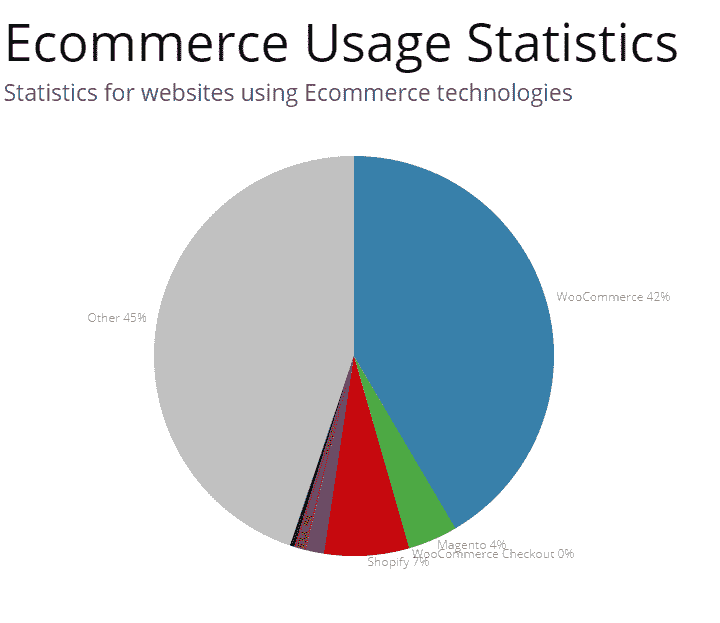
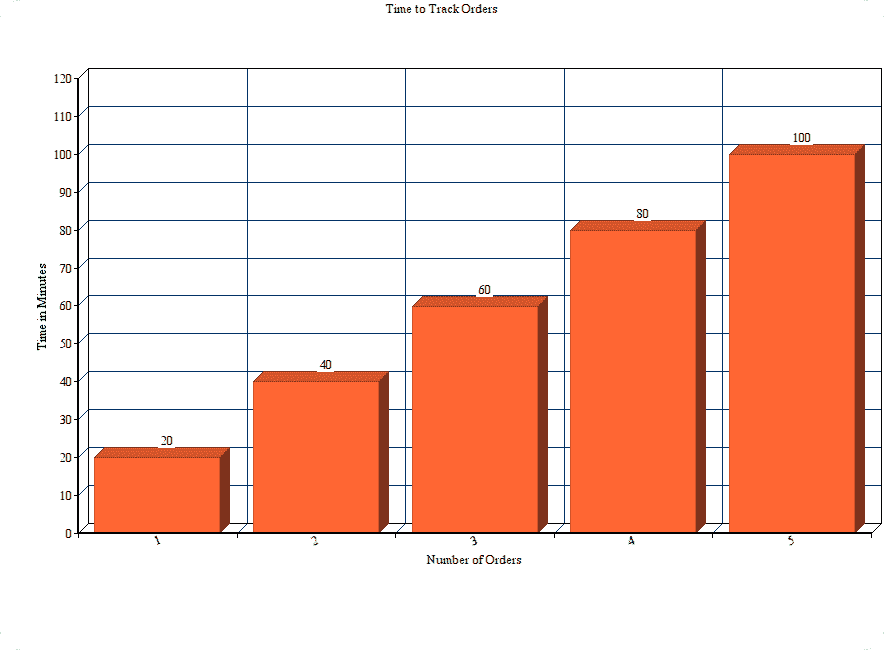
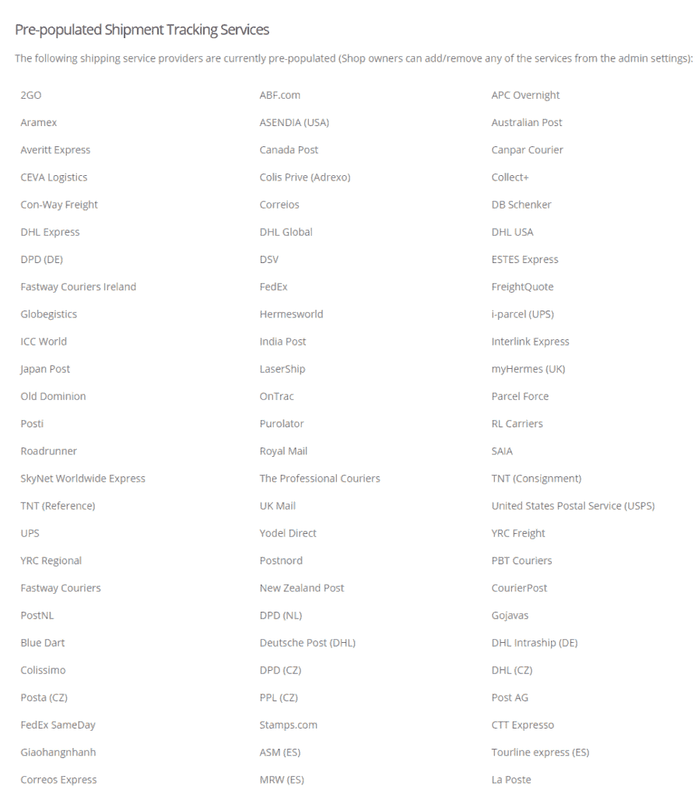
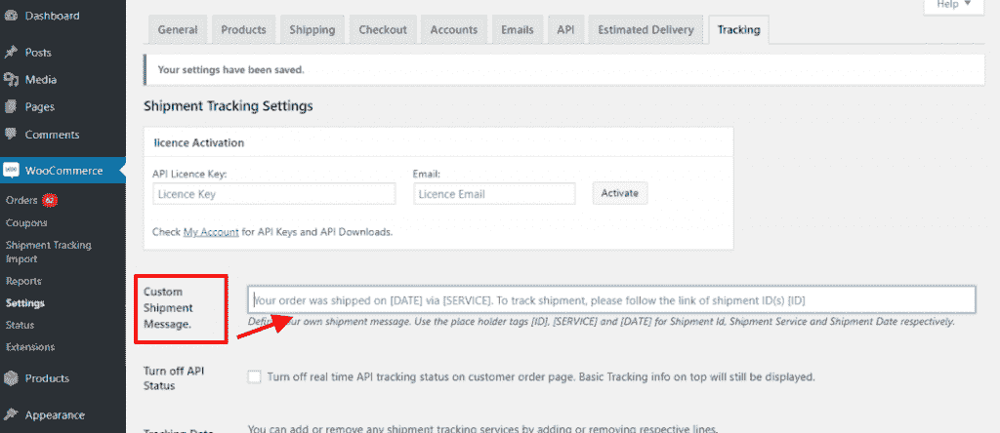
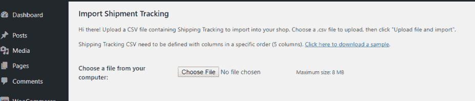
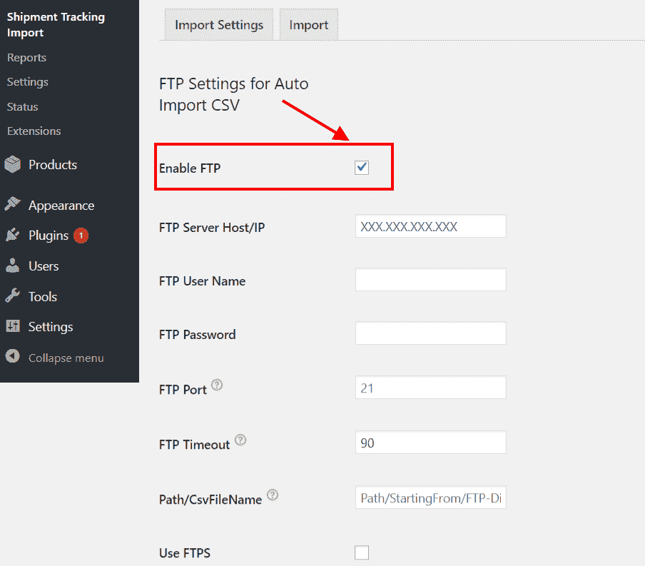
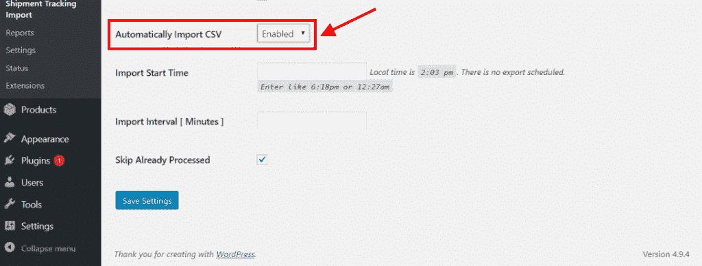

# WooCommerce 订单跟踪终极指南

> 原文：<https://medium.com/hackernoon/the-ultimate-guide-to-woocommerce-order-tracking-85bc32e4f2e2>

**互联** —描述当今世界的最佳方式。有了如此多的方式与世界各地的几乎任何人联系，它极大地推动了在线业务的发展。因此，人们在网上做生意时感觉更舒服。此外，像 WordPress/WooCommerce 这样的平台也值得称赞，因为它使每个人都更容易成为当今电子商务的一部分。像 [**WooCommerce 预订和预约**](https://www.pluginhive.com/product/woocommerce-booking-and-appointments/) 和 [**WooCommerce 发货跟踪 Pro**](https://www.pluginhive.com/product/woocommerce-shipment-tracking-pro/) 这样的插件已经被证明是许多企业主的福音。

本指南的目标读者是那些花时间与顾客打交道并帮助他们跟踪订单的 WooCommerce 店主。有了这个指南的帮助，[追踪 WooCommerce 订单](https://www.pluginhive.com/product/woocommerce-shipment-tracking-pro/)将不再是一件累人又耗时的任务。我们将探索将手头的任务自动化的可能性，并确保下次您的客户需要货件跟踪时，它将在瞬间完成。

对于所有的 WooCommerce 店主和那些计划在不久的将来成为其中一员的人来说，随着你进一步阅读，拥有一个自动化的[订单跟踪](https://www.pluginhive.com/product/woocommerce-shipment-tracking-pro/)机制的想法会更加清晰。本指南旨在回答所有的“ ***如何做和什么*** ”的问题，以便于理解拥有一个专用的订单跟踪解决方案对企业主是多么重要。

# 订单跟踪真的是一个大问题吗..？

让我们以 WooCommerce 为例。就基于 WooCommerce 的网站数量而言，WooCommerce 是一个巨大的平台。根据与 共建的 [**， **WooCommerce 为互联网上 47%的电子商务网站供电。下图显示 WooCommerce 遥遥领先于所有其他平台。****](https://trends.builtwith.com/shop)

E-commerce Usage Statistics

有了这么多的网站，将会有数以百万计的客户接受这些网站的服务。此外，还有一些最好的运输公司，如 UPS、USPS、FedEx、DHL 等。跟踪每个客户的订单会耗费大量的时间和精力。在追踪您通过 UPS 运输的订单时，需要执行以下步骤。

*   **通过搜索客户姓名或电子邮件 ID 获取订单详情。**
*   **查找该订单的跟踪编号。**
*   **访问官方** [**UPS 追踪链接**](https://www.pluginhive.com/product/woocommerce-ups-shipping-plugin-with-print-label/) **页面。**
*   **手动输入跟踪 ID。**
*   **获取官方追踪详情**
*   **通过电子邮件向客户发送跟踪详情。**

基于上述过程，我们可以很容易地得出以下几点。

*   **单个订单的这一过程可能需要 20 分钟。**
*   **在跟踪包裹时，无法执行任何其他任务。**
*   **对于中等规模的企业，需要一名专门的支持代表来执行这项任务。**
*   如果有多个订单，这项任务的时间和工作量将会成倍增加。
*   **这种方式适用于单个运输承运人。对于使用多家运输公司的企业来说，时间、精力和成本会更多。**

Time taken to track orders increases exponentially

> *您真的应该关注订单跟踪并向客户提供跟踪细节吗..？嗯，肯定是的..！*

该指南旨在为企业主找到最佳解决方案，以便轻松跟踪他们的货件，并为他们的客户提供跟踪详情。但在此之前，让我们看看什么是无缝订单跟踪的理想解决方案。

# 适合您企业的理想订单跟踪解决方案

任何企业，无论是线上还是线下，都有着与企业成功直接相关的相似的基本方面。在任何问题的情况下，找到问题的解决方案需要对这些方面进行大量的考虑。在寻找理想的订单跟踪解决方案时，必须考虑以下因素。

# 节省时间的事物

Save Time Save Money

时间就是金钱。在线业务，就像其他业务一样，需要专门的时间。这段时间必须用来探索有成效的想法，解决当前的问题，等等。但是，在订单跟踪的情况下，这些宝贵的时间都花在了处理客户关于货物去向的询问上。对于大中型企业，支持团队会花费大量时间来帮助客户找到他们的货物。因此，理想的订单跟踪解决方案必须专注于节省店主和支持团队的时间。这样，他们就少了一项需要担心的任务，他们可以努力解决客户的实际问题。

# 自动化解决方案

Automated Solutions resulting in Less Manual Effort

自动化很好地满足了订单跟踪的需求。由于每天都要处理如此多的订单，因此，即使花更少的时间来跟踪一个订单也会变得不可妥协。因此，理想的订单跟踪解决方案必须是一个自动化系统，该系统不仅能处理发货跟踪细节，还能将这些细节映射到专用订单号，以便在需要时可以向客户提供这些细节。

> 查看 [WooCommerce 预订和预约](https://www.pluginhive.com/product/woocommerce-booking-and-appointments/)来满足您所有的 [WooCommerce 预订](https://www.pluginhive.com/product/woocommerce-booking-and-appointments/)需求。

自动化系统的一个主要好处是它可以用最少的人员工作。我们已经讨论了店主或支持人员如何处理令人厌烦的货物跟踪任务。还有很多自动化系统的例子可以帮助你的网上生意取得成功。当谈到运送产品时，有一些非常高效的 [**WooCommerce 运送插件可以自动完成任务，如生成包裹**](https://www.xadapter.com/?s=shipping+plugin) ，甚至在某些情况下， [**创建运送标签**。](https://www.xadapter.com/product/woocommerce-ups-shipping-plugin-with-print-label/)

# 省钱者

Less Costly Business Solutions

大部分电子商务份额由中小型企业组成。也就是说，这些企业可能没有预算来购买跟踪包裹的独立解决方案。平均而言，一个中等规模的企业主每天可能处理不到 5 个订单。因此，如果他需要一种机制来自动化整个跟踪过程，这种解决方案的成本绝不会成为他的障碍。

说到 WooCommerce，有一些真正可靠的 [**订单跟踪解决方案，免费的**](https://wordpress.org/plugins/woo-shipment-tracking-order-tracking/) 来处理中小型企业的需求。此外，对于大规模企业，总有 [**高级工具**](https://www.xadapter.com/product/woocommerce-shipment-tracking-pro/) 让购买该解决方案的每一分钱都物有所值。

# 增强客户体验

Because Customer’s Experience Matters

在任何业务中，一切都归结于客户体验。在订单跟踪的情况下，事实上，客户联系支持人员或店主是最大的问题。下单时，确保良好客户体验的最佳方式是确保客户得到他们可能要求的东西。在线业务的理想订单跟踪解决方案必须是增强客户体验的额外工具。这可以在多个方面使企业主受益。

# 寻找最好的 [WooCommerce 订单跟踪](https://www.pluginhive.com/product/woocommerce-shipment-tracking-pro/)插件

WooCommerce 最好的一点是它基于 WordPress，这是一个开源平台。换句话说，如果 WooCommerce 和 WooCommerce 店主真的有问题，用不了多久就会有针对这个问题开发的插件。在订单跟踪的情况下，也有很多插件可以用来跟踪货物。

然而，有了这么多插件，WooCommerce 店主很难选择最适合自己业务的插件。因此，在这一节中，我们将阐明订单跟踪插件的一些必备特性。

*   **处理多家运输公司的能力** 对于像 WooCommerce 这样受欢迎的电子商务平台，企业主不会只使用一家运输公司。此外，WooCommerce 商店的店主倾向于覆盖全世界的顾客。因此，他们可能会使用不止一家运输公司向客户运送产品。在这种情况下，订单跟踪插件满足商业案例的最佳方式是为多个运输公司提供支持。
*   **自动完成订单** 在前面的章节中，我们谈到了自动化在减轻店主负担方面发挥的重要作用。为了让订单跟踪插件正常工作，订单状态必须更改为**完成**，以便更新该订单的跟踪详细信息。这使得店主可以非常方便地关注不同的订单，而不是确保订单是否完成。
*   **在送货单中插入跟踪数据** 对于 WooCommerce 店主来说，个性化是最重要的要求之一。*如果您能在订单确认电子邮件的专门部分收到所有的跟踪信息，那不是很好吗？如果你的目标是一个订单跟踪插件，一个能够将所有跟踪细节插入到送货单中的插件将是完美的。*
*   **直接从我的账户页面** 跟踪订单对于多个订单，一些客户可能会从网站访问他们的订单。因此，他们更容易通过登录网站直接跟踪所有订单。这样，他们就可以选择登录网站，选择他们想要跟踪的订单。所以拥有一个具有这种功能的插件会让你的客户大吃一惊。
*   **通过电子邮件跟踪订单** 电子邮件已经成为企业主广泛使用的沟通方式之一。一旦下了订单，就可以发送电子邮件，这是一个很好的选择。然而，向您的客户发送跟踪详情对客户来说将是一种全新的体验。这样，他们就可以通过点击订单完成电子邮件中的跟踪链接来直接跟踪订单。
*   **从任何平台导入跟踪细节** 导入跟踪细节的能力是[**WooCommerce 订单跟踪**](https://www.pluginhive.com/product/woocommerce-shipment-tracking-pro/) 插件必须具备的功能之一。这样，店主可以轻松地导入包含所有订单细节和跟踪信息的 CSV 文件。
*   **通过 FTP 导入** 在某些情况下，WooCommerce 店主可能会选择通过 FTP 对他们的 WooCommerce 商店进行更改。在这种情况下，花额外的时间登录 FTP 帐户并对文件进行更改似乎不太实际。应该有一些机制，您可以在插件设置中输入 FTP 凭据，并将跟踪细节导入到订单中。
*   **从文件夹自动导入** 忙碌的店主可以通过另一种方式在他们的 WooCommerce 商店中使用可靠的货物跟踪插件。通过使用 FTP 导入存储在文件夹中的跟踪细节似乎是一个有效的选择。然而，通过基于时间间隔自动导入详细信息，订单跟踪插件会比竞争对手更有优势。

因此，一个满足上述所有功能的 WooCommerce 插件将是跟踪货物的最佳解决方案。有了这样一个插件，不仅小型企业主能够加强他们的商店，甚至中型商店主也能够优化他们的客户体验。

> 你也可以在 PluginHive 上查看我们的 [WooCommerce 货物追踪专业版](https://www.pluginhive.com/whats-unique-woocommerce-shipment-tracking-pro-plugin/)。

# 使用 WooCommerce 货件追踪专业版进行订单追踪

[**WooCommerce 发货追踪 Pro**](https://www.pluginhive.com/product/woocommerce-shipment-tracking-pro/) **，由 PluginHive** 开发，是 WooCommerce 店主能找到的最好的追踪插件之一。这个强大的插件允许 WooCommerce 店主直接从订单页面跟踪他们的货物。不仅如此，使用这个插件，一旦订单完成，客户就可以通过电子邮件获得跟踪细节。

现在，让我们来看看这个插件如何为 WooCommerce 店主提供无与伦比的订单跟踪性能。以下是一些突出的特点，将节省企业主大量的时间，金钱以及他们的努力。

## **支持多家运输公司**

Support for Multiple Shipping Carriers

[woo commerce Shipment Tracking Pro](https://www.pluginhive.com/product/woocommerce-shipment-tracking-pro/)为多家运输公司提供支持。基于该偏好，店主可以容易地添加或移除额外的运输公司。

## **自定义跟踪消息**

Create your own Custom Tracking Messages

为您的客户添加个性化的跟踪信息，让您的订单完成电子邮件更具个性。这种方式有助于与客户建立牢固的关系，并有助于提供更好的体验。

## **批量进口跟踪数据**

Import Tracking Details in bulk via CSV import

在批量导入的帮助下，店主可以使用 CSV 文件轻松添加多个订单的跟踪详细信息。这样，店主可以一次为所有订单添加跟踪细节，从而节省时间和精力。

## **FTP 导入&自动导入**

Import Tracking Details via FTP

WooCommerce 店主可以选择在插件设置中添加 FTP 细节，这样他们就可以将[发货跟踪](https://www.pluginhive.com/product/woocommerce-shipment-tracking-pro/)细节直接添加到 WooCommerce 网站。

Schedule Auto-Import CSV via FTP

自动导入功能允许 WooCommerce 店主将自动化添加到他们的订单跟踪中。使用该功能，店主可以安排将跟踪信息导入 WooCommerce 商店的时间。

## **总之……**

在这个时代，经营一家网上商店并建立货物跟踪设施是相当困难的。所以使用像 [**WooCommerce 发货跟踪**](https://www.pluginhive.com/product/woocommerce-shipment-tracking-pro/) 这样有条不紊的解决方案，对于这个需求真的可以卸下你肩上的灰尘，让你的销售额上升。

你也可以从 [**WP 爱好者**](https://wpbuffs.com/security/) 那里获得一些关于如何保护你的 WordPress 站点的有用资源。

***本文由*** [***乌贾瓦尔·舍科特***](/@ujjawal_23325) ***原创。***

关于乌贾瓦尔

> 他是一个著名的内容作家，喜欢在 WooCommerce 上工作，探索各种可用的运输解决方案。闲暇时，他喜欢找理由相信简单。你不可能在国际足联的比赛中打败他，痛苦的经历。