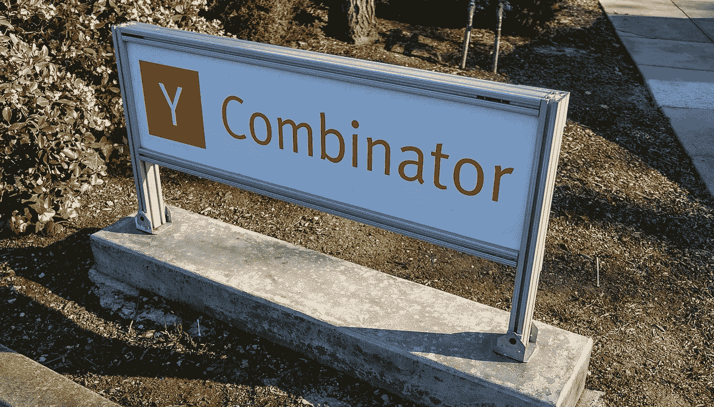

# 面试准备终极指南

> 原文：<https://medium.com/hackernoon/the-ultimate-guide-to-ycombinator-interview-preparation-8372628154c3>

在我自己准备 2018 年冬季班级面试期间，我查阅了关于这个话题的所有公共资源，并与 Y Combinator 的校友进行了 20 多次实践面试。我所学到的一切总结如下。这是我个人的看法，不代表 YC 的官方立场。

*随同本指南，您还可以阅读并重用我们的*[***【YC】面试答案***](https://docs.google.com/document/d/1PepdbDoiWHcHL6TzNqTG7Tdm6ehuUiL2xLr5N20LgbI/edit) *。要获得更多帮助，请加入申请 YC* *的创业公司聊天社区。*

# 答案开发

**答案文档。**你准备过程的核心是写一份包含所有预期问题和你对这些问题的回答的文件。从下面的项目开始，然后通过增加在你的练习面试中提出的新问题的答案来扩展。

**开场描述**

*   您在面试中的第一句话要么是解决方案描述，要么是价值主张。它应该有 4-8 个单词长，并通过“妈妈的测试”，即你的父母应该能够重复给你。

**力量点**

*   提前定义 3 个核心力量点。引导谈话触及所有问题，有时甚至不考虑问题。
*   优势类型:收入/增长/牵引力、领域专业知识/以前做过、洞察力(又名“啊哈时刻”)、市场规模。
*   当你不确定第一次的时候，考虑重复或重新表述你的前三点。
*   测试你的优点:如果有人只听到一行描述和三个优点，他/她会对你的公司感到兴奋吗？

**见解**

*   那些是轶事、引语或仿真陈述，得到一致的“啊哈”和“嗯”..有趣的”反应。

**防御**

*   了解你的 2-3 个关键薄弱环节，并针对最常见的问题准备简单明了的答案。
*   对于每一个你没有用优势点或洞察力回答的问题，限制自己用一句话来回答。你要最大限度地利用时间讨论优势，而不是次要问题。如果你使用第二句话，它应该回到优势或见解。

## **如何写出强有力的答案**

*   使用大量仿真陈述和数字。您的答案文档应该至少有 20-30 个带数字的答案。
*   只要有可能，在答案中排除动词。例如，“你的市场定位是什么？”——“A，然后 B，然后 C”。
*   使用简单的词汇和例子，避免流行词汇或抽象概念。
*   对于弱项方面的问题，用一句话来承认或辩护，然后用第二句话回到强项
*   用例子和事实代替前瞻性计划。过去，我们已经用 X 解决了这个问题，结果是 Y。
*   解释含义:“如果我们实现了 X(困难，但可能的技术成就)，那么我们将获得 Y(主要的商业胜利)”。
*   尽可能使用来自客户的原始数据，而不是类比。一般来说，YCombinator 并不认为基于类比的论证是可靠或有力的。
*   避免自上而下的市场规模。要么自下而上，要么接近可比。
*   “推销你的联合创始人”，准备好告诉你的合伙人为什么很棒。

# 练习运行

安排至少 10-20 次练习。对于模拟面试，询问你已经认识的投资者和创始人，你所在城市/国家/大学的 YC 校友，你所在行业或类似商业模式的 YC 校友，以及自愿在 Twitter 上进行模拟面试的 YC 校友。你不需要介绍。早点问，至少在面试前 7-10 天。

每次练习后做笔记并重写你的答案。向每个模拟面试官汇报。询问哪些答案是清晰有力的，哪些不是。讨论如何改进你的个人答案。重复你的强项、独特的见解/轶事和辩护答案。

此外，观看 YC 的公共办公时间(下面的链接)，感受一下 YC 的面试形式。

# 面试日

## **物流和期望**

*   早点到，确定你的房间，了解谁在你的小组里，在剩下的时间里研究小组伙伴。与其他申请人交新朋友。
*   在笔记本电脑上准备好演示，在多个选项卡中显示所有重要屏幕。不要依赖 YC 的无线网络。
*   假设 YC 合伙人事先不知道。
*   提前查看合作伙伴的简历，确定哪些合作伙伴会因为对您的空间感兴趣而成为支持者。
*   从 YC 的角度来看，采访的目的是在 10 分钟内获取尽可能多的信息。
*   至少有一个 YC 合伙人会仔细观察身体语言和非语言信号。
*   预计 10 分钟内有 40-80 个问题，每轮问答 8-12 秒。
*   做好不断被打断的准备(即使在最初的 2-3 个字的回应之后)。
*   准备好回答你清单之外的独特问题。
*   准备好与多位联合创始人的平行面试(不太常见)。
*   做好准备，在一个问题上进行狭窄而深入的练习，这个问题很可能与你最大的弱点有关。

## **面试时间**

*   说话要快，但不要超快。
*   感到快乐，精力充沛，兴奋地去追求机会。
*   随意友好，保持眼神交流。
*   自信，但要谦虚。自信简洁=令人生畏。
*   几个弱回答还可以。一个冗长无力的回答比一个简短的承认更糟糕，比如“我不知道”或者“我们计划在这方面努力”。
*   不要太保守，表现出可教性。
*   如果第一次没有被很好地接受，考虑重复或重新表述你的三个要点。
*   大多数回答应该是一句话，有些可以是两句话。在整个面试过程中，限制自己只回答 2-3 个更长的问题。
*   不要打断对方，不要在意料之外的问题上争论。相反，你可以说“是的，而且…”或者“我会在这上面加些…”来继续你的共同创始人。
*   当不同意 YC 搭档的陈述时，要么给出相反的事实，要么接受它作为假设来检验。
*   不要做直线偏转。在改变方向之前，先回答问题。
*   当你的业务受到关键假设的挑战时，准备好用清晰的辩护和事实反击。
*   当谈话偏离正题时，试着把它引回强项，例如“我想确保你听到这个…”。

## **预期 YC 评估标准**

*   有趣的问题。理想的，独特的或新颖的。否则，一个新的见解或方法。
*   令人信服的价值主张。
*   清晰简洁的解决方案描述。
*   清楚地了解解决方案的难点是如何工作的。
*   鼓舞人心的使命。
*   市场规模和动态。一个小但快速增长的市场总是引人注目的。
*   克服特定市场问题的真知灼见。
*   激活“蜘蛛感应”，即“嗯……这个空间应该会发生一些有趣的事情”的感觉。
*   具有深厚相关专业知识和领域知识的团队。
*   很强的沟通技巧:简洁、简短、清晰的回答。
*   竞技景观流畅度。
*   事实证明进步的速度很快。精力充沛，足智多谋，“把事情做好”的态度。
*   善于沟通，善于建设性地接受反馈。坚定而又灵活。
*   原创思维和学习能力。直接来自客户的非常规观点和见解。
*   积极的团队动力，没有干扰或争论，愿景一致。创始人冲突的几率低。
*   良好的英语和通俗易懂的口音，交流没有语言障碍。
*   激励和招募明星团队的能力。让 YC 合伙人愿意为我们工作。能成长为“自然力”。
*   在 YC 计划(又名“成为热门种子交易”)结束时建立势头的直接途径。
*   在 2-3 年内获得高收入的直接途径，也就是“做大”。

# Y Combinator 面试资源

**官方资源:** [合伙人名单](https://www.ycombinator.com/people/)，[备考建议](https://apply.ycombinator.com/interviews/preparation)，[备考建议视频](https://www.youtube.com/watch?v=hApTk-JUOhI)，[老建议](http://old.ycombinator.com/howtoprepare.html)，[高顺的 7 分](http://www.michaelseibel.com/blog/how-to-pitch-your-company)。

**校友们的建议:** [Quora thread](https://www.quora.com/What-is-it-like-to-interview-with-Y-Combinator-It-seems-like-a-short-interview-10-minutes-What-happens-during-that-time-and-what-happens-after) ， [Kwindla Hultman Kramer](https://hackernoon.com/y-combinator-interview-advice-live-practice-sessions-87886a3cbf8a) ， [Henrik Zillmer](http://henrikzillmer.com/dos-and-donts-at-the-y-combinator-interview) ， [Tristan Zier](/@tmzier/how-to-prepare-for-the-y-combinator-interview-fd7fb7eaa82c) ， [Barak Ben Ezer](/@barakbenezer/y-combinator-passing-interview-getting-accepted-bd42661fc465) ， [Scott Wheeler](https://blog.directededge.com/2009/11/05/the-interview-with-y-combinator-thats-not/) ， [David Rusenko](http://www.david.blog/blog/y-combinator-interview-advice) ， [Sumon Sadhu](http://sharpshoot.blogspot.com/2009/04/so-you-got-y-combinator-interview-now.html) ， [Robby Walker](http://drraw.blogspot.com/2007/04/ycombinator-advice-interview-tips.html) ，[Natalie Bart](https://hackernoon.com/student-founders-heres-how-to-ace-your-yc-interview-adaa74735547)

**问题合集:** [PG 模拟器](http://ipaulgraham.herokuapp.com/)，[适配](https://www.aptible.com/blog/y-combinator/)，[布拉德·弗洛拉](http://blog.perfectaudience.com/2013/04/26/want-to-ace-your-ycombinator-interview-be-relentlessly-empathetic/)， [TechCrunch](https://techcrunch.com/2012/04/27/be-concise-the-top-questions-asked-at-a-y-combinator-interview/) ， [QZ](https://qz.com/913913/these-are-the-four-questions-y-combinator-uses-to-identify-the-next-unicorn/) 。

**公职时间:** [SS 2011](https://www.youtube.com/watch?v=K9m9vPAlb_0) ， [SS 2013](https://www.youtube.com/watch?v=syoqjYLDs48) ， [SS 2014](https://www.youtube.com/watch?v=9cWPxuxqdGQ) ， [SS 2014 NYC](https://www.youtube.com/watch?v=wKaJPZMOWVg) ， [TNW 2014](https://www.youtube.com/watch?v=68xgz7qkclM) ， [SS 2016](https://www.youtube.com/watch?v=fcyf9z4gSeI) ， [SS 2016](https://www.youtube.com/watch?v=TZLlcyJfZBs) ，[SC17–1](https://www.youtube.com/watch?v=8Qc8ipjzatY)，[SC17–2](https://www.youtube.com/watch?v=abtHadERzXU)

# 感谢

***我永远感谢所有帮助过我们的人:*** *赫拉奇克·阿贾米安、丹尼尔·艾哈迈迪扎德、安德鲁·阿鲁达、迪里安·阿斯帕鲁霍夫、查斯·巴卢、基里尔·别洛夫、伊娃·布莱滕巴赫、马特·布雷兹纳、汤姆·布罗德里克、莱翁·布鲁延、杰里米·蔡、丹·卡罗尔、迪帕克·楚加尼、尼克·德蒙纳、德米特里·杜米克、埃文·法瑞尔、赫比·傅、吉姆·吉布斯、安东·格拉德科博罗多夫 托马斯·潘，罗伯特·里奇奥，文桑，鲍里斯·西尔弗，普雷斯顿·西尔弗曼，扎克·汤森，布雷特·范·苏伊登，詹姆斯·沃恩，普拉文·文卡特桑，特蕾西·杨，戴安娜·辛克。*

# 祝你好运！

要获得更多帮助，加入一个由申请 YCombinator 的初创公司组成的聊天社区。我经常在那里帮助你准备你可能有的任何问题。