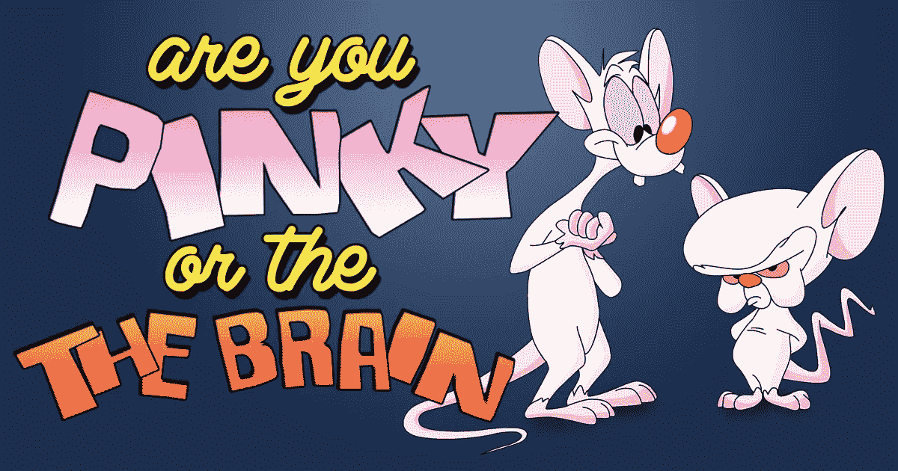
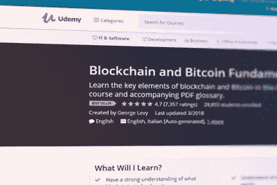
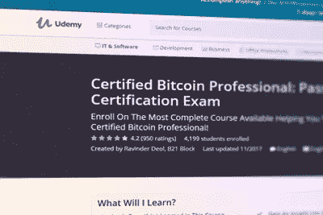
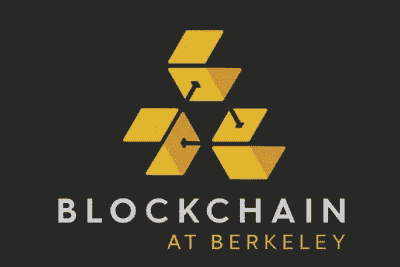
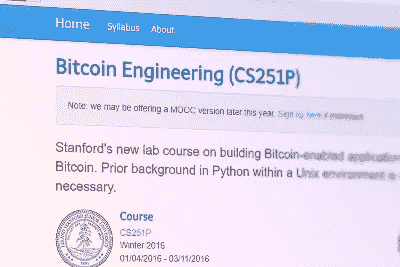
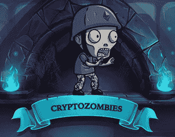
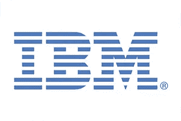
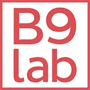
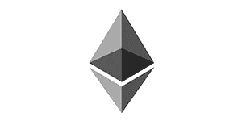
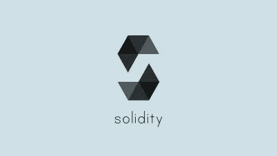

# 扩展您区块链知识的终极开发课程列表

> 原文：<https://medium.com/hackernoon/the-ultimate-list-of-development-courses-to-expand-your-blockchain-knowledge-3153e2b631c>

source: brainfall.com

如果你想在区块链获得成功的职业生涯，但不知道从哪里开始，这个最好的区块链发展课程的概述是在这里帮助。无论您是完全的初学者，还是想要加深知识或从其他行业过渡到区块链的高级开发人员，您都会在本概述中找到与您相关的课程。

# 区块链基础知识

这些课程将向您解释区块链的基本原理，并对此类技术进行深入概述！

我的课程:

# "[区块链和比特币基本面](https://howtotoken.com/courses/blockchain-bitcoin-fundamentals/)"

本课程面向没有任何编程或开发背景，但想了解区块链基础知识的人。您将学习区块链中的核心概念，如哈希函数、挖掘、Merkle 树、智能合约和令牌。你还将获得关于设置比特币钱包并使用它进行交易的实用指导，因此如果你想学习基础知识并迈出加密货币交易的最初步骤，本课程是完美的。

*   **价格:** $95
*   **类型:**在线
*   **持续时间:** 35 次讲座

# "[认证比特币专业人士:通过认证考试](https://howtotoken.com/courses/certified-bitcoin-professional-pass-certification-exam/)"

这门关于区块链基础的课程旨在让你为认证比特币专业考试做好准备。它远比上述课程更全面，不仅会为您提供基础知识，还会在专业水平上为您提供区块链和比特币相关主题的深入指导。通过 38 门课程讲座，你将学到成功通过认证比特币专业考试所需知道的一切。该课程涵盖了不同的挖掘算法和硬件、各种类型的加密货币钱包、比特币客户端、商户和支付处理器。这位名叫 Ravinder Deol 的讲师是 B21Block 平台的创始人，他自己也是一名认证的比特币专家，所以他知道自己在说什么。该课程适合完全初学者，以及那些对区块链和比特币有一些基本知识，但希望对其进行结构化以成功通过认证考试的人。

*   **价格:** $100
*   **类型:**在线
*   **持续时间:** 38 场讲座

# 学术课程

对于任何喜欢学术方法(家庭作业、讲座、考试和测验)的人来说，这里有一些来自著名大学的课程:

# "[伯克利的区块链](https://blockchain.berkeley.edu/decal/fa17/fund/)"

在 13 周内，本课程将向您深入介绍比特币和区块链的基本原理，以及加密货币和智能合约背后的历史和加密机制。本课程主要是理论性的，但你也将获得实际的编码经验，到课程结束时，你将能够用 Java 和 Solidity 构建自己的智能契约和去中心化应用程序。请记住，该课程是离线进行的，只限于伯克利的学生。

*   **类型:**离线
*   **持续时间:** 13 周

# "[普林斯顿大学的比特币和加密货币技术](https://howtotoken.com/courses/bitcoin-cryptocurrency-technologies/)"

关于比特币和其他加密货币技术方面的综合课程。你将了解比特币如何工作，什么是挖掘，以及为什么它对比特币的正常运行如此重要。您还将了解什么是值得研究的替代硬币以及加密货币的前景。它还包括 Java 中的实际编码作业，但它的主要焦点是比特币和区块链的理论基础，所以对于复杂的编程教程，你应该看看其他课程。该课程由 Arvind Narayanan 教授，他是普林斯顿大学计算机科学系的助理教授。你需要注意的一点是，课程材料自 2015 年以来一直没有更新，因此区块链行业的许多概念和进步都没有在其中涉及。

*   **价格:**免费
*   **类型:**在线
*   **持续时间:** 11 周

# "[Andreas Antonopoulos 和尼科西亚大学的区块链培训系列](https://howtotoken.com/courses/blockchain-training-series/)"

全球首个数字货币理学硕士学位。因此，与前面提到的课程不同，它不是一个单一的课程，而是一个常规的结构化理学硕士学位，具有针对不同背景的人的关于加密货币和区块链的广泛综合课程。这门课程是在线管理的，所以无论你在哪里都可以获得理学硕士学位。许多课程由著名的《掌握比特币》一书的作者安德烈亚斯·安东诺普洛斯教授。然而，完整的理学硕士学位可能既昂贵又耗时。所以在决定你是否准备好承担这个责任之前，你可以参加这个项目的[免费入门课程](https://digitalcurrency.unic.ac.cy/free-introductory-mooc/)。该课程由塞浦路斯大学以大型开放式在线课程(MOOC)的形式提供，在这里您可以直接向著名的 Andreas Antonopoulos 先生学习。你甚至不需要有以前的技术背景。塞浦路斯大学最主要的是，尼科西亚大学颁发了第一个学术证书，其真实性可以通过比特币区块链进行验证。

*   **价格:**12080 欧元，提供奖学金
*   **类型:**在线
*   **周期:** 2 年

# "[斯坦福大学比特币工程(cs 251 p)](https://howtotoken.com/courses/bitcoin-engineering-cs251p-by-stanford/)"

关于用 Python 构建支持比特币的应用程序的非常实用的课程。它是通过实际的编码作业进行的，针对的是以前有 Python 和 UNIX 经验并想从事区块链开发的人。在简要介绍了比特币的基础知识后，您将学习如何构建基于比特币的流行互联网服务版本，如 Twitter 或 Instagram。该课程由斯坦福大学的教授讲授，目前该课程在线下进行，但 [MOOC 版本](https://docs.google.com/forms/d/e/1FAIpQLScQwu-EpUYWYrfTKXxYNB2htxd8qgui7_CoTbdgwD9_dMh-WQ/viewform?c=0&w=1)将于今年晚些时候推出。

*   **类型:**线下，MOOC 版本即将上线。
*   **持续时间:** 12 周

# 区块链实用开发

**最佳独立在线课程:**

# "[隐型僵尸——通过构建自己的游戏](https://howtotoken.com/courses/cryptozombies/)来学习编码. "

使用 Solidity 构建基于以太坊的分布式应用(DApps)的实践课程。不需要以前的编程经验，因为该课程的游戏化方法非常适合希望获得实际操作经验的初学者。因为这个课程非常实用并且面向编码，所以它没有涵盖区块链的任何理论基础，所以你必须到别处去寻找。通过本课程，你将学习如何构建一个类似于游戏 Cryptokitties 的 DApp:你将获得一步一步的指导，如何创建具有稳固性的独特僵尸角色，由他们组成一支军队，并让他们互相战斗。完成本课程后，你将拥有以太坊开发的实用技能，你可以通过进一步的教程进一步加强这些技能。

*   **价格:**免费
*   **类型:**在线
*   **时长:** 6 节互动课

# [IBM Developer Works，IBM Blockchain foundation 开发者](https://howtotoken.com/courses/ibm-developer-works-ibm-blockchain-foundation-developer-2/)

IBM 基于 IBM 区块链平台的实用开发课程——Hyperledger。与之前提到的隐型僵尸相比，这一个更全面，也解释了区块链的理论基础。它专注于 Hyperledger，而不仅仅是坚固性，像 Cryptozombies，所以如果你对 Hyperledger 平台特别感兴趣，你应该选修它。否则你可能会发现这门课程与你的学习目标无关。通过本课程，您将学习如何使用 Hyperledger 构建自己的区块链网络。这是一门面向开发人员的高级课程，因此如果您之前没有任何区块链的经验，您应该先学习 IBM 的[基础](https://developer.ibm.com/courses/all/blockchain-essentials/?course=begin#8629)课程，然后再继续学习这门课程。如果你打算在一家大公司做一名区块链开发人员，这个课程是完美的，因为 Hyperledger 是企业界最受欢迎的平台之一。

*   **价格:**免费
*   **类型:**在线
*   **时长:** 6 节

# "[B9 lab 认证在线以太坊开发者](https://howtotoken.com/courses/certified-online-ethereum-developer-b9lab-2/)"

B9lab 提供的课程，是区块链教育领域的先锋服务。这是一门高级课程，面向有意追求公认的认证并在区块链开发领域开始职业生涯的开发人员。您将学习如何使用 Solidity、Web3 和 Truffle，并使用这些资源构建基于区块链的高级项目。该课程提供了经验丰富的讲师的支持，如 Elias Haase T1，并通过 Slack 与其他参与者合作。这是伟大的人有兴趣建立一个成功的职业生涯在区块链发展和网络，它不只是学习基础知识。因此，与 IBM 的 Cryptozombies 和 Hyperledger 课程相比，这个课程更加广泛和全面。它并不专注于一个特定的平台(如 Hyperledger)，它给你提供了比 Cryptozombies 更高级的技能。

*   **价格:**1450 欧元
*   **类型:**在线
*   **持续时间:** 9 周

**Udemy 课程:**

# "[以太坊和坚固性:完整的开发者指南](https://howtotoken.com/courses/ethereum-solidity-complete-developers-guide/)"

最畅销的 Udemy 实用开发课程。讲师斯蒂芬·格林德(Stephen Grinder)是一名职业工程师，拥有在硅谷顶级公司工作的经验。他将指导您完成基于区块链的开发过程，从以太坊和简单的智能合约的基础到高级的多页面前端。首先，你需要有编程经验，特别是 Javascript 和 NPM 的知识。这是关于以太坊和可靠性开发的最全面的课程之一，针对的是希望进入区块链行业的有经验的开发人员。

*   **价格:** $95
*   **类型:**在线
*   **时长:** 243 场讲座

# "[以太坊:去中心化应用设计&开发](https://howtotoken.com/courses/ethereum-decentralized-application-design-development/)"

这是一门侧重于构建分散式应用(DApps)和专用区块链网络的课程，采用边做边学的方法。它是针对开发者的，所以如果你没有编码的经验，你会很难理解。要成功完成本课程，您应该特别熟悉 JavaScript 编程。对于愿意学习如何构建基于区块链的应用程序、什么是以太坊令牌技术标准，以及如何为 ico 实现区块链解决方案的开发人员来说，这是非常棒的。本课程涵盖了比之前在此描述的概念更高级的概念。例如，它将指导你如何建立私人区块链网络，这是大多数课程都没有涉及的。如果你想在一家与区块链相关的初创公司或一家希望将区块链引入其运营的公司获得一份开发工作，这份工作将非常适合你。

*   价格: $95
*   **类型:**在线
*   **持续时间:** 101 场讲座

# "[以太坊区块链开发者:使用 Solidity 构建项目](https://howtotoken.com/courses/ethereum-blockchain-developer-build-projects-using-solidity/)"

B21Block 创始人关于以太坊和坚固性的深度课程。它将深入区块链的技术细节，特别是以太坊，并通过全面的分步教程为您提供使用 Solidity 编写智能合约和构建 DApps 的实践经验。与上面提到的两个课程相比，这个课程更侧重于理论而不是编码，这使得它更适合刚刚开始在区块链行业的旅程的初学者。这门课程将为你在区块链行业的进一步发展打下良好的基础。对于那些有一些编码经验并希望总体上掌握以太坊和区块链基础的人来说，决定这个新行业是否适合他们是一个很好的职业选择。

*   价格: $195
*   **类型:**在线
*   **持续时间:** 85 场讲座

在您学习了基础知识并很好地掌握了实际的区块链开发之后，在区块链继续深造的最佳方式是在 GitHub 上启动一个项目并掌握您的技能。我们从区块链行业的专家那里收集了[建议，这些建议将有助于你加深知识。关于可用的额外资源，如教科书和教程，您可以参考这篇](https://howtotoken.com/career/blockchain-developer-practical-advice-from-experts/)[文章](https://medium.freecodecamp.org/the-authoritative-guide-to-blockchain-development-855ab65b58bc)。

如果你想找到更多的教育机会，你可以参考我们最受推荐的区块链课程的排名。我们试图建立市场上最具信息量的课程评级，这将帮助任何人开始他们的教育道路，并根据数据决定从哪个课程开始。

为了建立最全面的区块链课程评级，我们做了以下事情:

*   根据评论为每个类别(开发、交易、平均使用)建立课程评级。
*   联系每一位作者，在我们的网站上发布对他们的采访。
*   实现课程，保留最推荐的。

我们还有特别的奖金(促销代码和奖学金)，所以在开始你的教育之路之前，你可以加入我们的教育区块链电讯[频道](https://t.me/TENKQA)的学习者社区。

*原载于 2018 年 3 月 30 日*[*howtotoken.com*](https://howtotoken.com/career/ultimate-list-of-development-courses-to-expand-your-blockchain-knowledge/)*。*

## 关于作者:

[基里尔·希洛夫](http://twitter.com/kirills4ilov)——geek forge . io 和 Howtotoken.com 的创始人。采访全球 10，000 名顶尖专家，他们揭示了通往技术奇点的道路上最大的问题。加入我的**# 10k QA challenge:**[geek forge 公式](https://formula.geekforge.io/)。