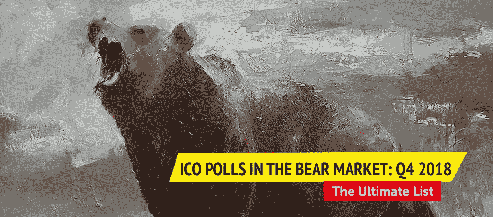
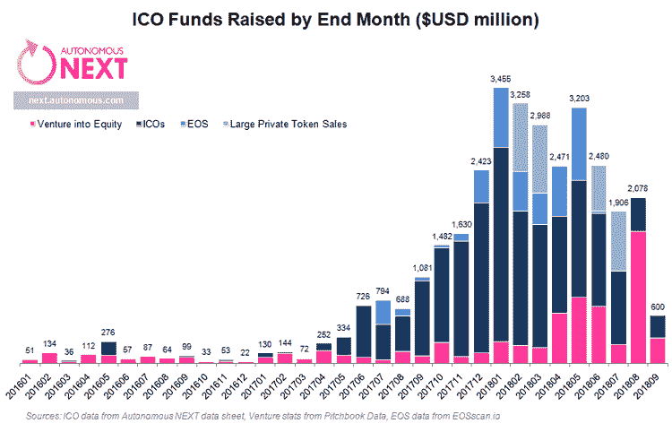
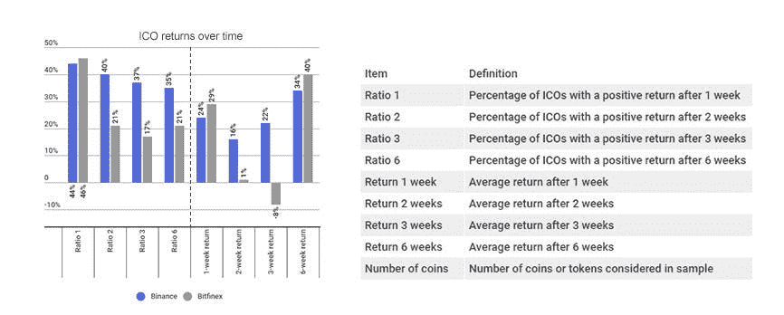
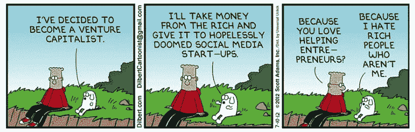
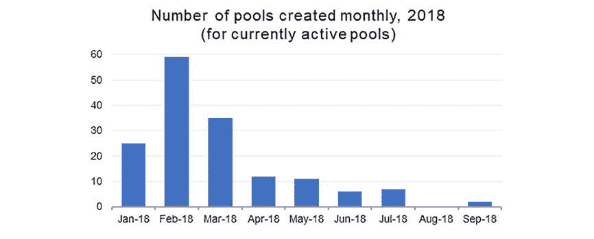
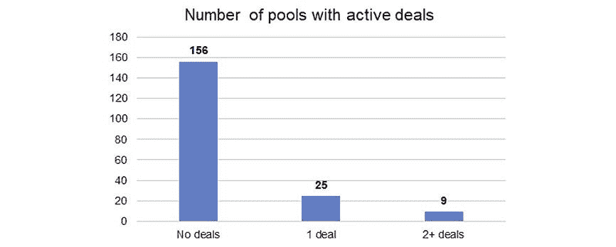

# 熊市中的 191 个 ICO 池的最终列表—2018 年第四季度

> 原文：<https://medium.com/hackernoon/the-ultimate-list-of-ico-pools-in-the-bear-market-q4-2018-81ffc4df5a9b>

ICO(首次发行硬币)市场在 2018 年第三季度发生了巨大变化。来自 Autonomous Next research 的[数据显示，月度 ICO 活动比 2018 年 1 月下降了 90%，2018 年 9 月仅从散户投资者那里筹集了 2.79 亿美元——这是一年来的最低水平。](https://next.autonomous.com/thoughts/crypto-september-icos-90-down-from-january-but-venture-funding-is-ray-of-hope)

# ICO 市场的现状

投资者对购买公司股票而非公用事业代币更感兴趣。仅在 2018 年 8 月，区块链项目就从风险资本家那里筹集了约 16 亿美元，这表明了从个人投资者到机构投资者的转变。

*以太坊价格下跌吓坏 ICO 创始人*

[据 CryptoSlate](https://cryptoslate.com/ico-funding-falls-to-lowest-point-in-a-year-due-to-crypto-bear-market/) 报道，ICO 市场低迷的另一个可能原因是以太坊价格走低(【2018 年 6 月 1 日至 10 月 23 日下跌 65%)。可能的解释是引入了[新的 bit MEX——ETH 的永久互换合约](https://coinswitch.co/news/reasons-why-ethereum-price-falling)，该合约允许交易者降低 ETH 的价格，[对未解决的缩放问题和不安全的智能合约的技术担忧](https://bravenewcoin.com/insights/ethereums-brutal-week-3-reasons-why)，以及随着最初的炒作过去而改变的市场周期。

不管原因是什么，ETH 价格的下降可能已经在 ICO 市场上引起了区块链项目创始人的恐慌，他们大多在 ETH 中筹集了价值数百万美元的资金。他们开始套现以获得有利的价格，导致整个市场的低迷。这导致 ICOs 如今连软帽都收不到。

*ICO 后时间越长，获得的利润越少*

由 GreySpark Partners 准备的另一项[研究提供了对币安上的 131 枚硬币和 Bitfinex 上的 24 枚硬币的分析，该研究指出，在 ICO 之后，随着时间的推移，显示正回报的 ICO 项目的份额显著下降(在六周内，币安从 44%下降到 35%，Bitfinex 从 46%下降到 21%)。原因是缺乏牵引力，令人失望的产品进步，骗局，执行困难，没有市场需求，或糟糕的营销策略。](https://www.scribd.com/embeds/388270475/content#from_embed)

不是所有的 ico 都死了，但是很难找到幸存者

虽然 ICO 市场低迷，但还是有值得投资的好项目。2018 年 8 月和 9 月有 [104 个 ico](https://www.coinspeaker.com/2018/10/04/quarterly-ico-market-analysis-q3-2018/)成功筹集超过 10 万美元，其中 15 个获得了超过 2500 万美元的资金。尽管存在大量的欺诈项目和利润减少，但市场在积极变化的预期下正在发展和成熟。然而，普通的加密投资者没有必要的专业知识来区分[小麦和谷壳](http://context.reverso.net/%D0%BF%D0%B5%D1%80%D0%B5%D0%B2%D0%BE%D0%B4/%D0%B0%D0%BD%D0%B3%D0%BB%D0%B8%D0%B9%D1%81%D0%BA%D0%B8%D0%B9-%D1%80%D1%83%D1%81%D1%81%D0%BA%D0%B8%D0%B9/wheat+from+the+chaff)——识别高潜力项目并获得它们。他们需要能够寻找最佳投资机会的专家——就像传统市场中的风险投资一样。这些风险投资风格的团体，有点像加密世界中的早期风险投资，已经在这里了——称为 ICO 池。

# ICO 池在这个市场中仍然有意义吗？

为了了解 ICO 资金池是否是投资者进入市场的最佳方式，我们决定看看 ICO 资金池如何应对当前的市场状况。ICO 池汇集了愿意以更优惠的条款参与 ICO 私人销售(仅适用于特定人群)和预售(公共，但仅适用于白名单中的人)的个人投资者。每个池参与者贡献一个 smart 合同，一旦达到硬上限或 ICO 结束，资金将被发送到项目。然后收到代币，根据投资者贡献的多少分发给投资者(减去资金池服务的少量佣金)。

ICO 池为投资者提供了独一无二的机会，让他们能够以非常优惠的条件参与到那些原本难以企及的交易中。市场竞争激烈，新的池必须提供新的服务和优势，以扩大他们的社区。我们进行了一项分析，以了解资金池取得的进展、其发展的动力以及它们可以为投资者带来的好处。

*所用数据来自 ICO pools 聚合器包括*[*ICO pools . io*](https://icopools.io/en/)*和*[*ICO Pool World*](https://icopoolworld.com/)*，以及* [*Bitcointalk 论坛*](https://bitcointalk.org/index.php?topic=2887177.80) *和我们自己的研究。*

# 活动 ICO 池的最新列表(按创建日期排序)

2017 年底，ICO 市场蓬勃发展，池开始大规模进入该市场。他们中的许多人在开始时相当成功，然而，随着市场竞争的加剧和新的池的出现，大多数人现在都落后了。

# 2018 年第 3-4 季度人才库—自信的新人

第三季度和第四季度(迄今为止)成立的 ICO 池迅速减少，这可能是由 2018 年早些时候成立的骗局池造成的-如前所述，这些骗局池未能向投资者提供承诺的回报，导致下半年泡沫破裂。整体市场低迷对资金池市场的发展产生了负面影响，进一步削减了投资者的收益。

尽管如此，2018 年第三季度至第四季度还是创建了几个社区。尽管它们仍处于早期阶段，尚未证明它们的商业模式，但这些资金池是在不利的市场条件下建立的，这一事实意味着它们必须有一个经过深思熟虑的未来增长战略。

[**1。氪池**](https://t.me/KryptoPool)

Krypto Pool 是一个新的 ICO 联营集团，为其成员带来独家 ICO 交易。自 2018 年 7 月以来没有活跃的 ico。

[2**2。Howtotoken 池**](https://pool.howtotoken.com/)

根据 pool 的研究，来自风险投资市场的专家团队拥有业经验证的技术经验，这就是为什么他们只收集了所有有趣且长期可行的项目的 1%。例如，在过去的两个月里，我们评估了 800 多个新 ico，只选择了其中两个。对于成功几率最高的项目来说，通过率只有 0.5%。

[**3。密码合金**](https://t.me/Cryptoloyds)

Cryptoloyds 是一个面向俄语用户的分析渠道，为其成员准备 ICO 项目的详细审查，通知他们 ICO 预售，并允许他们以不同的池费在独家项目中获得分配。

[**4。伞池**](https://t.me/umbrella_pool)

伞池是一个加密购买池，拥有私人 ICOs 交易的独家访问权。一个新的但活跃的社区，新的交易与团队的评估一起定期发布。

[**5。宣传片工厂**](https://discordapp.com/invite/FZmGqvg)

PF 是一个用户可以获得保证分配和/或参与促销的免费令牌空投的地方。该团队与投资者不容易进入的顶级项目合作。

[⑥**。ICO 资金池募捐**](https://t.me/icopoolfundraiser)

ICO Pool 筹款活动旨在帮助普通投资者用他们愿意贡献的资本获得更高的奖金。资金池旨在与 ico 直接合作，确保投资者的投资是安全的。

[**7。**隐身 _ 基金](https://t.me/stealth_fund)

stealth_fund 帮助私下销售的参与者匿名出售他们的配额。然而，由于兴趣不高，发起的两项交易(DxChain 和 Aergo)都被取消了。

[**8。CBTS 池**](https://cbtrust.co/)

CBTS 是一个由 100 名专业人士组成的团队，他们挑选项目并帮助项目筹集资金。资金池允许投资者以折扣价获得这些 ico，并通过推荐选项获得 ETH。

[**9。池之相交**](https://t.me/FellowshipOfThePool)

人才库伙伴关系是一个新的人才库，仅面向美国合格投资者(通过 KYC 认证)。该团队在 ico 个人投资之前对其进行尽职调查，并且不收取任何形式的会员费。

[**10。加密东方巫师**](https://forum.cryptoeasternwizards.com/)

东方加密向导是一个新的社区，作为一个论坛，提供内幕信息、加密讨论、股票市场信息、教育资料等。

# 早(Q1-Q2) 2018 池—骗子来了

2018 年上半年，由于竞争激烈，市场上出现了几笔新交易。那时创建了大量的池，二月是最“多产”的月份，从下面的列表中可以看出。我们已经从列表中排除了相当多的 ICO 池，它们的社区非常小，几乎没有交易，并且在过去几个月中没有任何活动，所以实际上，建立的池的数量甚至高于我们的分析显示的数量。

然而，他们中的许多人都是骗子——早期资金池的成功吸引了他们进入市场。这些由非专业人士经营的诈骗集团未能给参与者带来丰厚的回报。尽管如此，还是可以从那时起找到一些好的池，它们特别关注项目的选择性，并提供深入的分析。由于高 ICO 奖金和游戏化优势，这些资金池也可以吸引投资者。

[**11。ICO 猎人**](https://www.icohunter.net/members/)

ICO Hunter 是获取当前和未来 ICO 公正信息的资源。该团队手工挑选并审核他们在网站上展示的每一个 ICO。

[**12。欧米茄块**](https://t.me/joinchat/AAAAAEX3tQyJhu2pxAoF3Q)

欧米茄街区是一个相当大且友好的投资者社区。这个资金池提供了独家交易和投资 ico 的良好选择。

[**13。智能 ICO 投资人**](https://smarticoinvestor.com/)

Smart ICO Investor 是一个由期权交易商运营的团体和博客，提供 ICO 项目的有用信息和分析。

[**14。天体池**](https://t.me/AstroPool_io)

AstroPool 为任何投资者提供了无限制投资私人销售的机会。

[15**。加密圆桌**](https://cryptoroundtable.io/)

Crypto Round Table 是一个透明的加密货币社区，定期制作研究报告和视频内容。该内容还提供了加密圆桌会议正在进行的项目的额外曝光。

[**16。阿波罗 ICO 池**](https://t.me/ApolloPool)

Apollo ICO Pool 是一个面向售前的 ICO Pool，拥有相当坚实的社区。

[**17。刘**](https://t.me/liucryptos)

刘 Cryptos 是加密货币的投资者和影响者。他的小组非常有组织，结构良好，有 ICO 评级、追踪器等等。

[18 日**。block motion Capital**](https://t.me/BlockmotionAnnouncements)

Blockmotion Capital 是一个透明、公平、具有社区意识的合作投资集团，参与 ICO 和售前。

[**19。密码编译程序**](https://cryptolammer.com/about/)

Crypto Lammer 是一个分享 ICO 警报、相关区块链和加密新闻、ICO 报告、硬币分析等的频道。

[**20。TMT ICO**](https://t.me/tmt_iconotice)

TMT ICO 是一个基于亚洲的社区。

[**21。" R & R" ICO 池**](https://t.me/rzricopool)

“R&R”ICO 池是一个具有坚实的社区(尤其是俄罗斯)和相当长的跟踪记录的池。

[**22。ICO 投资人**](https://t.me/DNEVNIKI_ICO)

ICO Investor 是一个俄罗斯频道，提供 ICO 项目分析和评级，并参与池。

[23**23。ICO 拉**](https://t.me/Icopulls_channel)

ICO Pulls 是一个投资 ICO 项目的小型俄语团体。交易的数量和筹集的金额是有限的，尽管他们的记录相当不错。

[24**。CP ICO 购买俱乐部**](https://t.me/icobuyclub)

CP ICO Buy Club 是一个资源池，提供前 1%的 ICO 预售交易。CP ICO Buy Club 已经换了主人——到目前为止，它是由几个管理员在自愿的基础上运营的。

[**25。加密视觉**](https://t.me/cryptovisionicoannouncement)

Crypto Vision 是一个相对较小但友好的有组织的加密投资者社区。尽管项目的选择有限，但大多数拨款都已填满。

[**26。欧米茄池**](https://bitcointalk.org/index.php?topic=3039193.0)

欧米茄池是为那些想在私人销售期间为 ico 做贡献的人而成立的，从那时起，它已经变成了一个成熟的池。欧米茄池为其成员提供了很多好的交易，以及有用的分析。

[27。crypto 99](https://t.me/crypto_99)

Crypto 99 是一个加密货币投资者和爱好者的社区，它为其成员提供了访问市场更新，分析和 ICO 池的权限。

[28**。**氪星因子](https://t.me/thekryptofactor)

Krypto Factor 是一个用于 ICO 讨论、加密货币和汇集资金参与 ICO 的小组。

[29**。ICO 100**](https://t.me/joinchat/AAAAAFH3GSAnTpsiHlR61g)

ICO 100 是一个讲俄语的团体，旨在寻找顶级 ICO，并为其成员提供自我投资的见解和资源。

[**30。意大利密码俱乐部**](https://t.me/ItalianCryptoClub)

一个大型的意大利社区，交流主要是用意大利语进行的。

[**31。鲸都**](https://www.icowhalepool.com/)

鲸资本是一家新兴的数字资产风险投资和咨询公司，专注于区块链项目，为客户提供融资建议和社区管理服务。

[**32。ICO 参与资本**](https://www.icoparticipationpool.com/)

ICO PC 是一个资源池，为其参与者提供独家项目的优惠条款以及大量分配，这些分配通常会很快被填满。

[**33。ICO 搜索党**](https://t.me/ICOSearchParty)

ICO Search Party 是一个专门寻找和研究新 ICO 以及组织基于智能合同的池的团体。

[**34。月亮辛迪加**](https://moonsyndicate.org/)

月亮辛迪加是一个庞大的社区，致力于参与最好的 ICO 项目。他们通常获得稳定的分配，并为会员提供良好的条款，以及良好的交易分析。

[**35。PRICO POOLS**](https://t.me/joinchat/AAAAAEql1HZX2AdpTZR0gA)

此池自 2018 年 7 月以来一直未激活。

[**36。哈迪斯首都**](https://bitcointalk.org/index.php?topic=3243831.0)

哈迪斯资本是一个 ICO 辛迪加集团，旨在参与私人销售。哈迪斯资本没有很多池运行，但他们确保他们是高质量的，有一个积极的投资回报率的好机会。

[37**。ICO 鲸**](https://t.me/joinchat/DtpkCE-4Hs6Vx6XBB9je1g)

ICO Whale 是一个池，致力于为其成员提供获得最佳售前 ICO 和更高奖金的机会。该群组已成为私有群组，现在需要 KYC 身份验证才能加入。

[**38。ICO 狗**](https://icodogpool.com/)

ICO 狗是社交最活跃的池之一。他们的主要特点是网站有一个用户评级系统，评级高的用户可以进入最好的池。

[**39。法国拉池**](https://t.me/joinchat/JN0xjlD94fNmJEybs0LFXw)

La French Pool 是一个经验丰富的大型社区，负责协商私人预售和托管 PrimaBlock 泳池时的最佳奖金。

[**40。私人投资者俱乐部**](https://t.me/PrivateInvestorsClubAnnouncement)

私人投资者俱乐部是一个小型私人投资俱乐部，专门从事加密 ico 和投资。

[**41。伺服放大器**](https://t.me/servampsdlt)

SERVAMPS 是一个项目加速器，提供各种服务，这些服务不是专门针对区块链的，而是专注于数字资产市场，以帮助一级项目制定有助于巩固其领先地位的战略。

[**42。隐医**](https://cryptomedics.io/)

CryptoMedics 提供具有真正价值和深度研究的加密货币教育:加密信号、内部信息、ICO 评估、隐藏的宝石、付费通讯、投资组合咨询等。

[43**。ICO 台球俱乐部**](https://bitcointalk.org/index.php?topic=2980869.0)

ICO Pool Club 是一个 ICO Pool，它将 ICO 的详细信息放在公告频道中，尽管仍然缺乏创始人对 ICO 的分析。

[**44。隐鸟**](https://cryptoarnie.typeform.com/to/hXBgYt)

CryptoArnie 是一个大型的、非常活跃的社交社区，面向有经验的、聪明的 ICO 参与者和交易者。

[45**45。流入-加密**](https://www.inflow-crypto.club/)

流入加密俱乐部是加密货币投资的一站式商店。除了专家意见，他们提供基本和先进的短期和长期投资策略，有组织的 ICO 投资池，以及有用的加密相关资源。

[46**。Moonetize ICO club**](https://moonetize.io/)

Moonetize ICO Club 专注于以更有效的方式共享 ICO 指标，试图为他们的小社区组织小池。

[47**。Oly245 加密聊天**](https://t.me/oly245cryptochat)

Oly245 Crypto Chat 是一个讨论 ico、空投等的聊天和公告渠道。

[48**。**小鸡池](https://bitcointalk.org/index.php?topic=3047400.0)

从 2018 年 8 月开始，游泳池暂停开放。

[**49。wmarket Pools**](http://www.whitemarket.io/en/)

Wmarket Pools 选择和分析项目，提供投资无限量资金的机会，同时避免困难的注册和 KYC 程序。

[**50。心宿二首都**](https://t.me/antarescapital)

Antares 资本基金整合自然人和法人实体的资本，以参与 Telegram messenger 的 pre-ICO。

[**51。ICO 投资人枢纽**](https://t.me/joinchat/AAAAAEXQfsGa-X_AwQucwA)

ICO Investor Hub 是一个大型的、有组织的、结构化的池，它在公告页面上发布交易的详细信息。他们还为 ICO 创始人提供 AMA 会议。

[**52。ICO 池(分散基金)**](https://t.me/poolforpublic)

ICO Pool(分散基金)旨在获得一般公众无法获得的 ICO。该系统是非常透明的，管理人员的个性是众所周知的。然而，这个小组已经有一段时间没有活动了。

[**53。密码协会**](https://t.me/Crypto_Society_Pool)

Crypto Society 是一个前 ICO 池，有相当坚实的社区和良好的交易。

[**54。增益**](https://gains-associates.com/)

GAINS 的目标是成为一个值得信赖的群体——创始人是透明的，并展示真实的 id。他们不仅建立资金池，还协商最佳交易和私人奖金，并为 ICO 公司提供多种服务。

[**55。宝石俱乐部| ICO 社区**](https://t.me/joinchat/G3hZf0ZaUn2g10Sf9sLpFA)

GEM CLUB 是一个小型社区团体，由 ICO 爱好者/投资者组成的多元化团队讨论被低估的项目。

[**56。MMG 人群**](https://t.me/joinchat/GSRgAUlHdu-rjsuqyyTsTg)

MMG 人群是一个大型的加密投资者国际社区。他们的主要目标之一是为热门项目提供条件诱人的人才库。游泳池完全变成私人的了。

[**57。保费池**](https://t.me/Premium_Pools)

优质池正在寻找优质的 ico 只，可以带来最大的利润。

[**58。TCS**](https://discordapp.com/invite/NcArdwk)

TCS 池自 2018 年 5 月以来一直未激活。

[**59。ICO 实验室财团**](https://theicolab.com/)

ICO 实验室是一个私人团体，在众筹阶段之前研究和接近最好的 ICO 项目，具有强大的购买力。他们变得完全保密。不活跃。没有发现任何成功的投资。

[**60。隐星。俱乐部**](http://cryptostars.club/)

隐星。俱乐部的主要目标是选择值得信赖的 ico，以避免诈骗。

[**61。火箭池**](https://www.rocketpool.net/)

Rocket Pool 是一个分散的以太坊 PoS pool，允许个人和企业从他们的以太上赚取利息，并为寻求 PoS 服务的企业提供完整的第三方 API。

[**62。精矿池**](https://t.me/concentrate_pool)

集中池— ICO TGE 是一个讲俄语的池，在 Primablock 上提供预售 ICO 项目。他们注重尽职调查，对 ICO 项目有严格的选择标准。

[**63。DXB 加密池**](https://t.me/joinchat/FtdAahH0fsU4WRfJfyB9lg)

DXB 加密池是一个非常小的加密爱好者团体，他们为即将到来的 ico 提供资金。管理员不收取任何佣金，并鼓励小组中的每个人做自己的尽职调查。这个群已经有一段时间没有活动了。

[**64。欧文&好友**好友](https://t.me/ErwinAndFriends)

欧文&老友记是 ICO 预售池。他们有一个 VIP 通道，让会员可以访问由专家选择的 ico、独立的专业支持、个人帮助、奖金、内部信息等。

[65**。watch bro**](https://t.me/joinchat/AAAAAEY5x10qJrZEEQJmDw)

Watchbro 是一个分享 ICO 市场见解的渠道。

[**66。进入 Crypto-ICO 池**](https://www.getoncrypto.com/)

goc 团队由一小群专门的加密采纳者和爱好者组成。该团队使用 Primablock 创建公共池，并拥有资源与大投资者一起进入新项目。

[67**。ICO 池**](https://www.icopool.co/)

ICO Pools 是一个小团体，允许投资者参与 ICO 的私人销售和预售。

[**68。Crypto-ICO 主谋**](https://t.me/Hottesticopickscommunity)

该组织由 Crypto Kyle 和一群爱好者运营，致力于通过仔细研究来选择最佳交易。但是，现在已经有一段时间没有活动了。

[**69。隐卡因池组**](https://t.me/cryptocainepoolgroup)

Cryptocaine Pool Group 频道提供教育帖子(投资组合管理技巧、交易策略等。)、信号、每周围捕和协商的 ico。

[**70。关键硬币资产**](https://t.me/joinchat/GLIfI0z3BZMbAP_8tqV4Fw)

Key Coin Assets 是一个小型社区资源，用于获取即将推出的 ico 的最新信息。该团队声称将亲自投资选定的项目。这个小组已经有一段时间没有活动了。

[**71。Pramod 的密码社区**](https://twitter.com/OfficialPramodM)

Pramod 的 crypto 是一个小型但定性的社区，由一位经验丰富的分析师创建。人才库为其成员提供参与有前途项目的机会，其主要目标是选择性。

[**72。鲸**](https://whalio.com/)

Whalio 是一个公共社区，它联合了投资者和盈利的 ico。池参与者的资金被转移到网站上的帐户，团队直接投资，没有子池。

[**73。黑龙潭**](https://t.me/BlackDragonVentures)

黑龙是一个庞大而雄心勃勃的群体，数量迅速增长。该小组对大量 ico 进行了深入分析。

[**74。house crypto**](https://t.me/housecrypto_ann)

自 2018 年 7 月以来，该游泳池一直没有活动。

[75**。比特币党**](https://t.me/thebitcoinparty)

在社交媒体上非常活跃的比特币党(Bitcoin Party)挑选出不同评论者推荐的顶级 ico，并与他们的成员分享有用的信息。

[**76。阿瓦隆资本**](https://discordapp.com/invite/8MgMfa5)

Avalon Capital 是一个在 Discord 上运行的资金池，可以获得良好的 ICO 交易，使用 Primablock 实现透明，在某些情况下还可以进行子资金池。

[**77。以太网边缘 ICO 池**](https://t.me/etheredgepoolchat)

Etheredge ICO Pool 的目标是在更好的条件下获得售前 ICO，做到透明、经济高效和负责任。该集团是英国受监管的投资企业。

[**78。密码大师**](https://t.me/joinchat/GVeN_UMCJOixymw-QmjT5Q)

Crypto Gurus 是一个旨在寻找最新 ico 和讨论市场新闻的组织。

[**79。加加林**](https://t.me/Gagarin_ICO)

这是一个俄语频道，有一个坚实的社区寻找好的 ICO 交易。

[**80。银河池**](https://galaxyfoundation.tech/?utm_source=hypernum.com)

银河基金会是一家专注于加密货币、区块链相关技术和数字资产的私人风险投资基金。

[**81。鲨鱼资本**](https://bitcointalk.org/index.php?topic=3022237.0)

ICO 鲨鱼池是一个相当大的池，关闭了许多炒作的 ICO，如兰花协议，Hashgraph 等。，而且已经完全私有化了。

[**82。ICOVISIONS GROUP**](https://icovisions.com/)

ICOVISIONS 是一家面向投资者的区块链项目众筹机构。

[**83。**池推进剂](https://t.me/thepoolpropellant)

Pool Propellant 是一个小社区，它搜索最新的大项目，并一起投资以获得可能的最佳交易。最近不太活跃。

[84**。DCI 泳池**](https://t.me/dcipools)

2018 年 9 月，DCI 池的管理人员通知其成员，由于市场状况不佳，没有好的 ICO，以及 ICO 市场饱和，该集团认为没有理由投资新的 ICO，然而，他们将寻找像 STO 这样的替代品。

[**85。ICOs 联盟**](http://leagueoficos.com/)

LOI 是一个 ICO 研发集团，为备受期待的项目提供私人资金池。

[86**。CryptoSeedPartners**](https://t.me/joinchat/GO4VDA2fr8IxEGqPZsulhw)

CryptoSeedPartners 最初向 ICO 项目捐款，但他们现在更专注于加密的其他方面，如交易和 ICO 讨论。这个团体也变得更加私密。

[**87。隐浪人**](https://icopools.io/ru/pool/35)

游泳池完全变成私人的了。

[**88。DD ICO 顶级交易员**](http://top-traders.info/)

DD ICO Top Traders 是由一个致力于加密货币的大型俄语社区组成的池。Primablock 的使用保证了安全性，虽然 ICO 的选择相当少。

[**89。牛津资本 ICO 池**](https://t.me/OXCICO/3)

Oxford Capital ICO Pool 有一个组织良好的 Discord 渠道，正在通过预售和带有折扣和奖金的私人销售进入市场。

[**90。预售池**](https://presalepool.com/)

预售池为投资者协商特殊的难以访问的预售 ICO 交易，只为预售池成员保留代币和奖金的分配。

[**91。安然:ICO 预售团购**](https://t.me/enronico)

自 2018 年 8 月以来，该团体一直不活跃。

[**92。隐杆池**](https://t.me/cryptoboom_pools)

该团体自 2018 年 7 月以来一直没有活动。

[93**。月亮黑手党**](https://t.me/joinchat/HUDJYEy_8JwEMsQQhIFKDQ)

Moon Mafia 是一个大型投资者社区，提供良好的可访问性和 ICO 条件，尽管分配额可能很小，有时折扣很低。

[94**。1035 俱乐部 ICO 池**](https://www.1035club.com/)

1035 俱乐部是一个成员有限的投资俱乐部，特别侧重于评估 ICO 售前分配。俱乐部遵守任何适用的 KYC 要求。

[95**。块脑 ICO 池**](https://t.me/blockbrains)

Block Brains ICO Pools 的目标是分享知识，讨论趋势和市场分析，并联合力量建立共享主节点，并尽早获得有趣项目的资金。

[96**。迈克·迈克尔斯 VIP ICO 组**](https://t.me/MMICO)

Mike Michaels VIP ICO 组是一个大型池，定期提供新的机会，成功率很高。

[97**。零和密码**](https://t.me/ZeroSumCrypto)

ZeroSum Crypto 为私人交易提供 Primablock 池。他们发布的任何项目都是团队个人投资的项目。该组织还进入了交易市场，以“拯救社区”，正如管理员所宣称的那样。

[**98。天使主 ICO 池**](https://www.angelsinvestorgroup.io/)

天使 ICO 小组分析了数百个 ICO，只提供符合投资标准的最具潜力的项目——这些是团队自己投资的项目。

[99 年**。顶点隐语**](https://discordapp.com/invite/xnfXBHR)

一个只说西班牙语的不和谐的游泳池。

[**100。**法院](https://t.me/the_court_group)

法院是一个友好的辛迪加，向需要钱的 ico 捐款。

[**101。ICO 分析**](https://t.me/ico_analytic)

ICO Analytics 是一个大型俄语和英语社区，提供新闻、分析、ICO 项目评论以及早期交易。

[102**。皇家区块链投资集团**](https://www.rbig.co/)

皇家区块链投资集团成立的目的是在预售期间投资 ico，而不用担心过高的费用或佣金。通过填写 RBIG 破冰船，社区将可以访问一个成员专用的目录。

[**103。ICO 银团**](https://www.icosyndicated.com/)

ICO 辛迪加就 ICO 私人/预售独家交易进行谈判，使会员获得高达 100%的 ICO token 奖金，并且没有顶级区块链项目的锁定。这些交易通常只留给富有的投资者。

[**104。ICO 鲸鱼—聊天&投资**投资](https://t.me/ICO_Whales_group)

ICO Whales 的目标是创建一个每个人都可以表达自己和自己想法的社区。项目评审由分析师团队准备，并经过三阶段审计。

[**105。MKK 池**](https://t.me/mkkpool)

MKK 是匈牙利最大的密码社区之一，也是“不和”MKK 赌局的运营商。

[**106。MyICOPool**](https://myicopool.com/)

MyICOPool 是一个完全透明和安全的池，符合所有政府机构对众包项目的要求。

[**107。水池 ICO 沼泽**](https://t.me/ICOBOG_EN)

Pools ICO BOG 是一个国际性的大型活跃社区，提供良好的 ICO 交易。

[**108。密码罗盘**](https://www.crypto-compass.io/)

CryptoCompass 对选定的项目提供广泛的研究和私人销售。该小组正在对选定的项目进行 150 多项标准的运营尽职调查。

[**109。一起投资**](https://coico.org/)

Invest Together 是一个俄语 ICO 库和博客，提供有用的信息，如采访、文章等。

[**110。隐鲸池(葡萄牙语/英语)**](https://www.cryptowhalespool.org/)

Crypto Whales Pool 是一个小型的葡萄牙语投资者社区，扩大到英语受众，通过参与几个良好的项目取得了一些成功。

[111**。CryptoSid 的 ICO 池**](https://t.me/cryptosidspool)

CryptoSid 的 ICO Pool 是一个拥有大量用户的社区，允许他们免费加入，并获得团体 ICO 折扣和奖金。

[**112。蓝宝全球池**](https://t.me/lamboglobal)

蓝宝全球池是一个大池，独家交易只对过去池的参与者开放。

[**113。私售池**](https://t.me/joinchat/G0v2akj6HBvnsvNd0Um41w)

从 2018 年 7 月开始就没有活动过。

[**114。数字资产池**](https://www.digital-assets.org/)

Digital Assets Currency 成立于 2017 年 8 月，其愿景是成为澳大利亚最大、最诚实、最透明的加密货币基金。目前，数字资产管理着数百万美元的基金。

[**115。全球资金池辛迪加**](https://t.me/globalpooldiscussion)

Global Pool Syndicate 是一个筹款实体，其运营目的是获得社区对区块链生态系统中即将到来的项目的早期访问权。

[116**。TWW ICO 研究**](https://www.togetherwewin.co.uk/)

Together We Win 为社区提供了一个用户友好的界面，让社区对感兴趣的 ico 进行投票。TWW 开始与获胜者对话，以获得私下销售和利益的细节。

[**117。ICO 神谕**](https://t.me/ICOoracles)

ICO Oracles 为其用户提供了成为最好的私有和预售 ICO 的一部分的机会，并且不用担心天然气战争、错过众筹销售或网站崩溃。

[**118。火箭辛迪加**](https://rocketsyndicate.org/)

Rocket Syndicate 是一群私人 ICO 投资者，他们投资于聪明和有远见的创始人，解决区块链领域的实际问题。

[**119。加密内圈辛迪加**](https://cryptosyndicate.group/)

Crypto Syndicate Group 团队由能够参与预售和私募发行的合格投资者组成。会员可以获得关于即将推出的 ico 的经过仔细研究的专家信息。

[**120。喜马拉雅私人销售池**](https://www.himalayanpsp.com/)

喜马拉雅私人销售池为投资者创造了一个多元化的平台，大投资者和小投资者之间没有或只有很小的差距。该团队由几名分析师组成，他们致力于预测 ICOs 对环境力量的反应。

[121**。投资者优先池**](https://t.me/joinchat/H7ADBBEGQaYGGJ3m7Pd74g)

Investor Prime Pool 是一个小型社区，允许在 Primablock 上进行 ICO 预售。

[**122。芝诺块池**](https://www.zenoblock.co.uk/)

芝诺资本的愿景是将区块链带给大众。研究、深度分析和谈判领域的专家团队使用这些技能在获得售前和私人奖金之前寻找 ICO。

[**123。密码学家**](https://t.me/poolicochat)

CRYPTOLOGISTE 是一个讲法语的小社区。

[**124。Alphablock 印度尼西亚**](https://www.alphablock.id/)

Alphablock 是一个社区团体，旨在通过讨论、信息和会议(meetups)来教育印度尼西亚的加密爱好者。

[125**。Conexus 池**](https://t.me/ICO_Private)

Conexus Pool 是世界各地即将到来的社交媒体营销机构的枢纽。提供的服务包括泳池服务、奖金管理以及所有与 ICO 相关的服务。

[**126。ICO 专家网**](https://t.me/icoexpertsnetwork)

ICO 专家网络是一个密码专家和爱好者的渠道。该团队使用他们的分析算法分析了数百个 ico，比较了技术指标和市场情绪。

[**127。天际资本集团**](https://t.me/skylineannouncements)

Skyline Capital Group 是一家活跃的投资集团，为其成员提供定期预售和私人 ICO 交易。

[**128。基思的加密池**](https://t.me/Officiallykeith)

基思的加密池是由基思·韦林经营的。创建该聊天是为了分享关于热门密码、技术分析和 ICO 讨论的信息。

[**129。wave pool . io**](https://t.me/WavePools)

WavePool.io 是一个小型但活跃的社区，提供早期 ICO 机会。

[130**。ico picker . io**](https://icopicker.io/login?prev=pools)

来自 Elite Club 的 ICO Picker 是第一个通过众包产生 ICO 选择、分级和分析的在线平台。

[**131。ICO 池迈阿密**](https://www.icopoolmiami.com/)

ICO Pool Miami 为用户提供了参与私人/预售 ICO 的机会。用户可以在小组中讨论、贡献和交流关于即将推出的预售 ico 的想法。

[**132。行动池**](https://t.me/Action_Pool)

ACTION POOL 是一个非常活跃的社区，拥有早期 ICO 投资的成功记录。

[**133。crypto Luna**](https://t.me/CryptoLunaAnn)

Crypto Luna 是一个讨论有趣 ICO 项目的小社区。

[**134。K & D 大写**](https://t.me/KandDCapital)

K&D Capital 是一个小型集团，提供私人 OTC 和资金池，以及加密货币新闻。

[135**。月池**](https://t.me/moonpoolbot)

月池正在投资最有前景的 ICO 项目，并有电报机器人进行运营。

[136**。史诗令牌**](https://www.etk.org/)

Epic 团队确保优质项目的预售金额分配给社区成员，并确保每个成员都能根据 Epic 的平台指南获得最大金额。

[**137。隐小兵 ICO 池**](https://www.crypto-creeps.com/)

cryptopractices ICO Pool 是一种 ICO pooling 服务，使用独特的联系方式来确保伟大的预售交易和折扣。自 2018 年 7 月以来一直不活跃，社区非常小。

[**138。柴油 ICO 池**](https://t.me/dieselsyndicate)

目前出售。

[**139。二叠纪辛迪加群落**](https://www.permiansyndicate.com/)

二叠纪辛迪加是一个 ICO 私人销售社区。每笔交易都带有团队的浅见，以及其他 ICO 评级机构的评分(如果适用)。加入需要 KYC 表格。

[**140。东方 ICO 基金**](https://t.me/mmgeast)

自 2018 年 7 月以来，某个频道一直不活跃。

[141**。密码俱乐部社区**](https://t.me/joinchat/GZ-1M0UzVqOpN51BcslkNw)

Crypto Club 社区是加密货币投资者的专属社区，分享他们的策略、交易和分析。

[**142。造字俱乐部**](https://coinstelegram.com/)

Coinstelegram Club 是一个投资加密社区，允许人们通过 pools 和 Coinstelegram 的私人俱乐部进行独家交易(针对通过 KYC 和 AML 的成员)投资最佳 ICO 项目。

[**143。聪池**](http://www.satoshipool.pro/)

Satoshi Pool 旨在将所有希望在早期阶段投资有前途的 ico 的人聚集在一起，提供最好的报价和奖金。这个资金池非常活跃，尽管迄今为止交易大多不成功。

[**144。朋友&资金**资金](https://t.me/friendsandfunds)

Friends&Funds 是一个俄语平台，拥有一支经验丰富的分析师团队和自己的 ICO 评估技术。从聊天机器人到信号，整个投资过程都是自动化的。

[**145。超越 FOMO**](https://t.me/BeyondFOMO)

BeyondFOMO 致力于确定最高质量的项目并协商最佳销售条款。他们鼓励每个人进行与加密相关的讨论，并特别关注信任问题。

[**146。ICO 池公司**](https://t.me/icopoolcorporation1)

Ico Pool Corporation 是一个 Discord and Telegram group，旨在让每个人都能参与不同 Ico 的预售。然而，现在泳池的活动非常有限。

[**147。卓越加密**](https://t.me/joinchat/IPToMgoIGWvqWme5K-vYFg)

Crypto Excellence 是一个透明的加密货币组织，拥有一个由合格投资者组成的核心团队。该团队与加密领域的知名人士、大型风投、加密基金、有影响力的人士等有联系。

[**148。白金 ICO 俱乐部**](https://www.platinumicoclub.com/)

白金 ICO 俱乐部是一个面向有经验的 ICO 参与者、交易者和研究人员的国际加密货币社区。该团队具有广泛的洞察力，并在微观和宏观层面上对空间有很好的理解。

[**149。华尔街交易员 ICO 池**](https://t.me/IcoPoolWallStreet)

华尔街交易员 ICO 池是一个频道，包含有关 ICO 池和 ICO 新闻的信息。为华尔街交易者学校的成员推出。

[150**。隐名投资者群体**](https://t.me/IncognitoInvestorsGroup)

隐姓埋名投资者小组是一个专注于信任和安全的群体，只有两名 Primablock 管理员，他们都使用真实的个人资料照片和真实姓名作为昵称。

[**151。ICO_POOLS_ALERTS**](https://t.me/ICO_POOLS_ALERTS_CHAT)

ICO_POOLS_ALERTS 是一个聚合有关池和活动 ICO 产品的信息的渠道。

[**152。尤尼顿**](https://uniton.io/ru/ico)

Uniton.io 提供新闻、独立分析、文章和交易建议，以及访问 ICO 预售。

[**153。Pro ICO 池**](https://t.me/proicoasia)

Proico.asia 是一个由投资者为投资者创建的资源，它结合了 ico、ITO 和投资池的当前项目信息。

[**154。开普勒集体**](https://keplercollective.com/)

开普勒集体提出了一种用户友好的方式来支持下一代令牌项目。该团队为选择合适的支持项目提供了直接、透明的信息访问。

[**155。ICO 池牛**](https://t.me/joinchat/FCDjgkgPuV0sEd-rWQI3og)

ICO POOL BULL 是一个私人团体，是 ICO 和加密讨论的咨询公司。

[**156。密码唤醒**](https://t.me/crypt0senseICO)

CryptoSenseICO 是一个分析师团队，提供一个池，让用户获得独家私人 ICO 销售。该团队专注于分析和信任管理。

[**157。奇点联盟**](https://t.me/singularityalliancevc)

奇点联盟与风投有联系，可以获得丰厚奖金且没有最低限额的交易。然而，自 2018 年 8 月以来，该小组没有任何活动。

[**158。crypto Pro**](https://www.cryptopro400.com/)

Crypto Pro 是与加密货币投资和区块链技术相关的加密社区的信息中心。

# 2017 年池—先发优势

“加密货币年”，2017 年带来了大量的 ICO 池。目前活跃的一些大型已建立的池是在那时建立的。这些 ICO 池一直定期为其成员提供 ICO 机会，由于兴趣很高，许多人已经填满了分配。由于 2017 年的资金池有着良好的记录，财务稳定，因此它们很可能在未来有办法遵守监管机构的规定，这使它们成为风险厌恶型投资者的一个不错的选择。

[**159。海洋池**](https://www.oceanpool.io/launchpad/)

Ocean Pool 挑选最有前景的区块链项目，并向它们提供社区种子预售捐款，作为回报，它将获得独家投资条款。

[**160。108** 池](https://t.me/pool108)

Pool108 是一个小池，其成员可以进行私人交易。

[**161。I club**](https://t.me/iclub_en)

iClub 是一个国际平台，俄罗斯观众在其中占主导地位。该集团提供各种交易，尽管它很少为其成员提供分析。

[**162。ICO D . a . ch**](https://t.me/ICODACH_EN)

ICO Dach 是由一群德国密码爱好者创建的经验丰富的社区。达成独家交易和充实可靠分配的大资金池。

[**163。Bitnews 泳池俱乐部**](https://pool.bitnews.today/)

Bitnews POOL Club 的创建是为了吸引志同道合的人进行有利可图的合作投资。所有项目都是在经过分析师和专家的彻底分析和验证后发布的。

[**164。ONEX 首都**](https://onexcapital.io/)

ONEX Capital 是一个加密货币聊天社区，由 5，000 多名交易员、研究人员、企业家和爱好者组成，他们讨论并分享技术分析、行业新闻和即将推出的 ico 信息。

[**165。加密大写**](https://t.me/icopools_cc)

秘密资本是最古老和最有经验的团体之一。该资金池填补了大量分配，并向投资者提供可实现的个人上限，同时从他们那里收取合理的费用。

[**166。D.VA 加密投资集团**](https://dvasignal.com/)

D.VA 加密投资集团是南韩的一个大型区块链社区。为会员提供市场分析和项目评估，为项目提供推广服务。

[**167。ICO 评审**](https://t.me/ico_review)

ICO Review 是一个俄语频道，有一个非常坚实的社区发布新闻和 ICO 项目的评论。

[168**。图标符号**](https://t.me/iconizers_pool)

Iconizers 是市场上最古老的池之一。它为参与者提供体面的项目，分配给他们的项目几乎总是满员。

[**169。ICOWhale**](http://www.icowhale.group/)

ICOWhale 提供私人 ICO 交易，允许用户在购买数百枚代币和硬币时节省高达 70%的费用。尽职调查后，专注于为集团谈判最佳价格。

[**170。问我密码**](https://t.me/askmecryptoIco)

Ask Me Crypto 是一个加密交易社区，允许成员跟踪市场上最新的 ico。

[**171。标记符**](https://tokenator.io/en)

Tokenator 是一个大型的国际资源库，它提供了各种可以参与的项目。他们通过自己的网站接受投稿，不向参与者收取任何费用，并声称拥有强大的分析团队。

[**172。隐天使**](http://cryptoangels.io/)

CryptoAngels 是一个由加密货币投资者组成的封闭社区，提供投资项目的建议，这些项目将产生有保证的利润。声称关闭建议的准确率不低于 82%。

[**173。ITuber**](https://ituber.me/fund/)

ITuber 是一个大的资源库，其主要目标和特点是选择高质量的项目。

[**174。elcap**](http://elcap.io/)

Elcap 提供一系列精选预售 ICO 和独家加密货币的深入信息，并通过将初创公司与营销服务联系起来建立战略合作伙伴关系。

[**175。**批量](https://t.me/bulknetwork)

Bulk 是一个俄语频道和社区，关注市场上最好的 ICO，它也允许其成员参加 ICO 预售。

[**176。兄弟情池、新闻和提示**](https://t.me/BROtoken)

Brotherhood Pool，News and Hints 为一个小社区提供了一个信号和一个新闻频道，以及 ICO 预售和空投。

[**177。ICO 圈**](https://icopools.io/ru/pool/39)

ICO Circle 是一个活跃的 ICO 共享社区，为其成员提供良好的 ICO 交易。它变得完全私密。

[**178。BitcoinGarant**](https://t.me/joinchat/CB7zgBH_ARit352rnwq6-Q)

BitcoinGarant 是一个讲俄语的公共和私人投资者社区。

[**179。kryptsu**](https://twitter.com/kryptsu)

Kryptsu 在 Telegram 中有一个频道，提供最新的信号、新闻、研究、内幕消息和 ico。游泳池已经完全变成私人的了。

[**180。黑咖啡之都**](https://icopools.io/en/pool/163)

游泳池是私人的。

[**181。DiddyCarterICO**](https://t.me/diddycarterico)

DiddyCarterICO 是一个成熟且非常透明的资金池，它依赖于详细的分析和对优质投资项目的选择。

[182**。格林威克集团**](https://t.me/joinchat/HI_AOEL02-CCSCp8ItKqAQ)

格林威克集团是一个私人 ICO 池，有一个私人研究团队来讨论/建议项目。

[**183。**格鲁什科夫池](http://glushkovpool.com/#/)

Glushkov Pool 是最有经验的俄语投资者社区之一。该池有自己的电报机器人，详细记录交易历史以及正在进行的池。

[**184。bitcoinfox**](https://bitcoinfox.ru/skladchina-dlya-ico.html)

Bitcoinfox 是俄罗斯的加密货币资源，也运行 ICO 池。拥有 2017 年底以来参与各类 ICO 项目的丰富经验。

[**185。正版加密**](https://t.me/CryptoGenuine)

加密正版是一个频道，分别跟踪新闻，分析硬币，并给出信号。从 2018 年 7 月开始就没有活动过。

[**186。ICO 预售(天蓝色黑色)**](https://azureblack.com/)

Azure Black 是一家国际集团，热衷于从加密财富中创造真实世界的价值，帮助启动和发展成功的加密业务。

[**187。加密每日 ICO 池**](https://t.me/CrytoDaily)

Crypto Daily ICO Pool 是一个小型的 ICO 讨论和合作投资社区。已经有一段时间没有活动了，管理员很少回答参与者的问题。

[**188。TLG 创业**](http://tlg.ventures/)

TLG 风险投资公司是由三位秘密企业家创建的风险投资公司。该团队对投资的公司非常挑剔，并采用专有方法来评估这些项目。

[**189。ICO 辛迪加**](https://icosyndicate.org/)

ICO 辛迪加是一个庞大的社区，它经常获得与机构买家相同或更好的价格和访问 ICO 的机会。他们直接与 ico 合作，以获得独家交易。

[190**。明码**](https://t.me/CryptoWise)

CryptoWise 帮助人们了解加密货币交易。

[**191。加密加**](https://t.me/crypt0plus)

Crypto Plus 是一个非常小的社区，有一个电报频道来发布市场新闻和分析。

# 2018 年底还应该考虑加入一个 ICO 池吗？

从数据中可以看出，**市场上的大多数池都是在 2018 年上半年创建的，此后新人数量迅速下降。**目前，活跃交易池的份额仅为 18%，自 2018 年夏季以来，许多交易池一直保持沉默。原因，如前所述，可能是不利的市场条件和缺乏投资者的兴趣所造成的骗子大量进入市场。愿意加入 ICO 资金池的投资者现在必须非常挑剔，以避免被骗，他们必须只选择有相关团队经验的可信社区。

我们将继续关注市场并更新名单，所以我们欢迎任何对我们研究的补充。万一要补充什么，请在正文中突出显示或者留言评论，以便我们审核后实施。

## 关于作者:

基里尔·希洛夫——geek forge . io 和 Howtotoken.com 的创始人[。采访全球 10，000 名顶尖专家，他们揭示了通往技术奇点的道路上最大的问题。加入我的**# 10k QA challenge:**](http://twitter.com/kirills4ilov)[geek forge 公式](https://formula.geekforge.io/)。