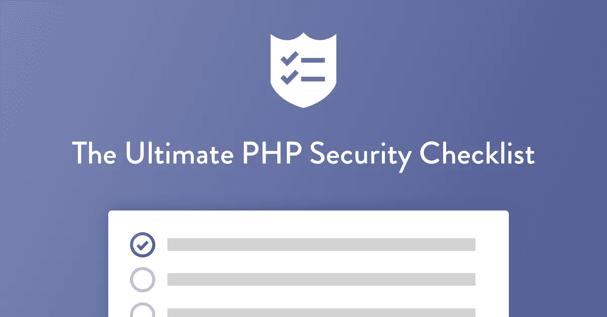

# 终极 PHP 安全清单

> 原文：<https://medium.com/hackernoon/the-ultimate-php-security-checklist-eec9895f2fa3>

该死，但是安全很难。需要做什么并不总是显而易见的，良好安全性的回报充其量也是模糊的。当它从我们的优先列表中消失时，谁会感到惊讶呢？

这个安全清单旨在为开发人员提供一个 PHP 安全最佳实践列表，他们可以遵循这些实践来帮助提高代码的安全性。

下面是一些 PHP 安全检查表的选项(*阅读完整的检查表* [***这里***](https://www.sqreen.io/checklists/php-security-checklist) *)*

# 过滤和验证所有数据

不管数据来自哪里，不管是配置文件、服务器环境、GET 和 POST，还是其他任何地方，都不要相信它。过滤并验证它！通过使用一个可用的库，比如 zend-inputfilter，可以做到这一点。

**阅读更多:**

*   [Zend 框架中的验证](https://framework.zend.com/blog/2017-06-13-zend-validator.html)
*   [Symfony 中的验证](https://symfony.com/doc/current/validation.html)
*   [在 Laravel 中验证](https://laravel.com/docs/5.6/validation)

# 使用参数化查询

为了避免 SQL 注入攻击，不要将 SQL 字符串与外部数据连接或插入。请改用参数化查询和预处理语句。这些可以与特定于供应商的库一起使用，或者通过使用 PDO 来使用。

**了解更多:**

*   [在 PDO 准备好的语句和存储过程](https://secure.php.net/manual/en/pdo.prepared-statements.php)
*   [Mysqli 准备的报表](https://secure.php.net/manual/de/mysqli.quickstart.prepared-statements.php)
*   [PostgreSQL pg _ query _ params 函数](https://secure.php.net/manual/en/function.pg-query-params.php)

# 设置 open_basedir

`open_basedir`指令限制 PHP 可以从`open_basedir`目录及以下访问文件系统的文件。不能访问该目录之外的任何文件或目录。这样，如果恶意用户试图访问敏感文件，如`/etc/passwd`，访问将被拒绝。

**阅读更多:**

*   [open_basedir 配置指令](https://secure.php.net/manual/en/ini.core.php#ini.open-basedir)
*   [PHP 文件系统安全性](https://secure.php.net/manual/en/security.filesystem.php)
*   [数字海洋的隔离执行环境](https://www.digitalocean.com/community/tutorials/7-security-measures-to-protect-your-servers#isolated-execution-environments)

# 检查您的 SSL / TLS 配置

通过定期扫描，确保服务器的 SSL/TLS 配置是最新的且配置正确，并且没有使用弱密码、TLS 的过期版本、没有弱密钥的有效安全证书等。

**阅读更多:**

*   [SSL 实验室](https://www.ssllabs.com/)
*   Mozilla 的[天文台](https://observatory.mozilla.org/)

# 使用 TLS 或公钥连接到远程服务

当访问任何数据库、服务器或远程服务(如 Redis、Beanstalkd 或 Memcached)时，总是使用 TLS 或公钥。这样做可以确保只允许经过身份验证的访问，并且请求和响应是加密的，数据不会以明文形式传输。

**阅读更多:**

*   [公钥基础设施和 SSL/TLS 加密](https://www.digitalocean.com/community/tutorials/7-security-measures-to-protect-your-servers#public-key-infrastructure-and-ssltls-encryption)
*   [什么是 SSL、TLS 和 HTTPS？](https://www.websecurity.symantec.com/security-topics/what-is-ssl-tls-https)
*   [SSL 与 TLS 有什么区别？](https://www.globalsign.com/en/blog/ssl-vs-tls-difference/)

# 不要在标题中发送敏感信息

默认情况下，PHP 会在 HTTP 头中设置他的版本号。一些框架也可能做同样的事情。

**阅读更多:**

*   从 HTTP 头中隐藏 PHP 和 Apache 信息

# 记录所有的事情

无论您记录的是失败的登录尝试、密码重置还是调试信息，都要确保您是在用一个易于使用的成熟的包(如 Monolog)进行记录。

**阅读更多:**

*   [独白](https://github.com/Seldaek/monolog)
*   [PHP 日志基础知识](https://www.loggly.com/ultimate-guide/php-logging-basics/)

# 制定内容安全政策

无论您有一个单页静态网站、大型静态网站还是复杂的基于 web 的应用程序，都要实施内容安全策略(CSP)。它有助于缓解一系列常见的攻击媒介，如 XSS。

**阅读更多:**

*   [通过 MDN 网络文档的内容安全政策(CSP)](https://developer.mozilla.org/en-US/docs/Web/HTTP/CSP)
*   [通过谷歌 Chrome 扩展文档的内容安全政策(CSP)](https://developer.chrome.com/extensions/contentSecurityPolicy)
*   [CSP 评估员](https://csp-evaluator.withgoogle.com/)
*   [内容安全策略(CSP)验证器](https://cspvalidator.org/#url=https://cspvalidator.org/)
*   [使用 Sqreen 轻松添加内容安全策略](https://www.sqreen.io/)

> **想要更多？点击查看完整清单**

*原载于*[*www . sqreen . io*](https://www.sqreen.io/checklists/php-security-checklist)*。*