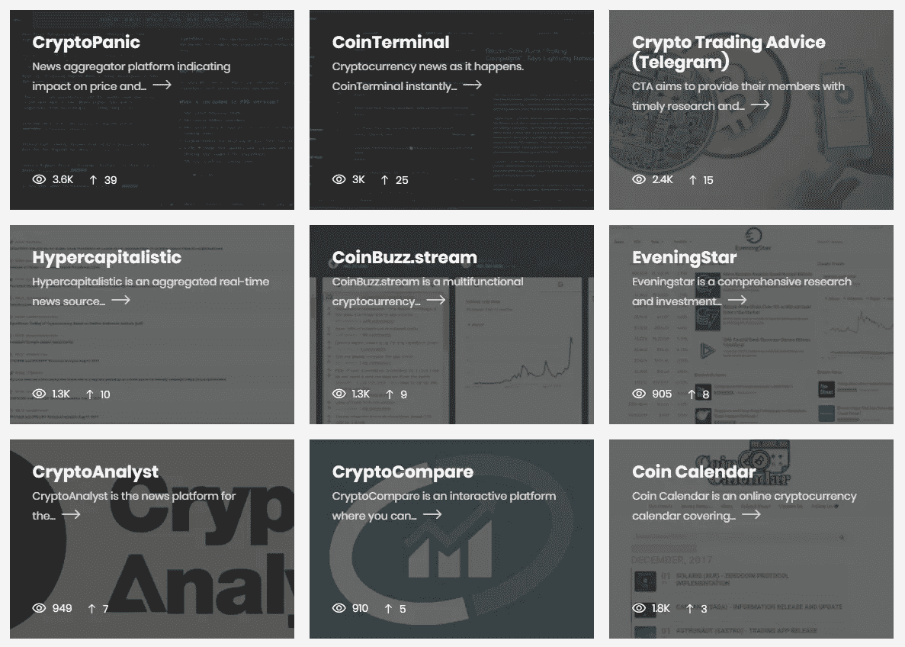

# 密码交易员和投资者的终极资源列表

> 原文：<https://medium.com/hackernoon/the-ultimate-resource-list-for-crypto-traders-investors-954bb7b8a2eb>

# 图表工具和技术分析

*   [TradingView](https://tradingview.go2cloud.org/aff_c?offer_id=2&aff_id=10306) —所有市场的专业制图[工具](https://hackernoon.com/tagged/tools)
*   [Coinigy](https://www.coinigy.com/?r=fad206e0) —加密专用制图工具&交易平台
*   [CryptoWatch](https://cryptowat.ch/) —北海巨妖旗下的多兑换图表工具

# 分散交易所

*   [IDEX](https://idex.market/) — ERC-20 代币交易所
*   [以太三角洲](https://etherdelta.com/#PPT-ETH) —运行智能合约的 ERC-20 令牌交换
*   [ForkDelta](https://forkdelta.github.io/#!/trade/DAI-ETH) —针对 EtherDelta 的大幅改进的用户界面
*   [波浪](https://wavesplatform.com/)

# 新闻聚合器

*   [密码恐慌](https://cryptopanic.com/)
*   [CoinTerminal](https://site.cointerminal.co/)
*   [CoinBuzz](https://coinbuzz.stream/)
*   [共同旁观者](https://coinspectator.com/)
*   [CryptoFlash.io](http://cryptoflash.io/)
*   [ccowl](https://www.ccowl.com/news)
*   [隐袭事件](http://cryptohappening.com/)

# 价格提醒和通知

*   [Cryptalert](https://cryptalert.com/) —简易价格提醒(web & mobile)
*   [coin flash app](https://coinflashapp.com/googlebot.html)——谷歌趋势提醒[比特币](https://hackernoon.com/tagged/bitcoin)(网络&移动)
*   [CoinMarketAlert](https://coinmarketalert.com/) —价格提醒网络应用
*   [Coinwink](https://coinwink.com/#email) —电子邮件&短信价格提醒

# 即将到来的加密事件

*   [共同市场](https://coinmarketcal.com/)
*   [CoinsCalendar](https://www.coinscalendar.com/)
*   [Coindar](https://coindar.org/en)

# ICO 信息

*   [ICO 预警](https://www.icoalert.com/)
*   [ICO 日历](https://cointelegraph.com/ico-calendar)
*   [ICO 倒计时](http://www.icocountdown.com/)
*   [ICO 追踪器](https://icotracker.net/)
*   [ICO 工作台](https://icobench.com/)
*   [ICO 下降](https://icodrops.com/)
*   [加密路线图](https://crypto-roadmaps.com/)
*   [ICO 统计](https://icostats.com/) —追踪 ICO 投资表现
*   [以太探索者](https://ethplorer.io/) —以太币价格分析

# 市场资本化

*   [硬币市值](https://coinmarketcap.com/) —数百个加密市场的价格数据
*   [实时硬币手表](https://www.livecoinwatch.com/) —实时加密价格数据
*   [crypto occuring](http://cryptohappening.com/market/)—许多加密市场的实时价格数据
*   [硬币审核](https://coincheckup.com/coins/bitcoin/analysis) —价格数据结合项目分析
*   [Coin Gecko](https://www.coingecko.com/en) —开发商和社区排名的价格数据
*   [athcoincindex](https://athcoinindex.com/)——历史最高价格&日期
*   [Coin360](https://coin360.io/) —顶级硬币可视化地图

# 分析工具

*   [Sifr 数据](https://www.sifrdata.com/) —各种价格指数和相关性的数据可视化
*   [Coin Monsta](https://coinmonsta.io/metrics) —社交媒体指标和情感分析
*   [CoinTrading.ninja](https://cointrading.ninja/correlation) —加密价格变动和相关性的可视化
*   [OnChainFx](https://onchainfx.com/) —价格&带有附加分析工具的市值数据

# 桌面交易软件

*   [保证金](https://margin.de/) —桌面技术分析工具和交易平台
*   [TradeDash](https://tradedash.io/) —内置制图工具的桌面交易平台

# 加密交易机器人

*   [CryptoHopper](https://www.cryptohopper.com/?atid=1178) —基于云的加密交易机器人& backtester
*   [HaasOnline](https://www.haasonline.com/?ref=2148) —专业桌面交易自动化
*   [利润拖车](https://profittrailer.com/pt/lucaswyland/) —带有报告仪表板的自托管交易机器人
*   [GunBot](https://thecryptobot.com/?gun=2930) —集成了 TradingView 的自托管交易机器人
*   [CryptoBlizz](https://www.cryptoblizz.com/?rfa=1643) —自托管加密交易机器人
*   [CryptoTrader](https://cryptotrader.org/?r=2723) —云托管平台，开发您自己的策略
*   [C.A.T](https://cryptocatbot.com/?ref=416) —多交易所集成的自托管交易机器人

# 投资组合跟踪

*   [德尔塔](https://getdelta.io/) —移动、网络和桌面
*   [组合证券](https://www.blockfolio.com/) —仅限手机
*   [AltPocket](https://altpocket.io/) —网络和手机
*   互联网和手机
*   [CryptoTrackr](https://cryptotrackr.com/) —仅限网络
*   [CryptoCompare 投资组合](https://www.cryptocompare.com/portfolio/) —仅限网络
*   [共同追踪](https://cointracking.info/?ref=L326841) —网络和移动
*   [Acrypto](https://acrypto.io/) —仅限 Android
*   [TabTrader](https://tab-trader.com/) —投资组合跟踪&移动交易平台
*   [质量块](https://massblock.io/) —移动
*   [Bitsnapp](https://bitsnapp.com/)
*   [数字高尔基](https://www.digitalgolgi.com/)

# 软件钱包

*   [Exodus](https://www.exodus.io/) —时尚的多币种钱包(仅限台式机)
*   Jaxx —多币种钱包(网络和桌面)

# 硬件钱包

*   [账本钱包](https://www.ledgerwallet.com/r/5f4f) —多币种安全硬件钱包
*   [Trezor 钱包](https://trezor.io/) —安全比特币硬件钱包
*   [KeepKey](https://www.keepkey.com/) —多币种硬件钱包
*   [bitkey](https://bitkey.io/) —为钱包创建气隙计算机的图像工具

# 税收工具

*   [密码交易商。税收](https://www.cryptotrader.tax/)
*   [比特币。税收](https://bitcoin.tax/r/342ntsRhB)
*   [Libra ax](https://www.libratax.com/login)
*   [硬币跟踪](https://cointracking.info/?ref=L326841)

# 交易子街道

*   [/r/加密货币](https://www.reddit.com/r/CryptoCurrency/)
*   [/r/cryptomarkets](https://www.reddit.com/r/CryptoMarkets/)
*   [/r/bitcoinmarkets](https://www.reddit.com/r/BitcoinMarkets/)
*   [/r/altcoin](https://www.reddit.com/r/altcoin)
*   [/r/ethtrader](https://www.reddit.com/r/ethtrader/)
*   [/r/ethtraderpro](https://www.reddit.com/r/ethtraderpro/)
*   [/r/h 分析](https://www.reddit.com/r/EthAnalysis/)
*   [/r/liteconominates](https://www.reddit.com/r/LitecoinMarkets/)
*   [/r/neotrader](https://www.reddit.com/r/Neotrader/)
*   [/r/xmrtrader](https://www.reddit.com/r/xmrtrader/)
*   [/r/I 市场](https://www.reddit.com/r/IOTAmarkets/)
*   [/r/reqtrader](https://www.reddit.com/r/REQTrader/)
*   [/r/siatrader](https://www.reddit.com/r/siatrader/)
*   [/r/algotrading](https://www.reddit.com/r/algotrading/)

# 诈骗追踪

*   [BadBitcoin](http://www.badbitcoin.org/) —诈骗和虚假网站的黑名单

# 多方面的

*   [迈克菲预测追踪器](https://fnordprefect.de/) —比特币价格 vs 迈克菲的 2020 年赌注
*   [MtGox 钱包监视器](https://www.cryptoground.com/mtgox-cold-wallet-monitor/) —监视 MtGox BTC 的移动
*   [Yeenot。今日](https://yeenot.today/catalog/) —验证加密信号和加密新闻的影响
*   [历史新高](https://alltimehigh.ly/) —测量最高价硬币之间的差价
*   [比特币讣告](https://99bitcoins.com/bitcoinobituaries/)

*用*[***CryptoTrader***](https://www.cryptotrader.tax)***轻松报告您的加密货币资金收益。*税**。

*原载于 2018 年 4 月 27 日*[*www . cryptotrader . tax*](https://www.cryptotrader.tax/trading/the-ultimate-resource-list-for-crypto-traders-investors/)*。*

[https://upscri.be/hackernoon/](https://upscri.be/hackernoon/)