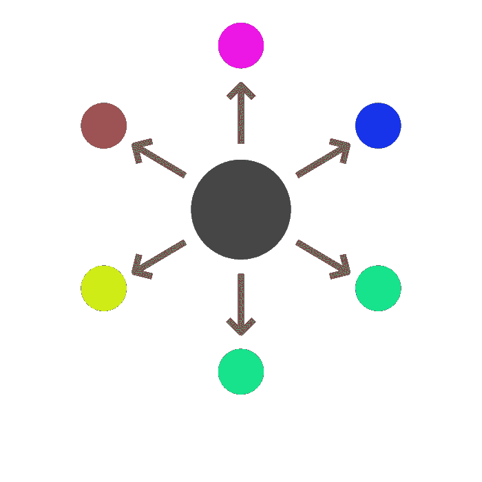

# 非捆绑创业

> 原文：<https://medium.com/hackernoon/the-unbundled-startup-26254cbff9ed>

Unbunded Startup. Image by Juan Pablo Bravo from the Noun Project

公司的成立，虽然有所增加，但与风险资本开始以来的情况基本相同。

通常是这样的:

一个人，或者一个小团体有了一个想法，创造了一些东西。无论是 slide-ware，还是 MVP，团队都展示了他们可以在上面执行。他们试图获得一些吸引力，以显示人们想要这种产品。他们在沙丘路走来走去，直到一张支票落入他们手中，同时勒索家人和朋友。用加速器、孵化器或其他选择代替硅谷之旅。一旦有了一点吸引力和一个 MVP，并且他们已经能够销售他们的故事，团队就会雇佣。我们拿一个传统的 SAAS app 来说。这个团队应该能够执行前端、后端、销售、营销、筹资和会计工作。一家[区块链](https://hackernoon.com/tagged/blockchain)公司怎么样？是 SAAS +密码术，智能合约，分布式计算。公司必须成为更多领域的专家。一项艰巨的任务。

然而，这已经奏效了。今天的每一只独角兽都来源于这个故事的一个微小变体。但是如果有不同的方法来达到同样的结果呢？

一般来说，结果是什么？

*   影响
*   解决问题
*   投资者/创造者/参与者的回报
*   一次有趣的旅行？
*   (一个出口)

最后一个相对较新。如今，人们在组建公司时会考虑他们要卖给谁。情况并非总是如此。早期的互联网公司没有收购的概念。他们建立了一些公司，希望能继续发展到财富 500 强的规模。这是一种与今天截然不同的心态。在我主持的 [Meetup](https://www.meetup.com/Decentralization-and-Venture-Capital) 上，我遇到了两位年轻的企业家，他们开发了一款小型计算机视觉应用，他们希望自己的技术会成为谷歌的收购目标。给人们带来价值，或者解决世界上的一个现实问题呢？

> “技术赚钱有两种方式。捆绑和非捆绑。”

**分权+松绑**

我想通过两个例子来说明一个非捆绑的[创业公司](https://hackernoon.com/tagged/blockchain)是如何运作的。请记住，当前方法和非捆绑方法之间的一个主要区别是，以这种方式构建的每个项目都可能比创建它们的团队存在的时间更长。如果涉及智能合同，30 年后仍有人可以运行以太坊节点并使用它。

**解绑 Dapp**

从理论上讲，您可以为 crypto kitties 创建一个新的前端，收取一定的费用，然后将其余的功能转移到原来的 crypto kitties 智能合约中。你可以在他们已经完成的工作的基础上建立自己的公司，加入你的风格或风格，增加某种价值。无论该价值是一组新资产，还是仅仅是一个不同的 UX，您不必是智能合同、后端可伸缩性或数据库管理方面的专家。你只需要知道如何构建一个前端和一点点 api 来与合同交互。如果你已经知道如何制作前端，你可以在一个下午学习第二部分。我期待在 2018 年看到更多这方面的实验，希望超越 CryptoKitties。

这意味着什么？想到的一点是，后端开发人员或智能合同开发人员有更多的权力指导前端的可能性。可以说，他们制定了规则，限定了范围……最初。这个故事的另一个版本将添加新功能或减少功能的智能合约堆叠起来，从而实现其他前端可能性。后端也是如此。一个例子是在 [0x](https://0xproject.com/) 之上的一个层，以创建一个更好的、规范的方法来保存和匹配分散的交换订单。在那个世界里，你可以让其他开发者参与进来，通过构建你不知道怎么做或不想做的部分，并通过提供一种补偿机制(可能在智能合同中)来奖励他们。来自一个前端的用户在已签名的交易中粘贴一个标识符，智能合约可以解析并奖励该标识符，或者相应地采取行动。

**分拆一家公司**

如果一家公司将他们团队的*能力*垂直化会怎样？

让我们以一个虚构的公司 *BetterCenter* 为例。它们通过一些控制 HVAC 系统的软件层来降低运行数据中心的成本。这个团队通常由销售团队、开发人员、营销人员、高管等组成。相反，他们利用所有这些资源，投资寻找 5 名出色的嵌入式系统开发人员，并编写代码以降低 50%的数据中心冷却成本。

所以产品的核心已经准备好了，但是他们不认识暖通行业的人。与其雇用一个已经有这些关系的全职业务开发人员，为什么不激励已经在这个行业的人购买公司的股份，并试图利用他/她已经认识的人来销售。这与今天的现实世界没有太大的不同，尽管我认为在整个公司这样做的意义是完全不同的。

虽然开发工作的“困难部分”已经完成，但没有前端。人们需要某种方式与系统互动，但 BetterCenter 只有嵌入式工程师，他们对 UX 的 U 或 X 一无所知。

BetterCenter 不是雇佣前端开发人员，而是通过股权或项目收入分成来激励前端的创建。

他们对后端做同样的事情。

还有为了营销。

**但这不就是外包吗？**

在某种程度上，是的，但我认为围绕这个概念建立的组织结构有一些根本的不同。前端开发人员的个人或团队可以在不同的项目之间浮动，每次都获得权益。他们可以将自己标榜为首选前端团队。如果代码是开源的，或者智能合约接口是已知的，那么无论原始团队是否允许，都可以这样做。

一个已经在一个垂直行业中有很好关系的业务开发专家团队可以协商很好的佣金，并且比一个团队第一次尝试进入这个行业或组织的速度更快。

我认为在这个世界上，公平和支出的分配会更加公平。创始人不需要筹集那么多的资金，也不会那么受制于向他们借钱的人的权力。或许这一切都可以通过自举实现。贡献者将能够分享他们帮助创造的收入。甚至创始人的概念也发生了变化。尽管存在先有鸡还是先有蛋的问题，但我们已经看到了 CodeCanyon 和 Envato Marketplace 甚至 wordpress 等网站未来发展的一些端倪。有数以千计的插件，可重用的代码，通用前端，使各种产品的快速开发。智能合约和后端也发生了同样的事情。我不认为这个故事有一个隐含的顺序，它只是这样更好地流动，因为这是我们看到它结束的唯一方式之一。

这不仅仅局限于公司。一首歌，一个乐队，一个电影剧本，或者一本书呢？他们都会利用一些基本的操作原理。也许有一个软件层来促进这一进程。

在很大程度上，这种想法被局限于一个零比一的问题。如何开始。但是，随着组织的成长，甚至可能具体化，这种基础上有各种各样的选择。

选择性是最重要的。