# 地下加勒比比特币世界:影子人访谈

> 原文：<https://medium.com/hackernoon/the-underground-caribbean-bitcoin-world-interview-with-shadow-man-f0702143be08>

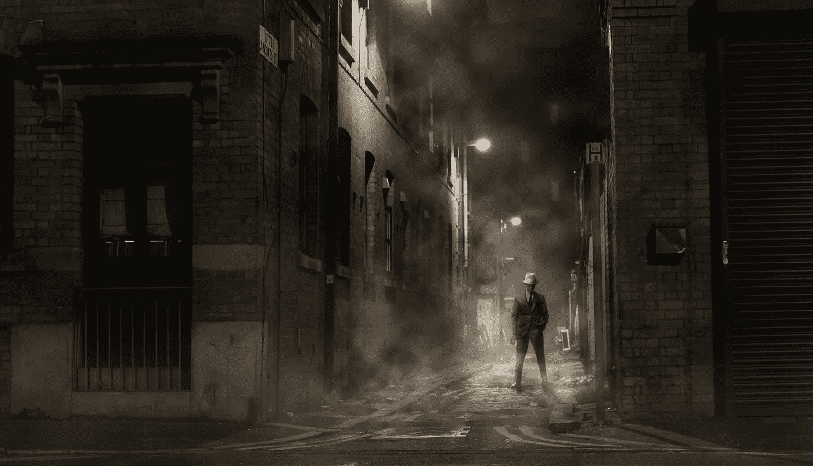

There is nothing dubious about Shadow Man. He just wishes to remain in the shadows, which is something I can respect.

这座有 200 年历史的加勒比海城市的空气很粘。所有的建筑都是原始建筑，我无法停止思考我听到的关于这个地方的疯狂故事。几年前，在更严格的银行法通过之前，世界上许多最大的贩毒集团据称在这里清洗了数十亿美元。我真的不知道我让自己陷入了什么，但影子人似乎是一个很酷的人，有一个有趣的故事。

几个月前，我们在一个比特币聊天群中随机相遇，讨论了我写的一篇文章，“[勒索、警方突袭和保密:委内瑞拉比特币采矿世界内幕”。](https://hackernoon.com/extortion-police-raids-and-secrecy-inside-the-venezuelan-bitcoin-mining-world-6e97a25e7402)“影子人从现实生活的角度理解了地下的加勒比海比特币世界。他还直接与印度、委内瑞拉和其他南美国家打交道。他不只是理解它。他是先锋。

我们约定在一家餐馆见面，当我在餐桌旁坐下时，我意识到我甚至不知道这个人的名字和长相。各种想法在我脑海中闪过。五分钟后，一个衣着光鲜的年轻人走进来，他穿着一件剪裁考究的西装外套。我们进行了眼神交流，我挥手让他过去。然后我们介绍了自己，不久之后，我们就深入到了比特币的话题中。

在他告诉我更多关于他自己和他的生意的情况后，我一直在想，“世界上的大多数人都不知道这件事还在继续。”我们每天都在阅读关于开发商、风险投资交易和 ICO 的文章，但我们很少听到人们在生态系统中开拓自己份额的真实生活故事。

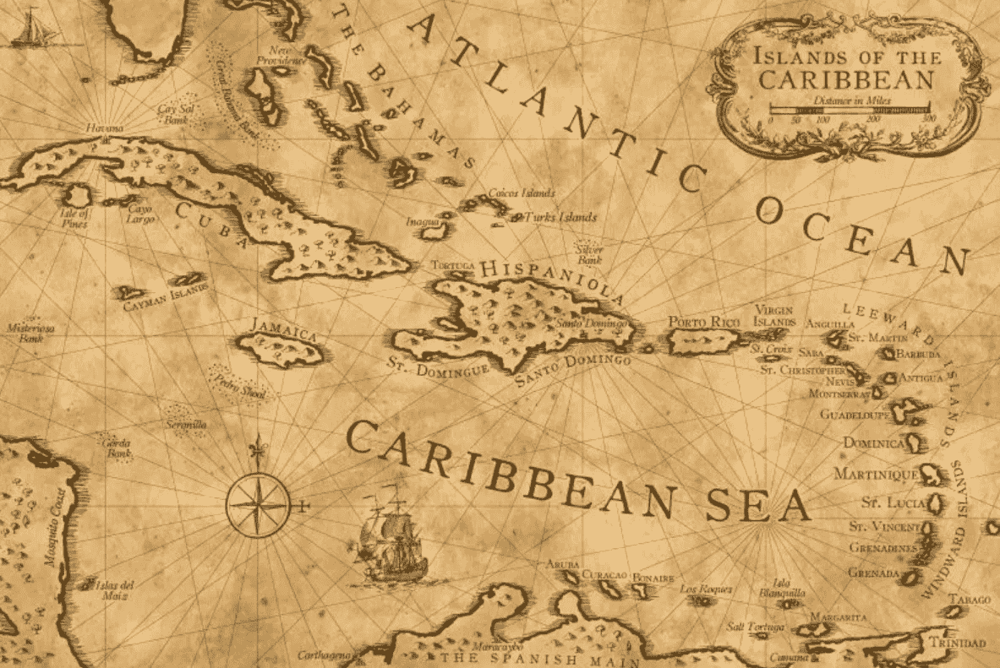

“Not all treasure is silver and gold mate.” Captain Jack Sparrow

# **影子人是谁？**

当我们即将分手时，我问是否可以采访他。和大多数比特币地下的人一样，他一开始是婉拒的。我告诉他我会对他的身份和位置保密。这就是影子人这个名字的由来。这件事毫无疑问。他只是希望留在暗处，这是我可以尊重的。

我回到美国的几个月后，我们重新联系并安排了这次采访。为了保护他的隐私，我们忽略了他的一些业务细节。毫无疑问，影子人将比特币带到了他的岛国和周边国家。他是一个比特币企业家在世界偏远地区发展生态系统的完美例子。

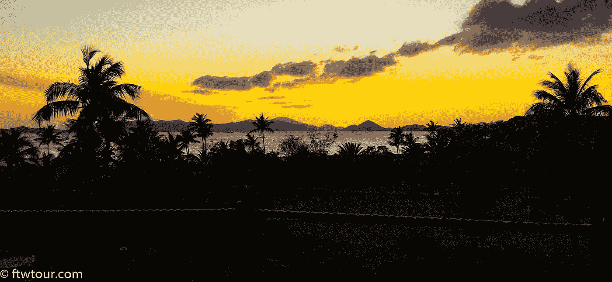

The internet is a crazy place. I dont reccomend meeting random people in foreign places unless you know them well.

## 您来自世界的哪个地区？

我来自加勒比海的一个岛屿。

## **你为什么希望匿名？**

我重视我的隐私；我与委内瑞拉的交易员做生意，这对大多数国家的监管机构来说都是一个自动的危险信号。

## 你为什么和我说话？

有很多关于比特币的错误信息，所以如果我在这里分享的信息有教育价值，我完全支持。此外，我想通过提供我在日常生活中如何使用比特币的例子来揭穿“nocoiner”关于比特币不能用作真实货币的说法。

## **你的技术背景、教育或正规培训是什么？**

我不会说我有技术背景，但我可以说我比大多数正常人更懂技术，(感谢上帝；好的 OPSEC 是艰难的。我在美国的一所大学学习商业，但从未毕业。

## **你是什么时候对比特币和密码产生兴趣的？**

我第一次听说比特币是在 2011 年，和大多数人一样，是一个朋友向我展示了这种在网上购买药物的绝妙方式。我发现它很酷，但没有完全理解它，所以我放弃了它。

它在 2013 年中期对我来说再次浮现，从那以后我就爱上了它。

## **你第一次买比特币是什么时候？**

2013 年，在 mtGox 上。

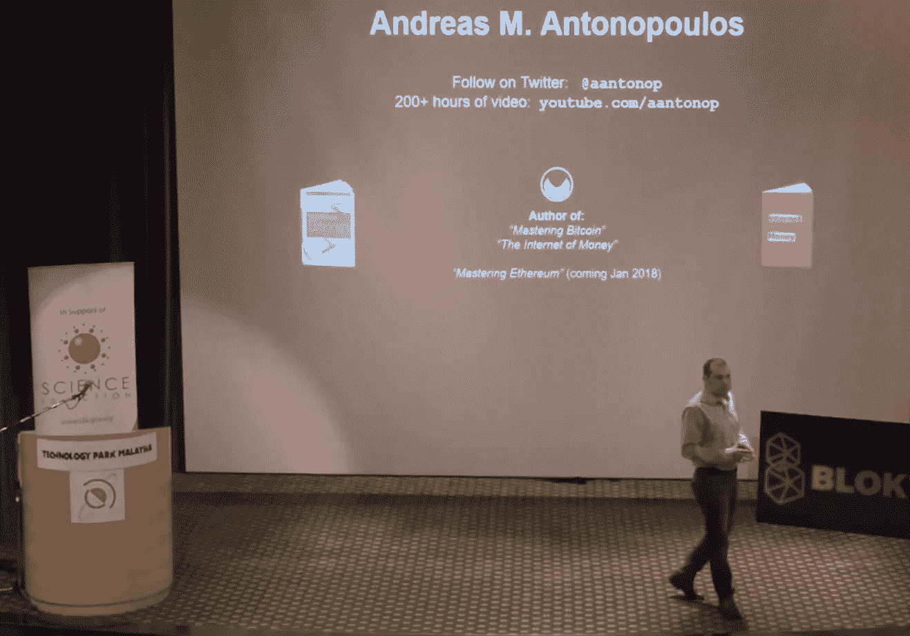

[Andreas Antonpopulous is a legend. His videos will teach you what you need to know about Bitcoin.](https://www.youtube.com/aantonop)

## **比特币是什么吸引了你？**

最初是价格行动。但后来我开始在 YouTube 上狂看安德烈亚斯·安东诺普洛斯的视频。他曾经在早期的比特币小组 hangouts 上，提到过奥地利经济学。这让我开始阅读米塞斯、罗斯巴德等的文学作品。很长一段时间以来，我一直对国家机器不屑一顾，但从未真正意识到经济学是这一切的核心。此外，中本研究所的赛博朋克作品内容丰富，读起来非常有趣。

## **你最大的比特币失败是什么？**

我要说我最大的加密失败是最近我搞砸了我的一个 Monero 钱包([mymonero.com](http://mymonero.com/))。)我相信我成为了网络钓鱼重定向攻击的受害者。损失了一大笔钱，但这迫使我学习如何生成安全的纸质钱包。在这个空间里，你怎么小心都不为过；只有偏执狂才能生存。

## **你最喜欢的一个比特币瞬间是什么？**

在 mainnet 上部署闪电网络。许多业内人士认为，这是一个游戏规则的改变者，将实现我们甚至无法想象的事情。

## **对你影响最大的几位比特币创造者是谁？**

早期是安德烈亚斯和 T2 组成的比特币小组。另外，我在 YouTube 上看到了一个由 Erik Voorhees 做的演讲，题目是“[比特币作为货币的角色](https://www.youtube.com/watch?v=H2YllvbJo6g)”在 Voorhees 短视地公开支持 Segwit2x 之后，我有点失去了对他的尊重，但我仍然感谢他早期的布道。

如今，我所敬仰的一些比特币创造者，排名不分先后:[吉米·宋](https://twitter.com/jimmysong)、[尼克·萨博](https://twitter.com/NickSzabo4)、[亚当·贝克](https://twitter.com/adam3us)、[埃里克·隆布罗佐](https://twitter.com/eric_lombrozo)、[安德里亚斯](https://twitter.com/aantonop)、肉食者最大主义者([罗查德](https://twitter.com/pierre_rochard)、[赛弗迪安](https://twitter.com/saifedean)、[戈尔斯坦](https://twitter.com/bitstein)、[弗朗西斯·普利奥特](https://twitter.com/francispouliot_)

## **你在比特币身上看到了什么别人可能没有生活在加勒比海的东西？**

帮助非法移民给家人寄钱的能力。尤其是对像委内瑞拉这样动荡不安的国家。

## **你所在的加勒比海地区的比特币世界是什么样的？**

很小众。这里有一个定期聚会，但没有什么接近主流的采纳。

## **在你的岛上或你身边，你认识多少持有比特币的人？**

我让我的一些家人和朋友参与其中。此外，参加比特币聚会的少数人。

## **在你住的地方，大多数人是怎么买到他们的比特币的？**

通过网上交流，我相信。

## 你的岛上有任何采矿活动吗？

有传言，但我无法证实。

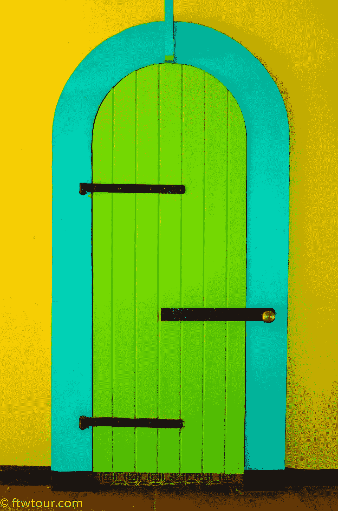

Being in an old Caribbean city talking Bitcoin with Shadow Man made me realize how small the Bitcoin world really is. There are many good people working everyday to help build the economy.

## **你们岛上对比特币的监管是什么样的？**

虽然各国央行对 Onecoin 和 Bitconnect 等骗局发出了警告，但没有官方声明提到比特币。

## **你如何看待各国打击比特币？**

这些镇压是非常短视的，是基于不合理的恐惧。创新和经济增长只会转移到监管更有利于技术进步的地方。我们看到了一个明显的例子，说明了纽约的 btc 企业对比特许可证的反应。在这本名为[《主权个体》(The Sovereign Individual)](https://www.amazon.com/Sovereign-Individual-Mastering-Transition-Information/dp/0684832720)的书中，作者预测，希望经济增长的国家将开始把公民更像顾客而非牲畜一样对待，以吸引企业家。这本书写于 1999 年，非常有先见之明，他们甚至预测了比特币的崛起，或者他们称之为“网络现金”怎么推荐都不为过。

## **稍微解释一下你的生意是如何开始的？**

几年前，我意识到本地比特币可以有效地用于促进汇款。

## **在过去几年里，它的发展如何？**

以前，我经常和想寄钱回家的委内瑞拉移民打交道。他们会给我现金，我会用当地的比特币把钱打到他们在委内瑞拉的银行账户上。我宁愿我的客户收到美元，但不幸的是，将钱转到他们银行账户的唯一途径是当地的恶性通货膨胀货币，委内瑞拉玻利瓦尔。我会做相当于 20 美元的交易。现在，我与镇上的零售店老板打交道，他们有委内瑞拉银行账户，所以他们从我这里购买大量玻利瓦尔，然后反过来将这些玻利瓦尔卖给生活在我岛上的委内瑞拉移民。

这可能听起来很混乱，但基本上是通过非正式汇款市场进行套利交易。

## **您目前提供什么类型的服务？**

我实际上做得更少了，更多地进入企业级加密挖掘。

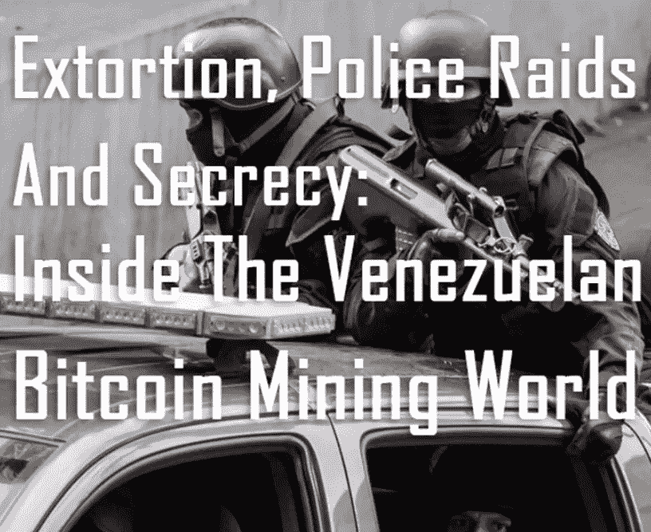

[This is a story I published with HackerNoon in January 2018.](https://hackernoon.com/extortion-police-raids-and-secrecy-inside-the-venezuelan-bitcoin-mining-world-6e97a25e7402)

## 你听说有人被捕了吗？

在我的岛上没有。但是我有时听说矿工在委内瑞拉被逮捕。

## **你的大部分业务是在**[**Localbitcoins.com**](http://localbitcoins.com/)**还是 p2p 上做的？**

我经常使用本地比特币，但我也直接与某些交易者交易，p2p 也是如此。这些是我最初开始用本地比特币做生意的交易商，但后来发展到一个令人舒服的信任水平，以至于不再需要本地比特币有价值的托管功能。

## **解释一下什么是** [**本地比特币**](https://localbitcoins.com/) **以及它是如何工作的？**

[Localbitcoins.com](https://localbitcoins.com/)是一个在线的点对点比特币交易所，允许你与世界各地的个人买卖比特币。杀手级的特色是平台提供的托管服务。

## **使用**[**local bitcoins**](http://localbitcoins.com/)**与普通 p2p 相比，有哪些优缺点？**

优点:

1.令人惊叹的托管功能

2.与世界各地的交易者联系的酷方式。

3.在安全方面的良好记录。

缺点:

1.LocalBitcoins 从每笔交易中抽取 1%的佣金，我相信是 1%。

2.骗子。一些骗子通过与良好的客户反馈进行公平交易来建立他们的声誉，然后利用他们的声誉作为杠杆，试图说服新手在 localBitcoins.com 之外进行交易。

## 对于有兴趣使用 [**本地比特币的人，你有什么小技巧？**](http://localbitcoins.com/)

在开始交易之前，一定要阅读用户的反馈。

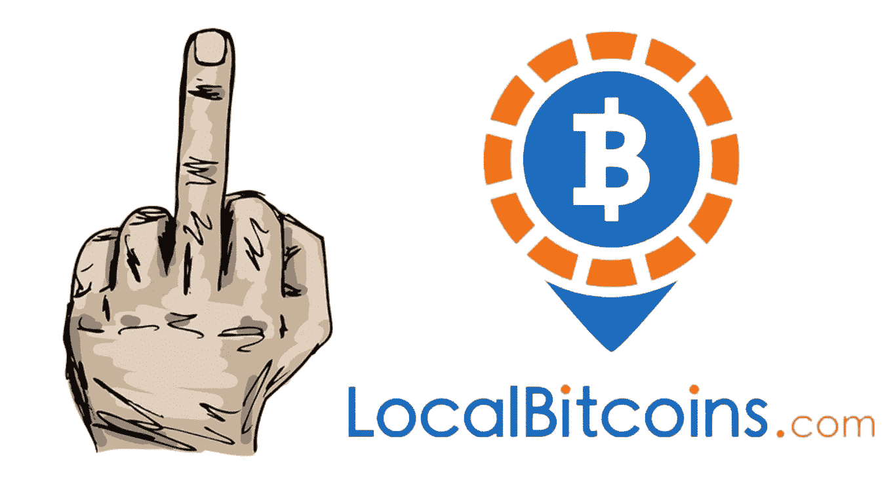

I have never used LocalBitcoins personally, but I have many friends who have.

## **你如何看待** [**本地比特币**](https://localbitcoins.com/) **要求反洗钱/KYC 的新变化？**

这一变化并没有真正影响我的使用。然而，这种变化可能会促使我和许多其他交易者去寻找分散的替代品，如 Bisq。

## **会继续使用**[**local bitcoins**](https://localbitcoins.com/)**吗？**

在可预见的未来，是的。

## 为了更好地保护隐私，除了 LocalBitcoins.com，还有哪些网站是不错的选择？

LocalBitcoins 是我唯一能想到的。还有像 Paxful 这样的，但是我从来没用过。

## **在这些网站上，有哪些容易识别骗子的危险信号？**

在本地比特币用户名旁边，你可以看到交易的数量和百分比。百分比是指反馈分数。明显的危险信号是，如果这个百分比分数不是 100%。这并不是说 100 分的人可以盲目信任。lbc 上的用户评分系统在 imo 上有点瑕疵，可以做得更好。这里的要点是不要被交易者的诡计所迷惑，他们会引诱你在 LBC 平台之外做生意，在决定与任何人交易之前，一定要检查反馈。

## **你和哪个国家的套利交易最多？**

委内瑞拉和印度

## 与玻利瓦尔和委内瑞拉的银行打交道是什么感觉？

毫不夸张地说，与一种每小时都变得越来越不值钱的货币打交道，感觉糟透了。这也是我不再和委内瑞拉有太多贸易往来的原因之一。

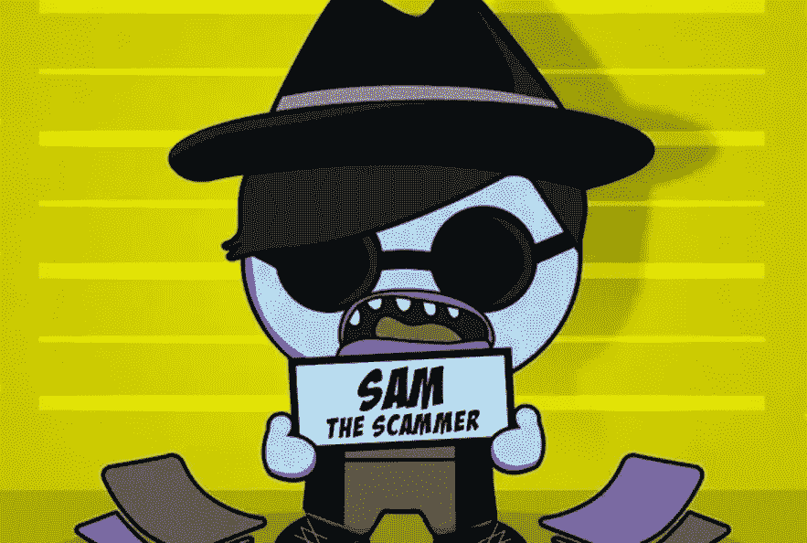

Getting scammed can happen to anyone. You must pay attention at all times. Never believe you are immune.

## **讲一个你遇到过的恐怖故事？**

早期我被一个委内瑞拉商人骗了。我们一起做了一些本地比特币的交易，然后他说服我做本地比特币之外的交易。我一给他发 btc，他就消失了。我唯一能做的就是在他的本地比特币个人资料上留下负面反馈。

## **处理印度对委内瑞拉是什么感觉？**

差不多吧。唯一的主要区别是，委内瑞拉货币是恶性通货膨胀，这意味着价值在不断自由落体。印度卢比相对更稳定。

## **你对像 hodlhodl 和 bisque 这样的去中心化交易所有什么感觉？**

我对这种交流的发展感到非常兴奋。我认为这种模式已经可行，只是需要更多的流动性。激发网络效应的东西，这在我看来是不可避免的。

## **你对存储密码有什么安全建议？**

去拿一个 Trezor。

## **你对另类硬币有什么想法？**

我持有一些推测，但我的袋子主要是 BTC。

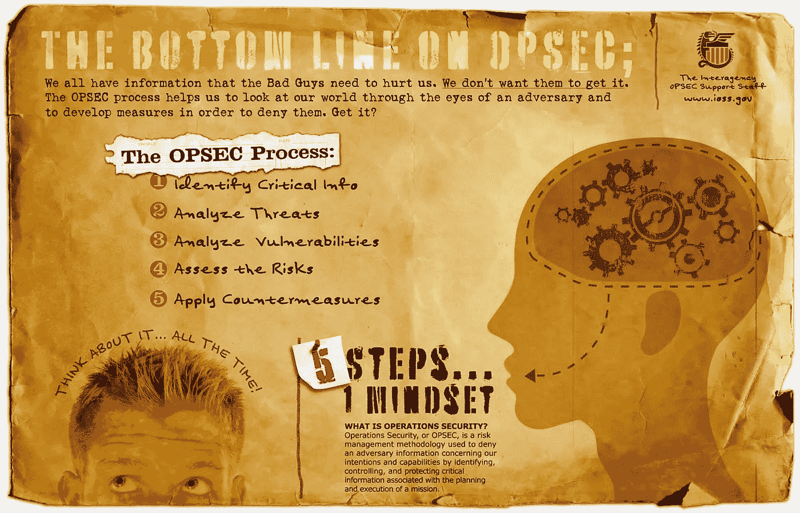

This is a basic break down of OPSEC. Be proactive about implementing and optimizing your OPSEC strategy.

## **您认为加密技术在 5-10-20 年内会走向何方？**

BTC 到月球

## **您参加了今年在阿卡普尔科举办的活动。你最大的收获是什么？**

这是一个狗屎硬币节，由最大的狗屎硬币制造者罗杰·弗赞助。可悲的是，许多参加过的新手都被这种“聪的视觉”的叙述所迷惑。

## **你从哪些比特币新闻网站和播客获取信息？**

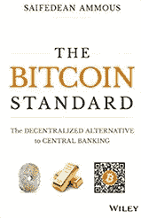

This a great read for any serious Bitcoiner!

主要是推特。我喜欢[比特币群](https://www.youtube.com/playlist?list=PLPj3KCksGbSYWSSADNIM9eDZPbckHgPvx)、[漩涡的](https://twitter.com/theonevortex)、[比特币新闻秀](https://www.youtube.com/playlist?list=PLPj3KCksGbSYHFmduDw4fyKe8H5fEZ6Be)、 [Noded 播客](https://noded.org/)和 [Block Digest](https://www.youtube.com/channel/UCb53lXz2IzEFT5JNHSbdvPg) 。

## 你能给刚接触比特币和另类货币世界的人的最佳建议是什么？

获得良好的视觉效果。

## 有什么最后的想法或至理名言吗？

HODL·BTC！并阅读 Saifedean Ammous' [*比特币标准。*](https://www.amazon.com/Bitcoin-Standard-Decentralized-Alternative-Central/dp/1119473861)

*特别感谢影子人接受采访。比特币将我们永远联系在一起。*

*在 twitter 上找我*[*@ piratebachbum*](https://twitter.com/piratebeachbum)*或*[*Hackernoon/@ piratebachbum*](https://hackernoon.com/@piratebeachbum)[*@ ftw _ tour*](https://twitter.com/ftw_tour)

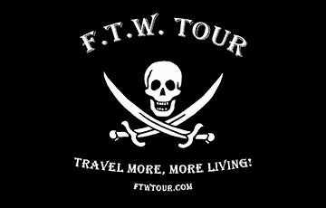

[ftwtour.com](http://www.ftwtour.com)