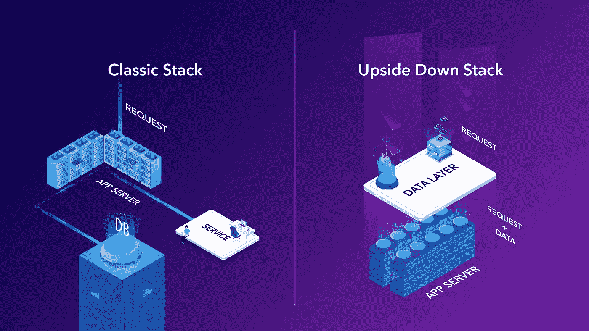

# 静态站点生成器的低调创新

> 原文：<https://medium.com/hackernoon/the-understated-innovation-of-static-site-generators-d188ff8e99af>

这篇文章反映了围绕新一代静态站点生成器的更大图景，这些静态站点生成器目前正在获得关注和采用。

静态站点生成器已经存在了一段时间，该领域的早期参与者是 Jekyll，它在推出时获得了很大的吸引力，引发了 GitHub 页面的诞生，并因此创建了一个对开发者友好的内容解决方案。我们现在看到了像 [GatsbyJS](https://www.gatsbyjs.org/) 这样的新一波静态站点生成器，它们不再局限于开发者受众的发布需求(比如，完全在 GitHub 上管理你的内容)，而是有野心成为*内容发布的*新工具。

当前的静态站点生成器浪潮带来了一个完整的生态系统，使得这一运动的范围比站点构建工具本身甚至不仅仅是内容更广。虽然有很多人关注这对于直接接触浏览器的[应用程序意味着什么，但很少有人考虑这些新堆栈(如](https://www.contentful.com/blog/2018/04/11/new-era-static-sites-rise-future/?utm_campaign=innovation-ssg&utm_medium=referral&utm_source=medium&utm_content=innovation-ssg&utm_term=)[Contentful](https://www.contentful.com/?utm_campaign=innovation-ssg&utm_medium=referral&utm_source=medium&utm_content=innovation-ssg&utm_term=)+[GatsbyJS](https://www.gatsbyjs.org/)+[Netlify](https://www.netlify.com/)为什么会受到关注并被开发团队选择的幕后原因。

# 在游戏服务器中获取数据和一些冒险的运行时

几年前，我在 Wooga 工作，为社交游戏构建游戏服务器——游戏的一个有问题的性能方面是游戏的状态必须非常频繁地更新。这意味着游戏服务器是写重的野兽，以一种方式敲打你的数据库，缓存，这种最常用于提升数据库负载以应对高流量的技术，将不是一个选项。

那时，我开始思考关于运行时位置的选择的含义。所谓运行时，我指的是代码运行的过程——这是指为了执行允许您完成当前请求的操作而需要访问的所有数据库和服务。

我们的应用程序给数据库带来的压力的解决方案是围绕与数据层交互的所有策略的彻底转变；这意味着从每个请求都有一个直接的数据库交互的模型过渡到一个在会话开始时在运行时加载用户的整个游戏状态的模型(我们选择了 Erlang)。你仍然可以找到很多年前的幻灯片，从项目开始的到在生产中运行后的[考虑事项](https://www.slideshare.net/hungryblank/getting-real-with-erlang)。

简而言之，与以前方法相比，该项目将与数据库的交互数量减少了两到三个数量级，并将亚毫秒级响应时间提高了两个数量级。这个想法一定也在游戏行业的其他人头脑中萌发，因为一年后微软推出了 [Orleans](https://github.com/dotnet/orleans) 。

# 我们从运行时数据的推动中学到了什么

那么，我们在 Wooga 关于游戏状态策略的工作现在如何与静态站点生成器相关呢？

在这个主题上的工作使我对栈是如何构建的有了更全面的思考(最后是数据)——运行时是协调所有动作的部分，请求进入运行时，从运行时，你确保许多其他系统被触及或触发。

当一个请求进入你的运行时之后，你编写你的代码，它是两件事情的混合:

1.  与流程外部的元素进行交互

*   读取数据
*   写入数据
*   检查授权
*   触发跟踪

2.为了满足请求而必须执行的实际业务逻辑

现在，如果你想一想大部分痛苦(bug、错误、中断)来自哪两个地方；我敢肯定，前者被认为是更邪恶的地方。

我清楚地记得在一个写作几乎不在画面中的范式中开始编程意味着什么，这使我认识到忍者状态或“流”的想法，你可以在类似于[、](https://gettingthingsdone.com/)或[流](https://www.amazon.com/Flow-Psychology-Experience-Perennial-Classics/dp/0061339202)的书中找到。

这是一种优越的精神状态，在这种状态下，你能够思考并专注于你想要实现的目标，而不会陷入诸如以下的内部对话:

*   “我需要的数据在哪里？”—所有数据都在那里；只需根据需要访问和操作它
*   “这些事情会以什么顺序发生？”—按照你写作的确切顺序，根据你的想法自然地排列
*   “这里面有什么可能失败的吗？”—您可能遇到的唯一问题是手头的数据；但是没有其他干扰或混乱会影响你写的东西(没有网络错误、冲突、竞争情况)。

这些考虑因素让我想到了“颠倒的堆栈”，在这种堆栈中，数据库或其他服务首先出现，而不是在两者之间或随着逻辑的进展而出现，在这种堆栈中，您带着执行请求所需的所有数据和授权进入运行时。

静态站点生成器本质上是构建过程，这些过程是由于静态工件下面的代码或数据的变化而触发的(这是 SSG 构建数据和代码而不是仅仅构建代码的一个新颖之处)。因为这些过程是由数据或代码中的变化触发的，所以这些变化是进入计算的内容，而不是运行时获取的内容。

这就是静态站点生成器类似于“颠倒的堆栈”的原因；数据是第一位的，是你进入流程时所带的东西，而不是只在持续的流程中被追求的东西。

这一愿景已经出现在 Concourse CI 这样的现代构建系统中，其概念是[管道由作业和资源](https://concourse-ci.org/pipelines.html)组成。这种想法的方向是“好的，这项工作是由一些资源的变化触发的，为了执行这项工作，还需要其他资源。”执行一个动作所需的资源的依赖关系树是预先指定的，并且您可以确保在执行一个作业之前所有的资源都在适当的位置。

在这一点上，我认为静态站点生成器是某些模式的早期采用者，这些模式将获得更广泛的采用。如果你有一个数据读得比写得多的领域，构建驱动的方法有很多优势(其中包括出色的性能、低成本和一个[更好的安全模型](https://www.contentful.com/blog/2018/03/16/reducing-the-attack-surface-with-static-sites/?utm_campaign=innovation-ssg&utm_medium=referral&utm_source=medium&utm_content=innovation-ssg&utm_term=))。

# 与无服务器的交集

正如我在上一篇文章中提到的，我预测了无服务器 GraphQL 背后的一些[更大的趋势，无服务器有着比通常所知的更深的含义。例如，它可以被视为一种非常引人注目的技术，用于处理构建驱动的工作负载，如静态站点生成器，您需要处理事件驱动的工作负载(事件由应用程序、数据或域模型的更改生成)，然后随着时间的推移在规模和分布上与服务恒定流量的工作负载不同。](https://www.contentful.com/blog/2018/04/05/graphql-and-serverless-where-cloud-computing-is-heading/?utm_campaign=innovation-ssg&utm_medium=referral&utm_source=medium&utm_content=innovation-ssg&utm_term=)

为了支持构建周期和管道，随着基础设施用于托管这些新类型的架构，无服务器又变得重要起来。[阶跃函数](https://aws.amazon.com/step-functions/)是为了理解未来可能会是什么样子。

# 值得关注的趋势

在结束这篇文章之前，重要的是要看看静态站点生成器代表了什么，以及它们依赖于哪些因素来实现它们目前享有的受欢迎程度。第一个重要的认识是，静态站点生成器可以比名字所暗示的更加动态，如果伴随着当前使用的工具链的重大创新，它们所应用的概念可能会被更广泛地采用。例如，静态站点生成器可能是一个指针，表明构建过程将被重新评估为不仅仅是应用程序逻辑的交付机制。

简而言之，这里有一些值得关注的趋势，因为它们可能成为未来前瞻性思维的种子:

1.  数据在计算一开始就进入运行时，而不是在计算过程中被抓取
2.  触发计算的事件是应用程序逻辑的变化、应用程序处理的域的数据的变化或者数据域本身的变化
3.  可以通过提供一组预编译的资产来满足用户请求(这些资产仅在底层数据更新时构建，而不是在请求时构建)
4.  数据是“构建”的，而不是在每次请求时获取和集成；需要更现代的构建系统和构建系统概念的创新

# 展望未来

重要的是继续观察静态站点的现象如何继续发展，并看到新一代 web 架构的前景，这些架构是基于构建的，而不是当前的以请求/响应为中心的模式。

为了让这种趋势发展，其他趋势需要到位；构建系统和数据库(或数据库前端的系统)是我们需要创新的一些领域。这将是我在本系列后续文章中阐述的内容。

*原载于 2018 年 7 月 17 日*[*【www.contentful.com】*](https://www.contentful.com/blog/2018/07/17/understated-potential-static-site-generators/)*。*