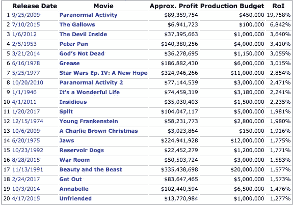

# 独角兽电影——最大投资者对最大赢家

> 原文：<https://medium.com/hackernoon/the-unicorn-movies-biggest-rois-vs-biggest-winners-ad6b9c4fd9af>

有很多参与者参与到电影行业中，比如电影制作公司、电影工作室、动画、编剧、发行；当然还有演员、导演和其他电影工作人员。

所有这些构成了一个全球产业，预计未来几年将达到 380 亿美元。到 2016 年达到 500 亿美元。2020 年。

但当谈到这个行业的收益时，我们所有人都会想到畅销书或票房收入，或者也被称为[的十亿美元电影俱乐部](http://www.imdb.com/imdbpicks/32-billion-dollar-grossing-movies/ls063095038/mediaviewer/rm3587670016)。

当然，我们会在该列表中找到以下五大优势:

1.  **《阿凡达》——全球票房:【2,787,965,087 美元**
2.  《泰坦尼克号》——全球总票房:2，187，463，944 美元
3.  《星球大战:原力觉醒》——全球票房:2068223624 美元
4.  **侏罗纪世界——全球总票房:【1,671,713,208 美元**
5.  **《复仇者联盟》——全球票房:**1，518，812，988 美元

但当我们检查这些电影的投资回报率时，我们可以看到《阿凡达》的总制作预算为 425，000，000 美元。这意味着 556%的投资回报率。对投资者和所有押注詹姆斯卡梅隆项目的人来说，这是一笔巨大的回报。

说到最赚钱的电影，根据投资回报率(ROI)，前面的名单没有一部能排到后面的。

如果我们将它们视为一种资产类别，电影似乎与其他类型的投资无关，并且在一定程度上抗衰退，因为人们仍然会去看电影。

像任何其他投资一样，多样化是一个关键部分。投资一系列电影，而不是一部作品。通过分散投资，风险和回报达到了更恰当的平衡。

电影业只是证实了乔治·索罗斯的名言:

> 赚钱的方法是对显而易见的事情打折扣，对意想不到的事情下注。