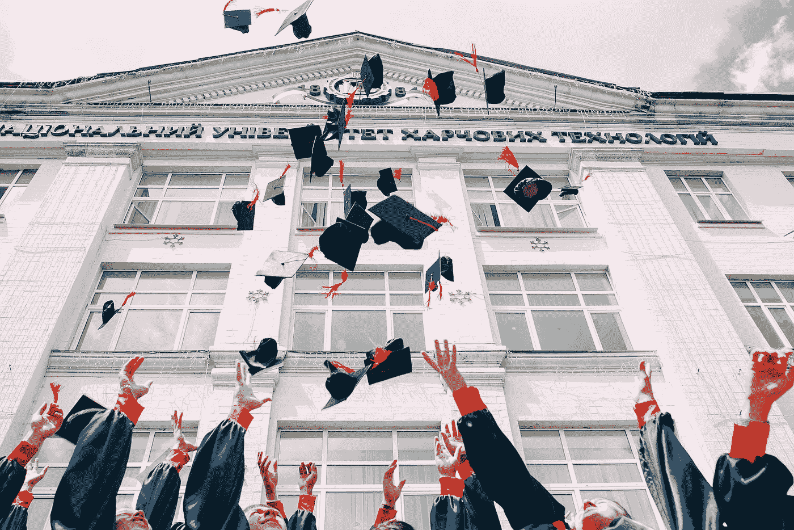

# 当今初创企业独角兽不太可能的学术渊源

> 原文：<https://medium.com/hackernoon/the-unlikely-academic-origins-of-todays-startup-unicorns-3de9325af49a>

*由* [到*约瑟夫*到](https://twitter.com/josephflaherty)

这是哈佛广场的毕业典礼周，成千上万的优秀学生将领取他们的文凭，然后开始成为教授、政治家和创业创始人。即使是哈佛的辍学生也有很好的记录。那些没有机会追随扎克伯格脚步的创业者呢？他们应该放弃在 TechCrunch 上被吹捧的所有希望吗？

 [## 50 家白手起家的大公司

### 风险投资是最成功的科技创业公司的共同特征，但不是先决条件，尤其是在早期…

hackernoon.com](https://hackernoon.com/50-big-companies-that-started-with-little-or-no-money-4ef1b68aac25) 

那鸿在收集 50 家在获得风投之前就已经发展壮大的初创公司的名单时，我惊喜地发现，拥有非典型教育背景的创始人数量之多。当然，常春藤联盟和它的精英表亲都有很好的代表，如 Wayfair(康奈尔大学)、CarGurus(达特茅斯大学)、SimpliSafe(哈佛大学)和 AdaFruit(麻省理工学院)。然而，对于每一个拥有优秀学历的创始人来说，都有一个米歇尔·潘(Michelle Phan)，她从佛罗里达一所以马戏团命名的艺术学校辍学，并继续共同创立了一家名为 Ipsy 的初创公司，自 T12 以来，该公司已经筹集了 1 亿美元，并在该领域处于领先地位。这份名单上有三位非常成功的创始人，他们根本没有接受过高等教育。

仅仅在这个小样本中，就有拥有高中、州立学校、艺术学校和贸易学校学位的创业者，他们已经建立了价值数十亿美元的创业公司。拓宽视角去审视所有的创业公司，可能会产生更多始于象牙塔之外的鼓舞人心的故事。

在所有条件相同的情况下，斯坦福大学的符号系统学位比《美国新闻》*《世界报道》* 排名第 1806 位的[学校的羊皮更能预示创业成功，但缺乏资本或证书不一定是不可逾越的障碍。这里有一个简短的不是从庄严的母校开始的成功故事名人录:](https://www.usnews.com/best-colleges/search?_mode=table&_sort=rank&_sort-direction=asc)

# 高中

Shopify 创始人 Tobias Lütke 去了德国的一所贸易学校，在那里当了一段时间的计算机工程学徒，然后创办了一家价值 150 亿美元的科技巨头 T2。Quizlet 创始人安德鲁·萨瑟兰在创办公司时没有支付一分钱的大学学费，这家公司已经在 T4 筹集了 3200 万美元。Scentsy 的 Colette Gunnell 只需要一个高中文凭就可以创办一家公司，现在每年的收入为 5 亿美元。

# 公立学校

Shutterstock 的创始人和白手起家的亿万富翁乔恩·奥林杰曾就读于石溪大学，该校被《美国新闻》和《世界报道》排名第 97 位。一个更重要的排名是纽约证券交易所授予他的公司的市值，该公司的价值为 15 亿美元。

SparkFun 始于科罗拉多大学的一间宿舍。PaintNite 的联合创始人是一个骄傲的威斯康星獾。MailChimp 的创始人在佐治亚大学起步。加油状态！

# 文理学院

一些创始人上过著名的学校，但没有学习技术或企业家精神。

经济学专业，温斯顿·丘吉尔协会成员，LootCrate 联合创始人[克里斯·戴维斯](https://www.linkedin.com/in/chrisdavis1/)利用在克莱蒙特·麦肯纳学院学到的高雅课程来迎合世界各地流行文化狂热分子的需求。

Lynda.com 创始人[琳达·温曼](https://en.wikipedia.org/wiki/Lynda_Weinman)在常青州立学院获得学位，然后在*比尔和泰德的《T21 历险记》中作为一名特效艺术家自学了计算机图形学的基础知识，这为她同名的教育科技公司铺平了道路。*

彼得·拉哈尔在威登堡大学(Wittenberg University)学习 Poly Sci，并承诺获得 Phi Kappa Psi，这让他具备了足够的商业头脑，将 1 万美元的种子资金转化为 RX Bar，该公司以 6 亿美元收购——正好赶上了他的五周年聚会。

# 杨百翰大学

杨百翰大学在全国大学中排名第 61 位，有一份杰出的校友名单，包括参议员、赢得超级碗的四分卫和《T2》暮光之城的作者。它所没有的，至少在科技界，是与其创始人/首席执行官毕业生的成就相称的声誉。从我列出的创业公司中，你会发现:

● PluralSight 创始人[亚伦·斯科纳德](https://www.linkedin.com/in/skonnard) ( [纳斯达克:PS](https://finance.yahoo.com/quote/ps?ltr=1) ，Mkt。28 亿美元)

●布伦特里创始人[布莱恩·约翰逊](https://www.linkedin.com/in/bryanrjohnson/)(被贝宝以[8 亿美元](https://techcrunch.com/2013/09/26/paypal-acquires-payments-gateway-braintree-for-800m-in-cash/)收购)

● Qualtrics 创始人[瑞安·史密斯](https://twitter.com/RyanQualtrics) & [斯图尔特·奥吉尔](https://www.linkedin.com/in/stuart-orgill-0538894/)(25 亿美元估值)

●InsideSales.com 创始人[大卫·艾尔金顿](https://www.linkedin.com/in/davidelkington/)([)15 亿美元估值](https://www.sramanamitra.com/2017/02/09/2017-ipo-prospects-insidesales-com-raises-new-round-at-flat-valuation/)

● Scentsy 联合创始人[卡拉·伊根](https://www.linkedin.com/in/kara-egan-16716012/)，她拥有 BYU 爱达荷分校的副学士学位

在过去的 10-15 年里，这是一个可以与麻省理工学院相媲美的创业成功记录，在独角兽的数量上，如果不是在总市值上。更令人吃惊的是，这所学校的学费刚刚超过 12，000 美元/年，这证明扎实的技术教育不需要背负大量债务！

# 国际学校

像索邦大学、剑桥大学、印度理工学院和清华大学这样的学校享誉全球。相比之下，不列颠哥伦比亚理工学院在《美国新闻》&《世界报道》中甚至都排不上号，但仍然产生了大量的 Fish 创始人[马库斯·福林德](https://www.linkedin.com/in/markus-frind-6b88b0/)，他以 7 . 5 亿美元的价格卖掉了自己的约会初创公司。

新南威尔士大学[在澳大利亚学院和大学中并列第五](https://www.usnews.com/education/best-global-universities/australia-new-zealand)，成功培养了毕业于亚特兰大的联合创始人，他们通过自己的努力开创了价值 150 亿美元的生意。

所以简而言之，去看书，但不要太纠结在哪里。