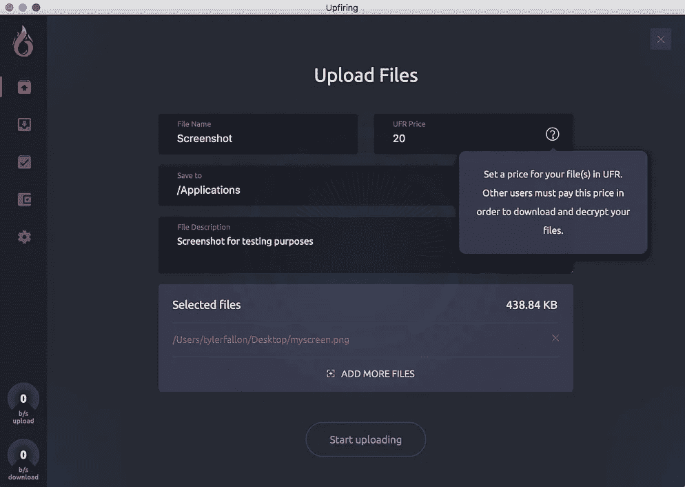
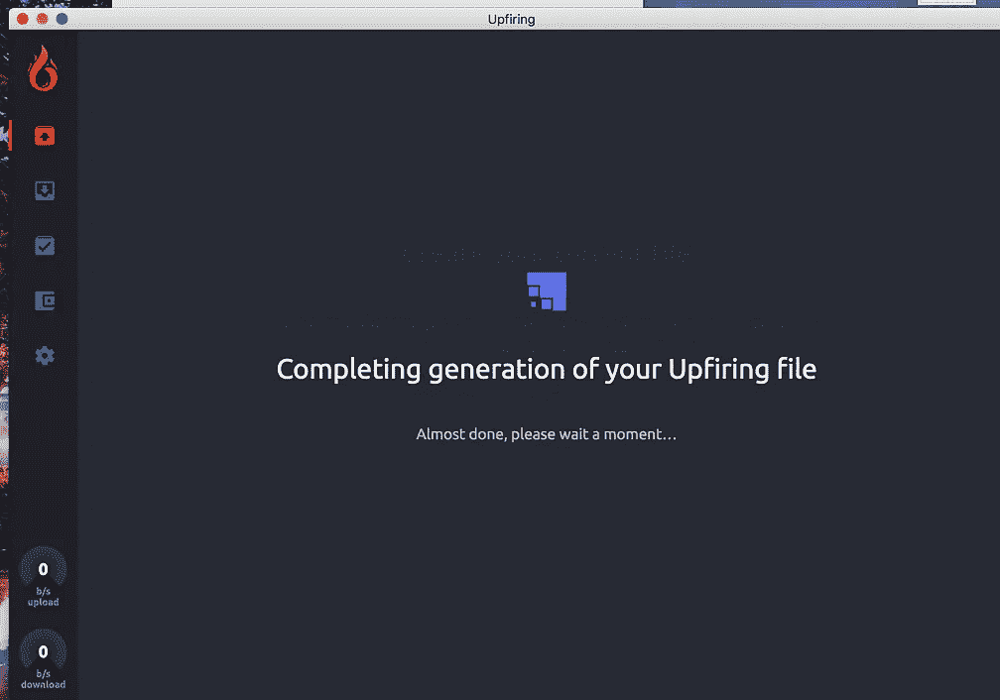
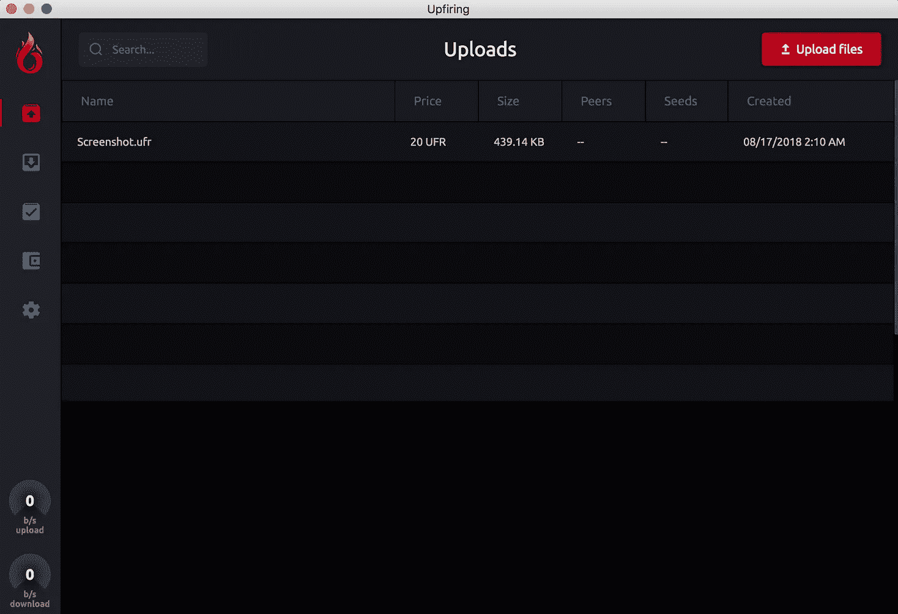
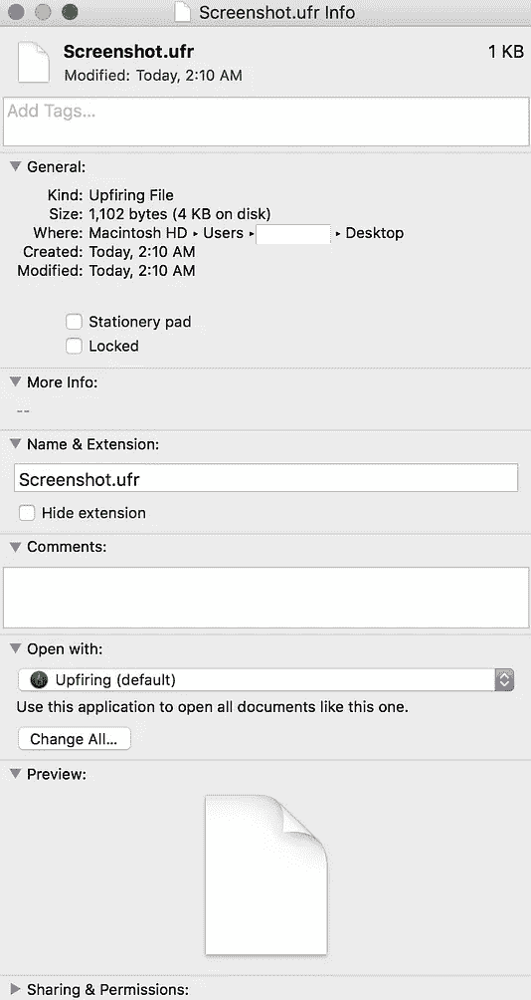
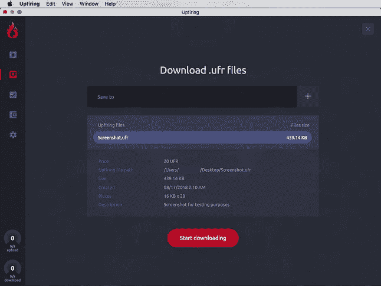
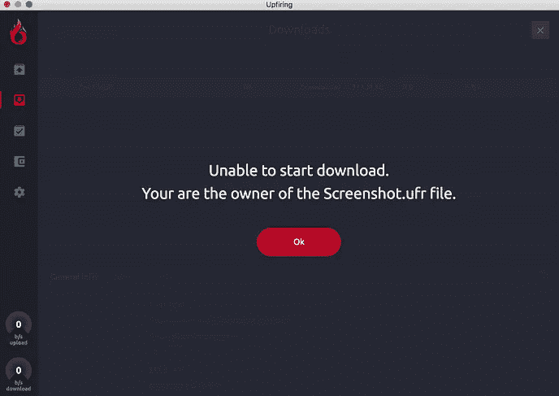
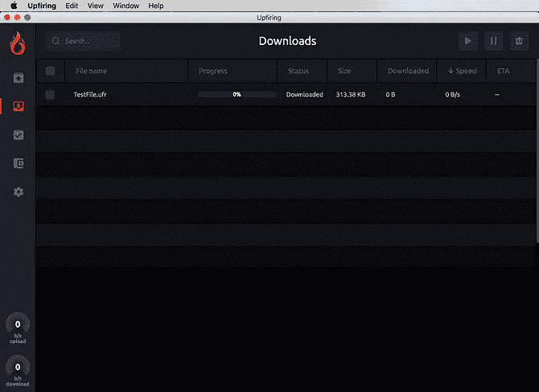
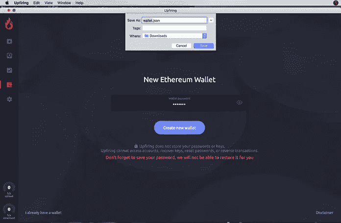
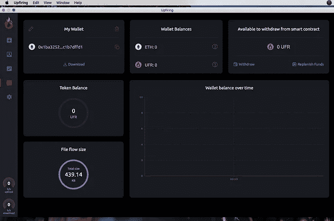
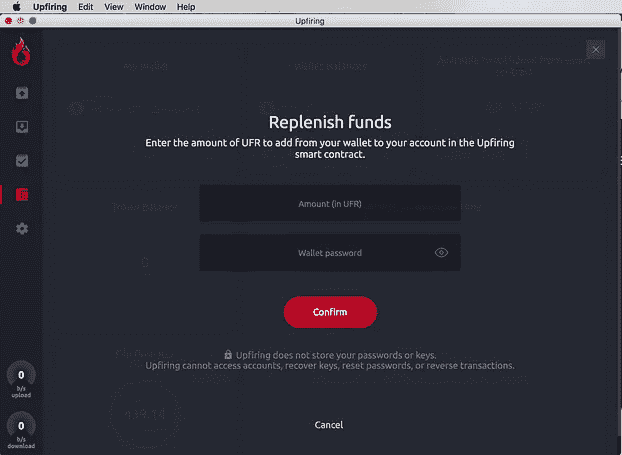

# Upfiring dApp—2018 年 8 月 Upfiring v1.0.0 的进度更新

> 原文：<https://medium.com/hackernoon/the-upfiring-dapp-august-2018-progress-update-for-upfiring-v1-0-0-9c2873472fb6>

Upfiring v1.0.0\. running on MacOS. Versions for Windows and Linux will also be available upon launch.

随着对应用程序的测试和审计的继续，我们希望提供应用程序当前状态的概述，并回顾一些关键特性。我们的应用程序的主要目标之一是易用性——任何人都应该能够使用 Upfiring，甚至是对 dApps 或区块链没有经验的用户。Upfiring v1.0.0 将在发布时针对 Windows、MacOS 和 Linux 版本发布，因此任何拥有计算机或笔记本电脑的人都可以立即开始使用该应用程序。

# **上传您的文件**

Uploading process for files in Upfiring v1.0.0

在“上传”选项卡中，用户可以上传他们自己的文件，并将其转换为上传文件。以文件扩展名"命名。ufr”，启动文件提供了几个关键特性，使它们比标准种子文件更有优势。首先，启动文件是加密的。这是 up fire 协议的重要组成部分，它为用户提供了无与伦比的隐私，并防止外人从网络交易中提取数据。在上面的例子中，应用程序接收一个截图(myscreen.png ),并输出价格为 20 UFR 的文件 screen down . ufr。然后可以分发 screen down . ufr。除非该文件被另一个用户下载，然后在 20 UFR 的应用程序中解密，否则无法访问 screen down . ufr 的内容。用户还可以下载文件而不解密，而是选择成为文件的种子。这将允许他们在每次该文件被他人下载和解密时赚取 20 UFR 价格的一部分。

# **从别人那里下载升级文件**

Part of the downloading process in Upfiring v1.0.0

在“下载”选项卡中，用户可以下载他们在网络、论坛、社区或其他地方找到的升级文件。下载文件后，用户可以成为该文件的种子，并在每次下载该文件时获得 UFR。他们也可以通过支付 UFR 价格来解密文件，使他们能够访问里面的内容。上面的例子(图 1 和图 2)显示了一个用户试图下载他们自己的 UFR 文件的例子。在这种情况下，应用程序会识别出这个文件属于上传它的用户，并给出一个错误。将 Testfile.ufr 加载到由另一个用户生成的应用程序(图 3)后，应用程序开始下载过程。

# **与你的钱包和正在升级的智能合约互动**

The “Wallets and Earnings” tab features an in-app UFR/ETH wallet that is able to interact with the Upfiring smart contract.

截至目前，升级的应用内钱包已经通过了初步测试，可以安全使用。您可以使用该应用程序安全地生成一个新的密码保护的钱包，可以存储 UFR 和 ETH。生成一个升级钱包会创建一个. json 文件，因此您可以在许多其他主要的钱包服务(如 MyEtherWallet)中加载您的升级钱包。如果你已经在钱包里存了 ETH 或 UFR，你也可以用钱包的直接把钱包加载到应用程序里。json 文件或私钥，并立即开始使用该应用程序。

通过使用“提取”和“补充资金”按钮，可以使用您的钱包轻松地将 UFR 转入和转出 Upfiring 智能合约。您的钱包被视为一个“账户”,可以在即将启动的智能合同中访问一定金额的 UFR，该金额等于您通过播种获得的总金额+您手动转入合同的金额。你可以在智能合约中使用你的 UFR 来下载升级文件，或者随时将文件提取到你的钱包中。

Upfiring 有可能成为第一个真正有用的 dApps，它解决了一个普遍存在的问题——播种问题——并改变了人们对共享和播种文件的看法。当我们知道该应用程序正式发布的确定日期时，我们将在我们所有的社交平台上宣布。

如果你对这个项目有任何进一步的问题，请随时在我们的社区页面上发帖或给我们发电子邮件到 support@upfiring.com。来加入我们在 Reddit 、 [Bitcointalk](https://bitcointalk.org/index.php?topic=2223828.0) 和 [Twitter](https://twitter.com/upfiringhq) 的活动，继续我们改变 P2P 文件共享未来的使命。别忘了加入我们新的 [Reddit 聊天](https://s.reddit.com/channel/1168151_aea237b244e01ceaaa202af98305cd4c2f960ae4)的讨论。