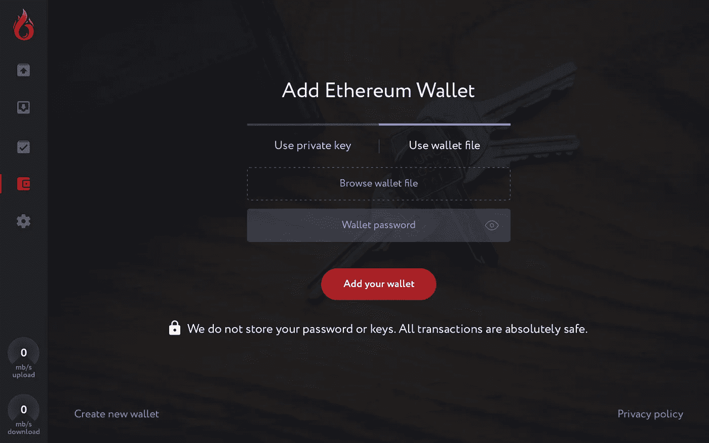
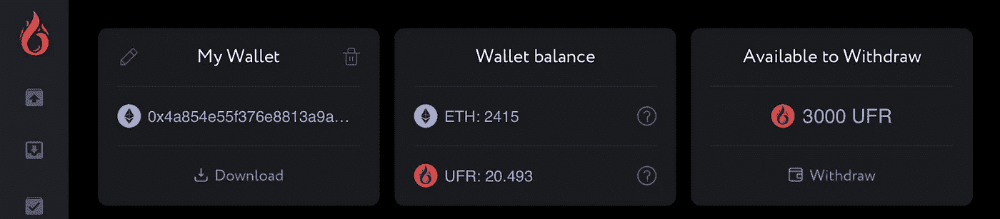
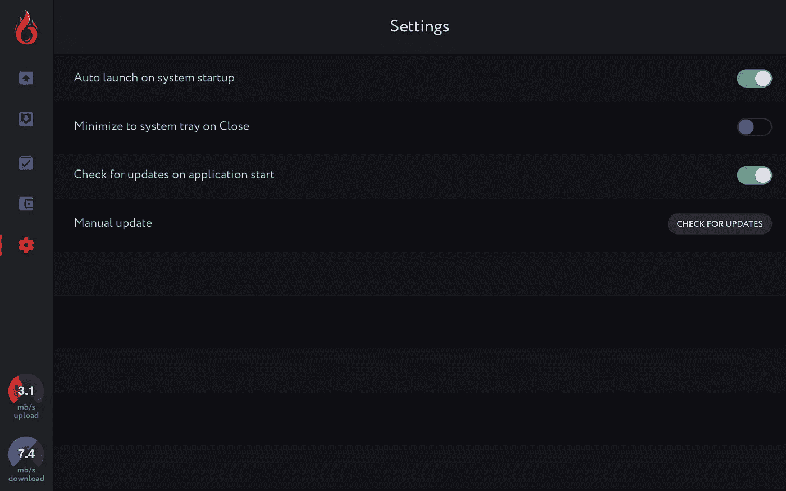

# 上升的 dApp —第三季度早期更新

> 原文：<https://medium.com/hackernoon/the-upfiring-dapp-early-q3-update-9a79d39e960c>

## 钱包集成和测试、代码审查、UI 和 UX 更新、源代码概述、dApp 入职、营销策略和社区

我们建立了有史以来第一个基于智能合同的 dApp，奖励用户播种和共享文件。一旦代码审查、测试和最后几个特性最终确定，Upfiring 将上线。

Upfiring is a smart contract-based blockchain file-sharing application that incentivizes seeding through UFR tokens, supports multiple seeders, and encrypts files for added security.

**主题**
源代码概述
○开发状态
○特性分解
○营销、扩展和采用
○ dApp 发布——期待什么？
○up firing Seeders 计划
○指南和文件
○up firing 社区——未来发展和成长

# **源代码概述**

Upfiring 是开源的。我们大约每月发布两次应用程序源代码，以便让开发者和关注者了解我们的最新进展:

[https://www . Dropbox . com/s/o 64 nhfz 1 lo 8 vfkp/up fireing _ source _ code _ 071018 . zip？dl=0](https://www.dropbox.com/s/o64nhfz1lo8vfkp/upfiring_source_code_071018.zip?dl=0)

自从上一次媒体更新以来，我们一直在悄悄地进行黑客攻击，并且已经为开发做好了准备。展望未来，我们将把一些重点转移到项目的营销和扩展上。

**发展状况**

为了将用户的资金存储在应用程序中，我们需要创建自己定制的全功能钱包系统，用户可以在应用程序中安全地存入、提取和转移 UFR 和 ETH。

Improved user interface for Upfiring v1.0.0, allowing for UFR and ETH in existing wallets to be instantly accessible. Users can create new wallets as well if they do not already have one.

除了这些钱包，正在升温的智能合约——将持有所有种子基金——负责在一个潜在的巨大网络上确保大量价值。因此，应用程序需要大量的测试来确保这些方面是完全安全的。我们已经看到了当[智能合约没有被正确测试](/chain-cloud-company-blog/parity-multisig-hack-again-b46771eaa838)时会发生什么，我们认为最好发布一个完全安全的面向用户的 dApp，让用户完全相信他们的资金是安全的——即使这意味着比最初预期的花费更多的时间专注于开发。

We’ve recently added a settings tab where users can customize the way their OS will interact with the application.

我们现在不能给出一个确切的发布日期——这完全取决于代码审查、测试和最终功能实现的结果。一旦我们确认 dApp 是完全安全的，并准备好发布，我们将宣布一个发布日期，并提供一个时间表，详细说明如何推出工作。我们感谢社区的耐心，并正在尽快准备 dApp 的发布。

自从上次媒体更新以来，已经增加了大量的功能。这是当前源代码的细目分类。上述代码版本包括以下功能:

✔·戴普生产。嵌入价格和所有权数据的 ufr 文件
价格数据和所有者(原始播种者)数据直接嵌入文件本身。这防止了它被改变，并允许文件容易地分布在各种媒体上，同时保持关于所有者/UFR 价格的数据。
创建了一种新的文件扩展名。ufr，它定义了应用程序生成的可以播种的文件。如果用户已经下载了，点击它们将自动打开升级应用程序。

✔设置选项卡—用户可以自定义应用程序与其计算机的交互方式，并启用自动启动、更新 dApp 等功能。

✔通过私钥或钱包文件添加现有钱包
将 UFR 或 ETH 存储在 MyEtherWallet 或 MetaMask 等现有钱包中的用户将能够直接将钱包加载到应用程序中，然后使用它下载文件或执行智能合同相关交易

✔在应用程序中创建新的钱包，并生成钱包文件/私钥。Upfiring 的功能类似于 MyEtherWallet，允许用户直接在应用程序中创建钱包，然后将生成的钱包文件保存到您的本地计算机上。

dApp 首次用户的✔入职界面。这些屏幕解释了如何开始创建一个钱包，保护它，生成。ufr 文件，并播种它们。

✔优化了内存使用，以支持可扩展性和一次下载/上传多个大文件

✔改进了 dApps 与智能合约的交互。Upfiring 将在发送交易前检查用户的 UFR 和 ETH 余额，如果其中一个余额不足，将显示一条消息。这可能发生在撤回(种子人从合同中撤回他们获得的 UFR 需要极少量的 ETH 通常称为 gas)和下载(用户没有足够的 UFR 来下载文件)两个过程中。

✔收入随时间变化的图表添加到钱包标签，让种子直接跟踪和可视化他们的 UFR 播种所得。

# 营销、扩展和采用

**dApp 发布——一旦 Upfiring 发布，会发生什么？**

当网络启动时，用户将开始上传文件，并在热门社区、社交媒体、论坛、现有的 P2P 网站以及他们选择的任何地方分享。因为播种是有激励的，我们希望随着越来越多的播种者加入和更多的文件上传，这个上升的网络会变得更有价值。这将有两个效果——网络将变得更强大(更多种子=更高的正常运行时间和更快的下载速度),更多的文件将在网络上可用——使 Upfiring 对搜索特定文件的下载者有吸引力。

在此期间，努力将转向大力营销 dApp，提高对 Upfiring 品牌的认识，并从现有的 P2P 网络中吸收新用户和种子。

**播种者主动出击**

Upfiring Seeders 计划将与 Upfiring v1.0.0 一起推出，旨在吸引尽可能多的种子用户加入该平台。我们计划成为第一个大规模的区块链应用程序，允许没有任何限制的付费播种。目前很少有企业级区块链应用程序可用(除了钱包和分散式交易所)，因此播种计划的主要重点将是向项目介绍新用户，并向他们解释他们如何从成为播种者、支持网络和上传自己的内容中受益。

这是一项全面的营销工作，将包括与内容创作者合作，与现有的 P2P 网站合作，促进和帮助新兴社区的发展，以及提高对社交媒体的认识。

**安装指南和文件**

因为并非所有应用程序的用户都熟悉区块链和使用 dApps，我们正在制定一套指南和易于理解的文档，解释使用 Upfiring 的重要概念，包括如何设置和保护钱包中的资金、私钥安全、智能合同交互、网络匿名等。我们还在应用程序中添加了“欢迎屏幕”,引导新用户完成使用应用程序和设置钱包的过程。

这些指南将在我们的[网站上随时提供。](https://www.upfiring.com)

# **装修社区**

Upfiring 社区将支持 Upfiring 生态系统，并为用户提供一个分享文件的场所，同时吸引种子用户，帮助他们保持文件在线。在最近的赏金战役中，最近建造了几个升级社区。我们未来的计划是在我们的网站、subreddit、Bitcointalk、社交媒体和其他地方支持社区驱动的项目。为了上市，你的项目必须达到一定的标准才能被批准。到目前为止，我们已经批准了两个源于最近的赏金运动的项目——ufr . io 和 UpTorrent.net。我们将在未来两周内将这些项目添加到我们的主页上，并建立一个更方便的系统来提交项目供审批和接收反馈。

请注意，在我们的网站上添加一个社区驱动的项目并不表示我们直接支持该项目。此外，我们不会监控所有发生在启动社区的活动。我们的网站和其他地方的收录标准是严格基于开发的。

今后，我们将在 Medium 上发布更小但更频繁的更新(代替我们到目前为止发布的大量但间隔很大的更新)。如果你对这个项目有任何进一步的问题，请随时在我们的社区页面上发帖或给我们发电子邮件到 support@upfiring.com。来加入我们在 Reddit 、 [Bitcointalk](https://bitcointalk.org/index.php?topic=2223828.0) 和 [Twitter](https://twitter.com/upfiringhq) 的活动，继续我们改变 P2P 文件共享未来的使命。