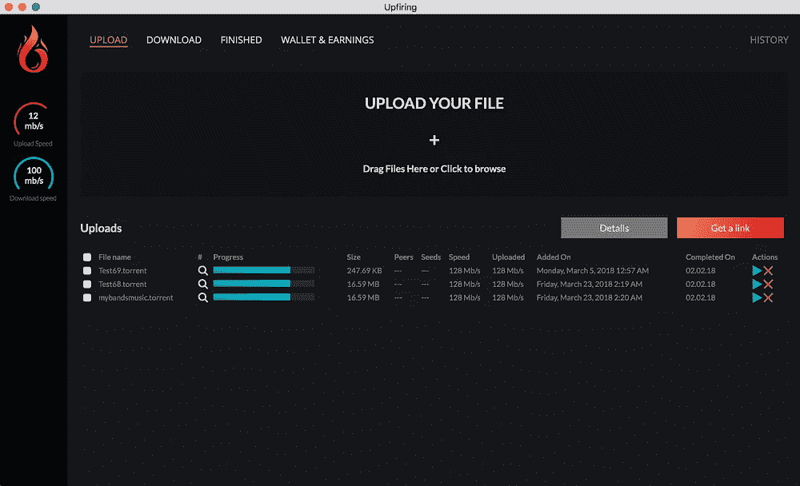
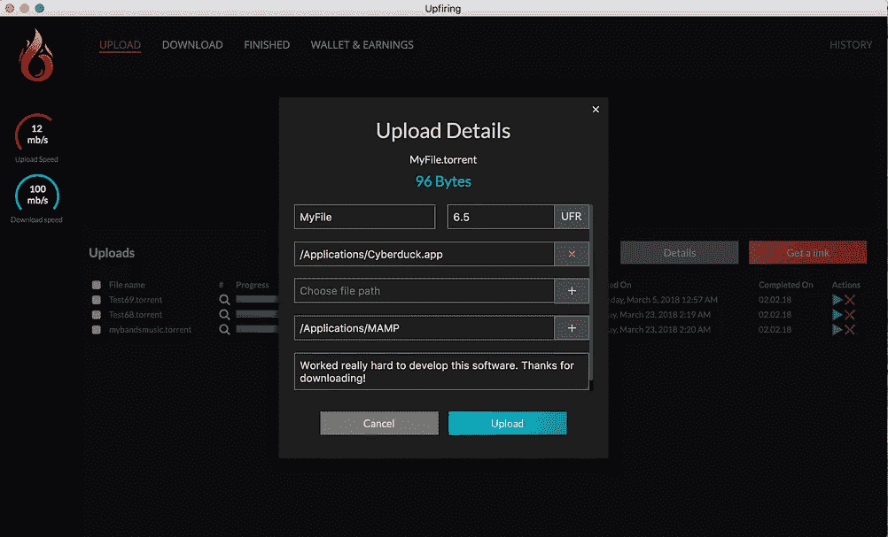
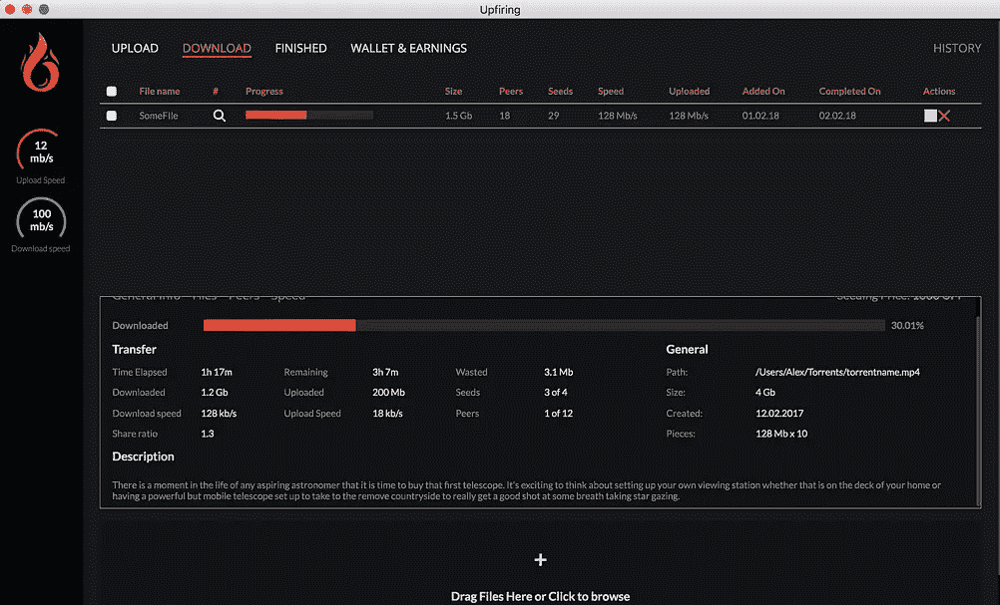
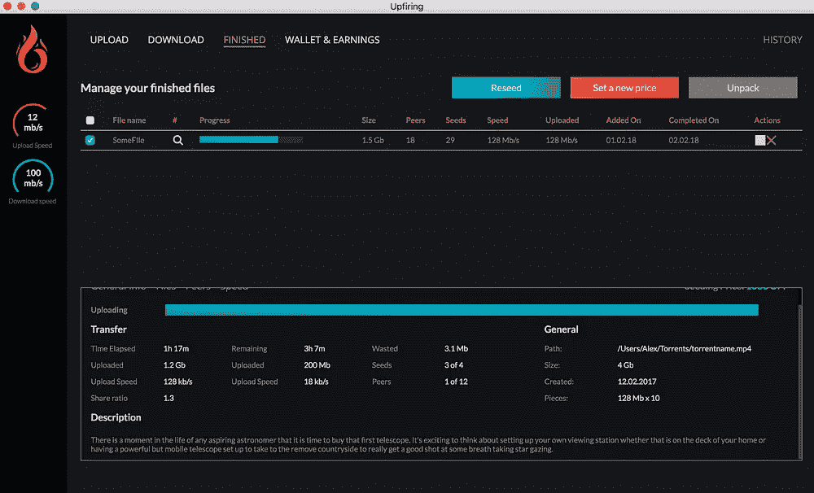
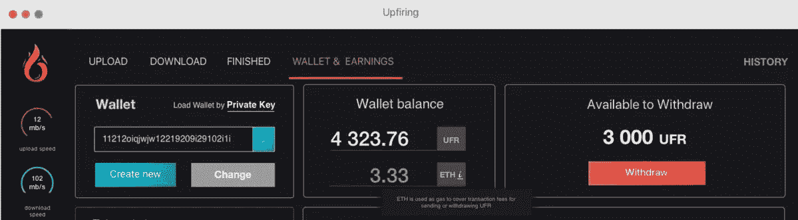
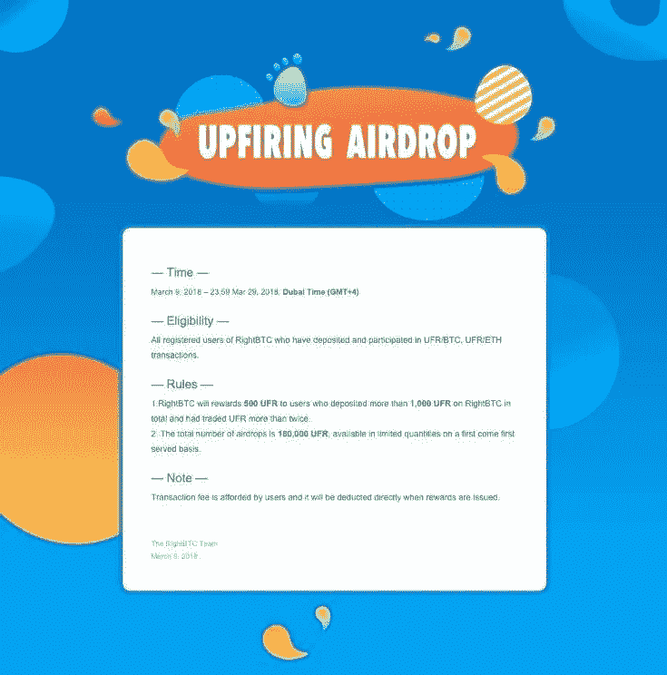

# 上升 dApp -三月底更新

> 原文：<https://medium.com/hackernoon/the-upfiring-dapp-end-of-march-update-8d2713e805bb>

## UI 和 UX 设计、源代码、社区奖励活动、Airdrop、交换列表、功能和技术细分以及路线图更新

Upfiring is the first-ever blockchain file-sharing application with token rewards for multiple seeders, file-encryption and verifiable transactions.

在过去的几个月里，我们在 Upfiring 应用程序上取得了巨大的进步，并很高兴分享我们的工作和即将到来的路线图。这次更新有很多要讨论的，让我们开始吧。

**主题**
UI&UX 设计
源代码
特性和技术分解
○包和框架
○加密和播种协议
○钱包
○智能合同物流
○下载和完成协议
路线图和发布时间表
交易列表
【UFR 空投
发起社区奖励活动

# **UI & UX 设计**

首先，这里有一些运行中的应用程序的截图。我们保持了设计的时尚和简单，同时为许多复杂的幕后功能留出了空间。

# **源代码**

应用程序源代码可在此处找到:

[https://www . Dropbox . com/s/6l 0 yo 3 z 8 zy 64 BCT/up fireing _ source _ release _ 032318 . zip？dl=0](https://www.dropbox.com/s/6l0yo3z8zy64bct/upfiring_source_release_032318.zip?dl=0)

我们从代码中排除了钱包和智能合约功能，以防止用户在应用程序完全开发、测试和安全之前尝试使用它。用于生成嵌入了所有者和价格信息的加密升级文件的代码功能齐全——还有其他几个特性。请随意评论代码，并给我们您对进度的反馈！

# **特点和技术分解**

**1:主要包和框架**

> Create-torrent 3 . 29 . 2
> Crypto 1 . 0 . 1
> drop 2 . 13 . 2
> electron react 框架
> Ethereumjs-util 5 . 1 . 4
> 使用 AES192 加密的文件加密程序
> 文件加载程序 1.1.6
> 历史 4 . 7 . 2
> Parse-torrent 5 . 8 . 3
> Travis CI 测试套件【T33

*当前正在使用的软件包/版本的完整列表可在应用程序源代码中找到。*

**2:升级加密和播种协议**

自从上次更新以来，我们已经设计了一个协议来解决下载者避免 UFR 费用的问题(下载一个文件并试图避免由原始播种者设置的 UFR 费用)。

Upfiring 为每个文件创建两个副本—一个非加密版本用于本地(未更改的版本),另一个加密版本用于网络事务。关于文件所有者(原始种子)和 UFR 价格的信息被集成到这个加密版本中。然后，使用修改的 bittorent 协议在对等方之间传输文件，下载者的资金被发送到播种者智能合同。一旦合同收到资金，就会自动向下载者发送一个加密密钥来解密文件。

如果下载者的 UFR 交易失败或他们试图避免支付费用，他们将留下一个不可用的加密文件，直到交易被发送到合同。这确保了对等点总是因为播种而获得奖励，并且使用其他应用的用户不能绕过 UFR 费用。

**3:钱包&智能合约物流**

用户将能够在 Upfiring 应用程序中创建新的钱包，或者使用他们的私钥加载现有的钱包。

UFR 和联邦理工学院最初并不需要使用该应用程序。用户可以开始播种他们的本地文件，并在下载应用程序后立即获得 UFR，而无需存入任何资金。

播种机智能合同实时记录每个播种机的 UFR。为了从 seeder 智能合同中获得 UFR(播种所得)，用户需要向区块链进行一笔小额交易，以触发合同的“撤销”功能。这是通过点击应用程序中的大红色“撤回”按钮，并输入小于或等于用户已赢得的 UFR 总额的 UFR 金额来完成的。这一过程将需要非常少量的 ETH，用于支付交易费用(在撰写本文时不到 0.40 美元等值)。

**4:协议下载完成**

从其他用户下载文件需要下载者支付 UFR 价格(由原始播种者设定)。因此，下载程序在下载文件时必须对主智能合同进行单次交易。当用户同意价格并按下“下载”按钮时，该过程在应用程序中自动完成。如果下载者不想在交易所购买 UFR，建议他或她先播种一些自己的文件以赚取 UFR，然后使用新获得的 UFR 下载文件。

从其他用户处下载文件后，该文件将被移至“已完成”标签，在该标签中，可以通过单击“重新播种”按钮以相同的价格重新播种该文件(使该用户成为原始文件的附加播种者)或以新价格播种该文件(使该用户成为新文件的原始播种者)。

与传统网络相比，该协议鼓励更多用户共享文件和种子——用户将被激励尽可能多地播种，以最大化他们的回报。这与现有的网络有很大的不同，在现有的网络中，由于大量的下载者和没有授予种子者的奖励，种子者/对等者可能很难找到。因此，与传统的 P2P 网络相比，我们预计文件的可用性和下载的可靠性会大大提高。

# 路线图和发布时间表

我们的一些主要开发重点是确保应用程序是企业级的、可扩展的、可大规模采用的，最重要的是安全。因为资金将存储在应用程序的钱包中，并且将部署智能合同，所以我们希望确保 Upfiring dApp 的第一个发布版本完全可以安全使用，并且没有潜在的可利用漏洞。正因为如此，我们已经改变了我们的路线图，因此该应用程序的第一个版本将是 1.0.0 版，并提供了开箱即用的所有计划功能。

版本 1.0.0 的发布日期。已经定为**Q2**中后期。在此期间，我们将不断向社区发布源代码更新，以便在我们完成新功能时进行审查。

以下是更新的路线图，包括计划的活动和开发进度:

**事件**

*   2017 年 12 月—2018 年 5 月:**重磅开发**
*   2018 年 1 月至 2018 年 3 月:**促成 Coinexchange.io、Stocks.exchange、Yobit、RightBTC 房源**
*   2018 年 3 月 29 日晚 11:59 GMT+4:**right BTC UFR 空投截止时间**
*   2018 年 3 月 29 日—2018 年 5 月 31 日:**启动社区奖金活动**
*   2018 年 6 月 1 日—2018 年 6 月 8 日:**启动社区奖金活动投票**
*   Q2 2018 年中后期:**上线 v1.0.0 .发布**
*   2018 年第三季度初:**促进主要交易所上市**
*   2018 年第三季度— Q1 2019: **启动营销活动并建立合作伙伴关系**

**发展**

✔设计应用程序、创建布局、实施电子框架
✔创建用于 MacOS/Windows/Linux 的构建机器。构建机器配置为创建与开发并行的构建版本
✔配置测试环境 MAC OS/windows/Linux(Ubuntu)
✔从用户的本地文件创建加密的启动种子文件，并在加密文件中嵌入有关文件所有者的信息
✔建立智能合同功能框架
✔允许用户通过在 Wallet 选项卡上实时播种来查看他们的 UFR 收入
✔建立播种协议
✔ UFR 文件定价和重新播种功能

**进行中**

*   全面测试钱包功能，确保用户的私钥安全，简化应用程序中的钱包创建
*   用户下载文件并发送正确数量的 UFR 后，发送密钥来解密文件
*   智能合同功能:
    —确保播种者余额随着播种而实时更新
    —允许用户从合同中提取挣得的 UFR
*   播种和下载协议最终确定
*   启动 dApp v1.0.0 .启动

# 交易所上市和合作

我们希望确保 UFR 能在多个交易所广泛使用，并让新来者也能轻松访问。在过去的几个月里，我们非常努力地与交易所建立合作伙伴关系，并建立了一些新的合作关系。

**Upfiring 与 UFR/BTC、UFR/瑞士联邦理工学院、UFR/USDT 和 UFR/DOGE 配对在 Yobit 上正式上市。**

我们一直等到这次更新才宣布这个消息，但这是正式的——你现在可以在 Yobit 的 BTC、ETH、DOGE 和 USDT 市场交易 UFR。你也可以用 Yobit 的骰子游戏来赌你的 UFR(当然不推荐！).Yobit 是一个巨大的交易所，已经存在了几年，有很多大牌硬币和高交易量。他们目前不接受新的注册，但如果你已经有一个帐户，你可以立即开始交易 UFR。

自上次更新以来，我们还被列入:

*   Coinexchange.io: UFR/BTC 和 UFR/ETH
*   右 BTC: UFR/BTC 和 UFR/ETH
*   股票交易所:UFR/BTC、UFR/ETH 和 UFR/LTC
*   Cryptowolf.eu:用 UFR 兑换任何其他加密货币，反之亦然

**现有交易所:**

*   神秘国度:UFR/BTC (UFR/LTC & UFR/DOGE 市场暂停)
*   IDEX: UFR/ETH
*   福克德尔塔:UFR/瑞士联邦理工学院

一旦应用程序发布，在主要交易所上市将成为重中之重，也是今年第三季度的主要目标之一(与营销活动一起)。

# **UFR 空投:2018 年 3 月 29 日**

RightBTC is airdropping 500 UFR to each user who has deposited more than 1,000 UFR and traded UFR three or more times on the UFR/BTC or UFR/ETH markets. Trades must be completed to be eligible.

从现在起到 2018 年 3 月 29 日，任何人都可以在 RightBTC 上注册，从外部来源(个人钱包、另一个交易所等)存入 1，000 UFR 或更多，并在 RightBTC 的 UFR 市场上完成 3 笔或 3 笔以上任何规模的交易，就有资格获得资格。奖励是每个合格用户 500 UFR。UFR 将在 2018 年 3 月 29 日 GMT +4 晚上 11:59 资格截止后空投给用户。

# 启动社区奖金活动

*日期:2018 年 3 月 29 日—2018 年 5 月 31 日*

**目的**

上行社区是共享上行链接的网站、应用程序和社交网络。内容创作者可以通过分享他们的链接供其他用户下载来从社区中受益，这允许他们赚取 UFR 并增加他们文件上的种子数量。一个活跃的社区的主要目标应该是增强内容创作者和分享者的能力，尽管这项活动鼓励开发者建立他们认为有助于扩大社区的任何东西。

可以为这一赏金活动建立的注册社区的一些例子是:允许内容创建者共享注册链接的网站或移动应用程序、分散/匿名聊天、论坛或留言板、仅用于购买/出售 UFR 的分散交易所、或任何其他类型的媒体平台。

活动结束时(2018 年 5 月 31 日)，项目不必全部完成。一个部分完成的项目——但是社区认为它展现了未来的希望——在投票中可能会表现良好。

这项奖励活动给了开发者一个机会，让他们直接为 Upfiring 的广泛应用做出贡献。此外，所有项目——尤其是那些在投票中表现良好的项目——都将受益于社区的推广和关注，从而使坚实的项目很容易获得用户群。

**奖励**

我们认为 Upfiring 社区对 Upfiring 的早期成功至关重要，因此准备重奖那些参与构建生态系统的人。

**三级**
第一名项目:**20000 UFR**
第二名项目:**12500 UFR**
第三名项目:**7500 UFR**
第四名&第五名项目: **4000 UFR 各**
所有参赛作品:4000 UFR 总数除以合格参赛作品总数，平均分配(不包括*如果合格提交的数量高于预期，则该金额可能会增加，以确保工作得到适当的奖励。*
总计**:**5.2 万 UFR

**群体投票**

获胜者将由社区投票选出。为了防止投票被操纵，投票将是公开的，并仅限于:
Reddit 帐户:帐户必须在 2018 年 3 月 23 日之前创建，并至少有 20 条评论 karma
Bitcointalk 帐户:帐户必须在 2018 年 3 月 23 日之前创建，并至少有 10 篇帖子

投票主题将于美国东部时间 2018 年 6 月 1 日中午 12 点发布在 Reddit 和 Bitcointalk 上。投票将于 2018 年 6 月 8 日上午 11:59 结束。

**更多信息**

Upfiring 及其团队保留决定投票是否有效的权利。如果一张选票看起来是重复的或者是选票被操纵的结果，那么这张选票可能被认为是无效的。奖金活动规则、时间周期和投票要求可能会根据团队的判断进行更改。Upfiring 强烈鼓励参与者在他们的社区中筛选侵犯版权的行为。建议任何包含升级链接的项目对此类侵权行为提供某种形式的管理规定，并提供一个联系资源，以便根据要求删除内容。

下周活动正式开始时，将在 Reddit 和 Bitcointalk 上发布更多细节的赏金活动线索。

如果你对这个项目有任何进一步的问题，请随时在我们的社区页面上发帖或给我们发电子邮件到 support@upfiring.com。来加入我们在 Reddit 、 [Bitcointalk](https://bitcointalk.org/index.php?topic=2223828.0) 和 [Twitter](https://twitter.com/upfiringhq) 的活动，继续我们改变 P2P 文件共享未来的使命。