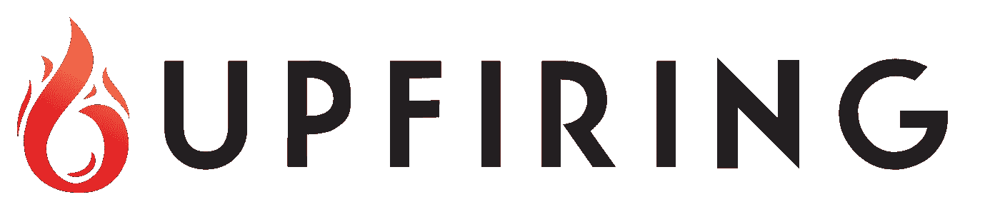

# 启动 dApp—2018 年 1 月中旬更新

> 原文：<https://medium.com/hackernoon/the-upfiring-dapp-mid-january-2018-update-2fe0d4d3a6e6>

这篇文章将涉及几个话题，包括:

*   交易所上市，取消供款期 v2.0
*   应用物流、高级功能和播种协议
*   源代码、图形、开发框架
*   常见问题

**交换列表**

先说交流。UFR 现在在以下市场交易:

*   隐国——UFR/BTC，UFR/LTC(暂停)，UFR/多吉(暂停)
*   以太三角洲—UFR/以太
*   IDEX——UFR/ETH

新用户的大量涌入让 Cryptopia 应接不暇。因此，他们已经宣布将他们的莱特币市场从主网站完全移除，并开设一个新的姐妹交易所，专门用于莱特币对交易。UFR/长期贷款将在该交易所开业时进行交易。

如果一切按计划进行，Upfiring (UFR)将在未来 10 天内在另一家中型(交易量排名前 50 位)交易所上市交易。交易对(BTC/UFR 和瑞士联邦理工学院/UFR)已经得到确认，但像许多其他交易所一样，它们最近被新用户淹没了。他们目前正在努力解决一些技术问题，然后恢复新的上市。这种交换的一个巨大优势是，与 Cryptopia 不同，它在所有移动和平板设备上都具有完全的功能。这将允许更快和更有效的 UFR 交易。

**价格讨论**

鉴于 UFR 最近的增长和社区中关于未来价格增长的许多帖子，需要给出一些友好的提醒。加密领域的价格上涨可能非常令人兴奋。当价格快速上涨(或下跌)时，很容易忽略项目，只关注市场。小心点。在买卖硬币和代币之前，你需要做好尽职调查，评估所有的风险和潜在收益。专注于技术和项目试图实现的目标，评估你认为它的价值是什么，记住市场总是双向的。我们现在正处于一个长期的加密货币牛市，但情况可能并不总是如此。不要鲁莽投资。

**取消供款期 v2.0\.**

如白皮书中所述，总 UFR 供应量(360 万)的 15%预留给潜在贡献期 v2.0。我们最近决定排除这一选项。我们最初贡献期的一个主要组成部分是以单一的固定价格提供 UFR，这使我们不同于许多其他项目。没有早期贡献者奖金结构，私人预售，或任何其他不公平的优势。

持有 2.0 版缴款期对现有 UFR 持有者不公平，因为它会立即增加 360 万 UFR 的流通供应量，稀释现有市场。作为替代方案，我们将指定这些代币的一小部分(1/3)用于在未来必要时为新的交易所上市融资。要求新上市的项目之间的竞争——以及加密空间最近的巨大增长——已经将许多主要交易所的新上市成本推高到数万甚至数十万美元。由于我们没有预料到市场中的这种变化，并且没有任何 ICO 基金被指定用于这一目的，如果我们希望扩大我们的上市范围并使 UFR 在未来更广泛地可用，为此目的分配 UFR 是必要的。

因此，在未来一两年内，总流通供应量最多可能增加 120 万 UFR——尽管我们最终使用的数量可能会比这少得多。根据个别交易所的政策，他们可能直接接受 UFR，也可能需要非常缓慢地出售。从长远来看，这种供应的增加不会对价格产生负面影响，并且在百分比上类似于因开采和用其他加密货币下注而产生的供应增加。

由于不再正式储备，CoinMarketCap 将认为整个 120 万 UFR 在流通，新更新的流通供应量将为 1560 万 UFR。在这个时间点上，我们不需要为了支付交易所上市而向生态系统中释放任何新的 UFR，实际的流通供应量仍然是 1440 万。每当 UFR 被出售以支付新交易所上市的成本时，它将与上市一起宣布。

指定用于缴款期 v2.0 的最后 240 万 UFR 将作为储备，直至制定出详细的使用计划。目前的想法是，它将被用来帮助形成合作伙伴关系，并创建一个附属程序，以帮助在遥远的未来(应用程序推出后的几个月或几年)进入更主流的 P2P 社区。

**应用物流、高级功能、&播种协议**

我们已经改变了最初的立场，并计划在应用程序的初始版本中支持许多与流行的 P2P 文件共享应用程序相同的文件类型，包括几个音乐和视频文件扩展名。此外，我们决定不允许在应用程序中直接搜索，必须从外部来源检索启动生成的链接，以便在应用程序中下载文件。

**上行链路和播种协议——工作原理**

上传一个新文件，为你的文件设定一个 UFR 价格，然后开始播种，你会得到一个链接。只要你在播种，这个链接将允许其他人直接从你这里下载你的文件。作为最初的播种者，你保证从你的文件中获得 UFR 总收入的 50%。如果其他人开始下载你的文件并以同样的价格播种，他们将平分 UFR 收益的另外 50%。这增加了给定文件的对等点数量，使其更加稳定，并允许更快的下载速度。你的文件上有更多的种子/同行意味着你的文件对下载者更有吸引力。

仔细观察，这是使 up fire 比任何其他现有的 P2P 文件共享应用程序更有价值的一个方面。艺术家可以在 Upfiring 上上传他们的原创. mp3 文件，成为原创种子，保证他们自己获得总收入的 50%。然后，他们可以推广他们的链接，让其他人轻松下载文件。如果其他人以相同的价格重新播种该文件，他们也将成为该艺术家文件的种子。因此，这些新的播种者将从该艺术家的所有推广努力中受益，并在下载该文件时获得 UFR。反过来，艺术家受益于更多的同行和更快(不断增加)的下载速度。

**加密协议**

加密文件有两个主要目的。首先，它有效地保护了您的文件不被任何与您的交易无关的人看到。除了相关的下载者和播种者之外，通过网络传输的文件将无法被任何人读取。加密协议的另一个优点是，下载者不能通过使用其他 P2P 共享应用程序来绕过 UFR 要求。如果文件是在升级应用程序之外下载的，它将保持加密状态，因此对下载者来说是无用的。这要求播种者的工作得到回报。

**UFR 钱包**

下载该应用程序后，用户将能够在该应用程序中创建新的 UFR 钱包。这个钱包可以装下 UFR 和 ETH。为了下载文件，用户需要在钱包里同时拥有 UFR 和少量 ETH。以太需要支付通过以太坊主网络发送 UFR 的交易费用。最初，UFR 可以从交易所载入你的钱包，或者通过播种一个新的文件来获得。

**确保播种者获得 UFR**

文件下载完成后，UFR 将被发送给种子。也就是说，用户有可能在收到下载的文件时立即关闭应用程序，并阻止 UFR 从他们的钱包发送给种子。在这种情况下，该用户将不再能够使用该应用程序(或他们当前的钱包)来下载新文件，直到该交易完成并且播种者得到奖励。该系统确保用户不能持续绕过 UFR 要求。

**结果出来了——UFR 将是应用程序中的一个要求**

首先，感谢大家对关于我们是否应该允许在应用程序中免费播种的社区投票的惊人回应(见[这里](https://www.reddit.com/r/Upfiring/comments/7ppdg3/community_poll_should_we_allow_free_seeding/))。在阅读了回复并仔细考虑了前提之后，我们决定设定一个 UFR 价格将是一个要求(不允许免费播种)。即使下载一个文件所需的 UFR 量非常小，也有必要为我们旨在建立的激励环境提供燃料。有一些帖子是关于“免费增值”模式或允许免费播种的时期的，但是这些选项对于分散的应用程序来说并不真正可行。一旦应用程序发布，我们将只能升级某些协议。我们对应用程序本身没有任何集中控制，因此我们无法远程启用/禁用特定的播种选项。

**源代码、图形、开发框架**

按照目前的开发进度，该应用程序的一些源代码和图形将在 2 月初至 2 月中旬与社区共享，以供审查。随着开发和改进，更多的代码和图形设计工作将在三月初继续共享。我们目前的估计是，Upfiring 应用的最早版本将于 2018 年 3 月底提供下载。

**开发框架**

该应用程序目前正在使用电子 Javascript 框架进行开发。这将允许应用程序跨平台并在 Windows、MacOS 和 Linux 环境下运行。ElectronJS 是开源的，你可以在他们的[网站](https://electronjs.org/)和 [Github](https://github.com/electron/electronjs.org) 上了解更多关于它的信息 **—** 以及一些基于它构建的应用程序(你可能会用到一些) **—** 。

**更多信息和常见问题**

***开发团队信息***

这个问题已经通过电子邮件和我们的社区讨论过很多次了，但是我们想重申一下，并进一步深入一些细节。由于该项目的性质，Upfiring 开发团队将保持公开匿名。这意味着——和许多其他 P2P 文件共享应用一样——这个团队不会出现在主页上。如果您已经获得了关于该团队的一些信息，我们也要求您不要在我们的社交媒体页面上发布这些信息，以保护那些努力使该项目成功的人。我们对人们私下讨论这个话题(Discord，Telegram，Reddit PMs 等)没有意见。

我们明白保持团队的私密性并不理想，但这是项目的一部分，我们希望通过在其他方面的出色表现来获得社区的信任，例如提供一些开发代码、应用程序图形，以及活跃在我们的社交媒体平台上。如果在应用程序进一步开发和更多的源代码可以提供给社区评估之前，您不愿意持有 UFR，这是可以理解的。

***如果有人在为 0.5 UFR 播种一个文件，难道我就不能下载后以 0.3 UFR 重新播种吗？***

是的。但是，这将被视为一个新文件，您必须自己分发新的下载链接。如果你以 0.5 UFR 播种该文件，它将被视为相同的文件，你(以及该文件的所有现有 0.5 UFR 播种者)将在每次下载该文件时获得 UFR 奖励。这也增加了对等点的数量，提高了下载速度，使其成为对下载者更有吸引力的选择。最后，你和其他种子人都将从彼此的推广努力中相互受益(例如在论坛、Twitter 等上发布链接)。因此，以较低的价格重新播种文件并不总是符合您的最佳利益。

***我可以在应用程序内搜索文件吗？***

不。当你播种一个新文件时，你会得到一个链接。推广和发布你自己的链接是你的责任。这些可以发布在现有的 P2P 文件共享网站上，或者将来可能会有专门为共享上行链接而设计的社区。

为什么会有人想在现有的 P2P 文件共享应用上使用 up fire？它有什么优点？为什么有人会为目前免费的东西付费呢？

正确的问题应该是“为什么有人会在完全没有回报的情况下在 P2P 网络上播种和分享他们的文件？”这就是今天所有现存 P2P 文件共享应用的现状。因为播种者没有从他们的工作中获得任何回报，他们没有真正的动机去让其他人获得新的文件。这使得在许多现有的 P2P 网络上找到具有足够对等点的想要的文件几乎是不可能的。

随着升级，文件可用性将不再是问题。因为播种者因为在网络上播种而被动地获得 UFR 奖励，所以他们会主动地播种新的文件，并且尽可能地推广它们，以便获得更大的奖励。此外，那些下载文件的人会希望在 afterwords 中播种，以便从这些文件的 UFR 总收入中分得一杯羹。

如果你对这个项目有任何进一步的问题，请随时在我们的社区页面上发帖或给我们发电子邮件到 support@upfiring.com。来加入我们在 Reddit 、 [Bitcointalk](https://bitcointalk.org/index.php?topic=2223828.0) 和 [Twitter](https://twitter.com/upfiringhq) 的活动，继续我们改变 P2P 文件共享未来的使命。