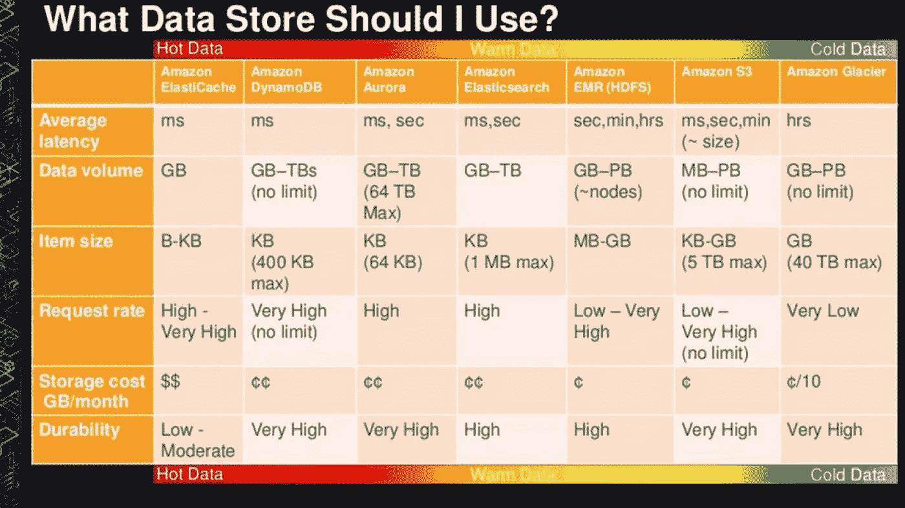

# DynamoDB 的颠倒世界

> 原文：<https://medium.com/hackernoon/the-upside-down-world-of-dynamodb-8170411492c0>

如果你来自关系数据库世界，DynamoDB 可能很难理解——但是它对无服务器应用的好处是不容忽视的。

在通往无服务器的道路上，最难的部分之一是掌握 DynamoDB，这是一个神秘的亚马逊 NoSQL 数据库，简单易学，需要六个月才能掌握。这是一个有趣的、令人沮丧的、奇妙的工具，它交替地让我喜极而泣或者对着我的鼠标大喊脏话。

我的整个职业生涯都与各种关系数据库打交道，所以很难摆脱固有的模式和实践，并尝试以完全不同的方式考虑数据。我读过很多关于[如何不适合所有人的文章](https://read.acloud.guru/why-amazon-dynamodb-isnt-for-everyone-and-how-to-decide-when-it-s-for-you-aefc52ea9476) , [可能不适合任何人](https://news.ycombinator.com/item?id=14721920)，如果你尝试一下[，你最终会切换回 RDS](https://blog.codebarrel.io/why-we-switched-from-dynamodb-back-to-rds-before-we-even-released-3c2ee092120c) 。但是我们坚持使用它，并发现它对于我们的无服务器数据需求是必不可少的。

Credit: [https://dzone.com/articles/cloud-data-services-sprawl-its-complicated](https://dzone.com/articles/cloud-data-services-sprawl-its-complicated)

# 为什么不直接用 RDS？

有几个原因可以解释为什么关系数据库和无服务器不能很好地融合。首先，如果您的功能急剧扩展——这是可能的，这是关键所在——经典数据库通常不是为处理大量出现的新连接而设计的。

回到我们拥有服务器的美好时光，这些连接由许多最终用户共享，因为中间层可能为每台服务器使用一个连接。这在 FaaS 世界中不一定是这样，在那里你的提供者可以根据需要构建你的函数的新实例，并且你可能出现比你预期的更多的连接。

第二，数据库连接使用“保持活动”pings 来保持连接活动——但是 Lambda 函数在不使用时会冻结，所以它会停止。对于数据库来说，当它停止响应时，这看起来就像连接已经消失了。在使用 RDS 的过程中，你正在强迫一种连接方法，这种方法本身并不适合 Lambda。

第三，关系数据库不会自动伸缩。许多公司拥有非凡的架构和方法来处理扩展，但这不是自动的。如果你从事构建可扩展的 web/移动应用的业务，你可以花更多的时间来管理你可能认为的数据库。当设计正确时，DynamoDB 是一个真正的管理选项，如果你正在编写一个使用量激增的应用程序，你会真正体会到这一点。

尽管如此，对于使用率低的无服务器应用程序，RDS 的使用可能是好的，但如果你有任何快速扩大规模的潜力，与 DynamoDB 的“有效”世界相比，这一切都有点脆弱。当 Aurora Serverless 退出技术预览版时，它可能会弥合这一差距，但迄今为止没有迹象表明交互会有所不同。

# DynamoDB 对无服务器的好处。

2007 年的原始 DynamoDB 论文解释了亚马逊电子商务商店平台的主要目标。高可用性和一致的性能是最重要的两个特性，这是以牺牲“传统的”数据库属性(如一致性和事务支持)为代价来实现的。

因此，DynamoDB 在无服务器应用程序中提供数据支持时大放异彩，在无服务器应用程序中，数据需求是由用户——用户资料、购物车、私人物品集合——分开的。您的用户几乎可以无限制地访问和更新这些项目，您唯一的瓶颈将是分配给一个表的吞吐量(它本身是可自动伸缩的)。

如果你计划推出一个潜在快速增长的网络或移动应用，DynamoDB 的主要设计功能将很好地为你服务。您不必担心管理连接、扩展或延迟，在大多数情况下，它会“正常工作”。

尽管如此，您仍然必须小心用户在哪里访问公共数据，即使是在简单的情况下——例如查找表或计数器——因为分区和吞吐量模型可能会导致一些意想不到的副作用。

# 世界上最快的 DynamoDB 入门。

DynamoDB 旨在以几乎免维护的方式为您提供非常一致的性能，如果您正确创建表的话，因此它非常适合无服务器应用程序(然而令人惊讶的是很难做到正确):

*   与关系数据库相比:表是表，记录是项，字段是属性。属性可以是平面或嵌套的 JSON 结构。每个项目可以有不同的属性，但没有属性可以是零长度字符串。
*   表的大小可能是无限的，但是访问模式对于很好地工作很重要(“热键”问题)。
*   您可以更改或更新除分区和排序键之外的任何数据，并且您对这些键的选择是一个关键的设计选择。理想情况下，这些键形成一个散列，您需要确保在整个数据集中随机访问它。
*   您需要为吞吐量(rcu/wcu)和使用的存储空间付费。当您查询一个项目时，项目的大小很重要，因为您将为整个项目付费(即使您过滤掉或返回数据的子集)。
*   本地辅助索引必须使用原始分区键(但不同的排序键)，并且必须在创建表时定义。它们还共享表的吞吐量(经常被遗忘)。
*   稍后可以在新的散列键上创建全局辅助索引，但是使用它们自己的吞吐量。散列不必是唯一的。这种命名是没有帮助的，两个索引都没有按照您预期的方式工作。
*   没有传统的 SQL 查询操作符，如 sum、average 或 count，没有 group by 子句。通常是*从某个地方*(表)选择某个东西(投影)*，在那里*某个条件被满足*(分区 ID、排序键和过滤器)。然后剩下的就看你的了。*
*   如果你真的需要，一致性是需要付出代价的。如果没有它，如果更新*刚刚发生*，您可能会发现查询返回陈旧的数据。在许多情况下，这并不重要，但你不会想这样运行一个银行应用程序。

有些查询模式非常有效，例如购物车。carts 表中有一个商品映射到一个用户 ID，包含 cart 中商品的嵌套 JSON 列表。它很棒，因为它很容易扩展，查找速度非常快，最终的一致性模型在这种用例中大放异彩。

甚至一些经典的关系数据库模式也相当明显——比如为客户返回订单列表。在这里，您只需将 customerId 作为分区键，将 orderId 作为排序键，就可以快速提取订单列表。

但是……如果你想知道有多少订单或者一个订单的平均规模……嗯，我们做不到*那个*。事实上，如果没有表格扫描或精神错乱导致的计数器系统，我们甚至无法告诉您表格中的项目总数。欢迎来到 DynamoDB 的颠倒世界。

# 把你的 DynamoDB 桌子想象成一个文件柜

由于来自关系数据库，我喜欢表，并且相信它们可以解决世界上的大多数问题(几乎可以)。但是 DynamoDB 所谓的表看起来不太像表——它没有列，没有必需的值(除了键之外),索引行为表明它不太像表。我觉得它更像一个文件柜。

想象一下:DynamoDB 由世界上最快的图书管理员爱丽丝运行，她扭曲了物理定律和杜威十进制系统，能够以可靠快捷的方式找到并组织你的数据。当您创建一个表时，您告诉图书管理员两件事——一个 ID(分区)和一个范围(排序键)——她为您设置了一些空间。

DynamoDB 表是一个文件柜，其中的分区键突出显示了要搜索的抽屉，排序键指的是该抽屉中的文件数量。文件本身可以包含许多文档，也可以什么都不包含。但关键的是，当图书管理员拿着你的文件回来时，她不会看里面，偷看数据，甚至不会关心那里有什么。

抽屉的大小是有限的(10GB)，并且无论文件的数量如何，只能如此快速地打开和关闭(3000 rcu/1000 wcu)*。如果你超过这些限制，爱丽丝会给你另找一个抽屉。但是一旦你有了不止一个抽屉，你就会*再也*缩回到一个抽屉里。*

Alice 总是会为您的信息找到空间，但其动机是向您收取每次请求所带回的所有文件的总重量。图书管理员不在乎文件中是否包含你不想要的东西。

如果你从一开始就告诉图书管理员你需要另一个索引，你会得到一个 LSI——它有相同的分区键(抽屉),但允许你在每个文件上放置多个标签。这就是 LSI 使用与主表相同的吞吐量资源的原因，因为它是主表的一部分。

但是一旦你有了一个分配好的文件柜，当你向爱丽丝要另一个索引时会发生什么呢？你已经被设置好了，所以图书管理员做了下一个最好的事情——她为你找到了另一个文件柜，其中包含主抽屉中一些项目的只读副本。这就是 GSI 使用表外附加资源的原因，也是您无法更新通过 GSI 检索的项目的原因。

## 这是一个勇敢的新世界。

对于我们的团队来说，学习无服务器应用程序是为了找到合适的工作工具。DynamoDB 为面向客户的数据访问提供了一致的性能和可靠的伸缩性，但要获得正确的设计还需要很长的学习过程。