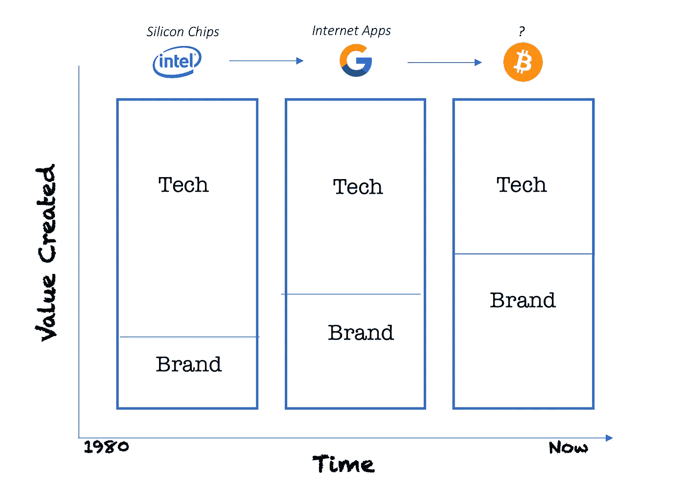

# 品牌对科技公司的价值:

> 原文：<https://medium.com/hackernoon/the-value-of-a-brand-for-tech-companies-f102d0c50a7d>

> VC:“可防守性在哪里？”
> 
> 创始人:“我们有一个伟大的品牌。”
> 
> 尴尬的沉默…

我相信许多风险投资家或创始人都能体会到这种交流。风投希望投资那些有网络效应、锁定能力强、或者在技术或分销方面有竞争优势的公司。然而，我私下怀疑，如今许多风投低估了品牌价值，高估了技术。我最初开始思考这个问题，是因为我注意到越来越多的创始人在推介时提到了“品牌”。鉴于创始人是机会所在的最佳代表，我认为这一点值得关注。USV 最近发表的论文 3.0，让我对这个假设更有信心。

我认为，品牌正成为高增长科技企业日益重要的组成部分，主要有三个原因:

**1。)**品牌在社会中的*角色正在演变*。越来越多的消费者会选择符合他们价值观的品牌，这种情感共鸣会培养忠诚度。此外，在一个信息过载的世界里——普通消费者每天会接触到 3000 个品牌——受信任的品牌可以作为一种有效的启发式方法来分析噪音。

**2。由于创新速度的加快和全球资本的可获得性，技术壁垒的力量已经减弱。全球风投可以立刻为成熟的商业模式提供资金，大型科技公司也在不断侵犯彼此的地盘。脸书轻而易举地复制了 Snapchat，亚马逊凌驾于所有人之上，中国和美国的自行车共享公司用巨额资金一决雌雄。正如 Arjun Sethi 在[这篇文章](https://hackernoon.com/units-of-time-are-the-new-currency-6f2cb28657cb)中所写的，你今天所拥有的护城河只是给你创造下一个杀手级产品的跑道。随着这些壕沟的缩小，科技公司的价值分布也发生了变化:**

事实上，当我周末坐下来写这篇文章时，马斯克和巴菲特正在讨论竞争性护城河的优点。巴菲特喜欢投资知名品牌，如可口可乐，因为它们提供了护城河，而马斯克认为护城河是“蹩脚的”，公司应该通过创新保持竞争力。在这种情况下，我认为马斯克低估了他的个人品牌为他的公司贡献的护城河。

**3。)** *分销渠道已经打开*。如今，无论是床垫公司还是音乐艺术家，创业公司面临的最大挑战是培养意识。任何人都可以通过 Instagram 营销产品，并通过亚马逊分销，但知名度和忠诚的粉丝群，也就是品牌，是无价的。赢家的长尾理论并没有出现。我们生活在一个重磅炸弹的世界:凯莉·詹娜去年为她的化妆品系列创造了 10 亿美元的销售额；碧昂斯成就女神地位；特斯拉被高估是因为埃隆的粉丝俱乐部；WeWork 用它的“灵性”来证明它的天价价值。

传统上，风险投资并不重视“品牌”，因为它的价值是无形的，难以量化。许多公共股票投资者也是如此。但从最近的成功故事中可以清楚地看到，比如 Revolut 和 Robinhood，它们在创纪录的时间内实现了 10 亿美元的估值，它们的新兴品牌在它们的快速增长中发挥了重要作用。事实上，苹果，也许是世界上最受认可的技术品牌，也恰好是世界上最有价值的公司。展望未来，投资者和企业家将需要开发新的思维模式，以更好地理解品牌在科技公司和早期创业公司中的作用。那些心智模型到底是什么？好吧，这是另一个帖子，因为我还在搞清楚这一部分！

*如果你喜欢这个帖子，请鼓掌，让其他人发现它。干杯。*