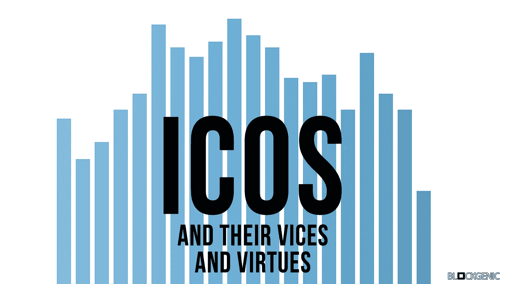

# ico 的恶习与美德

> 原文：<https://medium.com/hackernoon/the-vices-and-virtues-of-icos-939ddbd8ec5e>

可以肯定地说，ico 现在非常受欢迎。仅在 2017 年，就有超过 40 亿美元通过 ico 进行投资，他们已经证明有能力在极短的时间内筹集大量资本。但是 ico 是什么，有什么利弊，没有更好的替代方案吗？

# ico 是什么？

首次公开募股(通常被称为 ICO)是一种新区块链项目的融资机制，通过在令牌在任何交易所上市之前向投资者提供其项目的令牌来筹集资金。这些 ico 类似于更著名的首次公开募股(IPO)，投资者可以购买一家公司的股票。

这些 ico 通常由较小的团队执行，以便为他们的新项目筹集资金。就像首次公开募股一样，所有可用代币的一定比例会提供给公众。

ICO 通常是大事件，通常由多个阶段组成:
**预售:**ICO 的第一个阶段是预售，其中一部分代币私下提供给主要和有影响力的投资者。这些代币通常提供高额奖金或折扣，以获得这些早期投资者的支持。
**公开代币发售:**预售结束后，公开代币发售开始。一旦销售开始，每个人都有机会以预定的 ICO 价格购买代币。购买这些代币通常非常容易，只需向 ICO 智能合约进行一次交易即可完成。然后，智能合约会自动将新令牌发送到相应的地址。一个人得到的代币数量取决于投入的代币数量和汇率。 **软封顶达成:**所有 ico 都有软封顶。ICO 的软上限是为了使 ICO 成功而需要投入的最小资金量。如果 ICO 结束时未达到此软上限，ICO 将被视为不成功，资金将返还给投资者。 **达到硬封顶:**大部分 ico 也有硬封顶。ICO 的硬上限是他们愿意接受的最大资金量。一旦达到这个上限，ICO 就结束了。这一硬性规定是因为只有有限数量的代币可以发行给投资者。

有些 ico 是针对现有产品的，或者是由已经在以前的项目中证明了自己的团队开发的，然而大多数 ico 只不过是一份白皮书。白皮书给出了项目的详细描述，对于一个项目来说非常重要。

# ico 的利弊

由于象征性的价格大幅上涨，ico 已经让许多人变成了百万富翁。但 ico 也让许多人受骗，没有任何办法取回他们的初始投资。ico 有哪些利弊？

## 赞成的意见

高流动性
这既是有利的一面，也是不利的一面。ICO 为投资者提供了代币，通常在 ICO 签订后不久就可以很容易地兑换成其他资产或债券。如果投资者对项目进展不满意，他们可以迅速更换代币。

由于这些代币具有高流动性，投资者也可以对其代币进行“实时”定价。

**可访问性高** 与 IPO 不同，ico 可以随时随地被任何人访问。投资 ico 不需要大量的初始投资，不需要与合适的人建立良好的关系，也不需要其他不容易获得的东西。

这使得任何人都可以接触到 ico，这也是 ico 如此受欢迎的原因之一。

即时社区支持 ico 本质上是为区块链创业公司进行的众筹活动，它有各种好处。首先，这些项目将获得大量的社区支持。所有投资者都希望看到项目成功，因为这可能会提高项目标志的价格。由于这种巨大的支持，这些项目不得不花更少的钱在营销上，然后可以用来资助创新。

就像高流动性一样，ICOs 的这一特性有利也有弊。目前，进行 ICO 并不困难，因此对于相对较新的小公司来说，这是一个非常可行的选择，可以筹集资金来实现他们的想法。通过进行 ICO，一家新公司有能力在短时间内筹集大量资金。

## 骗局

**高流动性**
如上所述，高流动性有利有弊。在 ICOs 期间发行的许多代币只能在最初几个月(有时是最初几年)在(相对较小的)DEX(分散交易所)上兑换。这些 DEX 为项目团队提供了(秘密地)出售项目代币的能力，从而在其他人注意到之前“离开”项目。

**监管不力**由于大多数国家都以自己的方式处理 ICO，因此很难在所有国家进行完全符合规则的 ICO，这就是为什么许多 ICO 的合法性经常受到质疑。

**骗局和拙劣的项目**
IPO 通常只面向一小部分特定人群。这些人通常是经验丰富的投资者，他们知道在新项目中应该寻找哪些东西。

> 将会有很多巨大的投资机会，但随之而来的将会是很多骗局。这里不是幼儿园，当你遇到麻烦时，没有老师可以求助。[-谢里夫·布克蒂拉，停止疯狂](/@eosdublin/stop-the-maddness-63e3c0eea66b)

然而，ICO 对任何人来说都是容易的，这意味着几乎每个人都可以轻松地进行 ICO。这导致大量资金最终落入没有经验、不值得的项目团队手中，甚至更糟的是落入骗子手中。

**投机性质** ico 是非常高风险的投机性投资，通常只不过是一份白皮书和一个普遍的信念，即该项目将成功保持代币价格稳定。超过 90%的创业公司都会失败，区块链的创业公司也不例外。

市场操纵虽然有些 ico 非常成功，获得了数亿美元的收入，但大多数成功运作的 ico 获得的收入要少得多。让某些人“容易”持有大量代币供应，然后他们可以滥用这些代币来操纵市场，例如通过内幕交易。由于缺乏适当的监管，这种不当行为也相对容易逃脱惩罚。

# ICOs 还值得吗？

现在你更熟悉 ico 的缺点和优点，你可能想知道 ico 是否仍然值得他们承担风险。不幸的是，这个问题的答案并不简单。这确实取决于项目，但我们会给你一些规则和问题，在分析 ICO 时要记住。这些将帮助你远离骗局，也将帮助你估计一个项目的实际价值。

> 这里有 3 个简单的规则。
> 1。做你的研究。
> 2。持怀疑态度
> 3。拥有你的决定。
> 
> 评估项目时要问的一些问题。
> 1。团队是谁？你能在 Zoom 电话上和他们通话吗？如果没有，为什么没有？
> 2。他们为什么要筹集资金？
> 3。他们的交付里程碑是什么？
> 4。你为什么要关心这个想法？
> 5。他们在做什么不同于其他机会。
> 6。哪些受信任的社区成员或块制作者正在与他们合作。如果没有，为什么没有？
> 7。企业位于哪里？检查它是真实的。
> 8。他们能提供什么参考？
> 9。这个团队一起工作多久了？10。你能在即将到来的活动中与他们面对面吗？如果没有，为什么没有？
> 摘自[《停止疯狂》，EOS Dublin](/@eosdublin/stop-the-maddness-63e3c0eea66b)

虽然 ico 可能是一个不受监管的混乱局面，充满了骗子骗取你宝贵资金的机会，但它们也可能是一家新公司筹集资金的绝佳机会，也是投资者从一开始就为他们喜欢的项目提供资金支持的绝佳机会。记住，保持警惕。

## 关于我们

我们是 Blockgenic，一个世界级技术企业家和投资者的网络，希望对区块链技术产生积极影响。你可以在这里找到我们:
EOS Block 制作人姓名:' blockgenicbp'
[网站](https://blockgenic.website/)
[推特](https://twitter.com/blockgenic)
[Youtube](https://www.youtube.com/channel/UCXTaehuAs3UWKnMVnT71MMQ)
[Reddit](https://www.reddit.com/user/blockgenic)

*   声明:投资 ico 一定要谨慎。不要投资你输不起的钱*

*作者为* [*作者为*](https://www.linkedin.com/in/yannick-slenter/) *作者为* [*作者为*](https://blockgenic.website/)