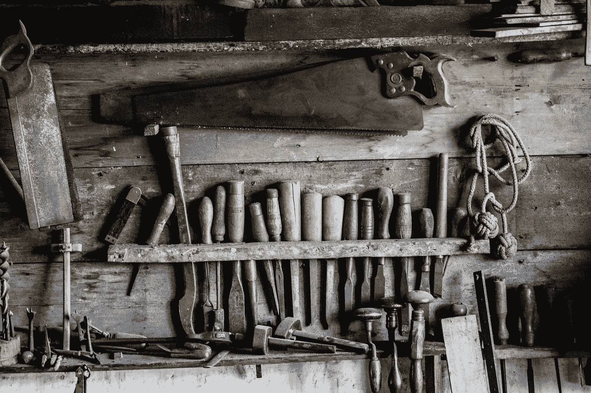

# 工具的优点

> 原文：<https://medium.com/hackernoon/the-virtue-of-a-tool-ac8d79f9177b>

供应商的成功应该与客户需求有关，而不是自身需求。

*照片由*[菲利普·斯温伯恩 ](https://unsplash.com/photos/vS7LVkPyXJU)

我是一个[工具迷](https://lukekanies.com/the-power-of-better-tools/)。我喜欢著名厨师的刀毫不费力的平衡，就像我的手知道自己该做什么。大量使用会产生老茧和肌肉，它的有用性被磨损的痕迹和改变的基础设施所证明。失败会留下水泡，甚至是住院。

一个好的工具证明了它的效用。刀磨得慢慢缩水，工作裤变薄，机器需要油。如果他们没有，你要么没有维护你的[工具](https://hackernoon.com/tagged/tools)，要么很少使用它们。

这件衣服是你使用的证明。它们应该被抓破。凹陷。老了。铜绿应该从商店获得，而不是工厂处理。他们的胼胝体应该和你的成对。工具可以不贵重。他们只会生活在架子上，然后退休到你的阁楼。你应该寻找一个完美的中间地带，在那里你花足够的钱让你的孩子可以继承他们，但不要多到你对给他们一份工作感到不安。

工具只有在帮助你工作时才配得上这个标签。

你可能会说我对它们有强烈的感觉。作为一名软件企业家，我认为这份爱让我专注于帮助人们工作。或者可能是我在现实世界中使用工具的经历让我在数字世界中寻找它们，学习制造我买不到的东西。

鉴于我对工具的迷恋，你会认为我在使用这个词的时候已经牢牢把握住了我的意思。显然，没那么多。我最近被一个简单的问题打断了，这个问题是由激进品牌实验室的乔丹·海尔斯提出的:你所说的工具是什么意思？

你什么意思，我什么意思？很简单的问题吧？上面的文字给出了一个例子，但我认为我可以用一堆合理的方式来回答它，其中没有一个看起来有太大的争议。

但是我越探索，问题就越不简单。

我一直把我的目标描述为为人们制造电动工具。这个短语来自我和我爸爸盖房子的时候，而“电动工具”就是你插上电源的东西。你知道吗？因为他们需要权力？这是一种常见的用法，也许这里的“选择”一词并没有太大的意义。

除了……我花了十多年时间学习产品管理，把自己描述成一个以产品为导向的创始人，在一个成长中的公司管理这个职能，并试图把它教给其他人。然而，这里我完全忽略了术语和字段。为什么我这么快就放弃了我过去十年的工作？仅仅是创意品牌吗？对我的行业冷嘲热讽？

为什么不是电力产品？这是一艘摩托艇的头韵:“为人们提供电力产品。”太棒了，对吧？

好吧，也许不是。

众所周知，产品管理始于消费品行业。有人递给你一节装满洗碗精的火车车厢，让你卖掉它。你必须包装它，设定价格，说服当地商店出售它，与他们讨论位置，把它从竞争对手那里移走，所有这一切。你在当地杂货店看到的每一件产品，都有一个产品经理爱不释手，他为它争取货架空间，相信它很美，希望你给它一个好归宿。

[汰渍肥皂是最常被偷的消费品之一](http://nymag.com/news/features/tide-detergent-drugs-2013-1/)，但不是因为它是肥皂。强大的品牌使其易于转售，甚至允许其在毒品交易中用作金钱的替身。我希望我在产品管理方面有那么好。尽管如此，它没有提到肥皂。

产品管理也可以用来作恶。激光打印机有墨盒，你只需重新填充。不太干净，但是一旦你为昂贵的打印机付了钱，运行起来又便宜又可靠。现代喷墨打印机使用一次性墨盒。为了在快速商品化的行业中维持利润率，制造商开始对墨盒制定规则:你必须从制造商那里购买它们，它们必须每年更换，你不能再装满它们，如果任何彩色墨盒是空的，你就不能进行黑白打印。

用户受到了伤害，因此供应商可以赚更多的钱。人们已经受够了,[美国最高法院介入了此事。](https://www.washingtonpost.com/news/the-switch/wp/2017/05/31/how-a-supreme-court-ruling-on-printer-cartridges-changes-what-it-means-to-buy-almost-anything/?noredirect=on&utm_term=.bda97541c9bf)

这是很好的产品管理。很邪恶，但你知道我的意思。很有效。我们说的是大 B 收入有效。嗯。道德差异开始显现。

这些都是公司将他们的商业模式强加给客户的例子。零售和散装出售的洗碗皂没有区别，但它们是不同的产品，通过包装、运输需求和标签来区分。你要为零售套餐支付比批发套餐多得多的费用，主要是因为它们背后的商业模式是如此的不同。

但是当我想到一个工具时，这些复杂性就消失了。当我用锤子的时候，它只需要适合我的手就可以砸东西。当我拿起我的钻头时，它能与我拥有的每一个钻头一起工作，不管它的商标是什么。电池和充电器是专有的，但供应商在我生活中最明显的作用是颜色选择。我的黄色钻头与蓝色或绿色公司的钻头配合得很好。(你可能会因为我提到颜色而联想到品牌。在这里仍然有效。)不管我是从家得宝(Home Depot)买的电钻，还是从我父亲那里继承的，这都无关紧要；一旦到了我手里，它就能工作了。

我觉得这就开始回答什么是工具的问题了。

它帮助您完成工作，而不用担心供应商的需求。

我知道 DeWalt 和 Mikita 需要赚钱来卖给我一个钻头，但是当我使用他们的工具时，我不会考虑这个问题。即使在二十多年没有锤子的情况下，我也能舒服地背诵“我的”锤子是带直爪的 Estwing 22oz 华夫饼干头，但这些细节都不意味着我需要卖主的许可才能用它敲钉子。我决定选择合适的工具，购买并使用它。故事结束。

它很小。如果你称某样东西为工具，而不是产品，你是说它不够完整，不是一个完整的解决方案。这可能是贬低，侮辱，但它不一定是。这也是一种独立的声明。自由的象征。这听起来很疯狂，兼容性。

产品对他们的供应商有一种隐含的、持续的依赖。如果那是我，我喜欢:我希望你一直付钱给我，而不只是一次。这种持续的关系是我不断改善我为你建立的一切的原因。这是确保我们拥有长期、可持续合作伙伴关系的好方法。但这并不总是健康的关系。你越需要处理我如何赚钱，你的体验就越糟糕。

我想这就是我喜欢工具的地方。它们是独立的。独立。使用它们从根本上来说是务实的，而不是一生的承诺。

作为一名供应商，这种独立性对我来说也有不利的一面。你听不到任何关于增长黑客的时髦词汇。你的产品没有“粘性”，没有“护城河”这些都是我的客户受到我的商业模式限制的例子，他们的缺席意味着收入更难建立，更难保护。

有人可能会说我过得更好，因为从长远来看，更尊重地对待我的客户会让生意更好，我可能会同意这一点。这种相互尊重的伙伴关系应该比坑害和虐待客户的伙伴关系带来更高的回报。我认为这通常是正确的答案，但它不是一个受欢迎的答案。更难获得资金，更难起步。我可能会被指责“不想建立一个真正的公司”，或者我可能会遭到硅谷最可怕的侮辱:“那只是一种生活方式的生意”。

去跟 Adobe 说吧。或者 AutoDesk。这些都是很棒的工具公司。他们是我们今天所知道的庞然大物，因为他们努力解决客户的问题。他们担心的是这一点，而不是如何随着时间的推移获取最大的收入。这是一个不同的时代，但人们没有改变。

我不认为当供应商的需求出现在客户的生活中时，每个产品都会受到影响，但我认为大多数都会受到影响。有些是懒惰，用商业模式创新来支撑产品局限性，但很多是战略，认识到把你的客户逼入困境的价值。

老实说，有些只是为了生存。许多喷墨打印机便宜得难以承受，但买家只关心成本，而不是价值。一些市场本质上是不正常的，用户和供应商通过糟糕的交易和愤世嫉俗的行为慢慢地互相残杀。但作为一名供应商，我可以选择在什么市场上玩，以及如何与我的客户合作。

我是一个简单的人，有一个简单的梦想:我想建立一些帮助别人工作的东西。我必须一边做一边赚钱，因为这是工作的性质，但我对客户的工作比对我自己的工作更感兴趣。我知道我需要一个商业模式，一个走向市场的战略，一个发展和支持我的业务的计划。但是我的客户应该不需要关心这个，不是吗？如果他们喜欢我正在建造的东西，他们应该能够购买和使用它。告诉他们所有的朋友这有多棒。他们不应该有一天醒来发现他们意外地娶了我。

我只想制造工具。我为此感到骄傲。

1.  我们非常愉快地讲述了(很可能是杜撰的)这个故事，这个锤子在佛罗里达是非法的，因为金属柄会切掉你的拇指。 [↩](#ffn1)

*最初发表于* [*由卢克·卡尼斯*](http://lukekanies.com/the-virtue-of-a-tool/) *撰写。*