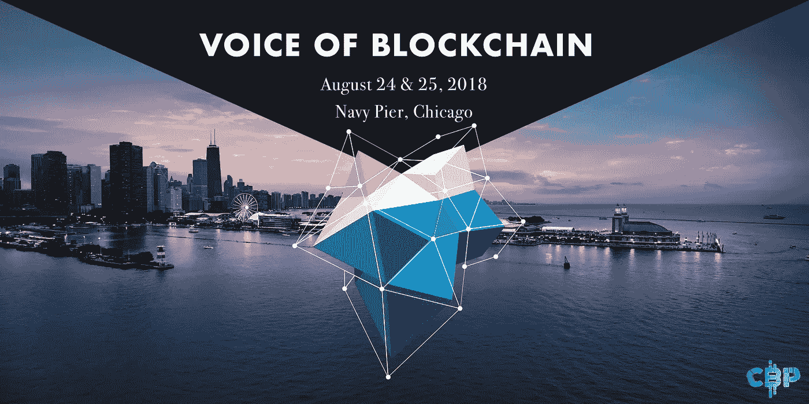
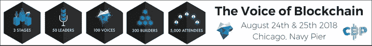

# 区块链之声——芝加哥区块链项目活动。

> 原文：<https://medium.com/hackernoon/the-voice-of-blockchain-a-chicago-blockchain-project-event-acb3717b56ae>

近 200 年来，芝加哥一直是商业和创新中心。从肉类包装到桥梁技术，芝加哥成了商业活动的必去之地。芝加哥河使得货物可以很容易地在各州之间和更远的地方进行分配/再分配，到 19 世纪中叶，随着芝加哥交易所的诞生，这座城市开始了成为世界上最大的金融中心之一的旅程。

Photo by [Alex Livingston](https://unsplash.com/photos/QbD-LmFZ-uk?utm_source=unsplash&utm_medium=referral&utm_content=creditCopyText) on [Unsplash](https://unsplash.com/search/photos/chicago?utm_source=unsplash&utm_medium=referral&utm_content=creditCopyText)

随着金融机构和创新理念深入其每一根纤维，加密货币——一种感知和合作建设新世界经济的新方式——在芝加哥安家也就不足为奇了。在纽约，企业家们找到了一个家，他们可以在那里开展他们的区块链项目，而没有纽约令人窒息的监管，也没有硅谷那样需要不断取悦的风险投资公司。

我不住在芝加哥，但我确实在金融行业工作了几年，我在这个我认为非常棒的城市呆了很长时间。我在那里遇见了我的妻子，现在仍有朋友在那里生活和工作，我努力了解那里发生的最新消息。

所以，上周早些时候，当我被邀请去看芝加哥区块链项目(CBP) 的“[区块链之声”活动时，我的兴趣立刻被激起了。](http://chicagoblockchainproject.com/voice-of-blockchain/)

> “区块链系统允许一群人在没有理由相互信任的情况下，就一组数据和数据进入系统的时间达成一致。区块链系统的一个突现特性是行动的灵感。该系统可以被设计成这样一种方式，即在系统的价值和被激励积极参与的个人数量之间创建一个正反馈回路。”

从本质上来说，区块链和加密就是生活在一个去中心化的、更加透明的世界里，在这个世界里，我们所有人都在互相协作，互相帮助。我对 CBP 了解得越多，就越了解到它理解这一点，以及我遇到的任何组织。

> “我们将奖励那些符合我们建设城市未来理念的项目。通过帮助他人，参与学习将是体验性的。有了在未来经济中竞争所需的技能，我们将把芝加哥建成区块链的世界之都。”

任何区块链和加密货币爱好者都知道，这个行业并不缺少投机者和试图利用易激动的公众的人。然而，CBP 背后的精神与其试图倡导的技术直接相关。

**区块链之声(Voice Of block chain)—**CBP 将于 8 月 24 日和 25 日在芝加哥历史悠久的海军码头举办为期两天的活动，这也是一场真正忠于这种精神的活动。CBP 致力于为来自各行各业的与会者提供机会，让他们相互交流，倾听行业领导者的意见，如 Bloq 的联合创始人马修·罗扎克和 Outlier Ventures 的合伙人鲁米·莫拉莱斯。

CBP 也刚刚证实，该州首席技术官杰克·金和伊利诺伊州区块链倡议主任苏尼尔托马斯都将出席。

将有 100 多名博客作者、YouTubers 和播客参加，以确保每个人都能听到活动的进展。他们甚至有自己的拍摄和采访区域“兰博兰”。CBP 显然想把他们的消息传达给每个人。

该活动最大的吸引力之一是，与许多其他区块链活动不同，区块链之声将采用**而非**付费推介或赞助演讲人，该活动不是为了那个。将会有有意义的、深入的关于区块链现状以及如何让它变得更好的对话。

为了确保有各种各样的参展商参与，CBP 有一个良好的社会轨道，以便非营利组织也能够为活动做出贡献，而不必付费。“社会公益之路”将由 Sharon Burns 负责，她曾在 MacArthur Foundation 担任首席信息官 14 年，并在 Y2K 期间担任芝加哥市技术部的负责人。

然而，这不仅仅是社会公益项目。CBP 希望确保来自各行各业的项目都有特色，以确保区块链能取得的成就得到全面了解。

将有专注于创新的参展商，关注区块链如何改善医疗和教育，智能城市将如何改变我们的生活方式，甚至博彩业的未来。

还将讨论金融科技和市场，展望加密世界中支付和银行的未来，它将如何影响监管以及它对地缘竞争的影响。

最后但并非最不重要的是，将有#BUIDL 参展商，他们将深入研究我们如何克服可伸缩性和隐私问题，研究挖掘和协议，以及我个人的主要兴趣之一。

票价中还包括开发人员研讨会，其证书由 CBP 学院合作伙伴(包括 Enigma Protocol)集成到 LinkedIn。此外，每位与会者都将获得一本《比特币漫画手册》**区块链特别声音版，作者是《恶魔的使命》漫画公司的乔什·布雷洛克**

预计将有超过 5000 名与会者参加，此次活动将是一个特殊的两天，可能会为未来类似的活动设立标杆。

CBP 正试图打破目前围绕区块链/加密世界的所有噪音，区块链的声音将为真正试图做出改变的人发出声音，而不仅仅是快速赚钱。

访问 [CBP 的网站](http://chicagoblockchainproject.com/)了解他们是谁，他们做什么，以及更多信息，包括如何获得区块链之声活动的门票。

来源:

 [## 创新、发明和芝加哥商业

### 约瑟夫·熊彼特在发明和创新之间画出了一个引人注目的区别。发明是…的创造

www.encyclopedia.chicagohistory.org](http://www.encyclopedia.chicagohistory.org/pages/643.html) 

*免责声明——本文由芝加哥区块链项目赞助。*