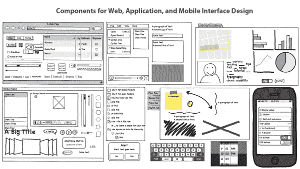
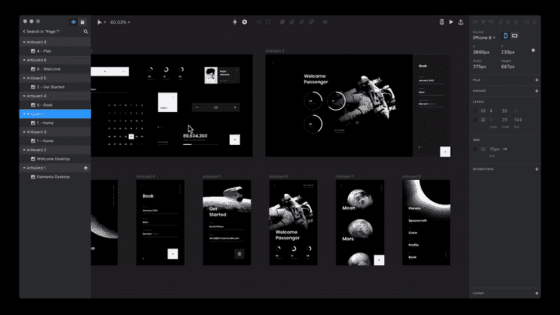
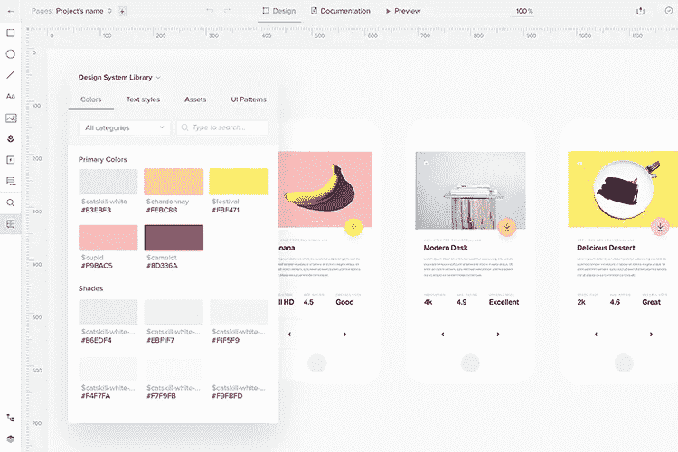
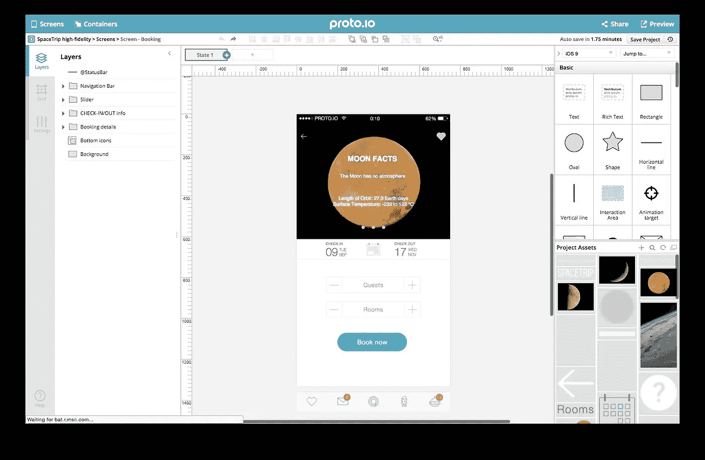
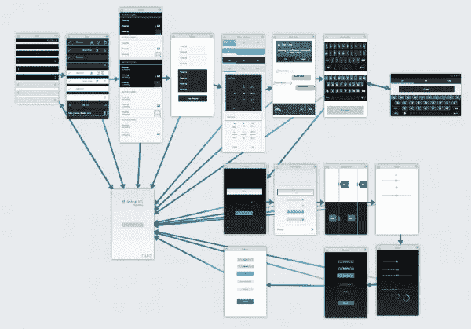
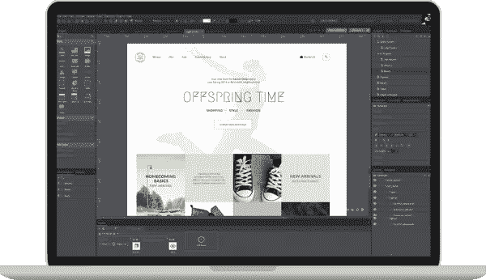
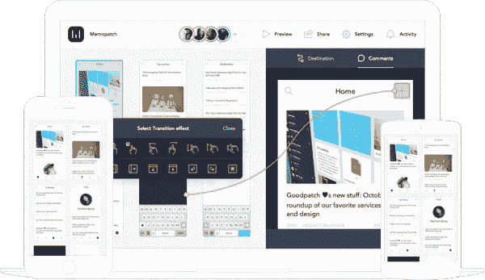
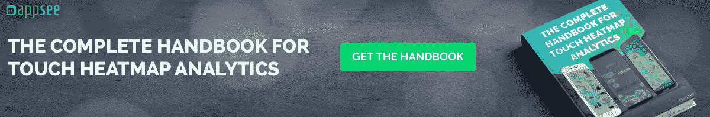

# 投票结果如下:移动应用程序专业人士的 7 大线框图和模型工具

> 原文：<https://medium.com/hackernoon/the-votes-are-in-the-top-7-wireframing-mockup-tools-for-mobile-app-pros-134cd1d9af0a>

当你为自己的移动应用产品找到完美的工具时，你就知道它有多有价值了。你发现了它，你玩弄了它，你爱上了它，你很快就忘记了没有它的生活是怎样的。

这就是这份七种工具的清单会对你做的。线框图、模型和原型的七种工具，会让你说“哇，我该怎么选？”好在我们将您的最大兴趣放在心上，并且我们提供了每个工具的一些关键要点。更不用说像 Airbnb、PayPal、Lyft 和 Cicso 这样的顶级移动应用品牌已经实现了其中的一些工具来建立一个光滑的用户界面和吸引 UX。

# [香脂](https://balsamiq.com/)

图片来源:[大西洋](https://www.atlassian.com/blog/archives/marketplace-monday-balsamiq-mockups)

Balsamiq 的名字就像面巾纸——它是一个众所周知的线框工具老手。Balsamiq 包括几个拖放元素，从按钮到列表，每一个都是手绘风格。这个线框工具背后的基本前提是保持模型“故意粗糙和低保真度”，以鼓励尽可能多的反馈。可以在 Mac、Windows 或 web 上访问该平台。定价基于每个项目，两个项目每月 9 美元，200 个项目每月 199 美元。

# [视觉](https://www.invisionapp.com/#tour)

图片来源: [UX 集体](https://uxdesign.cc/invision-studio-is-out-but-are-designers-migrating-to-a-new-tool-again-102949210aeb)

InVision 可以让你快速地将移动(iOS，Android)设计转换成可点击的交互式线框和模型。该产品旨在尽可能无缝地制作原型，并允许您轻松地从本地、Dropbox、Google Drive 和 box 上传图像。InVision 的最大特点之一是它能够通过文本消息与不同的用户共享原型的链接。这个工具对于协作和反馈收集非常有帮助。使用 vision 设计单个原型不需要任何成本。而额外的原型量被分组到不同的定价等级中。

# [UXpin](https://www.uxpin.com/)

图片来源: [UXPin](https://www.uxpin.com/design-systems)

UXPin 是一个基于云的工具，用于构建 web 和移动应用的原型。它有一个连贯的拖放式界面和几十个库，其中包含设计中要使用的各种项目。它可以用来为多种设备创建静态线框和交互式原型。UXpin 还提供了多种多样的 UI 元素，并支持从 Sketch 和 Photoshop 导入分层设计。我们还建议查看他们业界领先的博客，了解更多关于 UX 最佳实践的精彩内容。在价格方面，基本的“原型”是每用户/月 29 美元，而其推荐的“系统”计划是每用户/月 49 美元。企业定价需要进一步查询。

# [协议 io](https://proto.io/)

图片来源:[替换为](https://alternativeto.net/software/proto-io/)

Proto.io 是一个基于网络的模型工具。这是一个很好的移动线框和原型软件，因为它也允许离线查看原型，并带有许多移动部件。您可以使用容器来创建有效的动画和交互。它可用于构建低保真度和高保真度模型/原型。它还支持草图和 Photoshop 插件，并提供了一个巨大的设计组件库。

# [流体 UI](https://www.fluidui.com/)

图片来源:[线框](https://wireframes.linowski.ca/2012/08/fluid-ui-mobile-app-prototyping/)

Fluid UI 为 iOS、Android 和 Windows 手机提供了 16 个内置库。您可以通过从这些库中拖动元素来轻松创建屏幕。这个应用程序为你提供了一个很好的方式，通过创建链接来连接屏幕，形成一个所有东西如何组合在一起的图表，从而直观地绘制出你的项目。将鼠标悬停在链接上可以让您选择更改正在使用的过渡类型。Fluid UI 有三种不同的定价方案，从每月 8.25 美元的“个人”方案到每月 41.58 美元的“团队”方案。

# [JustinMind](https://www.justinmind.com/)

图片来源: [Justinmind](https://www.justinmind.com/overview)

Justinmind 是一个基于 web 的工具，包括一个 UI 元素库，从按钮和表单到通用形状，以及一系列用于 iOS、Web 和 Android 的小部件。包括自定义样式，因此您可以添加圆角、裁剪图像或颜色渐变，或者通过将图形拖到浏览器中来导入图形。您可以免费下载该工具，也可以选择企业计划。

# [保护](https://prottapp.com/)

图片来源:[保护](https://prottapp.com/features/)

Prott 是一个非常漂亮的原型和线框工具。使用 Prott，你可以拍摄你的粗略草图，并直接将其导入 Prott 的 iOS 或 Android 应用程序。然后，您可以使用草图轻松构建光滑的线框和原型。Prott 还通过高度互动的演示资源使演示变得非常简单和专业。它还提供了一系列协作工具。在定价方面，Prott 有 5 种不同的基于每月或每年的计划。年度计划打九折。

# 你怎么想呢?

这里有很多信息，但是一定要亲自检查一下这些工具。花些时间仔细阅读网站，尝试任何免费试用或演示，尽可能多地使用这些工具。

但是不要等太久——你的产品应该尽快得到应有的关注！

