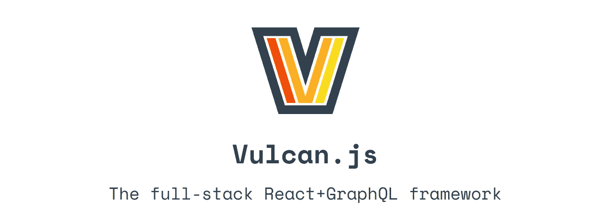
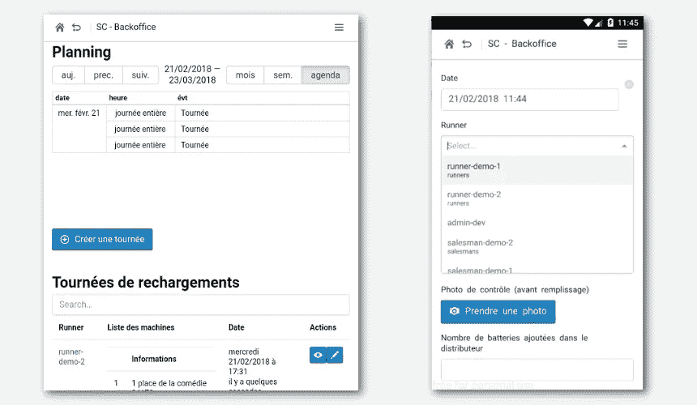

# Vulcan.js 挑战:一个应用程序的 15 天

> 原文：<https://medium.com/hackernoon/the-vulcan-js-challenge-15-days-for-an-app-e3735d1e3d4c>

## 承诺给我们的框架

我观察它的发展已经有一段时间了。它一个月又一个月地从一个有前途的开源应用程序 Telescope 发展而来，而 Telescope 本身又建立在一个有前途的框架 Meteor 之上。这个提议很好:如果我们能混合所有最好的 JS 技术会怎么样？如果我们能建立一个类似于均值堆栈的东西，但这次是正确的呢？

然后一个客户打电话给我们。该团队是一家年轻的初创公司，需要一个应用程序来管理电池自动售货机的充电。预算还不错，但这是一家初创公司，初创公司无法承受仅仅为了一个内部应用程序而进行 100 天的开发。在那里，我知道这是我几乎忘记的这个框架的一个用例，这是 **Vulcan.js.** 的一个用例

Even the logo is cool.

# **火神让你快速发展**

让我们从最后开始:这是正确的选择，我确实设法在 **15 天的工作中交付了应用程序，**包括构思和与客户的会议。该应用程序允许管理人员组织跑步者日程安排(为机器加油的员工)，销售人员安排与客户的会议，跑步者自己在为机器加油时填写表格。

关于技术方面，该应用程序是离线友好的，处理具有多个角色的复杂权限方案，在移动设备和浏览器上运行，并实时同步一切。

这里是计划界面的截图，经理可以在这里安排旅程，还有跑步者的补充界面。由于有了 Meteor，数据可以实时传输给跑步者，所以管理人员和跑步者的同步几乎是即时的。
规划建立在 react-big-calendar 之上，UI 建立在 Blueprint + Bootstrap 之上，自动完成输入建立在 react-select 之上。

Vulcan 是一个全栈框架，这 15 天包括**建立数据库，开发后端，开发前端，连接所有这些，并通过 Heroku 将其投入生产。**

**这是我的第一个 Vulcan 项目:**这个东西结构非常好，如果你已经对 React 和 Meteor 有所了解，只需几天就能掌握它的基本原理(尽管你可能是 GraphQL 的绝对初学者)。

# 好的元素

如果我能在截止日期前完成，这要归功于以下事实:

*   **Vulcan 是以模式为中心的，**这意味着您可以基于单个 JSON 模式生成集合、graphQL 查询和表单。您不必掌握 GraphQL 来深入了解 Vulcan，您可以在以后需求发展时学习它。这对于许多企业用例来说是极好，在这些用例中，应用程序主要是操纵复杂的结构化数据的工具。
*   **相关的功能都是内置的，**像认证、群组权限、SSR 等等。这个名单还在不断增加。例如，我设法在我的应用程序中很容易地添加了离线支持，当阿波罗 2.0 集成到 Vulcan 时，这将更加容易。
*   **社区很棒。**Slack 很活跃，那里的贡献者愿意回答问题，但也更好地了解[开发者的日常斗争。与 Vulcan 一起工作真是太棒了，感谢社区和核心团队，在我的代码面前我从不感到孤独。](https://hackernoon.com/tagged/developpers)

Jump in the Vulcan ship and feel the power of fast development. It may soon really become an Enterprise grade framework.

# 它仍然需要的是:你。

Vulcan 很年轻，架构已经很好，开发团队正在以非常快的速度接近 1.9 版本，然后是 2.x 版本。现在对火神的正确描述是*“令人惊讶的前途”*。

它获得的动力越大，修复错误、添加功能和提高性能的速度就越快。

我知道不是所有的人都有时间为开源项目做贡献，但是有一件事你肯定能帮上忙:给 Vulcan 一个机会，分享你的反馈！http://vulcanjs.org/

*我是法国计算机科学与创新办公室内阁 Lebrun Burel—*[*https://www.lebrun-burel.com*](http://www.lebrun-burel.com)的联合创始人

*总是乐于谈论代码、机器学习、创新创业！*