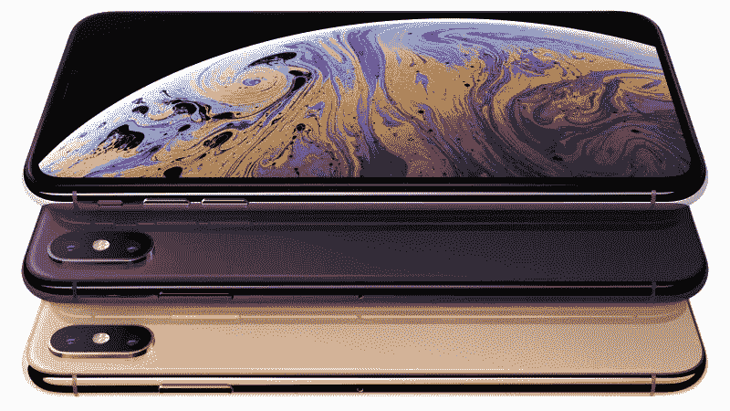
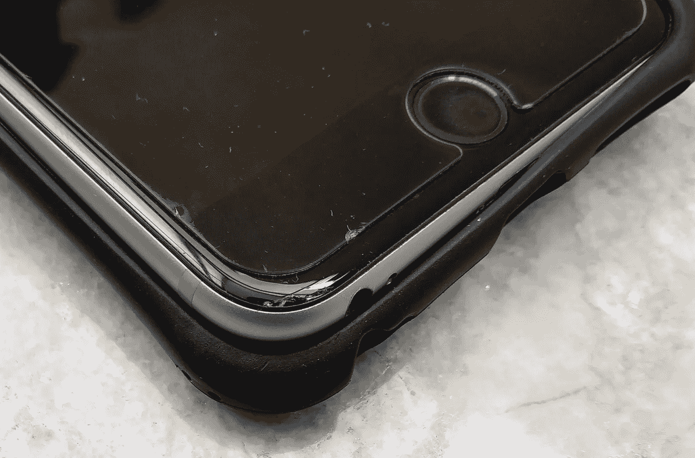

# “等待购买”的苹果游戏

> 原文：<https://medium.com/hackernoon/the-wait-buy-apple-game-d84b8b4a4891>

2018 款 iPhones 正式上市。我现在的 iPhone 6S+，现在已经三代了。因此，新手机可以做很多我的手机做不到的事情。毫不奇怪，我发现自己对这些评论垂涎三尺，直到《世界之外》的价格将我拉回现实。

如果你住在印度，情况尤其如此，印度是世界上购买 iPhone 最贵的地方之一。64GB 型号的 iPhone XS Max 将在₹1,10,000 上市(1527 美元)。这是在一个₹15,000(200 美元)手机被认为是昂贵的中档手机的国家。我敢肯定，美国消费者在花 1527 美元购买 iPhone XS Max 基本款之前也会三思而行。

这就是在印度购买 iPhone 的不同之处。对于一部手机来说，价格实在太高了，与印度的生活成本相比，这似乎是不必要的奢侈。例如，不久前，我以 1388 美元的价格将我五年的旧车卖给了₹100000。

那么，我的下一部手机到底想要什么呢？

答案不难找到。几个月前，我设法用第六代 iPad (2018 年款)替换了我的第三代 iPad 3。当然，它没有 iPad Pro 的所有最新功能。但它拥有比我 iPhone 6S+中的 A9 更先进的 A10 处理器，它甚至还具有 Apple Pencil 兼容性。在₹24,500(340 美元)，这是一个真正的讨价还价。

总而言之，如果我的钱没有得到很好的回报，我宁愿保住我的钱。看来是时候认真考虑一下我的选择了。

## 继续使用现有电话

我用了三年的 iPhone 6S Plus 是一部不错的手机，但它的年龄正在显示。旧电池和硬件无法满足新软件的需求。就像我打开相机或任何其他处理器密集型任务的那一刻，电池就没电了。此外，我已经开始遇到与手机不完全兼容的应用程序。

## 换块新电池

我的 iPhone 6S+有资格享受折扣电池更换计划(约为₹2000 或 27 美元，而通常为 79 美元左右)，因为它是受节流问题影响的手机之一。遗憾的是，我不能利用这个优惠，因为我的手机屏幕一角有一个小裂缝。

似乎与 iPhone 6 不同，iPhone 6S+使用粘合剂来压住触摸屏。苹果工程师说，要更换电池，她需要用吸力提起触摸屏，很有可能会破裂。所以她告诉我，我修理电池的账单可能包括更换触摸屏的费用，总费用可能高达₹18000(250 美元)。我的 iPhone 6S +是我第一部屏幕破裂的手机。我确实带了一个盔甲包，但当手机落地时，这个东西被推到了一边。只是其中之一！

## 去安卓

拥有一部 iPhone 已经九年了，我发现很难切换到安卓系统。我确实[试过一次](/indian-ink/apple-in-androidland-c66e8c827e07?source=linkShare-536476373c93-1536890426)，甚至试过[带两部手机](https://bullshit.ist/my-short-life-as-a-two-phone-man-3d2fc77fee68?source=linkShare-536476373c93-1536890085)。但我最终还是换回来了，可能是因为我习惯了 iOS。我仍然拥有一台 Redmi Note 4，这是两代旧 Android。它可以做我的 iPhone 做的大部分事情，但我不喜欢使用它，就像我用我的 iPhone 一样。

## 尺寸缩小到 4 英寸

如果我把₹1000 加到我的“电池更换”成本中，我可以用大约₹19000 的价格(264 美元)买到更小的 iPhone SE。这款手机是在印度制造的，因此免除了进口税，这也是它如此实惠的原因。那个 iPhone 和我的 iPhone 6S+硬件差不多。但是，在与相对较大的 5.5 英寸 iPhone 6S+生活了三年之后，缩小到 4 英寸的尺寸是不现实的。

## 选择 iPhone XR

iPhone XR 在₹77,000 的售价为 1069 美元，几乎是 iPhone XS Max 在美国的价格。如果我要花那么多钱，我不会接受妥协。iPhone XR 绝对是预算意识的妥协。一个摄像头在后面而不是两个，一个相对低分辨率的 LCD 屏幕屏幕而不是高分辨率的有机发光二极管，一个 SIM 卡而不是双 SIM 卡，3GB 内存而不是 4GB。

它甚至没有 3D touch，这一点我承认我用得不多。但我三年前在₹55,000 附近(763 美元)买 iPhone 6S+的唯一原因是，它拥有所有高端功能。在一部没有 3D 触感的手机上度过₹77000，这是我三年前的手机所没有的，这很难接受。

## 进口更便宜的 iPhones

印度海关通常不会对非居民印度人严格征收进口税，这些人在访问印度时会携带一部额外的手机。即使在阿联酋这样有数百万印度人工作的国家，价格差异也会很大。例如，iPhone XS Max 的价格为 4649 ₹91,000 元(1266 美元)，而在印度₹1,10,000 的价格为 1527 美元。但是随着最近美元对印度卢比的升值，印度人将会排队要求他们在国外的朋友和亲戚给他们买一部 iPhone。所以印度海关可能会收紧，这可能是不可行的。

## 拿一个电池组

由于我的 iPhone 6S+最大的问题是电池，一个解决方案可能是获得一个电池组。我有一个旧的 5000 毫安的索尼电源，和一根亚马逊的 6 英寸闪电线。但即使如此，这也是一个繁琐的解决方案，更不用说每天为两个设备充电而不是一个设备充电的头痛问题了。虽然我想我可以只给电池组充电，同时把手机和电池组连接起来。

## 玩等待游戏

事实上，当我的 iPad 3 变得又旧又慢时，我也面临过类似的问题。我不想在新 iPad 上花太多钱。所以我等了又等，等了漫长的两年。然后就像我之前提到的，几个月前我设法为₹24,500(340 美元)买到了第六代 iPad (2018 款)。当然，它错过了一些功能，但我没关系，因为它的价格是合理的。

问题是苹果知道它的超高价 iPhones 永远不会在印度销售。事实上，苹果在印度的市场份额最近跌至可怜的 1% 。这也是苹果决定在印度制造 iPhone SE 的原因。尽管是 4 英寸的手机，他们承认对它的销量感到惊讶。我想它对许多印度人(包括我的妻子)有吸引力，他们喜欢 iPhone SE 紧凑的尺寸、像样的性能、实惠的价格和苹果品质的完美融合。

所以我敢打赌，在未来一两年的某个时候，苹果可能会为印度推出相当于 iPhone SE 的产品。基本上是一部价格和功能都比 iPhone XR 更好的 iPhone。这意味着，如果我能让我的 iPhone 6S+延长一年或更长时间，苹果可能会为我提供一个解决方案。就像第六代 iPad 对于 iPad Pro 一样。

但是，对于我的 iPhone 6S+来说，两年的时间太长了。也许我会回到苹果经销商那里，要求他们更换电池，并把额外的屏幕更换费用作为一点点坏运气一笔勾销。

至少，我会有 3D Touch。谁管我是不是很少用？仅仅知道我有一个 iPhone XR 没有的功能，就让我感觉好多了！